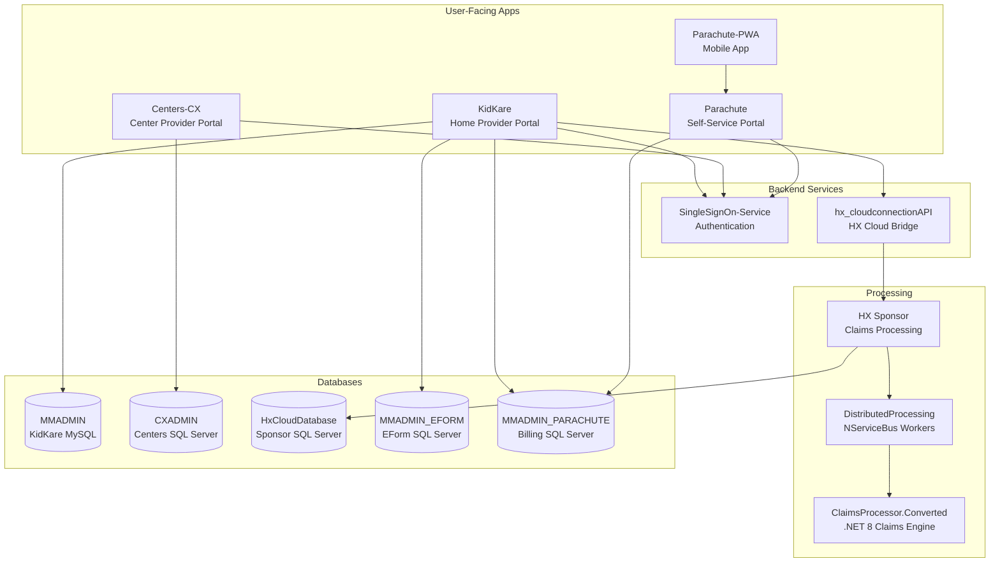

# System Overview

MinuteMenu is a multi-product platform that serves the CACFP (Child and Adult Care Food Program) ecosystem. Multiple applications work together to handle provider management, claims processing, billing, and authentication.

## How the Products Connect

## Key Cross-Repo Flows

| Flow | Repos Involved |
|------|---------------|
| **Authentication** | KK, CX, Parachute → SingleSignOn-Service |
| **Claims Processing** | KK → hx_cloudconnectionAPI → HX → DistributedProcessing → ClaimsProcessor.Converted |
| **Billing** | Parachute ↔ KK (Stripe, Zoho) |
| **EForm Submission** | KK (provider submits) → CX (center reviews) → HX (sponsor processes claim) |
| **Database Migrations** | MinuteMenu.Database (MMADMIN, CXADMIN, EFORM, PARACHUTE), hx_sponsorDatabase (HxCloudDatabase) |

## Tech Stack

| Layer | Technology |
|-------|-----------|
| KK Backend | ASP.NET Web API 2 + ServiceStack, Entity Framework 6, C# |
| KK Frontend | AngularJS 1.x, Gulp build |
| CX Desktop | WinForms (.NET) |
| CX Web | ASP.NET |
| HX | VB6 (legacy), being migrated to .NET 8 |
| SSO | ASP.NET |
| Databases | MySQL (KidKare), SQL Server (Centers, HX, EForm, Parachute) |
| Cache | Redis |
| Queue | NServiceBus + Azure Storage |
| Payments | Stripe Platform, Zoho Books/Subscriptions |
| Cloud | Azure (Storage, App Service) |
