# Attendance & Meal Counts

This page covers how SFSP/ARAS attendance and meal count data is recorded across different roles — Center/IC users, Sponsors, and Bulk Entry. It also covers Non-Congregate Meal Delivery and Custom Fields settings.

For general navigation and role information, [see Overview](overview.md).

---

## Center/IC Attendance & Meal Counts

Centers and ICs record attendance and meal counts one date and one meal at a time.

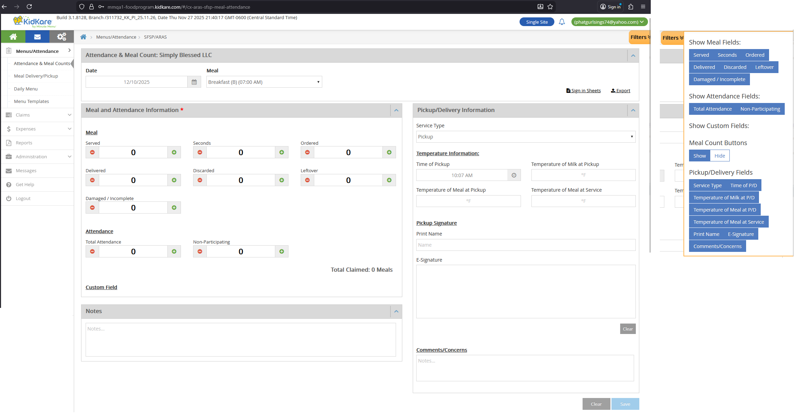

### Access

| Role | Can Access? |
|------|-------------|
| Center/IC Admin | Yes |
| Center/IC Staff with A&MC permission | Yes |
| Center/IC Staff without A&MC permission | No |
| Sponsor Admin/Staff | No (use Sponsor view instead) |

**Location:** Center/IC > Menus/Attendance > Attendance & Meal Count

### Date and Meal Selection

- Select a **Date** using the date picker. Future dates are not allowed.
- Select a **Meal** from the approved meals for that center.

### Field Mapping — Meal and Attendance

| UI Field | DB Table | DB Column | Notes |
|----------|----------|-----------|-------|
| Date | SFSP_ATTENDANCE | attendance_date | |
| Meal | SFSP_ATTENDANCE | meal_code | |
| Served | SFSP_ATTENDANCE_ITEM | meal_count | |
| Seconds | SFSP_ATTENDANCE | second_meal_count | |
| Ordered | SFSP_ATTENDANCE | ordered | |
| Delivered | SFSP_ATTENDANCE | delivered | |
| Discarded | SFSP_ATTENDANCE | leftover | |
| Leftover | SFSP_ATTENDANCE | leftover_ext | |
| Damaged / Incomplete | SFSP_ATTENDANCE | waste | |
| Total Attendance | SFSP_ATTENDANCE | total_attendance | |
| Non-Participating | SFSP_ATTENDANCE | non_participating_count | |
| Custom Field 1-4 | SFSP_ATTENDANCE_CUSTOM_VALUE | custom_value | Linked by custom_setting_id |
| Notes | SFSP_ATTENDANCE | comments | |

### Field Mapping — Pickup/Delivery

These fields track meal pickup or delivery details.

| UI Field | DB Table | DB Column | Notes |
|----------|----------|-----------|-------|
| Service Type | SFSP_ATTENDANCE | service_type | |
| Time of Pickup/Delivery | SFSP_ATTENDANCE | service_time | |
| Temperature of Milk at Pickup/Delivery | SFSP_ATTENDANCE | milk_temperature | |
| Temperature of Meal at Pickup/Delivery | SFSP_ATTENDANCE | meal_temperature | |
| Temperature of Meal at Service | SFSP_ATTENDANCE | service_meal_temperature | |
| Print Name | SFSP_ATTENDANCE | print_name | |
| E-Signature | SFSP_ATTENDANCE | esignature_id | Links to ELECTRONIC_SIGNATURE.esignature_id |
| Comments/Concerns | SFSP_ATTENDANCE | service_note | |

### Filters

Users can show or hide field groups using the filter panel. Filter settings are saved per user in the config.

| Filter Group | Fields |
|-------------|--------|
| Meal Fields | Served, Seconds, Ordered, Delivered, Discarded, Leftover, Damaged / Incomplete |
| Attendance Fields | Total Attendance, Non-Participating |
| Custom Fields | Custom Field 1, 2, 3, 4 |
| Meal Count button | Show / Hide |
| Pickup/Delivery Fields | Service Type, Time of P/D, Temperature of Milk at P/D, Temperature of Meal at P/D, Temperature of Meal at Service, Print Name, E-Signature, Comments/Concerns |

Filter config is stored in `KK_ConfigSettingDefinition.Name = 'CxArasSfspPageLayout'` with corresponding values in `KK_ConfigSettingValue`.

### Buttons

- **Save** — Saves all data to SFSP_ATTENDANCE and SFSP_ATTENDANCE_ITEM.
- **Clear** — Shows a confirmation popup. If confirmed, removes records from SFSP_ATTENDANCE and SFSP_ATTENDANCE_ITEM. Creates audit records in SFSP_MEAL_SERVED_BULK_ENTRY_HISTORY with meal_count = 0 and meal_count_from = previous value.

### Sign-in Sheets

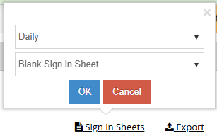 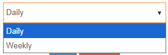 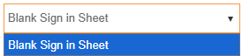

- Click the **Sign-in Sheets** link to download a blank PDF.
- Two formats: Daily and Weekly.
- File names: `DailySigninSheet_{number}.pdf`, `WeeklySigninSheet_{number}.pdf`
- API: `/kidkare/reports/CxPdf/printSignInSheet`

### Export

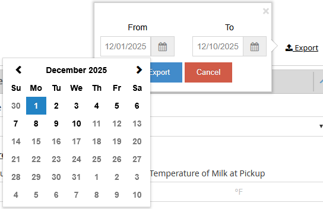

- Exports attendance data as a CSV file.
- [See Served Meals Report](reports.md#served-meals-report) for export details.

### Non-LA vs LA Differences

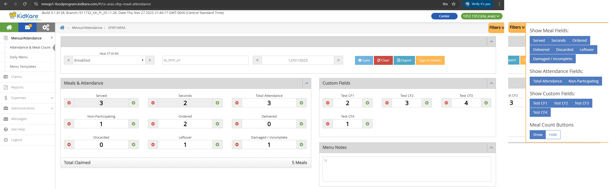

!!! note "LA vs Non-LA"
    LA (Louisiana) SFSP/ARAS centers use a different UI layout for the A&MC page. All behaviors are the same as the Non-LA version — only the visual layout differs. The Pickup/Delivery fields section is not shown for LA centers.

---

## Sponsor Attendance & Meal Counts

Sponsors enter meal counts for one center at a time, across a date range and all approved meals.

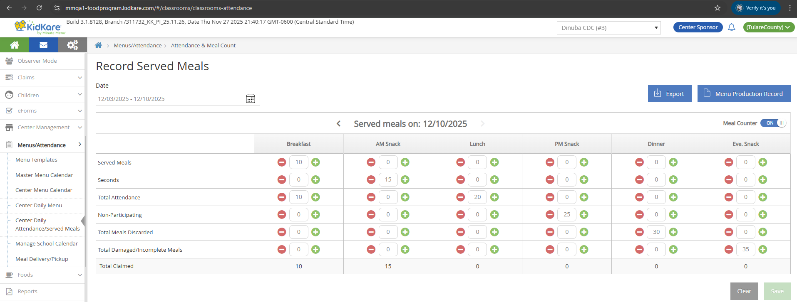

### Access

| Role | Can Access? |
|------|-------------|
| Sponsor Admin | Yes |
| Sponsor Staff with A&MC permission | Yes |
| Sponsor Staff without A&MC permission | No |

**Location:** Sponsor > Menus/Attendance > Center Daily Attendance/Served Meals > Select an SFSP/ARAS Center

### Center Selection

Select an SFSP/ARAS center from the Center dropdown. Only Open Enrolled SFSP/ARAS centers appear.

### Grid Layout

- Select a date range. Future dates are not allowed.
- Navigate back and forth within the date range.
- Each column shows one approved meal.

### Meal Counter Toggle

- Turn **Meal Counter** ON to use +/- buttons to increase or decrease values by 1.
- When Meal Counter is ON, clicking +/- and losing focus auto-saves the value.

### Input Validation

- Numbers only (0-9).
- Maximum: 9999. Minimum: 0.
- After entering a value and losing focus, the value is auto-saved.

### Field Mapping

| UI Field | DB Table | DB Column | Notes |
|----------|----------|-----------|-------|
| Served Meals | SFSP_ATTENDANCE_ITEM | meal_count | |
| Seconds | SFSP_ATTENDANCE | second_meal_count | |
| Total Attendance | SFSP_ATTENDANCE | total_attendance | |
| Non-Participating | SFSP_ATTENDANCE | non_participating_count | |
| Total Meals Discarded | SFSP_ATTENDANCE | leftover | |
| Total Damaged/Incomplete Meals | SFSP_ATTENDANCE | waste | |
| Total Claimed | Calculated | — | Read-only. Total Claimed = Served Meals + Seconds |

### Audit History

Changes are tracked in **SFSP_MEAL_SERVED_BULK_ENTRY_HISTORY**:

| Action | action_audit | meal_count_from | meal_count |
|--------|-------------|-----------------|------------|
| First entry (new record) | Add | 0 | entered value |
| Update existing value | Update | previous value | new value |
| Update value to 0 | Update | previous value | 0 |
| Clear button (delete) | Update | previous value | 0 |

### Buttons

- **Save** — Saves all data to SFSP_ATTENDANCE, SFSP_ATTENDANCE_ITEM, and SFSP_MEAL_SERVED_BULK_ENTRY_HISTORY.
- **Clear** — Shows confirmation popup ("Yes, delete"). Removes records from SFSP_ATTENDANCE and SFSP_ATTENDANCE_ITEM. Creates audit records in SFSP_MEAL_SERVED_BULK_ENTRY_HISTORY.
- **Export** — Downloads an xlsx file. [See Served Meals Report](reports.md#served-meals-report) for details.
- **Menu Production Record** — Downloads a PDF. File name: `MenuProductionReport_{number}.pdf`. API: `/kidkare/cxreports/CxPdf/sfsparasMenusProductionRecord`

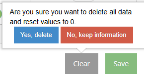

---

## Bulk Entry — Sponsor

Bulk Entry lets sponsors enter meal data for multiple centers on a single page.

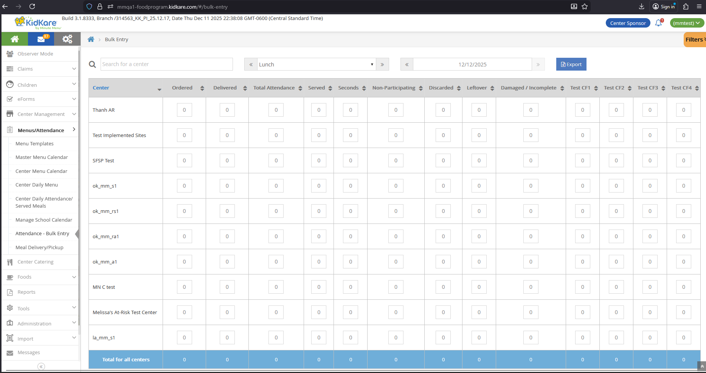

### Access

**URL:** `/#/bulk-entry`

| Role | Can Access? |
|------|-------------|
| Sponsor Admin | Yes |
| Sponsor Staff | Yes |
| Center Admin/Staff | No |
| IC Admin/Staff | No |

!!! warning "Visibility"
    The Bulk Entry menu only appears if the sponsor has **2 or more** SFSP/ARAS centers. If the sponsor has 0 or 1 SFSP/ARAS center, the menu is hidden.

The Center dropdown is hidden on this page.

### Controls

**Search** — Type text to filter by center name.

**Meal dropdown** — Single selection. Default: Lunch. Options: Breakfast, AM Snack, Lunch, PM Snack, Dinner, Eve. Snack.

**Date** — Default: current date. Cannot select future dates. Future dates highlight the field in red.

### Export

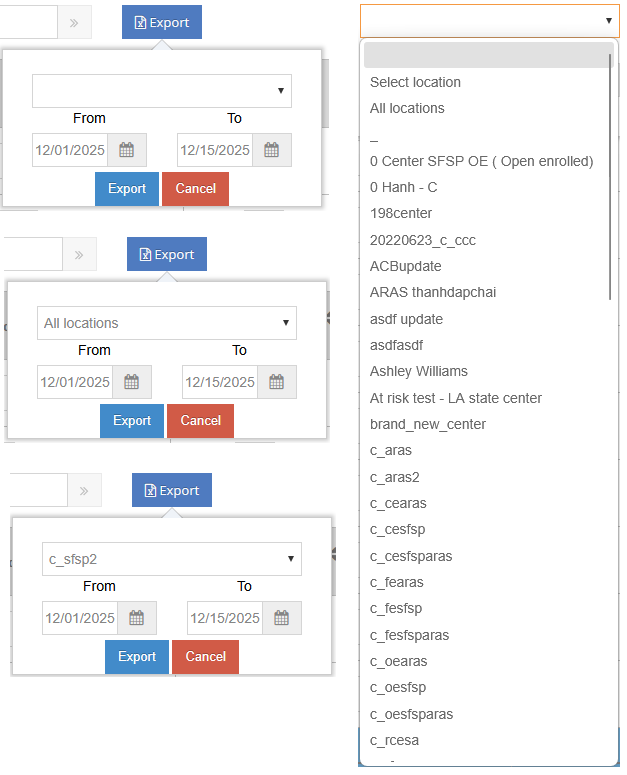

Click the **Export** button to open a popup with:

- **Center dropdown** — Default: empty. Options: All locations, or a specific SFSP/ARAS center.
- **From/To dates** — Cannot select future dates.
- Error message "The date range entered is invalid." appears if:
    - Future dates are entered and Export is clicked.
    - From date is after To date and Export is clicked.
- **Cancel** — Closes the popup.
- **Export** — Downloads `ServedMealsReport.xlsx`.

### Column Mapping

| UI Column | DB Table | DB Column | Notes |
|-----------|----------|-----------|-------|
| Center | CENTER | center_name | |
| Ordered | SFSP_ATTENDANCE | ordered | |
| Delivered | SFSP_ATTENDANCE | delivered | |
| Total Attendance | SFSP_ATTENDANCE | total_attendance | |
| Served | SFSP_ATTENDANCE_ITEM | meal_count | |
| Seconds | SFSP_ATTENDANCE | second_meal_count | |
| Non-Participating | SFSP_ATTENDANCE | non_participating_count | |
| Discarded | SFSP_ATTENDANCE | leftover | |
| Leftover | SFSP_ATTENDANCE | leftover_ext | |
| Damaged / Incomplete | SFSP_ATTENDANCE | waste | |
| Custom Field 1-4 | SFSP_ATTENDANCE_CUSTOM_VALUE | custom_value | Linked by custom_setting_id, center_id, attendance_date, meal_code |

### Sorting

Each column has sort icons. Click the up arrow for ascending, down arrow for descending.

### Bottom Totals Row

A read-only row at the bottom shows the sum of each column across all centers: Ordered, Delivered, Total Attendance, Served, Seconds, Non-Participating, Discarded, Leftover, Damaged / Incomplete, and Custom Fields.

### Input Validation and Auto-Save

- Default value: 0.
- Can enter text and numbers. Text characters are stripped — only valid numbers are saved.
- Maximum: 9999. Minimum: 0.
- Auto-save triggers when the input field loses focus:
    - Numbers only: the valid number is saved.
    - Text only: the field resets to 0. Not saved.
    - Mixed text and numbers: text is removed, the remaining number is saved.

### Audit History

Changes to **Served** and **Seconds** are tracked in **SFSP_MEAL_SERVED_BULK_ENTRY_HISTORY**:

| Column | meal_serving value |
|--------|--------------------|
| Served | 1 |
| Seconds | 2 |

| Scenario | action_audit | meal_count_from |
|----------|-------------|-----------------|
| First entry, no existing SFSP_ATTENDANCE record | Add | 0 |
| First entry, existing record but no Served/Seconds | Update | 0 |
| Subsequent entries | Update | previous value |

### Filters

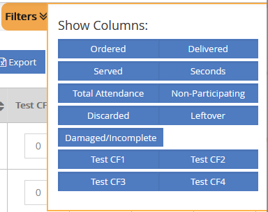

- Default selected: Ordered, Delivered, Served, Seconds, Total Attendance, Non-Participating, Discarded, Leftover, Damaged/Incomplete.
- Default deselected: Custom Field 1-4.
- Filter selections persist across logins.

---

## Non-Congregate Meal Delivery

Non-Congregate Meal Delivery allows centers to record meals delivered to children on specific days, instead of recording congregate (in-person) attendance.

### Non-Congregate Meal Settings

This setting controls whether Non-Congregate Meal Delivery is enabled for a center and which days are allowed.

| | Sponsor | IC |
|---|---------|-----|
| **Location** | Sponsor > Center Management > Manage Center Information > License/Schedule tab | IC > Site Details |
| **Who can access** | Sponsor Admin/Staff | IC Admin/Staff |

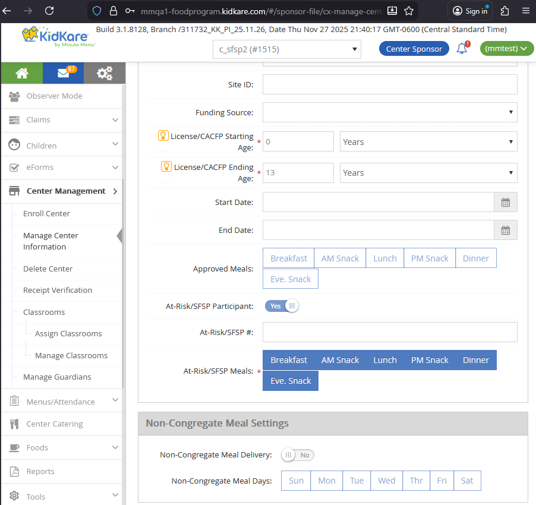

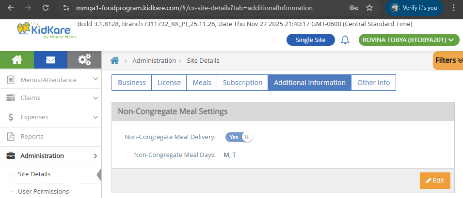

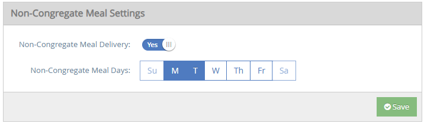

!!! note "When is this setting visible?"
    Non-Congregate Meal Settings is hidden for:

    - Regular centers
    - SFSP/ARAS centers that have at least 1 active child
    - Multi-license Regular-SFSP/ARAS centers that have at least 1 active child

    It is visible for SFSP/ARAS centers and Multi-license Regular-SFSP/ARAS centers (with no active children).

#### Toggle

- Default: **No** (off).
- Click to switch between Yes and No.
- DB: `CENTER_NON_CONGREGATE_MEAL.allow_meal_served_flag`

#### Day Selection

- Shows 7 days: Sun, Mon, Tue, Wed, Thu, Fri, Sat.
- If toggle is **No**: all days are deselected and disabled.
- If toggle is **Yes**: only days that match the center's "Days Open" setting (from General Info and Hours) are enabled. Click enabled days to select or deselect.

| Day | DB Column |
|-----|-----------|
| Sunday | CENTER_NON_CONGREGATE_MEAL.allow_sunday_flag |
| Monday | CENTER_NON_CONGREGATE_MEAL.allow_monday_flag |
| Tuesday | CENTER_NON_CONGREGATE_MEAL.allow_tuesday_flag |
| Wednesday | CENTER_NON_CONGREGATE_MEAL.allow_wednesday_flag |
| Thursday | CENTER_NON_CONGREGATE_MEAL.allow_thursday_flag |
| Friday | CENTER_NON_CONGREGATE_MEAL.allow_friday_flag |
| Saturday | CENTER_NON_CONGREGATE_MEAL.allow_saturday_flag |

### Non-Congregate Meal Delivery Page

**URL:** `/#/cx-aras-sfsp-non-congregate-meals`

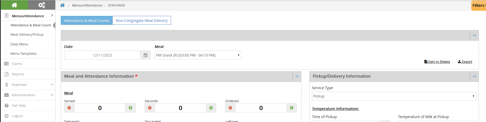

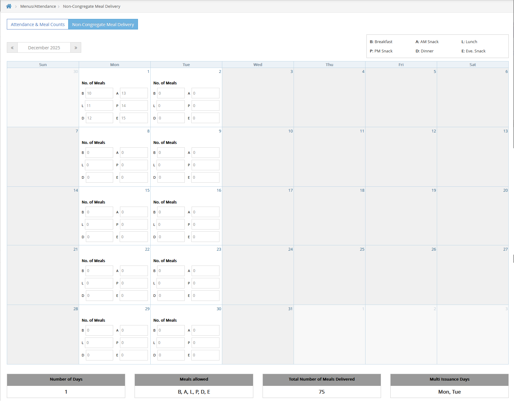

#### Access

| Condition | Result |
|-----------|--------|
| Non-Congregate toggle = OFF | Both tabs (A&MC and Non-Congregate) are hidden |
| Non-Congregate toggle = ON | Both tabs display |
| Center/IC Admin | Can access |
| Center/IC Staff with A&MC permission | Can access |
| Center/IC Staff without A&MC permission | Cannot access |

#### Calendar Layout

- Month view with columns: SUN, MON, TUE, WED, THU, FRI, SAT.
- Shows all days in the selected month. Days from other months are disabled and blurred.
- Use the Month/Year navigation (with Next/Previous icons) to change months. Default: current month.

#### Enabled vs Disabled Days

- **Enabled days** (Non-Congregate Meal Days): show "No. of Meals" text and input fields for each approved meal.
- **Disabled days** (not Non-Congregate Meal Days): grayed out, no meal inputs shown.

#### Static Text Labels

Read-only labels in the top-right corner:

| Abbreviation | Meal |
|-------------|------|
| B | Breakfast |
| A | AM Snack |
| L | Lunch |
| P | PM Snack |
| D | Dinner |
| E | Eve. Snack |

#### Dynamic Text (Bottom)

| Label | Description |
|-------|-------------|
| Number of Days | Count of recorded days in the selected month |
| Meals Allowed | All approved meals for this center |
| Total Number of Meals Delivered | Sum of all meal counts |
| Multi Issuance Days | Valid Non-Congregate Meal Days from CENTER_NON_CONGREGATE_MEAL |

#### Input Fields

- Default: 0. Numbers only (0-9). Maximum: 9999. Minimum: 0.
- Auto-saves when the field loses focus.

#### Field Mapping

| Meal | DB Column (CENTER_NON_CONGREGATE_MEAL_COUNT) | Also writes to |
|------|----------------------------------------------|----------------|
| Breakfast (B) | breakfast_meal_count | SFSP_ATTENDANCE.total_attendance, SFSP_ATTENDANCE_ITEM.meal_count |
| AM Snack (A) | am_snack_meal_count | SFSP_ATTENDANCE.total_attendance, SFSP_ATTENDANCE_ITEM.meal_count |
| Lunch (L) | lunch_meal_count | SFSP_ATTENDANCE.total_attendance, SFSP_ATTENDANCE_ITEM.meal_count |
| PM Snack (P) | pm_snack_meal_count | SFSP_ATTENDANCE.total_attendance, SFSP_ATTENDANCE_ITEM.meal_count |
| Dinner (D) | dinner_meal_count | SFSP_ATTENDANCE.total_attendance, SFSP_ATTENDANCE_ITEM.meal_count |
| Eve. Snack (E) | evening_snack_meal_count | SFSP_ATTENDANCE.total_attendance, SFSP_ATTENDANCE_ITEM.meal_count |

!!! note "No audit history"
    Non-Congregate Meal Delivery does **not** write to SFSP_MEAL_SERVED_BULK_ENTRY_HISTORY.

#### Effect on A&MC Page

When Non-Congregate Meal Days are set, the A&MC page date picker disables those days. For example, if Mon and Tue are Non-Congregate days, all Mondays and Tuesdays are disabled on the A&MC calendar.

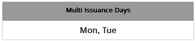 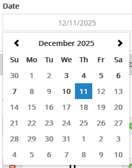

---

## Custom Fields Settings

Sponsors and SFSP/ARAS ICs can define up to 4 custom fields that appear on the A&MC page, Bulk Entry page, and Served Meals Report.

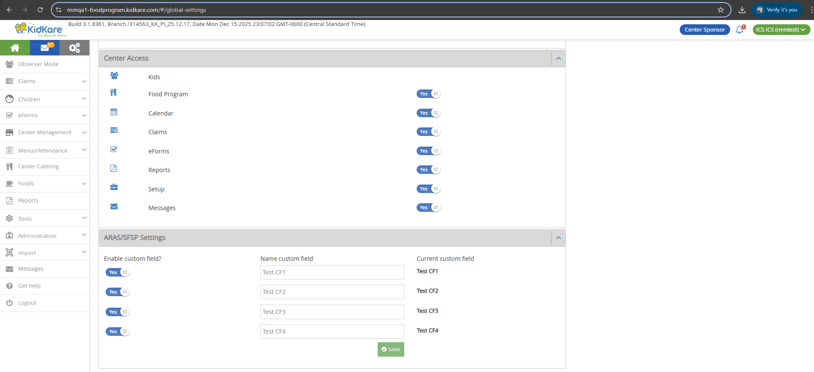

### Location

**URL:** `/#/global-settings`

**Location:** Settings icon > Settings page > ARAS/SFSP Settings section

**API:** `/kidkare/centers/meal/sfspattendancecustom?clientId={client_id}`

### Access

| Role | Can Access? |
|------|-------------|
| Sponsor Admin (with at least 1 SFSP/ARAS center) | Yes |
| Sponsor Staff (with Kidkare - Settings = Y) | Yes |
| SFSP/ARAS IC Admin/Staff | Yes |
| Sponsor Admin (Regular centers only) | No |
| Sponsor Staff (with Kidkare - Settings = N) | No |
| Center Admin/Staff | No |
| Regular IC Admin/Staff | No |

### Sliders and Text Fields

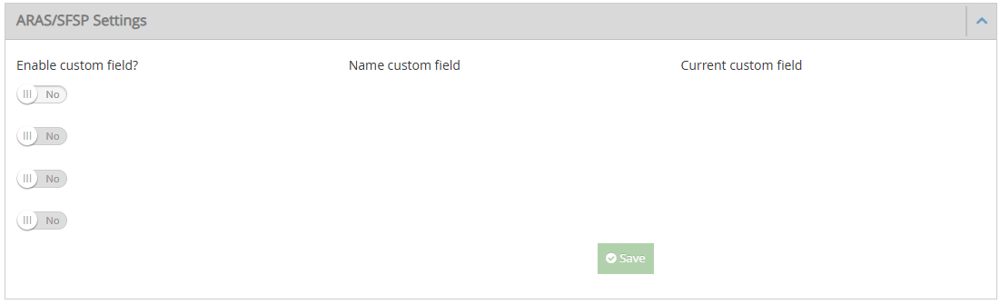

There are 4 slider + text field pairs. They enable sequentially:

1. **Slider 1** is enabled by default. Sliders 2, 3, 4 are disabled.
2. Turn Slider 1 to **Yes** — Text Field 1 appears (required, red outline). Slider 2 stays disabled.
3. Enter a name in Text Field 1 — red outline removed. Slider 2 becomes enabled.
4. Repeat the same pattern for Slider 2 to enable Slider 3, and so on.

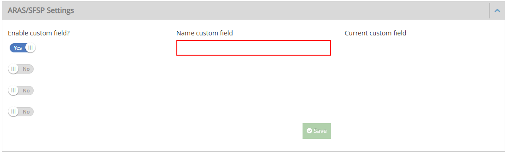

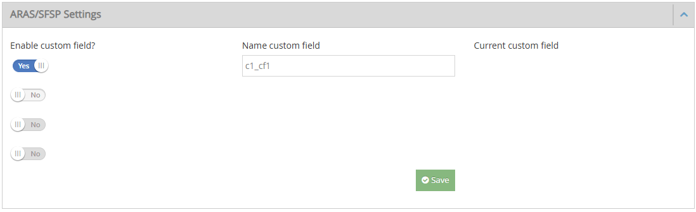

**Text field rules:**

- Empty by default. Maximum 100 characters.
- "Current custom field" shows the active custom field name for the current month (blank if none).

**Save button:**

- Disabled when no custom field is defined or when a required text field is empty.
- Enabled when at least one text field has a value.

### Save Confirmation

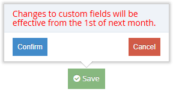

When Save is clicked, a popup appears:

> "Changes to custom fields will be effective from the 1st of next month."

- **Cancel** — Closes the popup. No changes saved.
- **Confirm** — Saves data to `SFSP_ATTENDANCE_CUSTOM`.

### Business Rules

All custom field changes take effect from the **1st of next month**, not immediately.

| Scenario | Result |
|----------|--------|
| Create a new custom field this month | Active from next month. Current month shows blank. |
| Update a custom field name this month | New name applies from next month. Current month keeps old name. |
| Update a custom field that has data | New name applies from next month. Existing data values are kept. |
| Remove a custom field that has data | Hidden from next month. Current month still shows the field and data. |
| Remove a higher field (e.g., Field 1) | Lower fields (2, 3, 4) stay in their same positions. |
| Create and update name in the same month | Applied from next month. |
| Create and remove in the same month | Applied from next month. |

### Where Custom Fields Appear

Custom fields appear in these locations:

- **Bulk Entry page** (Sponsor) — as columns with input fields, and in the Filters panel.
- **A&MC page** (Center/IC) — as input fields, and in the Filters panel.
- **Served Meals Report** — as columns.

All custom field values are stored in `SFSP_ATTENDANCE_CUSTOM_VALUE`.

---

## Multi-License Centers

Centers with both Regular and SFSP/ARAS licenses can switch between the two program views on the A&MC page.

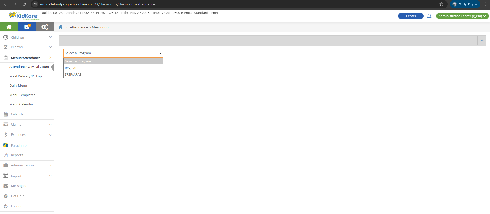 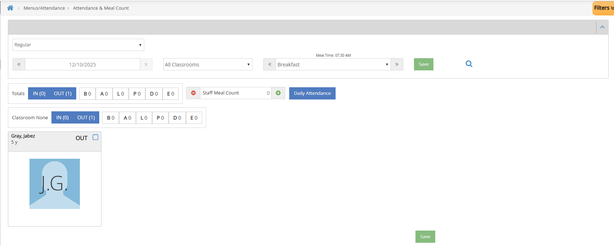

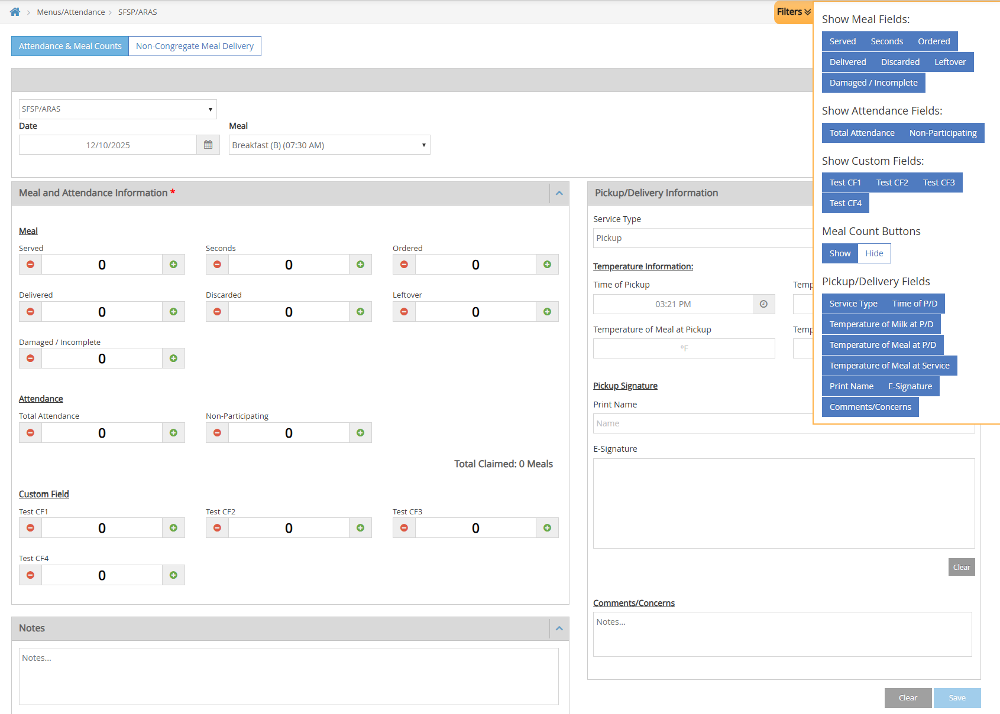

After loading the A&MC page, a **Program Type** dropdown appears with two options:

- **Regular** — Shows the standard Regular A&MC page with existing behaviors.
- **SFSP/ARAS** — Shows the SFSP/ARAS A&MC page (same as the Non-LA SFSP/ARAS view described above).
