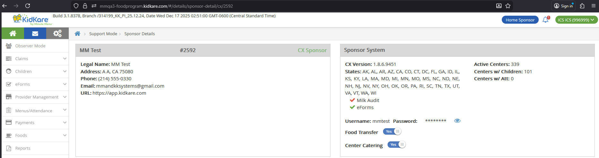
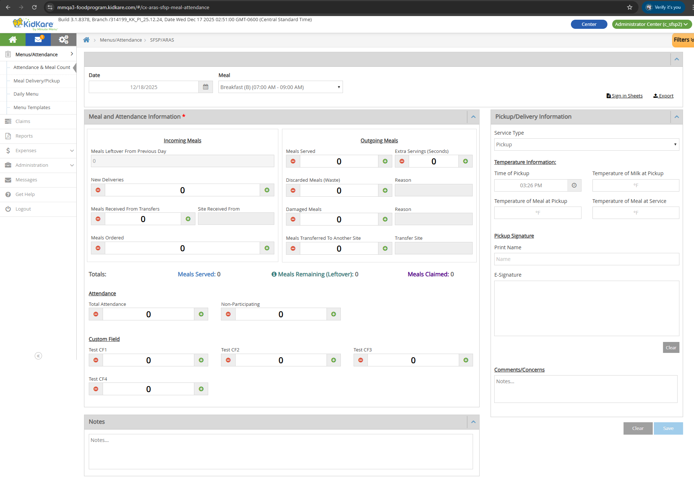
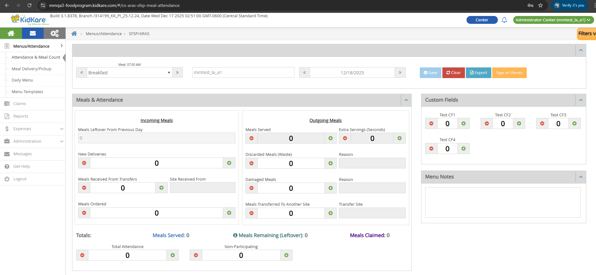
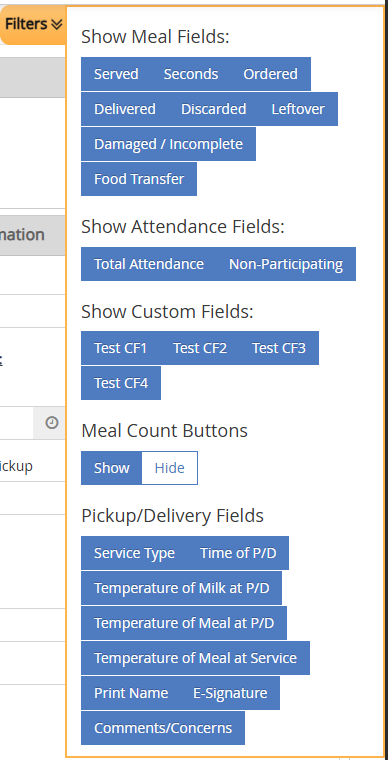
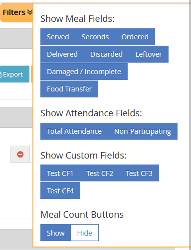
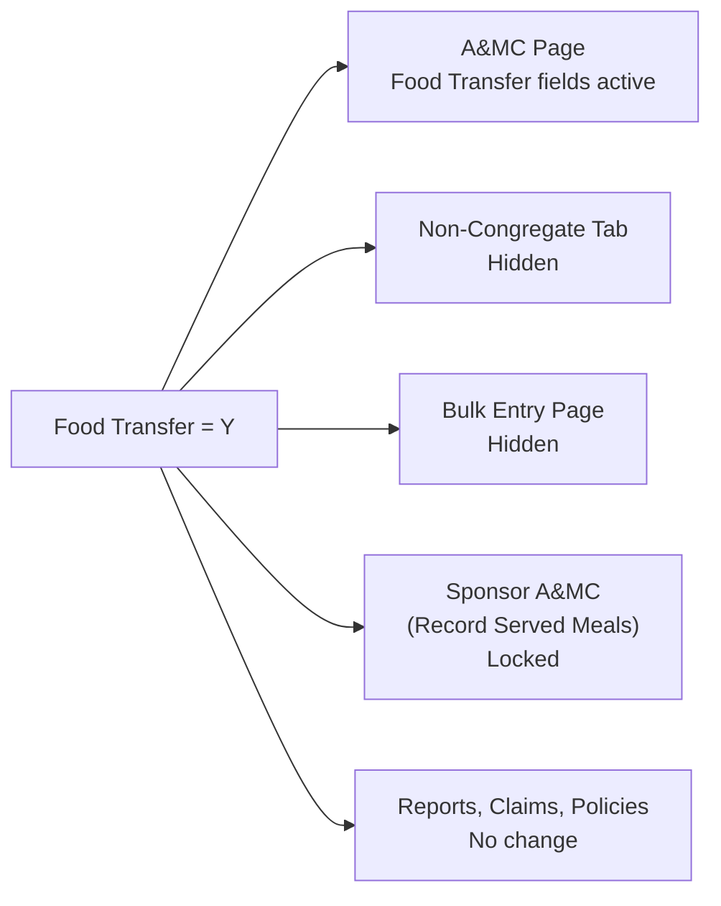

# Food Transfer

Food Transfer is a per-client setting that changes how the [Attendance & Meal Counts](attendance.md) page works for SFSP/ARAS centers. When enabled, it adds transfer tracking fields (meals received from other sites, meals transferred out) and modifies several existing field names and behaviors.

This setting does not apply to IC (Independent Center) users.

---

## Settings

**Location:** Support Tools > User Search > Sponsor tab > Search CX Sponsor > Click Sponsor ID > Sponsor Details > Sponsor System section > Food Transfer Settings

**URL:** `/#/details/sponsor-detail/cx/{client_id}`



| Setting | Default |
|---------|---------|
| ON | Enabled by default for certain clients |
| OFF | Default for all other clients |
| Hidden | Not visible for HX Sponsors |

!!! warning "Not applied for IC"
    Food Transfer settings are not applied for Independent Center (IC) users.

### Database Reference

| Table | Column | Notes |
|-------|--------|-------|
| `KK_ConfigSettingDefinition` | `Name = 'FoodTransfer'` | Setting definition |
| `KK_ConfigSettingValue` | `Value` | Uses matching `SettingDefinitionId`, `ScopeId = {client_id}` |

---

## Permissions

The Food Transfer version of the A&MC page is only available to SFSP/ARAS center users whose sponsor has Food Transfer = Y.

| Role | Food Transfer = Y | Additional Requirement | Can Access? |
|------|-------------------|----------------------|-------------|
| SFSP/ARAS Center Admin | Yes | -- | **Yes** |
| SFSP/ARAS Center Staff | Yes | Record Center Attendance = Y | **Yes** |
| SFSP/ARAS Center Staff | Yes | Record Center Attendance = N | No |
| SFSP/ARAS Center Admin/Staff | No | -- | No |
| Sponsor Admin/Staff | -- | -- | No |
| Regular Center Admin/Staff | -- | -- | No |
| IC Admin/Staff (Regular, SFSP, ARAS) | -- | -- | No |

---

## Field Changes on A&MC Page

When Food Transfer is ON, the [Attendance & Meal Counts](attendance.md) page shows different fields. The page is available at both Non-LA and LA layouts.









### Renamed Fields

These existing fields get new names when Food Transfer is ON:

| Original Name | New Name (Food Transfer ON) |
|---------------|----------------------------|
| Served | Meals Served |
| Seconds | Extra Servings (Seconds) |
| Ordered | Meals Ordered |
| Delivered | New Deliveries |
| Discarded | Discarded Meals (Waste) |
| Damaged/Incomplete Meals | Damaged Meals |

### Unchanged Fields

These fields keep the same name and behavior:

- **Shared:** Total Attendance, Non-Participating, Date, Meal dropdown, Clear button, Save button
- **Non-LA only:** Custom Fields 1-4, Pickup/Delivery Information section (Service Type, Time, Temperatures, Print Name, E-Signature, Comments/Concerns), Notes section, Sign-in Sheets link, Export link
- **LA only:** Custom Fields 1-4, Menu Notes section, Sign-in Sheets button, Export button, Center Name

For baseline behavior of these fields, see [Attendance & Meal Counts](attendance.md).

### New Read-Only Fields

These fields are calculated and display only. Users cannot edit them.

| Field | Color | Description | Source |
|-------|-------|-------------|--------|
| **Meals Leftover From Previous Day** | -- | The leftover value from the previous record of the same meal, regardless of how far back that record is. Shows `0` if no previous record exists. | Previous day's `leftover_ext` for same meal |
| **Meals Served** (summary) | `#407cc5` | Total meals served for the day. | Meals Served + Extra Servings (Seconds) |
| **Meals Remaining (Leftover)** | `#388080` | How many meals are left after all activity. Minimum display value is `0`. | See formula below |
| **Meals Claimed** | `#54088f` | The claimed meal count from the claims system. | `SFSP_ATTENDANCE_ITEM.meal_count` |

#### Meals Remaining Formula

The tooltip on the info icon shows this formula:

```
(Meals Leftover From Previous Day + New Deliveries + Meals Received From Transfers)
- (Discarded Meals + Damaged Meals + Total Meals Served Today + Meals Transferred To Another Site)
= Meals Remaining (Leftover)
```

If the result is negative, the field displays `0`.

!!! info "Switching Food Transfer toggles this field"
    When Food Transfer switches from **Y to N**, Meals Remaining becomes an editable input field (standard Leftover behavior). When it switches from **N to Y**, it becomes a calculated read-only field again. Existing data displays correctly after the switch.

### New Input Fields

These are numeric input fields with the same behavior as other existing input fields on the page.

| Field | DB Column | Constraints |
|-------|-----------|-------------|
| **Meals Received From Transfers** | `meal_received` | Numbers only, min 0, max 9999. Click +/- to increment/decrement by 1. |
| **Meals Transferred To Another Site** | `meal_transferred` | Numbers only, min 0, max 9999. Click +/- to increment/decrement by 1. |

### New Text Fields

Each text field is paired with a numeric input field. The text field is **mandatory** (red font with asterisk) when its paired input is greater than 0. Maximum 150 characters.

| Text Field | Paired Input Field | DB Table | DB Column | Locked When |
|------------|--------------------|----------|-----------|-------------|
| **Site Received From** | Meals Received From Transfers | `SFSP_ATTENDANCE` | `meal_received_comments` | Meals Received From Transfers = 0 |
| **Reason** (for Discarded) | Discarded Meals (Waste) | `SFSP_ATTENDANCE` | `discarded_comments` | Discarded Meals (Waste) = 0 |
| **Reason** (for Damaged) | Damaged Meals | `SFSP_ATTENDANCE` | `waste_comments` | Damaged Meals = 0 |
| **Transfer Site** | Meals Transferred To Another Site | `SFSP_ATTENDANCE` | `meal_transferred_comments` | Meals Transferred To Another Site = 0 |

When the paired input is 0, the text field is locked and grayed out.

!!! warning "Save button disabled"
    The Save button is disabled if any mandatory text field (marked with *) is empty while its paired input is greater than 0.

### New Filter: Food Transfer

A new **Food Transfer** filter option is added to the existing filter panel.

- **Select:** Shows the transfer-related fields (Meals Received From Transfers, Site Received From, Meals Transferred To Another Site, Transfer Site)
- **Deselect:** Hides those fields

Existing filter changes when Food Transfer is ON:

| Filter | Behavior |
|--------|----------|
| Discarded | Select/deselect shows/hides Discarded Meals (Waste) **and** its Reason field |
| Damaged/Incomplete | Select/deselect shows/hides Damaged Meals **and** its Reason field |

---

## System Impacts

When Food Transfer is turned ON, several other pages are affected.



| Page | Effect When Food Transfer = Y | Effect When Food Transfer = N |
|------|-------------------------------|-------------------------------|
| **SFSP/ARAS A&MC (Non-LA, LA)** | Food Transfer fields and functions applied as described above | Standard behavior |
| **Non-Congregate Meal Counts** | Tab and URL hidden (when Non-Congregate Meal Settings = Y) | Standard behavior |
| **Bulk Entry** | Page and URL hidden | Standard behavior |
| **Sponsor SFSP/ARAS A&MC (Record Served Meals)** | Page is locked with message: *"This page is temporarily disabled since Food Transfer setting is ON"* | Standard behavior |
| **Served Meals Report** | No change. Existing columns work as before. No new Food Transfer columns. | Standard behavior |
| **SFSP/ARAS Claims** | No change | Standard behavior |
| **Policies (A05a, B01)** | No change | Standard behavior |

---

## DB Reference

Summary of all database fields related to Food Transfer.

| UI Field | DB Table | DB Column |
|----------|----------|-----------|
| Food Transfer Setting | `KK_ConfigSettingDefinition` / `KK_ConfigSettingValue` | `Name = 'FoodTransfer'` / `Value` |
| Meals Leftover From Previous Day | `SFSP_ATTENDANCE` | `leftover_ext` (previous day, same meal) |
| Meals Remaining (Leftover) | `SFSP_ATTENDANCE` | `leftover_ext` |
| Meals Claimed | `SFSP_ATTENDANCE_ITEM` | `meal_count` |
| Meals Received From Transfers | `SFSP_ATTENDANCE` | `meal_received` |
| Meals Transferred To Another Site | `SFSP_ATTENDANCE` | `meal_transferred` |
| Site Received From | `SFSP_ATTENDANCE` | `meal_received_comments` |
| Reason (Discarded) | `SFSP_ATTENDANCE` | `discarded_comments` |
| Reason (Damaged) | `SFSP_ATTENDANCE` | `waste_comments` |
| Transfer Site | `SFSP_ATTENDANCE` | `meal_transferred_comments` |
