# Meal Delivery & Pickup

## Overview

Meal Delivery/Pickup manages satellite delivery forms between central kitchen sites and satellite centers. Sponsors and Centers/ICs use these forms to track food shipments, record temperatures, and capture signatures at departure and receipt.

Each form is called a "Satellite Form." It holds items shipped (bulk, pre-plated, or additional), departure/receiving timestamps, comments, and e-signatures from both parties.

Related report: [Pickup & Delivery Tracking Satellite Report](reports.md#pickupdelivery-tracking-satellite-report)

---

## Permissions

| Role | Access | Notes |
|------|--------|-------|
| Sponsor Admin | Yes | Full access |
| Sponsor Staff (Record Meal Delivery/Pickup = Y) | Yes | Permission must be enabled |
| Sponsor Staff (Record Meal Delivery/Pickup = N) | No | Cannot access the page |
| Center Admin | Yes | Full access |
| IC Admin | Yes | No 'Record Meal Delivery/Pickup' permission check for IC |

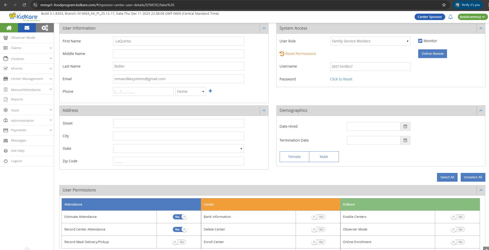

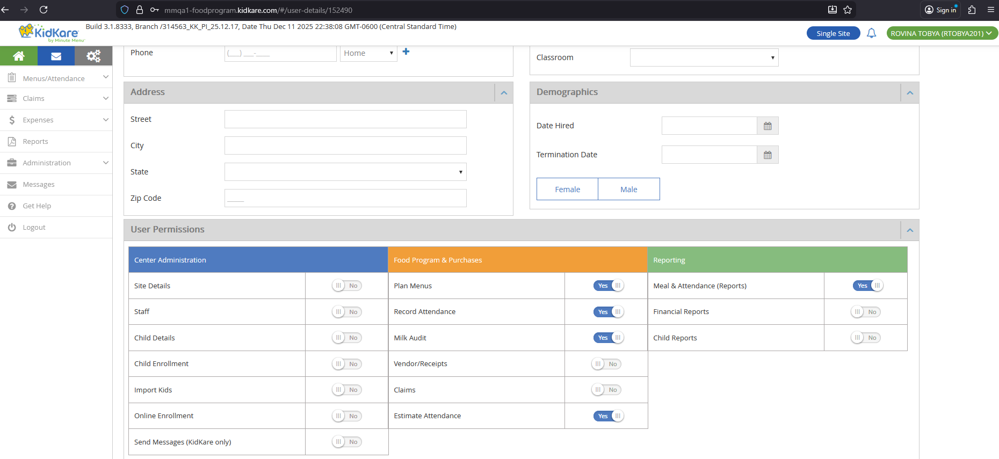

!!! note "Sub-menu visibility"
    The Meal Delivery/Pickup sub-menu always displays for sponsors, even if the sponsor has no SFSP/ARAS centers. If a Regular Center is selected, a message appears: **"This page is not available for this center. Please select another Open Enrolled Center."**

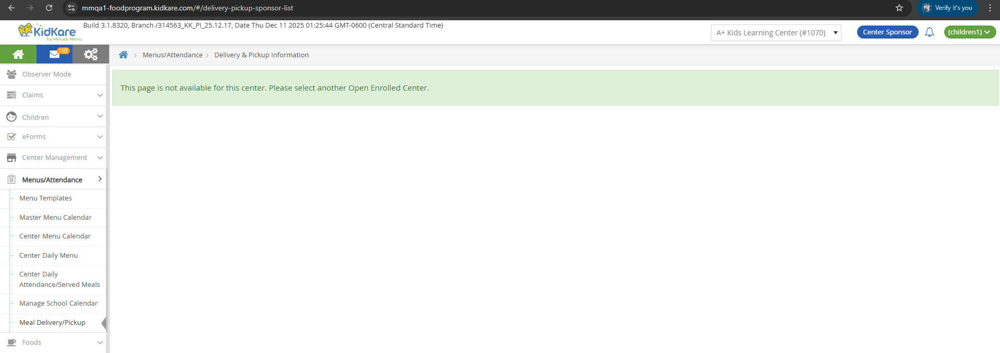

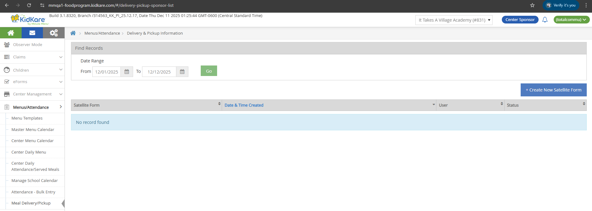

---

## List Page

- **Sponsor URL:** `/#/delivery-pickup-sponsor-list`
- **Breadcrumb:** Menus/Attendance > Delivery & Pickup Information

### Date Range

| Field | Default Value |
|-------|---------------|
| From | 1st of the current month |
| To | Current date |

Users can select or type a date in both fields.

### Create New Satellite Form

Click the **Create New Satellite Form** button to open the create page.

### Table Columns

| Column | Description | Format |
|--------|-------------|--------|
| Satellite Form | Form name | `Satform_{Month}_{dd}_{order}` (e.g., `Satform_Dec_22_1`, `Satform_Dec_22_2`) |
| Date & Time Created | When the form was created | `mm/dd/yyyy hh:mm AM/PM` |
| User | Creator name | `{STAFF.first_name} {STAFF.last_name}` |
| Status | Current state | Pending or Complete |

### Status Logic

| Status | Condition |
|--------|-----------|
| Pending | Form has 0 or 1 signatures (not locked) |
| Complete | Form has 2 signatures (locked) |

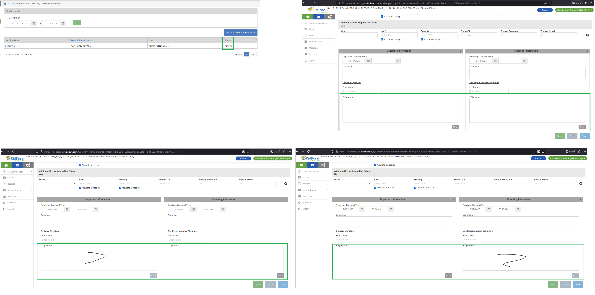

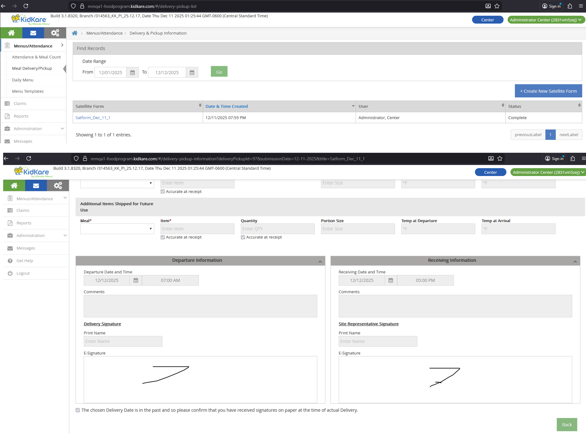

### Sorting and Pagination

- **Default sort:** Descending by Submission Date, then by Date & Time Created
- **Page size:** 10 records per page
- **Navigation:** Previous / Next buttons
- **Display:** "Showing {x} to {y} of {z} entries"

### Database Tables

Data loads from `SFSP_DELIVERY_PICKUP` and `SFSP_DELIVERY_PICKUP_ITEM`.

---

## Create / Edit Form

### URLs

| Action | URL Pattern |
|--------|------------|
| Create (Sponsor) | `/#/delivery-pickup-information?center={center_id}` |
| Edit (Sponsor) | `/#/delivery-pickup-information?deliveryPickupId={id}&center={center_id}&submissionDate={mm-dd-yyyy}&title=Satform_{Month}_{dd}_{order}` |
| Edit (Center/IC) | `/#/delivery-pickup-information?deliveryPickupId={id}&submissionDate={mm-dd-yyyy}&title=Satform_{Month}_{dd}_{order}` |

- **Create breadcrumb:** Delivery & Pickup Information > Create new
- **Edit breadcrumb:** Delivery & Pickup Information > Satform_{Month}_{dd}_{order}

The global Center dropdown is hidden on the create/edit page.

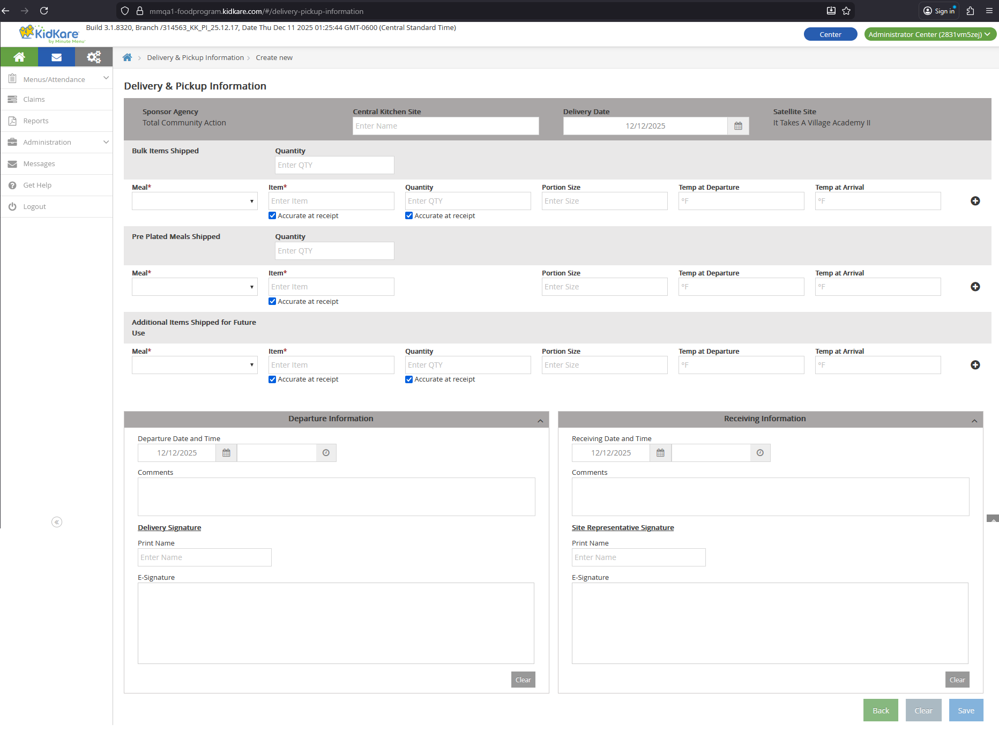

### Header Fields

| Field | Editable | Source |
|-------|----------|--------|
| Sponsor Agency | Read-only | `CLIENT.legal_name` |
| Central Kitchen Site | Yes | `SFSP_DELIVERY_PICKUP.center_kitchen_site` |
| Delivery Date | Yes (defaults to current date) | `SFSP_DELIVERY_PICKUP.submission_date` |
| Satellite Site | Read-only | `CENTER.center_name` |

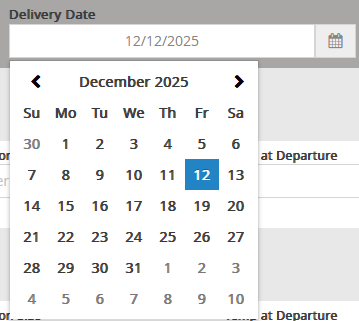

### Bulk Items Shipped

Database: `SFSP_DELIVERY_PICKUP_ITEM.item_type = 2255`

| Field | Input | Validation | DB Column |
|-------|-------|------------|-----------|
| Quantity | Text | -- | `SFSP_DELIVERY_PICKUP.bulk_item_quantity` |
| Meal* | Single select | Required. Options: Breakfast, AM Snack, Lunch, PM Snack, Dinner, Eve. Snack | `SFSP_DELIVERY_PICKUP_ITEM.meal_code` |
| Item* | Text | Required | `SFSP_DELIVERY_PICKUP_ITEM.item` |
| Accurate at receipt (Item) | Checkbox | 1 = selected, 0 = deselected | `SFSP_DELIVERY_PICKUP_ITEM.item_accurate` |
| Quantity | Text | -- | `SFSP_DELIVERY_PICKUP_ITEM.quantity` |
| Accurate at receipt (Qty) | Checkbox | 1 = selected, 0 = deselected | `SFSP_DELIVERY_PICKUP_ITEM.quantity_accurate` |
| Portion Size | Text | -- | `SFSP_DELIVERY_PICKUP_ITEM.portion_size` |
| Temp at Departure | Number | Numbers only, max 999999999, min -99999999 | `SFSP_DELIVERY_PICKUP_ITEM.temp_departure` |
| Temp at Arrival | Number | Numbers only, max 999999999, min -99999999 | `SFSP_DELIVERY_PICKUP_ITEM.temp_arrival` |

**Row controls:**

- **+ icon:** Adds a new blank row. Only appears on the last row.
- **- icon:** Removes the row. Hidden when only one row exists.

### Pre-Plated Meals Shipped

Database: `SFSP_DELIVERY_PICKUP_ITEM.item_type = 2256`

Same fields and behavior as Bulk Items Shipped. The quantity field maps to `SFSP_DELIVERY_PICKUP.plated_meal_quantity`.

### Additional Items Shipped for Future Use

Database: `SFSP_DELIVERY_PICKUP_ITEM.item_type = 2257`

Same fields and behavior as Bulk Items Shipped.

### Departure Information

| Field | Input | Validation | DB Column |
|-------|-------|------------|-----------|
| Departure Date | Date picker | Future days disabled | `SFSP_DELIVERY_PICKUP.departure_datetime` |
| Departure Time | Time picker | -- | (same column as date) |
| Comments | Text | Max 500 characters | `SFSP_DELIVERY_PICKUP.departure_comment` |
| Print Name | Text | Max 100 characters | `SFSP_DELIVERY_PICKUP.departure_print_name` |
| E-Signature | Mouse signing pad | -- | `SFSP_DELIVERY_PICKUP.departure_esignature_id` |

**Clear button:** Removes the current e-signature drawing without saving.

### Receiving Information

| Field | Input | Validation | DB Column |
|-------|-------|------------|-----------|
| Receiving Date | Date picker | Future days disabled | `SFSP_DELIVERY_PICKUP.receiving_datetime` |
| Receiving Time | Time picker | -- | (same column as date) |
| Comments | Text | Max 500 characters | `SFSP_DELIVERY_PICKUP.receiving_comment` |
| Print Name | Text | Max 100 characters | `SFSP_DELIVERY_PICKUP.receiving_print_name` |
| E-Signature | Mouse signing pad | -- | `SFSP_DELIVERY_PICKUP.receiving_esignature_id` |

**Clear button:** Removes the current e-signature drawing without saving.

### Past Date Checkbox

A checkbox with the text "The chosen Delivery Date is in the past..." controls past-date acknowledgment.

| Delivery Date | Checkbox Behavior |
|---------------|-------------------|
| Current date or future | Hidden |
| Past date | Displayed, selected, and disabled |

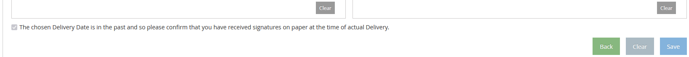

Database: `SFSP_DELIVERY_PICKUP.is_agreed_on_past_delivery_date`

### Form Buttons

| Button | Behavior |
|--------|----------|
| Back | Returns to the list page |
| Clear | Resets all fields without saving |
| Save | Saves all data and shows a confirmation toast |

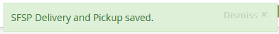

---

## Lock / Unlock Logic

| Signatures | State | Behavior |
|------------|-------|----------|
| 0 or 1 | Unlocked | All fields are editable. Add (+), Clear, and Save buttons are visible. |
| 2 | Locked | All fields are disabled. Add (+) icon, Clear buttons (e-signature and form), and Save button are hidden. |

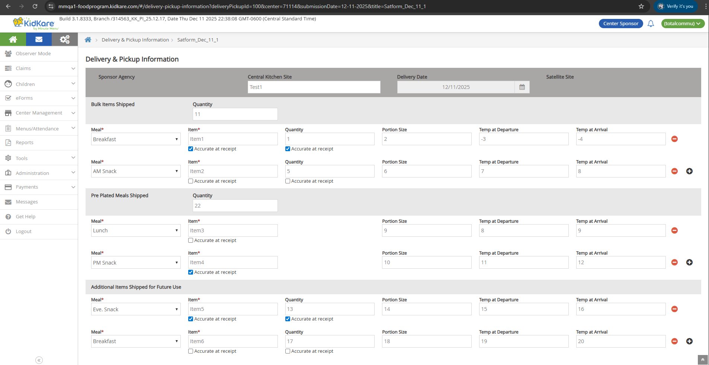

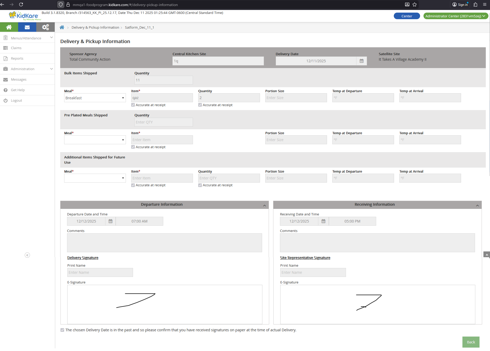

!!! warning "Locked forms cannot be edited"
    Once both the Delivery Signature and Site Representative Signature are saved, the form locks. No further changes are possible through the UI.

---

## Sponsor vs Center/IC Differences

| Aspect | Sponsor | Center / IC |
|--------|---------|-------------|
| Permission check | Requires 'Record Meal Delivery/Pickup' = Y | No permission check for IC |
| Create URL | Includes `center={center_id}` param | Includes `center={center_id}` param |
| Edit URL | Includes `center={center_id}` param | No `center` param |
| Sub-menu visibility | Always visible (even without SFSP/ARAS centers) | Always visible |

---

## DB Reference

### SFSP_DELIVERY_PICKUP

| UI Field | DB Column |
|----------|-----------|
| Central Kitchen Site | `center_kitchen_site` |
| Delivery Date | `submission_date` |
| Bulk Items Quantity | `bulk_item_quantity` |
| Pre-Plated Meals Quantity | `plated_meal_quantity` |
| Departure Date and Time | `departure_datetime` |
| Departure Comments | `departure_comment` |
| Departure Print Name | `departure_print_name` |
| Departure E-Signature | `departure_esignature_id` |
| Receiving Date and Time | `receiving_datetime` |
| Receiving Comments | `receiving_comment` |
| Receiving Print Name | `receiving_print_name` |
| Receiving E-Signature | `receiving_esignature_id` |
| Past Date Acknowledgment | `is_agreed_on_past_delivery_date` |

### SFSP_DELIVERY_PICKUP_ITEM

| UI Field | DB Column |
|----------|-----------|
| Item Type | `item_type` (2255 = Bulk, 2256 = Pre-Plated, 2257 = Additional) |
| Meal | `meal_code` |
| Item | `item` |
| Accurate at receipt (Item) | `item_accurate` |
| Quantity | `quantity` |
| Accurate at receipt (Qty) | `quantity_accurate` |
| Portion Size | `portion_size` |
| Temp at Departure | `temp_departure` |
| Temp at Arrival | `temp_arrival` |
