# SFSP/ARAS Reports

This page documents the report exports available for SFSP/ARAS centers: Served Meals Report, Bulk Attendance Last Modified, and Pickup/Delivery Tracking (Satellite Report).

---

## Served Meals Report

Export functionality that generates a `ServedMealsReport.xlsx` file. Available from three different pages, each with different behavior.

### Export Contexts

| Context | Role | Export Trigger | Has Popup? | Has Filters? |
|---------|------|----------------|------------|--------------|
| Center Daily Attendance/Served Meals | Sponsor | Export button | No | No -- all columns shown |
| Bulk Entry page | Sponsor | Export button | Yes -- select center(s), From/To | Yes -- hidden filter columns hidden in report |
| Non-LA/LA SFSP/ARAS A&MC page | Center/IC | Export button | Yes -- select From/To | Yes -- hidden filter columns hidden in report |

### Navigation

**Center Daily Attendance/Served Meals (Sponsor):**

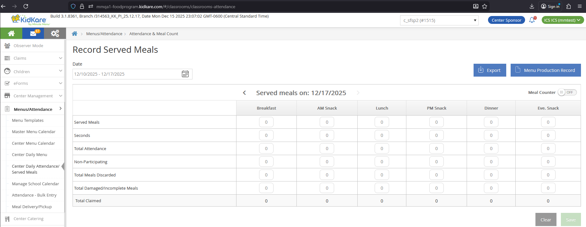

**Bulk Entry (Sponsor):**

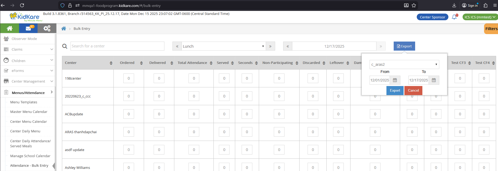

**A&MC page (Non-LA Center/IC):**

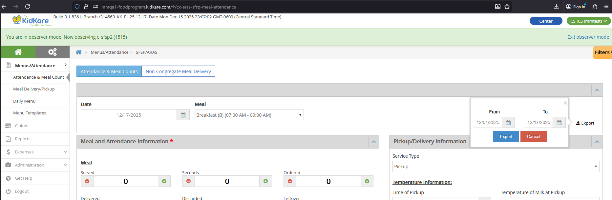

**A&MC page (LA Center/IC):**

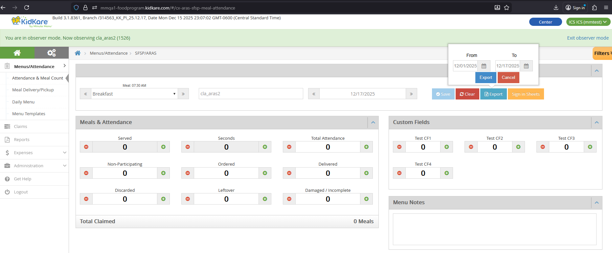

### Report File

| Property | Value |
|----------|-------|
| File name | `ServedMealsReport.xlsx` |
| Title line | "Served Meals Report" |
| Subtitle lines | Sponsor legal name, date range (From - To) |

!!! note "Meal columns"
    `{Meal}` in column names means: Breakfast, AM Snack, Lunch, PM Snack, Dinner, Eve. Snack. If a center does not have a meal approved but has records for that meal, the columns still display.

### Columns Always Shown

These columns appear in all three export contexts and do not depend on Filters.

| Column | DB Table | DB Column |
|--------|----------|-----------|
| Center Name | `CENTER` | `center_name` |
| Center Number | `CENTER` | `center_number` |
| Attendance Date | `SFSP_ATTENDANCE` | `attendance_date` |
| {Meal} Count | `SFSP_ATTENDANCE_ITEM` | `meal_count` |
| {Meal} Saved | `SFSP_ATTENDANCE` | `mod_date_time` |
| Comments | `SFSP_ATTENDANCE` | `comments` |

### Additional Columns for Sponsor Center Daily Attendance

The Center Daily Attendance/Served Meals page always shows these additional columns. They do not depend on Filters because this page has no Filters.

| Column | DB Table | DB Column |
|--------|----------|-----------|
| {Meal} Seconds | `SFSP_ATTENDANCE` | `second_meal_count` |
| {Meal} Claimed | Calculated | `SFSP_ATTENDANCE_ITEM.meal_count` + `SFSP_ATTENDANCE.second_meal_count` |
| {Meal} Attendance | `SFSP_ATTENDANCE` | `total_attendance` |
| {Meal} Non Participating | `SFSP_ATTENDANCE` | `non_participating_count` |
| {Meal} Total Meals Discarded | `SFSP_ATTENDANCE` | `leftover` |
| {Meal} Total Damaged/Incomplete Meals | `SFSP_ATTENDANCE` | `waste` |

### Filter-Dependent Columns (Bulk Entry and A&MC)

These columns only appear if the corresponding filter is visible (not hidden). They apply to both the Bulk Entry and Non-LA/LA A&MC contexts.

| Column | DB Table | DB Column |
|--------|----------|-----------|
| {Meal} Seconds | `SFSP_ATTENDANCE` | `second_meal_count` |
| {Meal} Claimed | Calculated | `SFSP_ATTENDANCE_ITEM.meal_count` + `SFSP_ATTENDANCE.second_meal_count` |
| {Meal} Attendance | `SFSP_ATTENDANCE` | `total_attendance` |
| {Meal} Non Participating | `SFSP_ATTENDANCE` | `non_participating_count` |
| {Meal} Total Meals Discarded | `SFSP_ATTENDANCE` | `leftover` |
| {Meal} Total Damaged/Incomplete Meals | `SFSP_ATTENDANCE` | `waste` |
| {Meal} Total LeftOver | `SFSP_ATTENDANCE` | `leftover_ext` |
| {Meal} Total Ordered | `SFSP_ATTENDANCE` | `ordered` |
| {Meal} Total Delivered | `SFSP_ATTENDANCE` | `delivered` |
| {Meal} Custom 1, 2, 3, 4 | `SFSP_ATTENDANCE_CUSTOM_VALUE` | `custom_value` |

For details on Custom 1-4 columns, see [Custom Fields](attendance.md#custom-fields-settings).

### A&MC-Specific Columns (Non-LA/LA Only)

These columns only appear in the Non-LA/LA SFSP/ARAS [Attendance & Meal Counts](attendance.md) export. They are filter-dependent.

| Column | DB Column | Notes |
|--------|-----------|-------|
| {Meal} Service Type | `service_type` | |
| {Meal} Time of P/D | `service_time` | |
| {Meal} Temperature of Milk at P/D | `milk_temperature` | |
| {Meal} Temperature of Meal at P/D | `meal_temperature` | |
| {Meal} Temperature of Meal at Service | `service_meal_temperature` | |
| {Meal} Print Name | `print_name` | |
| {Meal} E-Signature | -- | Shows "Signed" if signature exists, "Not Sign" otherwise |
| {Meal} Comments/Concerns | `service_note` | |

---

## Bulk Attendance Last Modified Report

State User report that shows when sponsors last updated attendance data from the Bulk Entry page.

### Access

Only State Users can access this report. Sponsor, Center, and IC users cannot.

| State | Navigation | Has Program Type Dropdown? |
|-------|-----------|---------------------------|
| LA/OK | Reports > SFSP/ARAS > Attendance > Bulk Attendance - Last Modified | Yes -- Regular, SFSP, ARAS |
| Other states | Reports > Attendance > Bulk Attendance - Last Modified | No |

**LA/OK State User view (with Program Type dropdown):**

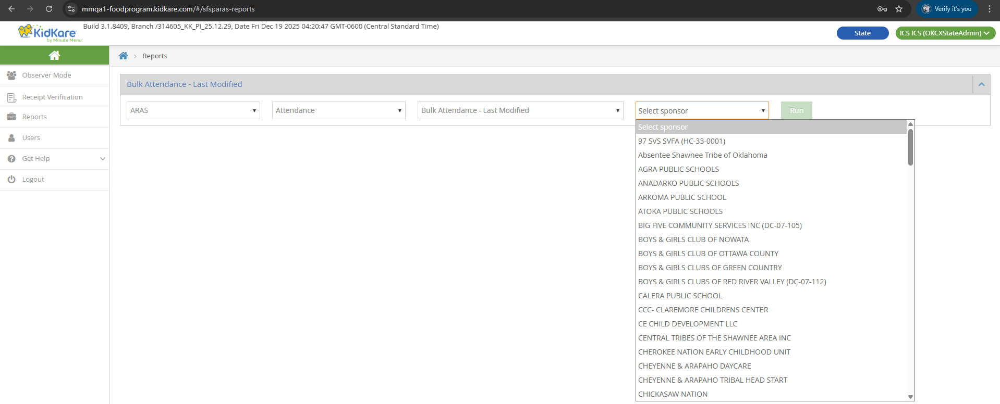

**Other State User view (no Program Type dropdown):**

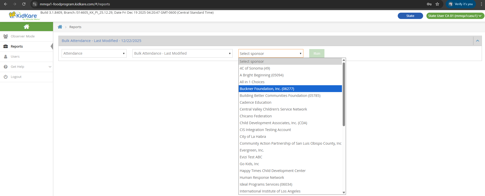

### Controls

| Control | Behavior |
|---------|----------|
| Select Sponsor | Single selection. Shows all sponsors in the same state as the logged-in State User. |
| Date | Default: current date. Cannot type a date -- select only. Future days are disabled. |
| Select Meal | Default: "Select Meal" (LA/OK) or empty (other states). Single selection. Options: Breakfast, AM Snack, Lunch, PM Snack, Dinner, Eve. Snack. |

### Report File

| Property | Value |
|----------|-------|
| File name | `BulkAttendanceLastModified_{sponsor_legal_name}_{date}.xlsx` |
| Title | "Bulk Attendance - Last Modified Report" |
| Subtitle lines | Sponsor legal name, selected date, selected meal |

### Columns

Data comes from `SFSP_MEAL_SERVED_BULK_ENTRY_HISTORY`.

| Column | DB Field | Notes |
|--------|----------|-------|
| Center Name | `CENTER.center_name` | Joined via `center_id` |
| Center Number | `CENTER.center_number` | Joined via `center_id` |
| Last Modified Date Time for Served Meals | `create_date_time` (where `meal_serving = 1`) | e.g., 12/22/2025 10:22:30 AM |
| Last Modified Date Time for Seconds | `create_date_time` (where `meal_serving = 2`) | |
| User Id | `create_login_id` = `USER.user_id` | |
| Full Name | -- | Empty for Sponsor Admin; `{Last Name} {First Name}` for Sponsor Staff |
| Timezone | `time_zone` | e.g., UTC+07:00 |

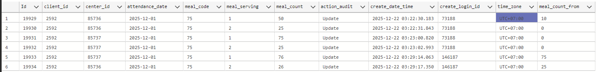

!!! note "N/A values"
    "N/A" means the sponsor has not updated attendance or meal counts from the Bulk Entry page.

### Key Behavior

- Only changes to **Served** and **Seconds** values create history records. Changes to other fields (such as attendance, comments) do not create records.
- Setting Served or Seconds to **0** still creates a history record.
- Each row shows the **most recent** change for that center, date, and meal combination.

**Example:** A Sponsor Admin records Breakfast for two centers. The report shows two rows with the Admin's User Id and empty Full Name.

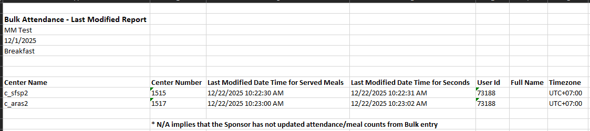

Later, a Sponsor Staff updates Served for one center and Seconds for the other. The report adds two new rows with the Staff's User Id and Full Name. Each row only has a timestamp for the field that was changed -- the other field shows N/A.

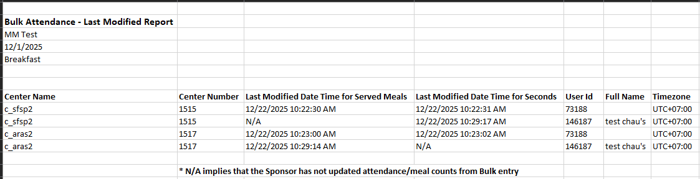

---

## Pickup/Delivery Tracking (Satellite Report)

Report for viewing and downloading satellite delivery/pickup forms as PDF files.

!!! info "Data prerequisite"
    Data for this report is created through the [Meal Delivery & Pickup](meal-delivery-pickup.md) feature. Without delivery/pickup records, the report has no data to display.

### Access by Role

| Aspect | LA/OK State User | Sponsor | Center/IC |
|--------|------------------|---------|-----------|
| Navigation | Reports > SFSP/ARAS > Menus > Pickup/Delivery Tracking | Reports > SFSP/ARAS > Meals & Attendance > Pickup/Delivery Tracking | Reports > SFSP/ARAS > Meals & Attendance > Pickup/Delivery Tracking |
| Sponsorship Type dropdown | Yes -- Sponsored, Independent | N/A | N/A |
| Sponsor/IC selection | Yes -- filtered by state | N/A | N/A |
| Center selection | Yes -- multi-select, after sponsor selected | Yes | N/A |
| From/To | Date picker (past, current, future). Run disabled if From > To. | Same | Same |

### Controls

**State User** has additional controls:

| Control | Behavior |
|---------|----------|
| Sponsorship Type | Sponsored or Independent. Determines whether Sponsor or IC dropdown shows. |
| Sponsor dropdown | Shows all sponsors in the same state as the State User. Single selection. Only if Sponsorship Type = Sponsored. |
| IC dropdown | Shows all SFSP ICs (if SFSP) or ARAS ICs (if ARAS). Single selection. Only if Sponsorship Type = Independent. |
| Center dropdown | Shows after selecting a sponsor. Lists SFSP or ARAS centers. Multi-select. |
| From/To | Can select or type a date. Past, current, and future dates allowed. Run button disabled if From > To. |

State User behavior is the same as Sponsor after selecting the sponsor/IC.

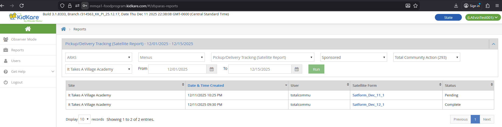

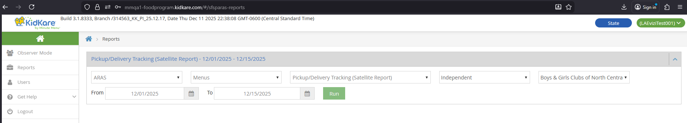

### Sponsor Behavior

1. Select center(s), From, and To dates. Click **Run**.
2. A data table displays with results.
3. Click a **Satellite Form** hyperlink to open the PDF in a new browser tab.
4. The PDF can be downloaded or printed.

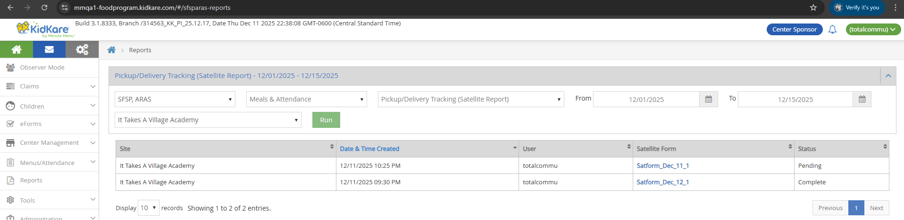

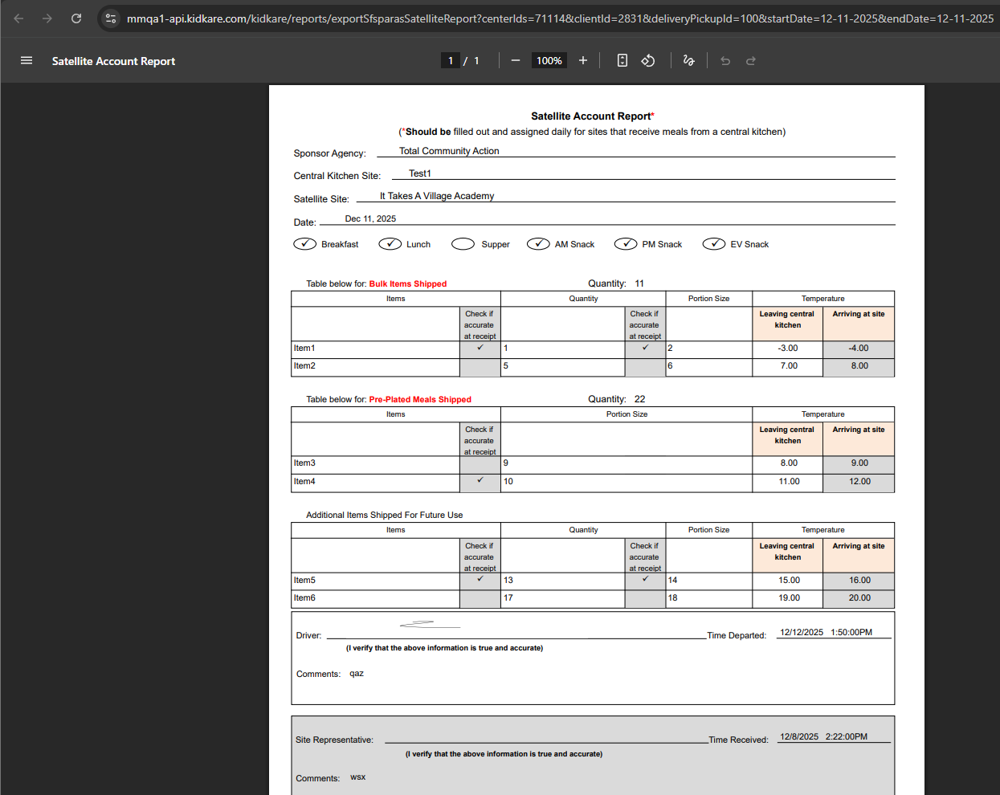

### Center/IC Behavior

1. Select From and To dates. Click **Run**.
2. A PDF file is automatically downloaded and opens in a new browser tab.

**Center view:**

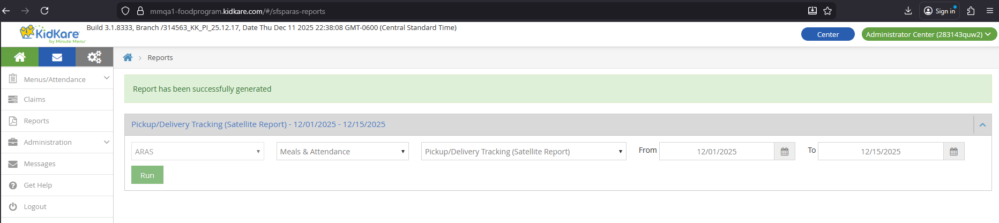

**IC view:**

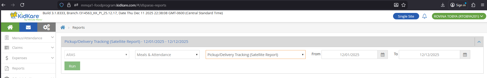

### Data Table Columns (Sponsor and State User)

| Column | Source | Notes |
|--------|--------|-------|
| Site | `CENTER.center_name` | |
| Date & Time Created | `SFSP_DELIVERY_PICKUP.create_date_time` | |
| User | `USER.username` (Admin) or `STAFF` name (Staff) | Center Admin shows "Administrator Center" |
| Satellite Form | `Satform_{Month}_{dd}_{order}` | e.g., Satform_Dec_22_1, Satform_Dec_22_2 |
| Status | Based on signature lock state | Pending = 0 or 1 signatures; Complete = 2 signatures (locked) |

The table shows 10 records per page with Previous/Next pagination.

### PDF File Names

| Role | File Name |
|------|-----------|
| Sponsor / State User | `exportSfsparasSatelliteReport.pdf` |
| Center / IC | `SatelliteAccountReport_{yyyy-mm-dd}-{number}.pdf` (e.g., `SatelliteAccountReport_2025-12-01-1.pdf`) |

!!! note "PDF endpoint"
    Sponsor and State User PDFs are generated via `/kidkare/reports/exportSfsparasSatelliteReport`.
