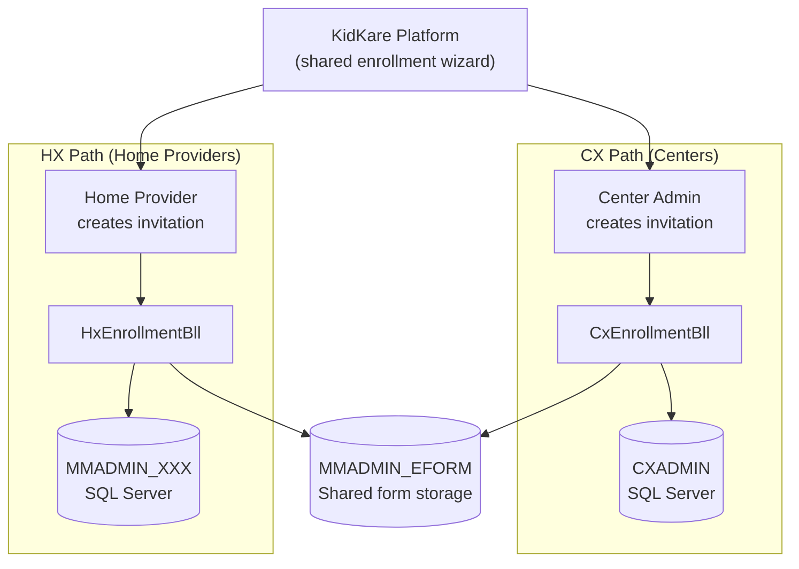
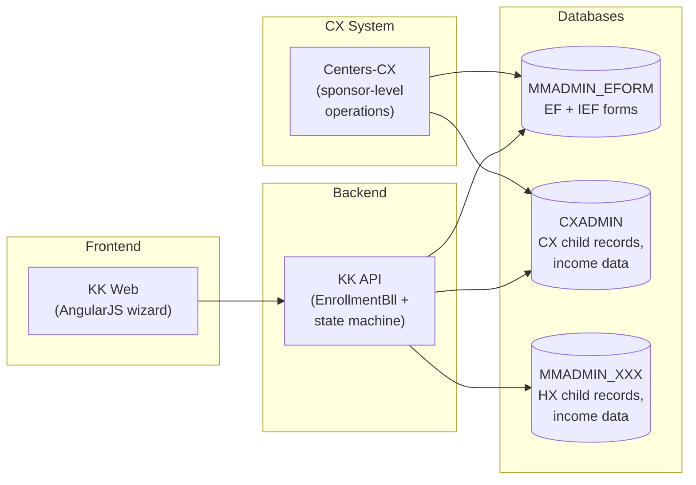
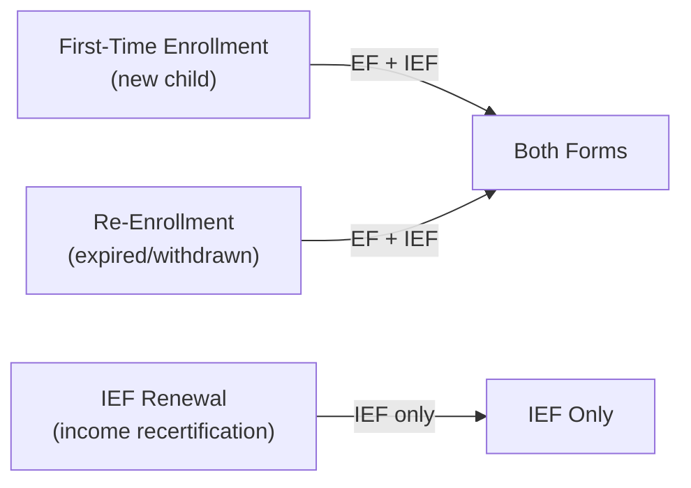
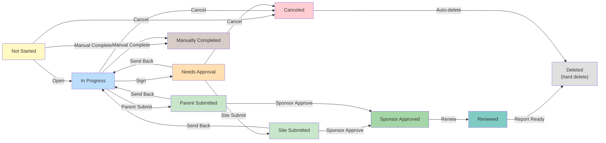
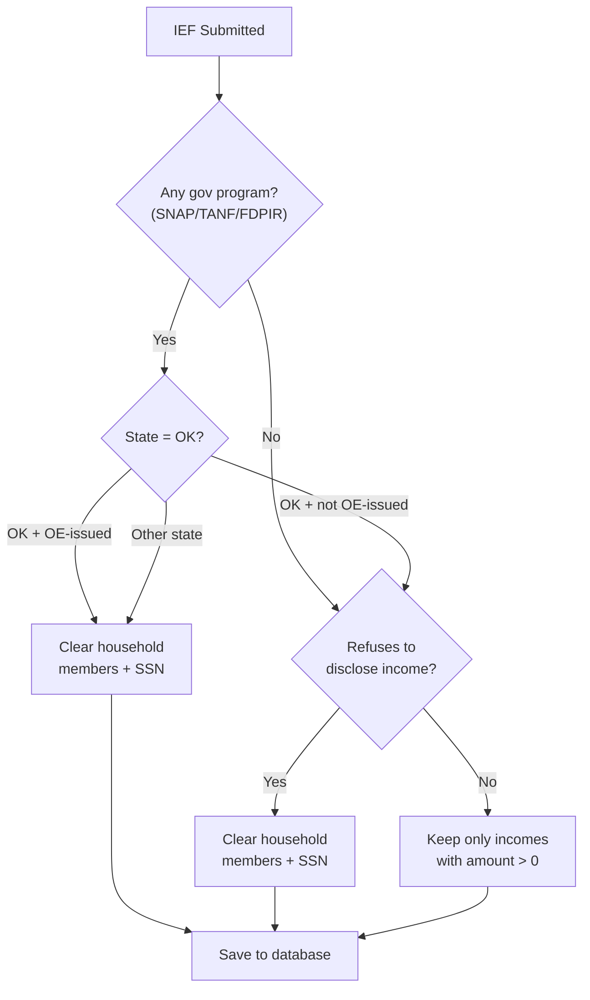
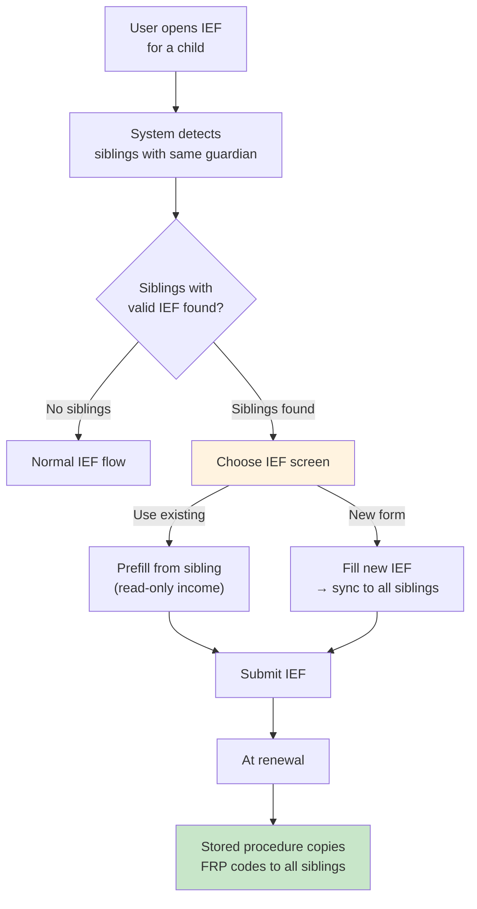

# EForm

eForm is the digital enrollment system for the USDA Child and Adult Care Food Program (CACFP). It handles the two federally required forms that must be collected before a child can receive subsidized meals — at both **center-based daycares (CX)** and **home-based providers (HX)**.

| Form | Full Name | Purpose |
|------|-----------|---------|
| **EF** | Enrollment Form | Child demographics, guardian contact info, attendance schedule, parent consent |
| **IEF** | Income Eligibility Form | Household income and government assistance — determines the meal benefit tier (Free, Reduced, Paid) |

Both forms follow a multi-stage approval pipeline: parent fills and signs → site reviews → sponsor approves → system generates enrollment records.

---

## Two Systems: CX (Centers) and HX (Homes)

eForm serves two different provider types through the same KK platform. The form flow is the same, but the underlying data and business logic differ.



### Key Differences

| Aspect | CX (Centers) | HX (Home Providers) |
|--------|-------------|-------------------|
| **Who creates invitations** | Center Admin or Sponsor | Home Provider |
| **Child data stored in** | CXADMIN database (SQL Server) | MMADMIN_XXX database (SQL Server) |
| **Form data stored in** | MMADMIN_EFORM (shared) | MMADMIN_EFORM (shared) |
| **Assignment table** | `KK_EnrollmentAssignmentCx` | `KK_EnrollmentAssignmentHx` |
| **Guardian matching** | Direct `guardian_id` foreign key | Name + address + zip code match (no direct FK) |
| **Sibling sync procedure** | `sp_copy_childInfo_to_siblings` | `sp_copy_hx_childInfo_to_siblings` |
| **Business logic class** | `CxEnrollmentBll` (extends `EnrollmentBll`) | `HxEnrollmentBll` (extends `EnrollmentBll`) |
| **Sponsor approval flow** | Center approves first, then sponsor | Provider submits directly to sponsor |
| **Oversight tab** | CX child oversight in KK (`cx-child-oversight.component.ts`) | Not applicable (home providers manage directly) |

The shared base class `EnrollmentBll` handles common logic. System-specific behavior is implemented via abstract methods overridden in `CxEnrollmentBll` and `HxEnrollmentBll`.

---

## Repos Involved



| Repo | Role |
|------|------|
| **KK** | Frontend enrollment wizard (AngularJS), API controller (`EnrollmentController`), business logic (`EnrollmentBll`, `CxEnrollmentBll`, `HxEnrollmentBll`), state machine, sibling IEF sync, invitation processing |
| **Centers-CX** | Sponsor-level operations — IEF save/retrieve (`IefService`, `IefAdapter`), child enrollment service, renewals |
| **MinuteMenu.Database** | Schema and stored procedures: MMADMIN_EFORM (form tables), CXADMIN (CX child income, sibling copy), MMADMIN_XXX (HX child income, sibling copy) |

---

## Enrollment Scenarios

Three scenarios determine which forms are required:



When both forms are required, the EF is always completed first, then the IEF. Each form's status is tracked independently.

---

## User Roles

```
┌──────────────────────────────────────────────────────────────────────┐
│                         APPROVAL CHAIN                               │
│                                                                      │
│   CX: CENTER ADMIN        PARENT/GUARDIAN        SPONSOR             │
│   HX: HOME PROVIDER       ───────────────        ──────────         │
│   ──────────────────                                                 │
│   • Creates invitation     • Receives email       • Reviews forms    │
│   • Can fill forms on      • Creates KK account   • Approves or      │
│     behalf of parent       • Fills EF + IEF         sends back       │
│   • Reviews & approves     • Signs electronically • Triggers renewal │
│   • Manages invitations    • Views form status                       │
│                                                                      │
│   STATE OBSERVER                                                     │
│   ──────────────                                                     │
│   • Read-only access to all forms                                    │
│   • Cannot take actions                                              │
└──────────────────────────────────────────────────────────────────────┘
```

**CX vs HX approval flow:**

- **CX**: Center Admin creates invitation → Parent fills → Center Admin reviews → Sponsor approves
- **HX**: Home Provider creates invitation → Parent fills → Provider submits → Sponsor approves

The Center Admin (CX) or Home Provider (HX) can also fill forms on behalf of the parent. This is the most common flow when the site handles paperwork directly.

---

## End-to-End Flow

```mermaid
graph TD
    A["Center Admin (CX) or<br/>Home Provider (HX)<br/>creates invitation"] --> B["Child created<br/>(status: Enrollment Incomplete)"]

    B --> C{"Who fills<br/>the form?"}
    C -->|"Site fills<br/>on behalf of parent"| D["Staff opens form<br/>from View Status"]
    C -->|"Parent fills"| E["Parent receives email<br/>→ creates KK account<br/>→ opens form"]

    D --> F["DOB Verification Dialog<br/>(prevents unauthorized access)"]
    E --> F

    F --> G["Load invitation data<br/>+ site config"]

    G --> EF

    subgraph EF ["Enrollment Form (EF)"]
        direction TB
        EF1["1. Child Info<br/>Name, DOB, sex, race, ethnicity"]
        EF2["2. Infant Details<br/>(only if age < 12 months)"]
        EF3["3. Guardian Info<br/>Name, phones, email, address"]
        EF4["4. Attendance<br/>Days in care, drop-off/pick-up, meals"]
        EF5["5. Review & Sign<br/>Summary + electronic signature"]
        EF1 --> EF2 --> EF3 --> EF4 --> EF5
    end

    EF --> EF_SUB["Submit EF → Needs Approval"]

    EF_SUB --> IEF_CHECK{"IEF<br/>required?"}
    IEF_CHECK -->|No| DONE
    IEF_CHECK -->|Yes| SIB_CHECK

    SIB_CHECK{"Siblings with<br/>same guardian<br/>detected?"}
    SIB_CHECK -->|No| IEF
    SIB_CHECK -->|Yes| CHOOSE["Choose IEF screen:<br/>Use existing sibling IEF<br/>or fill new?"]

    CHOOSE -->|"Use existing"| PREFILL["Prefill from sibling<br/>(read-only income)"]
    CHOOSE -->|"New form"| IEF

    PREFILL --> IEF_SIGN["IEF Step 3: Sign"]

    subgraph IEF ["Income Eligibility Form (IEF)"]
        direction TB
        IEF1["1. Programs<br/>SNAP, TANF, FDPIR, Other"]
        IEF2["2. Household Members<br/>Names, income, frequency, SSN"]
        IEF3["3. Certification & Sign<br/>Legal statements + signature"]
        IEF1 --> IEF2 --> IEF3
    end

    IEF_SIGN --> IEF_SUB
    IEF --> IEF_SUB["Submit IEF → Needs Approval"]
    IEF_SUB --> DONE["View Status page"]

    DONE --> APPROVE

    subgraph APPROVE ["Approval Pipeline"]
        direction TB
        AP1["CX: Center reviews & approves<br/>HX: Provider submits"]
        AP2["Sponsor reviews & approves<br/>(or sends back for revision)"]
        AP3["Renewal processing<br/>(sets enrollment + expiration dates)"]
        AP1 --> AP2 --> AP3
    end

    APPROVE --> COMPLETE["Child enrolled<br/>Eligible for meal reimbursement"]

    style EF fill:#e3f2fd
    style IEF fill:#f3e5f5
    style APPROVE fill:#e8f5e9
    style CHOOSE fill:#fff3e0
```



---

## Form State Machine

Each form (EF and IEF) has its own independent state machine, implemented using the **Stateless** library.



| Status | Code | Meaning |
|--------|------|---------|
| Not Started | 1 | Invitation sent but form not yet opened |
| In Progress | 2 | Form opened and being filled |
| Canceled | 3 | Invitation voided (auto-triggers deletion) |
| Site Submitted | 4 | Site approved (CX: center, HX: provider); awaiting sponsor |
| Manually Completed | 5 | Staff marked complete without parent submission |
| Needs Approval | 6 | Parent/site signed; awaiting site review |
| Sponsor Approved | 7 | Sponsor approved; ready for renewal |
| Renewed | 8 | Enrollment/expiration dates set |
| Awaiting Siblings | 9 | Waiting for sibling forms to reach same state (combined forms) |
| Awaiting Reports | 10 | Waiting for PDF report generation |
| Parent Submitted | 11 | Parent submitted directly (no site approval needed) |
| Deleted | -1 | Hard-deleted from database (terminal state) |

### View Status Actions

| Action | Available When | What It Does |
|--------|---------------|-------------|
| Open Online Form | Not Started, In Progress | Opens DOB dialog → enters form wizard |
| Review & Approve | Needs Approval | Site reviews and approves submitted form |
| Resend Invitation | Not Started, In Progress, Canceled | Re-sends email to guardian |
| Cancel Invitation | Not Started, In Progress, Needs Approval, Site/Parent Submitted | Voids the form; triggers auto-deletion |
| Manually Completed | Not Started, In Progress | Staff marks form complete without parent submission |

When a child has both EF and IEF, action buttons only enable if the action is valid for all selected forms.

---

## Business Rules

### Form Submission

- Both EF and IEF require **typed full name** + **drawn electronic signature**
- Submission payload is base64-encoded JSON wrapped in `{"isForMM": true, "dataForMM": "<base64>"}`

### Infant Detection

- A child is an **infant** if age < 12 months
- Infants get an additional form step: formula brand, breastmilk provision, solid food introduction

### IEF Income Logic



- SNAP, TANF, or FDPIR participation = **categorical eligibility** (income not needed)
- **Oklahoma exception**: income clearing only applies when OE-issued programs are enabled
- If parent refuses to disclose, household members and SSN are cleared
- Only income entries with amount > 0 and frequency != "No Income" are saved
- Previous year's household members can be loaded for prefill via `GET /enrollment/householdMembers?loadPreviousYear=true`
- SSN: only last 4 digits collected; not required when a government program case number is provided
- **HX + North Carolina**: "Retirement" income type converts to "Pension" for legacy compatibility

### SNAP/TANF Validation

Case numbers are validated against the National Data Service (NDS). Behavior is configurable per site via `OEAllowedRequiredSnapStanf`:

- **Warn**: validation fails but submission proceeds
- **Error**: validation fails and blocks submission

### Expiration Alerts

- **Expiring**: form expires within 30 days
- **Expired**: form expiration date is before today
- Dashboard surfaces these alerts in dedicated widgets

---

## Sibling IEF Sync (317778)

All children in a family with the same guardian must have the **same FRP designation** (Free/Reduced/Paid). This is a CACFP compliance requirement.

### How It Works

The system detects siblings (same guardian) and ensures FRP consistency:

1. **At enrollment** — When a parent opens the IEF, the system checks for siblings. If found, the parent chooses to reuse an existing sibling's IEF or fill a new one.
2. **At renewal** — Stored procedures copy FRP data to all siblings automatically after the form is renewed.
3. **From oversight tab** (CX only) — Staff can manually trigger sibling sync from the child detail page.



### CX vs HX Sibling Detection

| System | How siblings are matched | Why different |
|--------|------------------------|---------------|
| **CX** | Direct `guardian_id` match in same `client_id` | CX has a guardian table with foreign keys |
| **HX** | Guardian name + address + zip code match | HX stores guardians separately without direct FK to children |

Eligible children for sibling matching:

- Active (status 238) or Enrolled (status 239)
- Recently withdrawn (status 241, within 24 hours)
- Has valid IEF with future expiration date

### What Gets Synced

| Field | Description |
|-------|-------------|
| `frb_category_code` | FRP category (Free, Reduced, Paid) |
| `frb_eligibility_type_code` | Eligibility type |
| `benefits_program_case_number` | Government program case number |
| `is_issued_of_oklahoma` | Oklahoma-specific flag |
| `ief_expiration_date` | IEF expiration (oversight tab only) |
| `ief_effective_date` | IEF effective date (oversight tab only) |
| `CHILD_INCOME` records | Full income form data (32+ columns) |
| `CHILD_INCOME_HOUSEHOLD` records | All household members with 5 income sources each |

### Sibling Coordination for Combined Forms

Some states (GA, LA) use combined IEF forms shared across siblings. When forms are combined:

- All siblings must reach `Renewed` before any can proceed to report generation
- Forms wait in `Awaiting Siblings` status until all siblings catch up
- IEF deletion checks for other assignments before removing (shared across siblings)

---

## Data Model

### Form Storage (MMADMIN_EFORM, SQL Server — shared by CX and HX)

```
┌──────────────────────────┐     ┌───────────────────────────┐
│ KK_EnrollmentForm        │     │ KK_IncomeEligibilityForm  │
│──────────────────────────│     │───────────────────────────│
│ id (PK)                  │     │ id (PK)                   │
│ status                   │     │ status                    │
│ form_data (JSON)         │     │ form_data (JSON)          │
│ record_status_code       │     │ IsUpdateSibling (BIT)     │
│ create_date_time         │     │ record_status_code        │
│ mod_date_time            │     │ create_date_time          │
└──────────┬───────────────┘     └───────────┬──────────────┘
           │                                  │
           └──────────┬───────────────────────┘
                      │ (referenced by)
          ┌───────────┴───────────┐
          ▼                       ▼
┌──────────────────────┐  ┌──────────────────────┐
│ KK_EnrollAssignmentCx│  │ KK_EnrollAssignmentHx│
│ (CX assignments)     │  │ (HX assignments)     │
│──────────────────────│  │──────────────────────│
│ ClientId, CenterId   │  │ SponsorId, ProviderId│
│ ChildId, GuardianId  │  │ ChildId, GuardianId  │
│ EnrollmentFormId(FK) │  │ EnrollmentFormId(FK) │
│ IncomeEligFormId(FK) │  │ IncomeEligFormId(FK) │
└──────────────────────┘  └──────────────────────┘
```

### Child Data (separate per system)

| Table | Database | System | Content |
|-------|----------|--------|---------|
| `CHILD` | CXADMIN | CX | Child master record, FRP codes, IEF dates, benefits |
| `CHILD_INCOME` | CXADMIN | CX | Income form data (32+ columns per signature date) |
| `CHILD_INCOME_HOUSEHOLD` | CXADMIN | CX | Household members with 5 income sources each |
| `CHILD_INCOME` | MMADMIN_XXX | HX | Same structure as CX, stored per sponsor |
| `CHILD_INCOME_HOUSEHOLD` | MMADMIN_XXX | HX | Same structure as CX |

### Invitation Entity (MySQL, KidsContext — shared)

The `EnrollmentInvitation` entity is stored in MySQL and tracks:

- Invitation metadata (token, status, type, US state code)
- Guardian and child info (name, DOB, email)
- `OriginalData` / `CurrentData` (JSON snapshots of form data)
- `SystemCode` — CX or HX, determines which business logic path to use

---

## Email Notifications

| Trigger | Template | Condition |
|---------|----------|-----------|
| Invitation created or resent | ParentInvitation | Guardian email exists |
| Form sent back for revision | ParentInvitationRevision | Guardian email exists |
| Form signed (→ Needs Approval) | ParentSignForm | Guardian email exists AND `OESendApprovalEmail` setting enabled |
| Sponsor approves | ParentInvitationApprove | Guardian email exists |

Emails support English, Spanish, and Russian. Bulk resend groups invitations by email to avoid duplicates. An SSO user is auto-created for the parent if one does not exist.

---

## Key Source Files

### Backend (KK)

| File | Purpose |
|------|---------|
| `KidKare.Service/Controllers/EnrollmentController.cs` | API controller — all enrollment endpoints |
| `KidKare.Bll/Enrollment/EnrollmentBll.cs` | Base business logic — CRUD, income retrieval, sibling detection |
| `KidKare.Bll/Enrollment/CxEnrollmentBll.cs` | CX-specific logic — CX sibling query, CX renewal with sync |
| `KidKare.Bll/Enrollment/HxEnrollmentBll.cs` | HX-specific logic — HX guardian matching, HX renewal with sync |
| `KidKare.Bll/Enrollment/Processor/InvitationsProcessor.cs` | Invitation creation with existing IEF reuse for siblings |
| `KidKare.Bll/Enrollment/EnrollmentStateMachine/EnrollmentStateMachineInternal.cs` | Stateless state machine — transitions + side effects |
| `KidKare.Bll/Centers/Child/ChildBll.cs` | Child profile, sibling eligibility, copy-to-siblings API |
| `KidKare.Web/app/common/services/enrollment-service/enrollment-service.js` | Frontend wizard navigation, sibling routing |
| `KidKare.Web/app/states/child-enrollment/ief-forms/choose-ief/` | Choose IEF screen (new in 317778) |
| `KidKare.Web/app/states/child-enrollment/ief-forms/household/ief-household-controller.js` | Household form — handles prefilled read-only mode |

### CX System (Centers-CX)

| File | Purpose |
|------|---------|
| `MinuteMenu.Centers.CXWeb/Services/Enrollments/ChildEnrollmentService.cs` | Child enrollment + guardian management |
| `MinuteMenu.Centers.CXWeb/Services/Enrollments/IefService.cs` | IEF save/retrieve |
| `MinuteMenu.Centers.CXWeb/Services/Enrollments/IefAdapter.cs` | IEF data transformation + FamilyService integration |

### Database (MinuteMenu.Database)

| File | Purpose |
|------|---------|
| `CXADMIN/Stored Procedures/sp_copy_childInfo_to_siblings.sql` | Copy IEF + income data to CX siblings |
| `MMADMIN_XXX/Stored Procedures/sp_copy_hx_childInfo_to_siblings.sql` | Copy IEF + income data to HX siblings |
| `CXADMIN/Stored Procedures/initializeIEFEffectiveAndIEFSponsorApproveWithChildIds.sql` | IEF date initialization with sibling propagation |
| `MMADMIN_EFORM/Updates/317347_IsUpdateSibling_for_IEF.sql` | Added `IsUpdateSibling` column to `KK_IncomeEligibilityForm` |

### API Endpoints

| Endpoint | Method | Purpose |
|----------|--------|---------|
| `GET /enrollment/invitation` | GET | Load form for filling/review (with sibling detection) |
| `PUT /enrollment/enrollmentForm` | PUT | Submit Enrollment Form |
| `PUT /enrollment/ief` | PUT | Submit Income Eligibility Form |
| `POST /enrollment/firstTimeEnrollment` | POST | Create child + invitation |
| `POST /enrollment/approveInvitation` | POST | Site approval |
| `POST /enrollment/cancelInvitation` | POST | Cancel with sibling option |
| `POST /enrollment/validateSnapTanfNumber` | POST | SNAP/TANF case number validation via NDS |
| `GET /enrollment/householdMembers` | GET | Load household members (optionally from prior year) |
| `GET /enrollment/getChildIncome` | GET | Retrieve sibling's income data for prefilling |
| `POST /child/copyChildInfoToSiblings` | POST | Copy IEF data to siblings (oversight tab) |
| `GET /enrollment/combinedinvitationsList` | GET | Paginated invitation list for View Status |
| `POST /enrollment/sponsor/renewEnrollments` | POST | Sponsor triggers renewal processing |

---

## Related Docs

- [EForm Enrollment Flow (detailed)](../flows/eform/enrollment-flow.md) — Deeper dive into state machine transitions, deletion mechanism, and stored procedure logic
