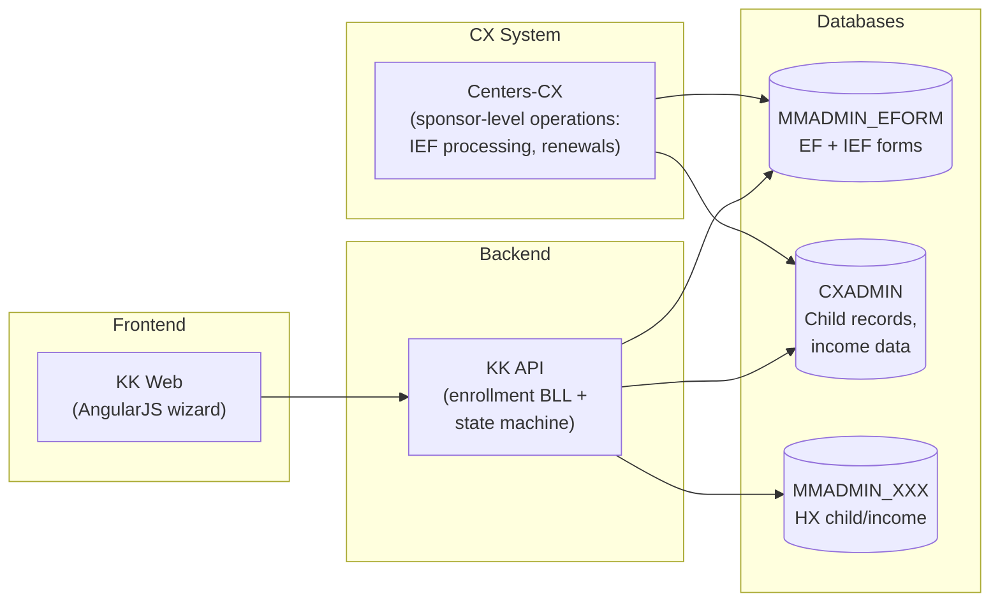
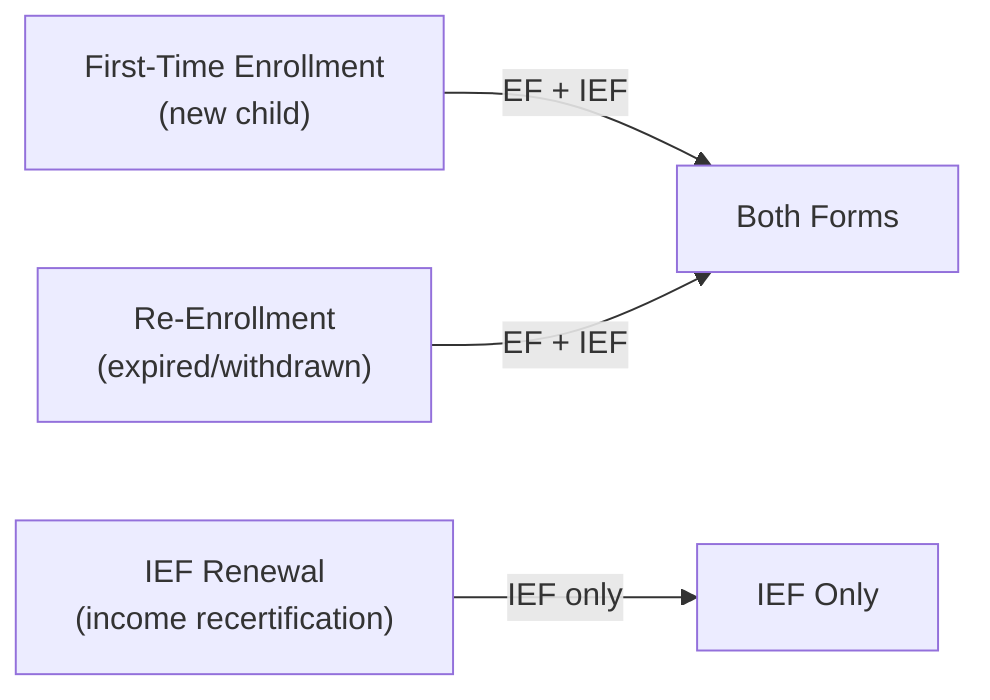

# EForm

eForm is the digital enrollment system for the USDA Child and Adult Care Food Program (CACFP). It handles the two federally required forms that must be collected before a child can receive subsidized meals at a daycare center or home.

| Form | Full Name | Purpose |
|------|-----------|---------|
| **EF** | Enrollment Form | Child demographics, guardian contact info, attendance schedule, parent consent |
| **IEF** | Income Eligibility Form | Household income and government assistance — determines the meal benefit tier (Free, Reduced, Paid) |

Both forms follow a multi-stage approval pipeline: parent fills and signs → center reviews → sponsor approves → system generates enrollment records.

---

## Repos Involved

| Repo | Role |
|------|------|
| **KK** | Frontend enrollment wizard (AngularJS), API controller, business logic (`EnrollmentBll`), state machine (`EnrollmentStateMachineInternal`), sibling IEF sync |
| **Centers-CX** | Sponsor-level operations — IEF save/retrieve (`IefService`, `IefAdapter`), child enrollment service, renewals |
| **MinuteMenu.Database** | Schema and stored procedures for MMADMIN_EFORM (form tables), CXADMIN (child income, sibling copy), MMADMIN_XXX (HX income sync) |

---

## Key Concepts

### Three Enrollment Scenarios

### User Roles

| Role | What they do |
|------|-------------|
| **Center Admin** | Creates invitations, can fill forms on behalf of parent, reviews and approves |
| **Parent/Guardian** | Receives email, fills EF + IEF, signs electronically |
| **Sponsor** | Reviews submitted forms, approves or sends back for revision, triggers renewals |
| **Provider (Home)** | Same as Center Admin for home daycare programs |

### Sibling IEF Sync (317778)

All children in a family with the same guardian must have the **same FRP designation** (Free/Reduced/Paid). When a parent submits an IEF for one child, the system detects siblings and either:

- Prefills from an existing sibling's IEF (parent chooses "use existing")
- Creates a new IEF and syncs FRP codes to all siblings automatically

This is enforced via stored procedures `sp_copy_childInfo_to_siblings` (CX) and `sp_copy_hx_childInfo_to_siblings` (HX).

---

## Related Docs

- [EForm Enrollment Flow](../flows/eform/enrollment-flow.md) — End-to-end flow with state machine, approval pipeline, sibling sync, and data model
