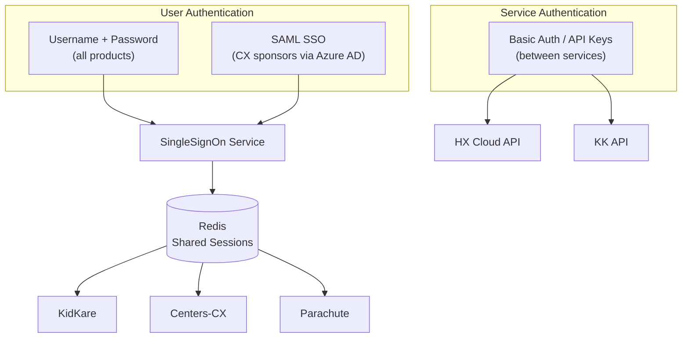

# Authentication Overview

MinuteMenu uses three authentication mechanisms. Each serves a different purpose.



---

## 1. Username + Password (Standard Login)

The default authentication method. All products use it.

**How it works:**

1. User enters username and password on login page
2. KK sends credentials to SingleSignOn Service (`POST /auth`)
3. SSO validates against its MySQL user database (salted hash)
4. If user doesn't exist in SSO but exists in HX or CX → account is created on the fly (JIT provisioning)
5. Session is stored in Redis, shared across all products
6. Session ID returned via cookie (`ss-id` header for SPA clients)

**Session details:**

- Stored in Redis with 12-hour TTL
- Shared across KK, CX, Parachute (same Redis instance)
- Contains: user ID, roles, permissions, site data

**Repos involved:** KK (login UI + login types), SingleSignOn-Service (credential validation + session creation)

---

## 2. SAML SSO (Federated Login)

Added for CX (Center) sponsors who want their users to log in with corporate credentials via Microsoft Entra ID (Azure AD). Controlled by **Policy A.13** per sponsor.

**How it works (simplified):**

1. User enters email on login page
2. System checks if the email domain is SSO-enabled (Home Realm Discovery)
3. If yes → redirect to corporate identity provider (Azure AD)
4. User authenticates at Azure AD
5. Azure sends SAML assertion back to SSO service
6. SSO validates assertion, creates a one-time exchange token
7. Redirects back to KK, which uses the token to create a normal session

**Key characteristics:**

- Authentication only — user accounts and permissions still managed in KidKare
- Policy-gated: each sponsor can enable/disable independently
- Currently supports CX Sponsor and Center users only
- SAML users have no KidKare password — they always log in via their IdP

**Repos involved:** KK (identifier-first UI, SAML BLL), SingleSignOn-Service (SAML callback, exchange token), MinuteMenu.Database (IdP config tables in CXADMIN)

See [SAML SSO Architecture](./saml-sso-architecture.md) for the full technical flow.

---

## 3. Service-to-Service Authentication

Backend services authenticate with each other using Basic Auth or API keys. This is not user-facing.

```
┌──────┐  Basic Auth   ┌──────────┐
│  KK  │──────────────►│  CX API  │
└──────┘               └──────────┘

┌──────┐  mm-api-key   ┌──────────────┐  Basic Auth  ┌──────┐
│  KK  │──────────────►│ HX Cloud API │─────────────►│  KK  │
└──────┘  (GUID)       └──────────────┘  (callback)  └──────┘
```

| Route | Method | How |
|-------|--------|-----|
| KK → CX | HTTP Basic Auth | Username + password from CX user session |
| KK → HX Cloud API | `mm-api-key` header | GUID API key per sponsor, validated and exchanged for JWT |
| HX Cloud API → KK | HTTP Basic Auth | Raw credential lookup for callbacks |
| Internal services | HTTP Basic Auth | Shared credentials (rate limiter, logging) |

**API key flow (APIM):**

1. External caller sends `mm-api-key: {GUID}` header
2. HX Cloud API validates GUID against `KK_API_KEY` table
3. Looks up associated sponsor and credentials
4. Generates JWT bearer token for the request session
5. All subsequent processing uses the JWT

**Repos involved:** KK (CentersClient, APIM BLL), hx_cloudconnectionAPI (JWT handler, APIM auth)

---

## How They Connect

All three mechanisms ultimately produce the same result: a **session in Redis** that all products can read.

```
Username/Password ──► SSO validates ──► Redis session ──► KK, CX, Parachute
SAML SSO ──────────► SSO validates ──► Redis session ──► KK, CX, Parachute
Service-to-Service ► Direct auth ────► Request-scoped (no shared session)
```

| Mechanism | Who uses it | Session shared? | Password in KidKare? |
|-----------|------------|-----------------|---------------------|
| Username + Password | All users | Yes (Redis) | Yes |
| SAML SSO | CX sponsors with Policy A.13 | Yes (Redis) | No — uses corporate IdP |
| Basic Auth / API Key | Backend services | No — per-request | N/A |
