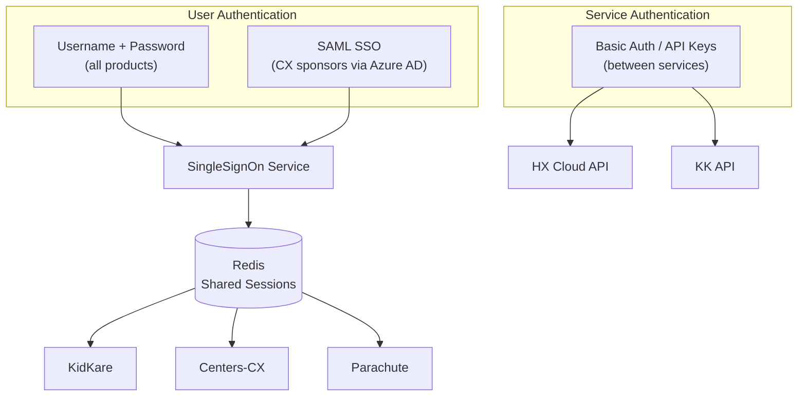
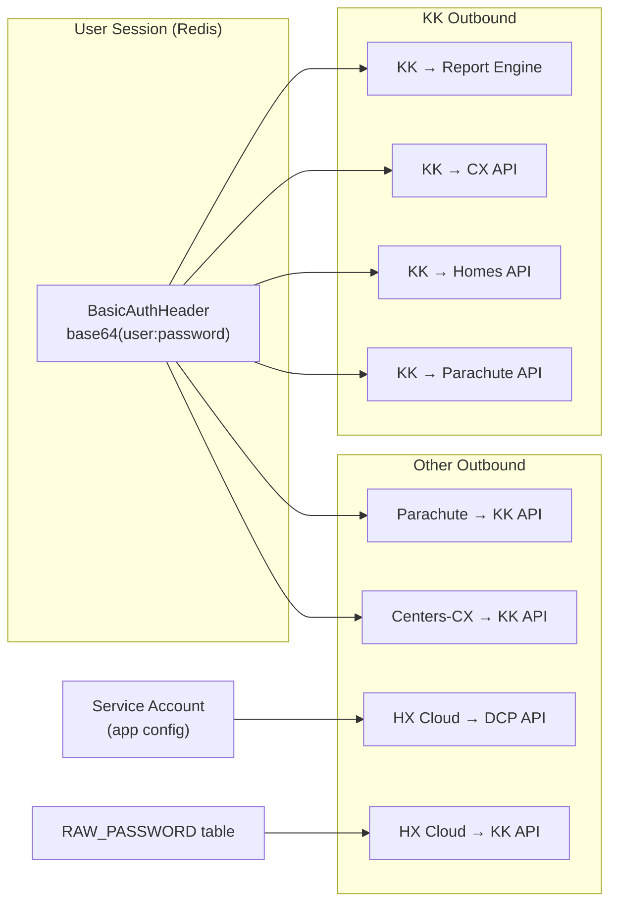

# Authentication Overview

MinuteMenu uses three authentication mechanisms. Each serves a different purpose.



---

## 1. Username + Password (Standard Login)

The default authentication method. All products use it.

**How it works:**

1. User enters username and password on login page
2. KK sends credentials to SingleSignOn Service (`POST /auth`)
3. SSO validates against its MySQL user database (salted hash)
4. If user doesn't exist in SSO but exists in HX or CX → account is created on the fly (JIT provisioning)
5. Session is stored in Redis, shared across all products
6. Session ID returned via cookie (`ss-id` header for SPA clients)

**Session details:**

- Stored in Redis with 12-hour TTL
- Shared across KK, CX, Parachute (same Redis instance)
- Contains: user ID, roles, permissions, site data

**Repos involved:** KK (login UI + login types), SingleSignOn-Service (credential validation + session creation)

---

## 2. SAML SSO (Federated Login)

Added for CX (Center) sponsors who want their users to log in with corporate credentials via Microsoft Entra ID (Azure AD). Controlled by **Policy A.13** per sponsor.

**How it works (simplified):**

1. User enters email on login page
2. System checks if the email domain is SSO-enabled (Home Realm Discovery)
3. If yes → redirect to corporate identity provider (Azure AD)
4. User authenticates at Azure AD
5. Azure sends SAML assertion back to SSO service
6. SSO validates assertion, creates a one-time exchange token
7. Redirects back to KK, which uses the token to create a normal session

**Key characteristics:**

- Authentication only — user accounts and permissions still managed in KidKare
- Policy-gated: each sponsor can enable/disable independently
- Currently supports CX Sponsor and Center users only
- SAML users have no KidKare password — they always log in via their IdP

**Repos involved:** KK (identifier-first UI, SAML BLL), SingleSignOn-Service (SAML callback, exchange token), MinuteMenu.Database (IdP config tables in CXADMIN)

See [SAML SSO Architecture](./saml-sso-architecture.md) for the full technical flow.

---

## 3. Service-to-Service Authentication

Backend services authenticate with each other using Basic Auth or API keys. This is not user-facing but is **critical for the Entra ID migration** — every call site below depends on the current credential system.

### How it works

Most service-to-service calls pass the **user's BasicAuthHeader from their session**. When a user logs in, their credential is stored in the Redis session. Every outbound call to another service re-uses that credential. A few services use hardcoded service accounts from app config instead.



### Complete Inventory

#### KK → Reporting Service (Basic Auth from user session)

The reporting service is the **largest consumer** of Basic Auth. Every report call passes the user's session credentials.

| Caller Class | Repo | What it does |
|---|---|---|
| `ReportController` (~20 methods) | KK | PDF generation for homes, centers, sponsors — verify in/out times, payment details, child reports |
| `ReportService` | KK | ServiceStack report endpoints (legacy) |
| `CenterAccountingReportBll` | KK | Center accounting and financial reports |
| `CommonReportEnrollmentBll` | KK | Enrollment and income eligibility reports |
| `ProviderAccountingReportBll` | KK | Provider accounting and invoice reports |
| `ParachuteReportController` | KK | Parachute-specific reports |
| `SponsorController` | KK | Sponsor report operations |
| `MessageController` | KK | Message-related report operations |
| `AccountingReportService` | Parachute | FormW10 reports |

#### KK → CX API (Basic Auth from session or CX DB)

| Caller Class | Repo | What it does |
|---|---|---|
| `CentersClient` | KK | Attendance quantities, CX data operations |
| `CxIntegrationBll` | KK | FRP calculations, CX integration endpoints |

Credentials come from the user session first. If unavailable, falls back to CX user password from CXADMIN database.

#### KK → Homes API (Basic Auth from user session)

| Caller Class | Repo | What it does |
|---|---|---|
| `ReportController` | KK | Report data retrieval (ChildInOutTimes, PaymentDetails, etc.) |

#### KK → Parachute API (Basic Auth from user session)

| Caller Class | Repo | What it does |
|---|---|---|
| `ParachuteServiceRestClient` (factory) | KK | Multiple endpoints via HttpClient |

#### Parachute → KK API (Basic Auth from user session)

| Caller Class | Repo | What it does |
|---|---|---|
| `KidKareIntegrationBll` (6 methods) | Parachute | Cancel/reactivate fraud subscriptions, Zoho queries, coupon management |
| `KKServiceRestClient` (factory, used by 12+ classes) | Parachute | Attendance, Settings, UserReader, AccountingHelper, Notifications, ProviderHomeScreen, and more |

#### Centers-CX → KK API (Basic Auth)

| Caller Class | Repo | What it does |
|---|---|---|
| `EnrollmentsClient` | Centers-CX | Online enrollment counts by center/client |
| `ManageFoodClient` | Centers-CX | Food list auth links |
| `ManageArassfspClient` (2 methods) | Centers-CX | Claim and attendance management links |
| `RenewEnrollments` | Centers-CX | Completed online enrollments data |
| `IEFService` | Centers-CX | Income eligibility renewals |
| `Features` | Centers-CX | Online enrollment status, self-auth links |

Note: CX has a **SSO decision gate** — `Login.GetAzureComponent().IsAllowSupportOldSSO()` switches between `username:password` and `username:idToken`. This is early migration scaffolding.

#### HX Cloud API → DCP (Hardcoded service credentials)

| Caller Class | Repo | What it does |
|---|---|---|
| `DcpService` (4 methods) | hx_cloudconnectionAPI | Submit/analyze claims, get processing status. Uses username/password from `DcpOptionConfig`. |

#### HX Cloud API → KK (Basic Auth from RAW_PASSWORD table)

| Caller Class | Repo | What it does |
|---|---|---|
| `KKIntegration` | hx_cloudconnectionAPI | Callbacks to KK. Looks up raw password from `RAW_PASSWORD` table in DB. |

#### Inbound Basic Auth (services that validate incoming Basic Auth)

| Service | Repo | What it does |
|---|---|---|
| `AuthAttribute` | KK | Validates incoming requests — supports both session and Basic Auth header |
| `BasicAuthenticationFilterAttribute` on `ClaimsProcessingController` | DistributedProcessing | Validates incoming claims processing requests against configured service credentials |

### API Key / Other Auth

| Route | Method | How |
|-------|--------|-----|
| External → HX Cloud API | `mm-api-key` header (GUID) | Validated against `KK_API_KEY` table, exchanged for JWT |
| External → HX Cloud API | `x-api-key` header (encrypted) | Decrypted and validated, limited to specific endpoints |
| SSO → Azure APIM | SAS token (HMAC-SHA512) | Shared Access Signature for APIM management API |
| KK → Zoho | OAuth token | `Zoho-oauthtoken` header with refresh flow |
| KK → Stripe | Bearer token | Stripe API key as bearer |
| KK → Chat API | Bearer token | User token for chat/messaging |
| KK → ChargeBee | Basic Auth (API key) | ChargeBee API key encoded as Basic Auth |

---

## How They Connect

All three mechanisms ultimately produce the same result: a **session in Redis** that all products can read.

```
Username/Password ──► SSO validates ──► Redis session ──► KK, CX, Parachute
SAML SSO ──────────► SSO validates ──► Redis session ──► KK, CX, Parachute
Service-to-Service ► Direct auth ────► Request-scoped (no shared session)
```

| Mechanism | Who uses it | Session shared? | Password in KidKare? |
|-----------|------------|-----------------|---------------------|
| Username + Password | All users | Yes (Redis) | Yes |
| SAML SSO | CX sponsors with Policy A.13 | Yes (Redis) | No — uses corporate IdP |
| Basic Auth / API Key | Backend services | No — per-request | N/A |

---

## Impact on Entra ID Migration

When migrating from MySQL-based auth to Azure Entra ID, every Basic Auth call site above needs to be addressed. Key considerations:

| Category | Call Sites | Migration Impact |
|----------|-----------|-----------------|
| **Session-based Basic Auth** (user credential passthrough) | ~30+ across KK, Parachute, CX | All depend on `BasicAuthHeader` stored in Redis session. If credentials change format (e.g., to tokens), every consumer breaks. |
| **Reporting Service** | ~20 methods in KK alone | Largest single consumer. All use `UserSessionState.GetBasicAuthHeader()`. |
| **Hardcoded service credentials** | Rate Limiter, DCP Service | Independent of user auth — can migrate separately. |
| **RAW_PASSWORD table** | HX Cloud → KK callbacks | Stores plain passwords for Basic Auth encoding. Must be replaced. |
| **CX SSO decision gate** | 6 clients in Centers-CX | Already has `IsAllowSupportOldSSO()` toggle — migration scaffolding exists. |

**Central points of change:**

1. `UserSessionState.GetBasicAuthHeader()` — used by all session-based calls
2. `ServiceClientExtension.UseBasicAuth()` — extension method on all ServiceStack clients
3. `EncryptionHelper.EncodeBasicAuthToken()` / `DecodeBasicAuthToken()` — encoding/decoding utility
4. `KKServiceRestClient` factory in Parachute — factory for all Parachute → KK calls
