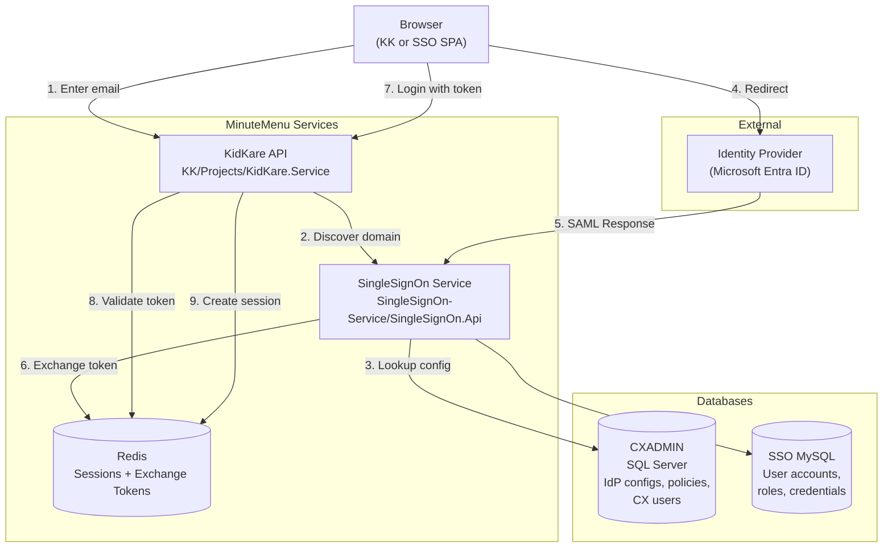
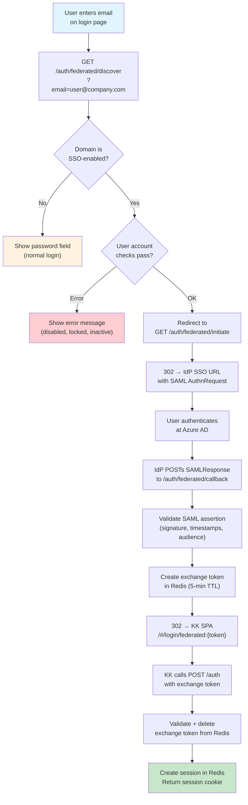
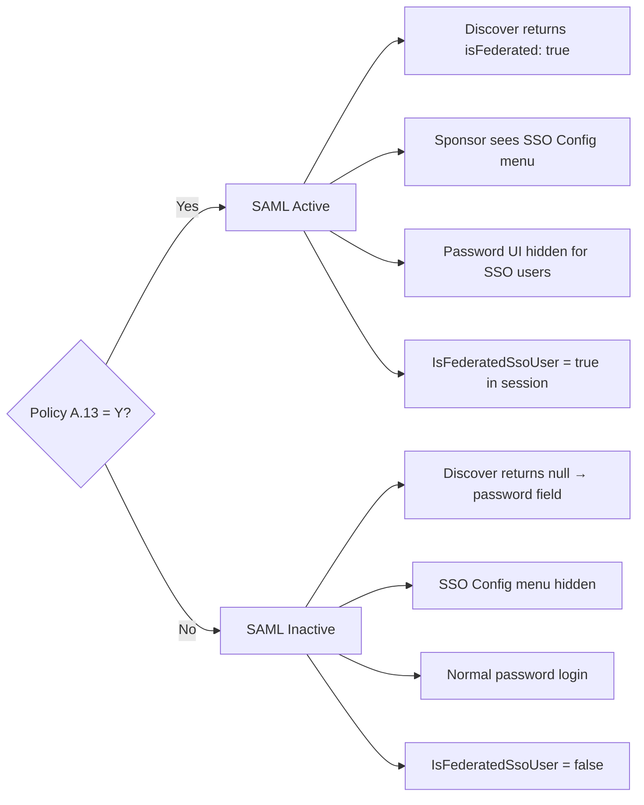
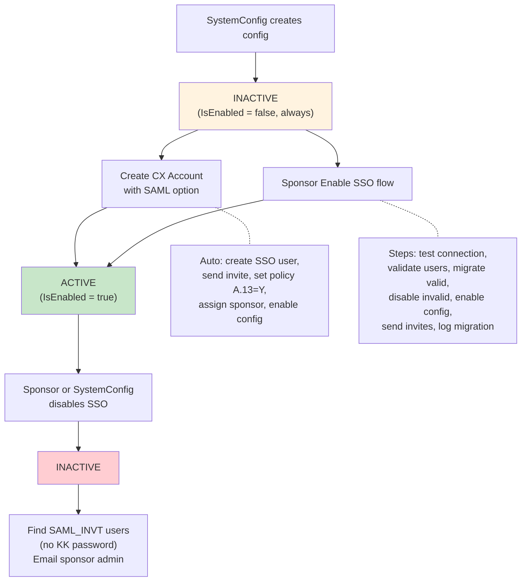

# SAML SSO Architecture

This document describes the technical architecture of SAML federated authentication in MinuteMenu. It covers how the components connect, how the login flow works, and how the system manages IdP configurations and user migration.

For end-user setup guides, see:

- [Client Migration Guide](./saml-sso-client-migration-guide.md)
- [Complete Guide](./saml-sso-complete-guide.md)

---

## System Components



**Where things live:**

| Component | Repo | Key Files |
|-----------|------|-----------|
| Identifier-first login UI | KK | `Projects/KidKare.Web/app/states/login/` |
| Domain discovery + SAML BLL | KK | `Projects/KidKare.Bll/Authentication/TenantDiscoveryService.cs` |
| IdP config management | KK | `Projects/KidKare.Bll/Authentication/FederatedIdpConfigBll.cs` |
| SAML assertion handling | KK | `Projects/KidKare.Bll/Authentication/SamlService.cs` (ITfoxtec library) |
| Federated auth endpoints | SSO | `SingleSignOn.Api/Controllers/FederatedAuthController.cs` |
| Login with exchange token | SSO | `SingleSignOn.Api/Services/LoginService.cs` |
| IdP config data model | KK | `Projects/KidKare.Data/Models/Cx/FederatedIdpConfig.cs` |
| Policy A.13 constant | KK | `Projects/KidKare.Bll/Constants/Policy.cs` |

---

## SAML Login Flow

The login flow has four phases: **discover**, **redirect to IdP**, **callback**, and **session creation**.



### Phase 1: Domain Discovery (Home Realm Discovery)

When the user enters their email and clicks Continue, the frontend calls the discover endpoint.

```
GET /auth/federated/discover?email=user@company.com
```

**What happens inside:**

```
TenantDiscoveryService.DiscoverByEmail(email)
│
├─ Parse domain from email ("company.com")
├─ Query CXADMIN for enabled IdP configs matching this domain
├─ Check Policy A.13 = Y for the sponsor
│   └─ Policy OFF → return null (show password field)
├─ If multiple configs match → tie-break by CX user's client_id
│
└─ SSO FederatedAuthController.Discover()
   ├─ Look up SSO user by email
   ├─ Check: has FEDERATED_USER role?
   │   └─ No role → isFederated: false
   ├─ Check: account disabled? → error: SAML_USER_DISABLED
   ├─ Check: account locked?   → error: SAML_USER_LOCKED
   ├─ Check: CX staff active?  → error: SAML_STAFF_INACTIVE
   └─ All OK → isFederated: true, tenantId: "xxx"
```

**Response:**

```json
{ "isFederated": true, "tenantId": "azure-company", "displayName": "Company Inc." }
```

or with error:

```json
{ "isFederated": false, "error": "SAML_USER_DISABLED" }
```

### Phase 2: Redirect to Identity Provider

When discovery returns `isFederated: true`, the browser redirects to the initiate endpoint.

```
GET /auth/federated/initiate?tenantId=azure-company&email=user@company.com
```

**What happens inside:**

```
FederatedAuthController.Initiate()
│
├─ Load IdP config by tenantId
├─ Build SAML AuthnRequest (via SamlService / ITfoxtec)
├─ Encode RelayState = returnUrl + "|" + email
└─ 302 redirect → IdP SSO URL with SAMLRequest query param
```

The user now sees their corporate login page (Azure AD / Entra ID). After authenticating (and MFA if configured), Azure generates a SAML Response.

### Phase 3: SAML Callback

Azure POSTs the SAML Response back to the Assertion Consumer Service (ACS) endpoint.

```
POST /auth/federated/callback
Body: SAMLResponse={base64}&RelayState={encoded}
```

**What happens inside:**

```
FederatedAuthController.Callback()
│
├─ Decode SAMLResponse (base64 → XML)
├─ ValidateWithAnyConfig(samlResponse)
│   ├─ Try each enabled IdP config
│   ├─ Verify XML signature using IdP's X.509 certificate
│   ├─ Check NotOnOrAfter timestamp (reject expired assertions)
│   ├─ Check Audience restriction matches our Entity ID
│   └─ Extract email from NameID element
│
├─ Verify email matches expected email from RelayState
├─ Verify user exists in SSO database
│
├─ Generate exchange token (GUID)
│   └─ Store in Redis: key="saml_exchange:{token}", value=email, TTL=5 min
│
├─ Build BasicAuthToken = base64(email + ":SAML:" + token)
└─ 302 redirect → /#/login/federated:{basicAuthToken}?returnUrl=...
```

### Phase 4: Session Creation

The KK SPA receives the redirect, parses the token from the URL, and calls the standard login endpoint.

```
POST /auth
Body: { basicAuthToken: "Basic {base64(email:SAML:{exchangeToken})}" }
```

**What happens inside:**

```
LoginService.Post(LoginRequest)
│
├─ Parse credentials → detect "SAML:" prefix in password
├─ Extract exchange token from password
├─ Redis lookup: "saml_exchange:{token}"
│   ├─ Not found → 401 "Token expired or already used"
│   └─ Found → get email, delete key (one-time use)
│
├─ Verify email matches request
├─ Add FEDERATED_USER role to user
├─ Set Meta["AuthProvider"] = "SAML"
│
├─ Fix BasicAuthHeader (critical step):
│   ├─ KK: look up CX password from CXADMIN → override with real credential
│   └─ SSO: create/reuse SelfMade token → override BasicAuthHeader
│
├─ Create session in Redis (same as normal login)
└─ Return LoginResponse with session cookie
```

**Why BasicAuthHeader needs fixing:** After SAML login, the BasicAuthHeader contains `email:SAML:{exchangeToken}`. But the exchange token is deleted from Redis — it's not a real credential. Downstream CX API calls that use BasicAuthHeader would fail. So the system replaces it with a valid credential immediately.

---

## Policy A.13 Gate

SAML is controlled per sponsor by Policy A.13 (`USE_SAML_SSO_FOR_LOGIN`). This policy is checked at multiple points.



**Check points in code:**

| Location | What it checks |
|----------|---------------|
| `TenantDiscoveryService.DiscoverByEmail()` | Config + policy → return null if policy OFF |
| `TenantDiscoveryService.GetByTenantIdentifier()` | Same gate for direct config lookup |
| `TenantDiscoveryService.GetAllEnabled()` | Filter out configs where policy is OFF |
| SSO `LoginService` (user details) | Config enabled AND policy Y → set IsFederatedSsoUser |
| KK `LoginTypeBase` (user details) | FEDERATED_USER role AND setting CxUseSamlSsoForLogin |
| Frontend left nav | `isCxSponsor() && hasAdminBit() && setting == true` |
| `FederatedIdpConfigController` | Require sponsor admin AND policy for sponsor access |

---

## IdP Configuration Lifecycle

IdP configurations are stored in CXADMIN database. They follow a draft → active lifecycle.



**IdP config data model (CXADMIN):**

| Field | Purpose |
|-------|---------|
| TenantIdentifier | Unique ID for this config |
| DisplayName | Human-readable name (e.g., "Contoso Azure AD") |
| IdpSsoUrl | SAML SSO endpoint at the IdP |
| IdpEntityId | SAML issuer identifier |
| X509Certificate | Public cert for signature validation |
| AllowedEmailDomains | Comma-separated list of email domains |
| DefaultSponsorId | Associated CX sponsor |
| IsEnabled | Active/inactive flag |
| MigrationLog | JSON audit trail of user migrations |

---

## User Migration Flow

When a sponsor enables SSO for existing users, the system migrates usernames to corporate emails.

```
EnableWithMigration(configId)
│
├─ Load IdP config + allowed domains
├─ Load all CX users for this sponsor
├─ Skip deleted staff (status code 290)
│
├─ For each CX user:
│   ├─ Look up SSO user by username
│   │   └─ Not found → InvalidUser (NO_SSO_USER)
│   │
│   └─ Check email in priority order:
│       ├─ 1. SSO Email → domain allowed? → ValidUser
│       ├─ 2. SSO PrimaryEmail → domain allowed? → ValidUser
│       ├─ 3. CX Staff Email → domain allowed? → ValidUser
│       └─ None matched → InvalidUser (EMAIL_DOMAIN_NOT_ALLOWED)
│
├─ Migrate valid users:
│   ├─ Change username to corporate email (SSO DB + CX DB)
│   ├─ Add FEDERATED_USER role
│   └─ Send federated invite email
│
├─ Disable invalid users:
│   └─ Disable via SSO (no valid email = can't log in via SSO)
│
├─ Enable the IdP config
└─ Append migration log (JSON) to config record
```

**Migration log format:**

```json
[{
  "date": "2026-03-19T10:00:00Z",
  "migratedBy": "admin@company.com",
  "migrated": [
    { "UserId": 1, "oldUsername": "john", "newUsername": "john@company.com" }
  ],
  "disabled": [
    { "UserId": 2, "username": "jane", "Reason": "NO_EMAIL" }
  ]
}]
```

---

## User Roles and Flags

SAML introduces two roles and one session flag.

| Role / Flag | Where set | Purpose |
|-------------|-----------|---------|
| `FEDERATED_USER` | SSO user roles | Marks user as SAML-authenticated. Added during migration or SAML login. |
| `SAML_INVT` | SSO user roles | Marks user as created via SAML invite (never had a KK password). Used to identify affected users when SSO is disabled. |
| `IsFederatedSsoUser` | Login response | Frontend flag. True when user has FEDERATED_USER role AND policy A.13 is ON. Controls password UI visibility. |

**Impact of `IsFederatedSsoUser = true`:**

- Frontend hides password fields and "Change Password" button
- Backend rejects password change requests
- Sponsor sees "SSO Configuration" menu item

---

## Security Design

### SAML Assertion Validation

The callback validates every SAML response before trusting it:

1. **Signature** — XML signature verified against IdP's X.509 certificate
2. **Timestamps** — `NotOnOrAfter` checked to reject expired assertions
3. **Audience** — Must match our Entity ID (`https://api.kidkare.com/ssoservice`)
4. **Issuer** — Must match a known, enabled IdP config
5. **Email match** — NameID email must match the email from RelayState

### Exchange Token Security

The exchange token bridges the SAML callback (server-side) to the SPA login (client-side):

- One-time use: deleted from Redis after first read
- Short-lived: 5-minute TTL
- Random GUID: not guessable
- Email-bound: token is tied to a specific email address

### No Password for SSO Users

SAML-invited users (`SAML_INVT` role) never have a KidKare password. If SSO is disabled:

1. System identifies all `SAML_INVT` users for the sponsor
2. Emails sponsor admin with the list of affected users
3. Those users must use "Forgot Password" to set a KidKare password

---

## SP (Service Provider) Configuration

These are the MinuteMenu SAML endpoints that must be configured in the IdP (Azure AD).

| SAML Field | Value |
|------------|-------|
| **Entity ID (Identifier)** | `https://api.kidkare.com/ssoservice` |
| **ACS URL (Reply URL)** | `https://api.kidkare.com/ssoservice/auth/federated/callback` |
| **SP Metadata URL** | `https://api.kidkare.com/ssoservice/auth/federated/metadata` |
| **NameID format** | Email (`user.mail`, not `user.userprincipalname`) |
| **Binding** | HTTP-POST (for SAML Response) |

---

## Cross-Product Behavior

### Parachute

Parachute portal detects federated users and disables password UI. The `IsFederatedSsoUser` flag from the login response controls this.

### Centers-CX

CX users are the primary audience for SAML. The IdP config is stored in CXADMIN database. CX user/staff status is checked during discovery to block inactive users before they reach the IdP.

### HX

HX users, Parents, and Independent Center users are **not supported** for SAML SSO. Only CX Sponsor and CX Center users can use federated login.
