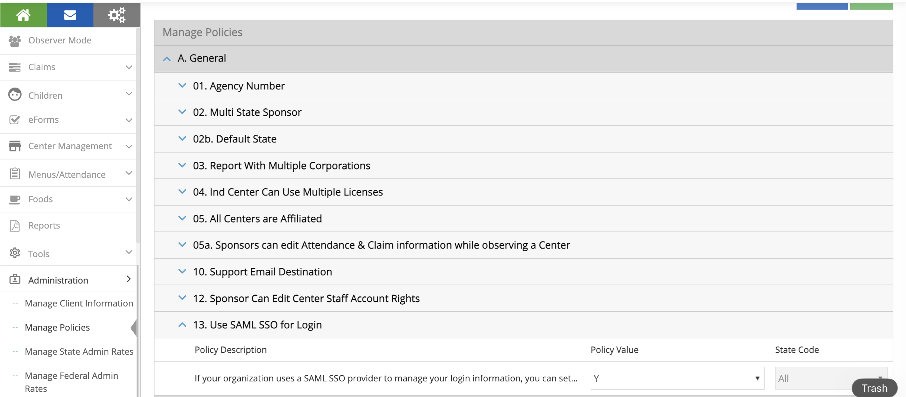
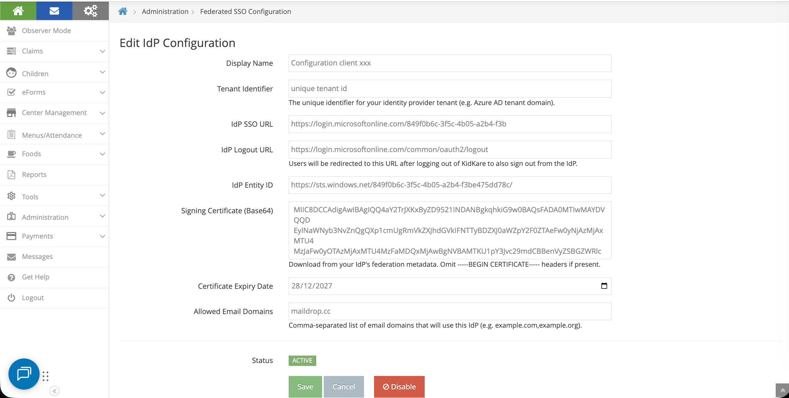
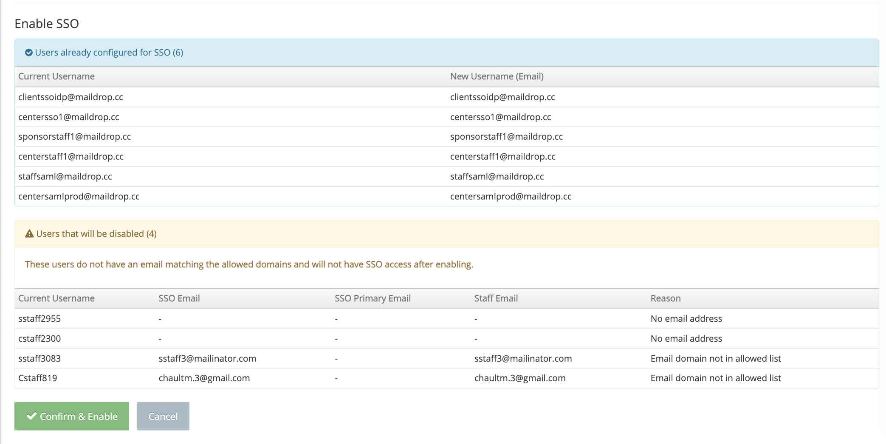

# KidKare SSO Migration Guide

This guide walks you through migrating your organization from KidKare native login (username/password) to Single Sign-On (SSO) using your Azure AD identity provider.

---

## Step 1: Enable Policy A.13

1. Log in as a **Sponsor Admin**
2. Go to **Administration > Manage Policies**
3. Find policy **A.13** (`USE_SAML_SSO_FOR_LOGIN`)
4. Set the value to **Y**
5. Click **Save**

This makes the **Federated SSO Configuration** menu visible under Administration.

---

## Step 2: Configure Your Azure SAML App

In **Azure Portal > Entra ID > Enterprise Applications > [Your App] > Single sign-on**:

### Basic SAML Configuration

| Field                            | Value                                                      |
| -------------------------------- | ---------------------------------------------------------- |
| **Identifier (Entity ID)** | https://api.kidkare.com/ssoservice                         |
| **Reply URL (ACS URL)**    | https://api.kidkare.com/ssoservice/auth/federated/callback |

### Attributes & Claims

> **Important:** Click **Edit** on Attributes & Claims. Click on **Unique User Identifier (Name ID)**. Change the source attribute from `user.userprincipalname` to **`user.mail`**. Save.
>
> This is required. The default `user.userprincipalname` will not work with KidKare.

### SAML Certificates

- Download the **Certificate (Base64)** file
- Note the certificate expiration date

### Copy These Values (you'll need them in Step 3)

| Azure Field                   | KidKare Field |
| ----------------------------- | ------------- |
| **Login URL**           | IdP SSO URL   |
| **Azure AD Identifier** | IdP Entity ID |

---

## Step 3: Update IdP Configuration in KidKare

Go to **Administration > Federated SSO Configuration**

Fill in the form:

| KidKare Field                          | Where to Get It                                                                                              |
| -------------------------------------- | ------------------------------------------------------------------------------------------------------------ |
| **Display Name**                 | Your choice, e.g., "Contoso Azure AD"                                                                        |
| **Tenant Identifier**            | Unique                                                                                                       |
| **IdP SSO URL**                  | Login URL from Azure (Step 2)                                                                                |
| **IdP Logout URL**               | **https://login.microsoftonline.com/common/oauth2/logout**                                                  |
| **IdP Entity ID**                | Azure AD Identifier from Azure (Step 2)                                                                      |
| **Signing Certificate (Base64)** | Open the downloaded `.cer` file in a text editor, copy the content between the `BEGIN` and `END` lines |
| **Certificate Expiry Date**      | From Azure certificate section                                                                               |
| **Allowed Email Domains**        | Comma-separated list of your email domains, e.g.,`contoso.com`                                             |

Click **Save**.

---

## Step 4: Enable SSO

1. Click the **Enable SSO** button on the configuration page
2. The system will automatically:

   - Test the connection to your identity provider
   - Validate all existing users
3. Review the user lists:

| List                                       | Meaning                                            |
| ------------------------------------------ | -------------------------------------------------- |
| **Users already configured for SSO** | Ready to go, no changes needed                     |
| **Users to be migrated**             | Their username will change to their email          |
| **Users that will be disabled**      | No valid email found — they won't have SSO access |

> **Recommendation:** Before clicking "Confirm & Enable", review the "disabled" list. Add valid email addresses to those users first so the migration goes smoothly. You can cancel, update the users, then click Enable SSO again.

4. Click **Confirm & Enable** when ready

---

## Adding New Users After SSO Is Enabled

New staff members added after SSO is enabled automatically get SSO access:

1. Add a new staff member through **Manage Centers > [Center] > User Permissions**
2. Use an email that matches your allowed domains
3. The system automatically sets them up for SSO login
4. They receive an invitation email with instructions to log in using their corporate credentials

---

## How to Revert to Native KidKare Login

If you need to switch back to username/password login, there are two ways:

**Option A: Disable the IdP Configuration**

1. Go to **Administration > Federated SSO Configuration**
2. Click **Disable** on the active configuration

**Option B: Disable Policy A.13**

1. Go to **Administration > Manage Policies**
2. Set policy **A.13** to **N**
3. Click **Save**

Both options will return all users to username/password login. Users who were created during the SSO period (never had a KidKare password) will need to:

- Go to the login page
- Click **Forgot Password**
- Set a new KidKare password

You will receive an email listing these users so you can notify them.
