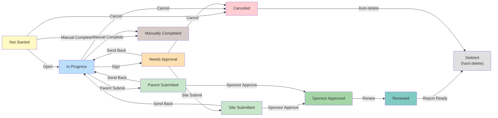
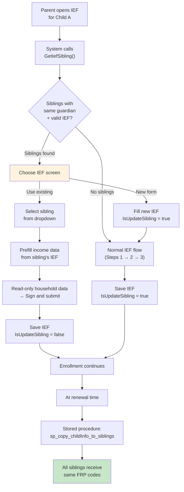
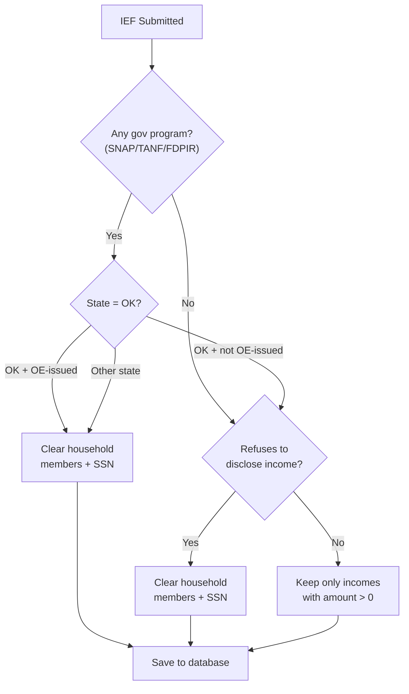

# EForm Enrollment Flow

This document covers the end-to-end enrollment flow, from invitation creation to form completion. It includes the state machine, approval pipeline, sibling IEF synchronization, and data model.

For a high-level overview of eForm, see [EForm Component](../../components/eform.md).

---

## End-to-End Flow

This flow applies to both CX (Center Admin) and HX (Home Provider). The form wizard is the same — the backend routes to CX or HX business logic based on the invitation's `SystemCode`.

```mermaid
graph TD
    A["Center Admin (CX) or<br/>Home Provider (HX)<br/>creates invitation"] --> B["Child created<br/>(status: Enrollment Incomplete)"]

    B --> C{"Who fills<br/>the form?"}
    C -->|"Staff fills<br/>on behalf of parent"| D["Staff opens form<br/>from View Status"]
    C -->|"Parent fills"| E["Parent receives email<br/>→ creates KK account<br/>→ opens form"]

    D --> F["DOB Verification Dialog"]
    E --> F

    F --> G["Load invitation data<br/>+ site config"]

    G --> EF

    subgraph EF ["Enrollment Form (EF)"]
        direction TB
        EF1["1. Child Info"]
        EF2["2. Infant Details<br/>(only if age < 12 months)"]
        EF3["3. Guardian Info"]
        EF4["4. Attendance"]
        EF5["5. Review & Sign"]
        EF1 --> EF2 --> EF3 --> EF4 --> EF5
    end

    EF --> EF_SUB["Submit EF<br/>→ Status: Needs Approval"]

    EF_SUB --> IEF_CHECK{"IEF<br/>required?"}
    IEF_CHECK -->|No| DONE
    IEF_CHECK -->|Yes| SIB_CHECK

    SIB_CHECK{"Siblings<br/>detected?"}
    SIB_CHECK -->|No| IEF
    SIB_CHECK -->|Yes| CHOOSE["Choose IEF screen:<br/>Use existing sibling IEF<br/>or fill new?"]

    CHOOSE -->|"Use existing"| PREFILL["Prefill from sibling<br/>(read-only income data)"]
    CHOOSE -->|"New form"| IEF

    PREFILL --> IEF_SIGN["IEF Step 3: Sign"]

    subgraph IEF ["Income Eligibility Form (IEF)"]
        direction TB
        IEF1["1. Programs<br/>(SNAP, TANF, FDPIR)"]
        IEF2["2. Household Members<br/>& Income"]
        IEF3["3. Certification & Sign"]
        IEF1 --> IEF2 --> IEF3
    end

    IEF_SIGN --> IEF_SUB
    IEF --> IEF_SUB["Submit IEF<br/>→ Status: Needs Approval"]

    IEF_SUB --> DONE["View Status page<br/>(forms: Needs Approval)"]

    DONE --> APPROVE

    subgraph APPROVE ["Approval Pipeline"]
        direction TB
        AP1["CX: Center reviews & approves<br/>HX: Provider submits<br/>(or sends back for revision)"]
        AP2["Sponsor reviews & approves<br/>(or sends back for revision)"]
        AP3["Renewal processing<br/>(sets enrollment + expiration dates)"]
        AP1 --> AP2 --> AP3
    end

    APPROVE --> COMPLETE["Child enrolled<br/>Eligible for meal reimbursement"]

    style EF fill:#e3f2fd
    style IEF fill:#f3e5f5
    style APPROVE fill:#e8f5e9
    style CHOOSE fill:#fff3e0
```



---

## Form State Machine

Each form (EF and IEF) has an independent state machine implemented using the **Stateless** library in `EnrollmentStateMachineInternal.cs`.



### Status Codes

| Status | Code | Meaning |
|--------|------|---------|
| Not Started | 1 | Invitation sent but form not yet opened |
| In Progress | 2 | Form opened and being filled |
| Canceled | 3 | Invitation voided (auto-triggers deletion) |
| Site Submitted | 4 | Site approved (CX: center, HX: provider); awaiting sponsor |
| Manually Completed | 5 | Staff marked complete without parent submission |
| Needs Approval | 6 | Parent/center signed; awaiting site review |
| Sponsor Approved | 7 | Sponsor approved; ready for renewal processing |
| Renewed | 8 | Enrollment/expiration dates set |
| Awaiting Siblings | 9 | Waiting for sibling forms to reach same state |
| Awaiting Reports | 10 | Waiting for PDF report generation |
| Parent Submitted | 11 | Parent submitted directly (no site approval needed) |
| Deleted | -1 | Hard-deleted from database (terminal state) |

### Key Transitions

| From | Action | To | Side Effect |
|------|--------|----|-------------|
| Not Started | Open | In Progress | — |
| In Progress | Sign | Needs Approval | Email to approver (if setting enabled) |
| In Progress | Parent Submit | Parent Submitted | Create completion notification |
| Needs Approval | Site Submit | Site Submitted | — |
| Site/Parent Submitted | Sponsor Approve | Sponsor Approved | Email to parent |
| Sponsor Approved | Renew | Renewed | Sibling coordination + sync |
| Any → Send Back | → In Progress | Revision email to parent |
| Canceled | Auto-delete | Deleted | Hard delete from DB |

### Deletion

When a form reaches `Deleted`, hard deletion runs with retry logic (3 attempts, exponential backoff):

1. Create `CompletedEnrollment` audit record
2. Null out form reference on assignment
3. If assignment has no remaining forms → delete assignment
4. Delete all `StatusHistory` records for the form
5. Hard-delete the form record

---

## Sibling IEF Synchronization (317778)

### Problem

CACFP requires all children in the same household to have the same FRP (Free/Reduced/Paid) designation. Before this feature, each child had an independent IEF, which could result in siblings having different benefit tiers.

### Solution

The system detects siblings (same guardian) and ensures FRP consistency through two mechanisms:

1. **At enrollment** — Parent chooses to reuse existing sibling IEF or fill a new one
2. **At renewal** — Stored procedures copy FRP data to all siblings automatically



### Sibling Detection

Siblings are found differently in CX and HX systems:

| System | How siblings are matched | Implementation |
|--------|------------------------|----------------|
| **CX** | Direct `guardian_id` match in same `client_id` | `CxEnrollmentBll.GetCxChildSiblings()` |
| **HX** | Guardian name + address + zip code match | `HxEnrollmentBll.GetHxChildSiblings()` — self-joins Guardians table |

Eligible children for sibling matching:

- Active (status 238, 239)
- Recently withdrawn (status 241, withdrawn_date > today)
- Has valid IEF with future expiration date

### What Gets Synced

The stored procedures copy these fields from the main child to all siblings:

| Field | Description |
|-------|-------------|
| `frb_category_code` | FRP category (Free, Reduced, Paid) |
| `frb_eligibility_type_code` | Eligibility type |
| `benefits_program_case_number` | Government program case number |
| `is_issued_of_oklahoma` | Oklahoma-specific flag |
| `ief_expiration_date` | IEF expiration (oversight tab only) |
| `ief_effective_date` | IEF effective date (oversight tab only) |
| `CHILD_INCOME` records | Full income form data (32+ columns) |
| `CHILD_INCOME_HOUSEHOLD` records | All household members with 5 income sources each |

### Database Procedures

| Procedure | Database | Called From |
|-----------|----------|-------------|
| `sp_copy_childInfo_to_siblings` | CXADMIN | `CxEnrollmentBll.RenewEnrollments()`, `ChildController.CopyChildInfoToSiblings()` |
| `sp_copy_hx_childInfo_to_siblings` | MMADMIN_XXX | `HxEnrollmentBll.RenewEnrollments()` |

Both procedures follow the same logic:

1. Discover siblings (by guardian match)
2. Copy child-level fields (FRP codes, benefits info)
3. Delete old sibling income records for the signature date
4. Insert new income records copied from the main child
5. Insert new household member records copied from the main child

If the main child has no income record, sibling income data is cleaned up to prevent orphaned records.

### New API Endpoints

| Endpoint | Method | Purpose |
|----------|--------|---------|
| `GET /enrollment/getChildIncome` | GET | Retrieve sibling's income data for prefilling |
| `POST /child/copyChildInfoToSiblings` | POST | Copy IEF data from main child to selected siblings (oversight tab) |

### New UI Component

**Choose IEF screen** (`ief-forms/choose-ief/`):

- Radio buttons: "Yes, provide new income" vs "No, use existing"
- Sibling dropdown showing names + IEF signature dates
- Preview of selected sibling's income data
- Available in English, Spanish, and Russian (i18n)

### Oversight Tab (CX Only)

The CX child oversight tab (`cx-child-oversight.component.ts`) supports manual sibling sync for center users:

- Multiselect dropdown of eligible siblings
- "Copy to siblings" action that calls `sp_copy_childInfo_to_siblings` with `IsOversightTab=true`
- Deleting IEF records or household income rows auto-triggers sibling sync

This is not available in HX — home providers manage child data directly without an oversight tab.

---

## IEF Income Logic

### Government Program Eligibility



**Key rules:**

- SNAP, TANF, or FDPIR participation = categorical eligibility (income not needed)
- Oklahoma has a special exception: income clearing only applies when OE-issued programs are enabled
- If parent refuses to disclose, household members and SSN are cleared
- Only income entries with amount > 0 and frequency != "No Income" are saved
- Previous year's household members can be loaded for prefill
- HX + North Carolina: "Retirement" income type converts to "Pension" for legacy compatibility

### SNAP/TANF Validation

Case numbers are validated against the National Data Service (NDS). Behavior is configurable per site:

- **Warn**: validation fails but submission proceeds
- **Error**: validation fails and blocks submission

---

## Data Model

### Core Tables (MMADMIN_EFORM, SQL Server)

```
┌──────────────────────────┐     ┌───────────────────────────┐
│ KK_EnrollmentForm        │     │ KK_IncomeEligibilityForm  │
│──────────────────────────│     │───────────────────────────│
│ id (PK)                  │     │ id (PK)                   │
│ status                   │     │ status                    │
│ form_data (JSON)         │     │ form_data (JSON)          │
│ record_status_code       │     │ IsUpdateSibling (BIT)     │
│ create_date_time         │     │ record_status_code        │
│ mod_date_time            │     │ create_date_time          │
└──────────┬───────────────┘     └───────────┬──────────────┘
           │                                  │
           └──────────┬───────────────────────┘
                      │ (referenced by)
                      ▼
┌─────────────────────────────────────────────────────────┐
│ KK_EnrollmentAssignmentCx                               │
│─────────────────────────────────────────────────────────│
│ id (PK)                                                 │
│ ClientId, CenterId, ChildId, GuardianId                 │
│ EnrollmentFormId (FK → KK_EnrollmentForm)               │
│ IncomeEligibilityFormId (FK → KK_IncomeEligibilityForm) │
│ record_status_code (290 = soft-deleted)                 │
└─────────────────────────────────────────────────────────┘
           │
    ┌──────┴──────┬───────────────┐
    ▼             ▼               ▼
 KK_Enrollment  KK_Storage     KK_Enrollment
 Report         Files          Completed
 (PDF reports)  (signatures)   (audit trail)
```

### Income Tables (CXADMIN / MMADMIN_XXX)

These are the tables that get synced across siblings:

| Table | Database | Content |
|-------|----------|---------|
| `CHILD` | CXADMIN | Child master record — FRP codes, IEF dates, benefits info |
| `CHILD_INCOME` | CXADMIN | Income form record (32+ columns per signature date) |
| `CHILD_INCOME_HOUSEHOLD` | CXADMIN | Household members with 5 income sources each |
| `CHILD_INCOME` | MMADMIN_XXX | HX equivalent of CX income data |
| `CHILD_INCOME_HOUSEHOLD` | MMADMIN_XXX | HX equivalent of household data |

### Invitation Entity (MySQL, Shared-Core)

The `EnrollmentInvitation` entity is stored in MySQL (KidsContext) and contains:

- Invitation metadata (token, status, type, state code)
- Guardian and child info (name, DOB, email)
- `OriginalData` (JSON snapshot at submission)
- `CurrentData` (latest form data as JSON)
- Assignment linking to center, guardian, and child IDs

---

## Email Notifications

| Trigger | Template | Condition |
|---------|----------|-----------|
| Invitation created or resent | ParentInvitation | Guardian email exists |
| Form sent back for revision | ParentInvitationRevision | Guardian email exists |
| Form signed (→ Needs Approval) | ParentSignForm | Guardian email exists AND `OESendApprovalEmail` setting enabled |
| Sponsor approves | ParentInvitationApprove | Guardian email exists |

Emails support English, Spanish, and Russian. Bulk resend groups invitations by email to avoid duplicates.

---

## Key Source Files

### Backend (KK)

| File | Purpose |
|------|---------|
| `KidKare.Service/Controllers/EnrollmentController.cs` | API controller — all enrollment endpoints |
| `KidKare.Bll/Enrollment/EnrollmentBll.cs` | Core business logic — CRUD, income retrieval, sibling detection |
| `KidKare.Bll/Enrollment/Processor/InvitationsProcessor.cs` | Invitation creation with existing IEF reuse for siblings |
| `KidKare.Bll/Enrollment/EnrollmentStateMachine/EnrollmentStateMachineInternal.cs` | Stateless state machine — transitions + side effects |
| `KidKare.Bll/Centers/Child/ChildBll.cs` | Child profile, sibling eligibility, copy-to-siblings API |
| `KidKare.Web/app/common/services/enrollment-service/enrollment-service.js` | Frontend wizard navigation, sibling routing |
| `KidKare.Web/app/states/child-enrollment/ief-forms/choose-ief/` | Choose IEF screen (new in 317778) |
| `KidKare.Web/app/states/child-enrollment/ief-forms/household/ief-household-controller.js` | Household form — handles prefilled read-only mode |

### CX System (Centers-CX)

| File | Purpose |
|------|---------|
| `MinuteMenu.Centers.CXWeb/Services/Enrollments/ChildEnrollmentService.cs` | Child enrollment + guardian management |
| `MinuteMenu.Centers.CXWeb/Services/Enrollments/IefService.cs` | IEF save/retrieve |
| `MinuteMenu.Centers.CXWeb/Services/Enrollments/IefAdapter.cs` | IEF data transformation |

### Database (MinuteMenu.Database)

| File | Purpose |
|------|---------|
| `CXADMIN/Stored Procedures/sp_copy_childInfo_to_siblings.sql` | Copy IEF + income data to CX siblings |
| `MMADMIN_XXX/Stored Procedures/sp_copy_hx_childInfo_to_siblings.sql` | Copy IEF + income data to HX siblings |
| `CXADMIN/Stored Procedures/initializeIEFEffectiveAndIEFSponsorApproveWithChildIds.sql` | IEF date initialization with sibling propagation |
| `MMADMIN_EFORM/Updates/317347_IsUpdateSibling_for_IEF.sql` | Added `IsUpdateSibling` column to `KK_IncomeEligibilityForm` |
