# Release TP 314217: Adyen Payment Integration — Feature Documentation

**Release:** Adyen payment integration (TP #314217)
**Project:** KidKare (Parachute)
**Date:** 2026-03-25
**Repositories:** Parachute, Parachute-PWA, KK (KidKare), MinuteMenu.Database

---

## Table of Contents
1. [Business Context & Requirements](#1-business-context--requirements)
2. [End-User Flows](#2-end-user-flows)
3. [Architecture Overview](#3-architecture-overview)
4. [Flow Charts (Technical)](#4-flow-charts-technical)
5. [Implementation by Repository](#5-implementation-by-repository)
6. [Ticket Traceability Matrix](#6-ticket-traceability-matrix)
7. [Test Case Plan](#7-test-case-plan)

---

## 1. Business Context & Requirements

### Background
Moving payment processing from Stripe to Adyen/ValPay. Stripe can no longer onboard new users. This release builds Adyen support for **new customers only**; existing Stripe users are unaffected and migration is NOT in scope.

### Business Requirements (from TP #314216)

**R1 — User Categorization:**
- Users categorized as Stripe or Adyen via `PaymentProviderType` (1=Stripe, 2=Adyen)
- Adyen users process on Adyen after onboarding; Stripe users continue on Stripe

**R2 — Onboarding (TP #314275):**
- Provider navigates to Settings > Subscription & ParaPay > Begin Onboarding Verification
- Fills KidKare-hosted form (Legal Entity Type, Business Name/DBA, Legal Company Name, Annual GMV, Website, Contact Info, Address)
- Data sent to Adyen via LEM & Balance Platform APIs
- Adyen generates Hosted Onboarding link for KYC verification
- Status tracked: Pending → Approved / Rejected
- Text updated: "Complete your account setup for Parachute ParaPay with Adyen"

**R3 — Storing Payment Methods (TP #314216):**
- Payers store payment methods from Settings (implied consent) or during payment (explicit permission asked)
- Credit Cards: Adyen Advanced Flow, stored as `UnscheduledCardOnFile`
- ACH: Adyen GIACT verification (instant, no micro-deposits needed)
- Users can update, edit, delete stored methods

**R4 — Creating Payments (TP #314548):**
- Pay with new or saved payment methods (Credit Card & ACH)
- Single Auth/Capture call (no separate capture step)
- Adyen handles fraud internally — transactions NOT directed to KidKare Fraud Queue
- Multiple partial payments on one invoice supported
- Fee: flat 2.95% + $0.30 for CC; $1.00 flat for ACH (provider rate)
- Error message on decline/fraud: "Payment Failed: please try again or if issues persist reach out to support@kidkare.com"
- Accepted card brands: Visa, Mastercard, Discover, Amex (same as current Stripe)

**R5 — Refunds (TP #315212, #318345):**
- Refund credit card and ACH payments back to original payment method
- Full and partial refunds with fee recalculation
- Split refund between Default (provider) and Commission (KidKare) accounts

**R6 — Autopay (TP #315093, #318347):**
- Enable/disable autopay with stored payment method
- Set payment limit per transaction
- Batch processing via scheduled job (HX: `/stripe/processAutoPay`, CX: `/cx/stripe/processAutoPay`)

**R7 — Payer Settings (TP #318348):**
- Save/delete/set-default payment methods
- Manage autopay configuration (5-step wizard)
- View payment method details (last4, brand, expiry)

**R8 — Payouts:**
- Sub-merchants receive payouts via Adyen Balance Platform
- Split payments: Default (provider portion) + Commission (KidKare portion)

---

## 2. End-User Flows

This section describes the Adyen payment features from the **end-user perspective** — what providers and payers see and do in the application.

### 2.1 Provider Onboarding (Site Setup)

Before a provider can accept payments through Adyen, they must complete the onboarding process.

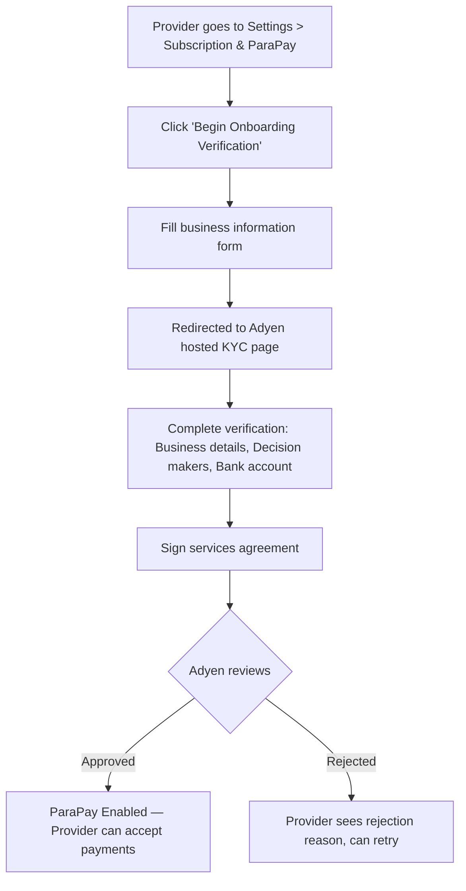

**Step 1 — ParaPay settings page.** Provider navigates to **Settings > Subscription & ParaPay** and clicks **"Begin Onboarding Verification"**.

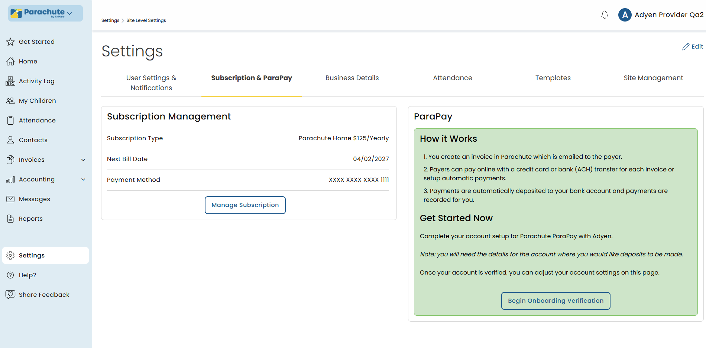

**Step 2 — Business information form.** Provider fills in: Legal Entity Type (Organization / Individual / Sole Proprietorship), Business Name/DBA, Legal Company Name, Annual GMV, and Website.

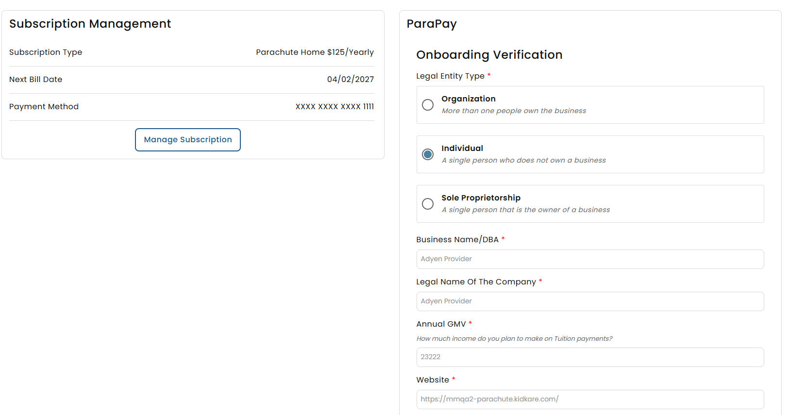

**Step 3 — Adyen hosted KYC verification.** Provider is redirected to the Adyen platform to complete identity verification. They need to provide Business details, Decision makers, and Bank account information.

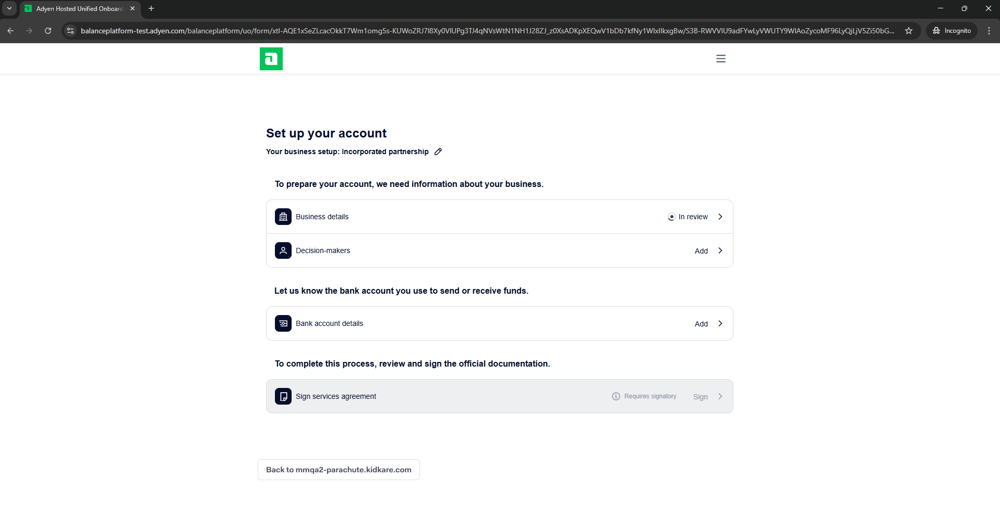

**Step 4 — Complete verification.** As each section is verified, it shows a green checkmark. Provider finishes by signing the services agreement.

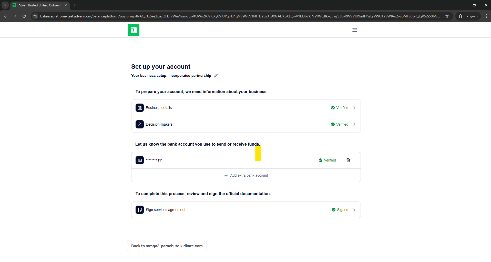

**Step 5 — Onboarding complete.** After Adyen approves, the provider returns to Parachute. The settings page now shows **"ParaPay Onboarding Verified"** with toggles for ParaPay, User Initiated Payments, and fee configuration.

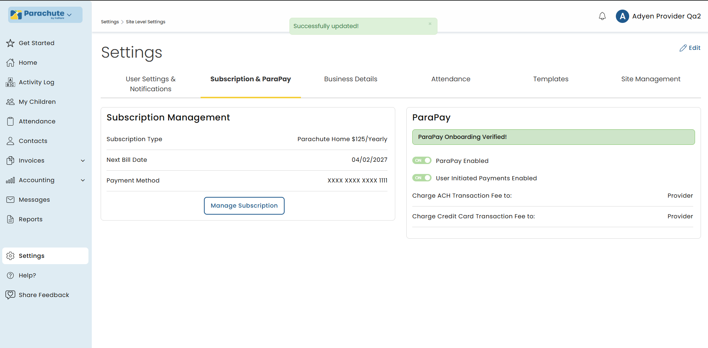

---

### 2.2 Payer: Save Payment Method

Payers can save credit cards or bank accounts for future use.

**Where:** Settings > Payment Information & Auto Pay > **"+ Add New Payment Method"**

- **Credit Card:** Enter card number, expiry, and security code. Card is saved via Adyen Advanced Flow.
- **Bank Account (ACH):** Enter account type, holder name, routing number, and account number. Verified instantly via Adyen GIACT (no micro-deposits needed).

Saved methods show last 4 digits, brand/bank name, and last used date.

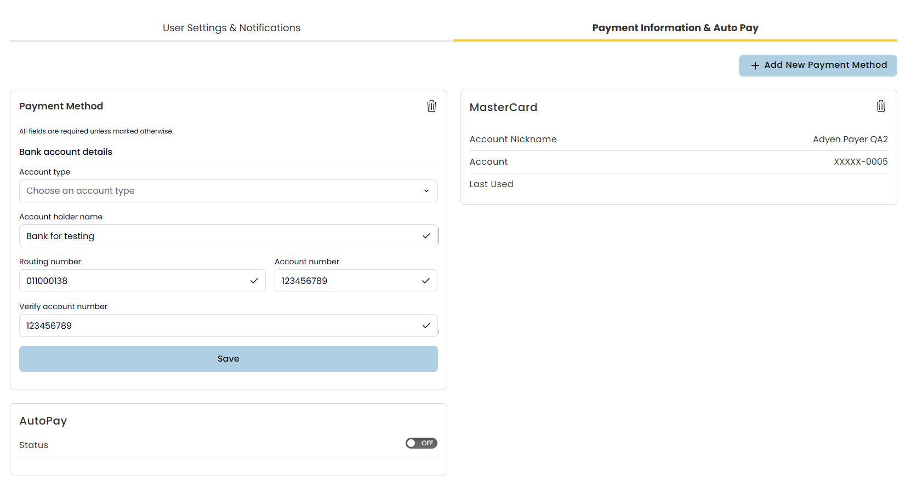

---

### 2.3 Payer: Configure Autopay

Payers can enable automatic payments so invoices are paid without manual action.

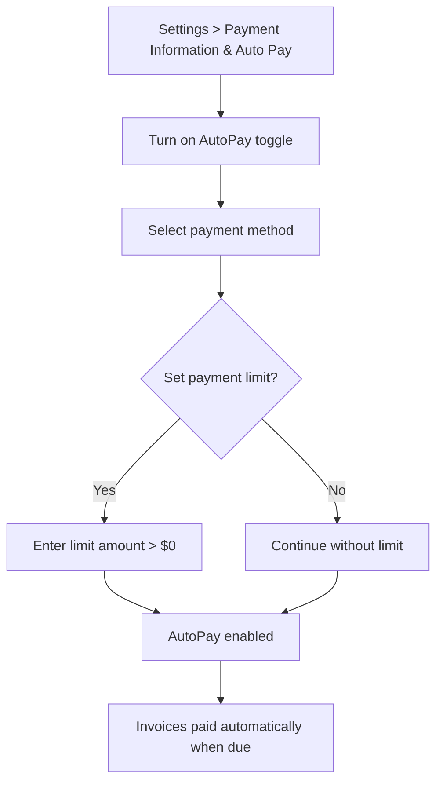

**Setup steps:**

1. Go to **Settings > Payment Information & Auto Pay**
2. Turn on the **AutoPay** toggle
3. Select a saved payment method (credit card or bank account)
4. Optionally set a **payment limit** — invoices above this amount require manual payment
5. Confirm

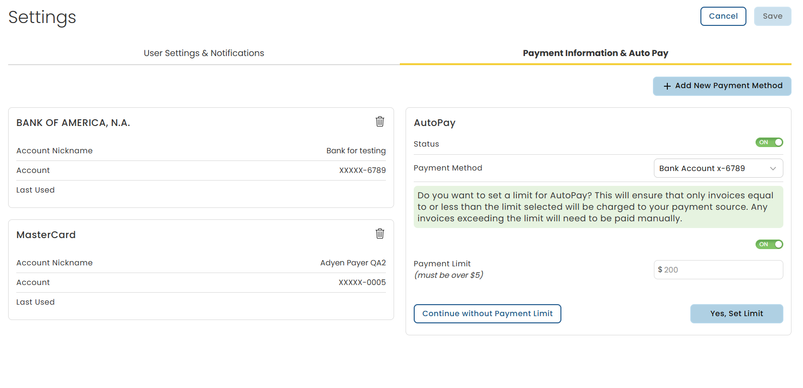

---

### 2.4 Payer: Make a Payment

Payers have **three ways** to make payments. All support paying with a saved method or a new credit card.

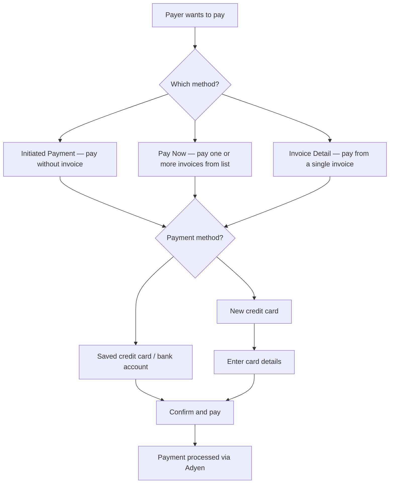

#### 2.4.1 Initiated Payment (without invoice)

Payer sends a payment directly to a provider without needing an existing invoice. Useful for ad-hoc payments.

**Where:** User Initiated Payment page

- Select **Provider**, enter **Amount**, choose **Child**, **Description**, and **Billing Period**
- Choose a saved payment method or enter a new credit card
- Confirm the payment in the authorization dialog

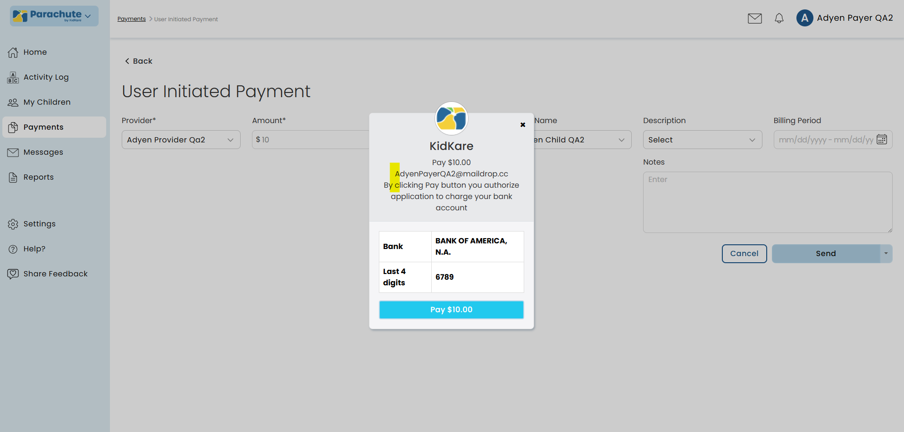

#### 2.4.2 Pay Now (from invoice list)

Payer selects one or more invoices from the invoice list and pays them in a single transaction.

**Where:** Invoices list > **Pay Now**

- Select invoices to pay (can pay multiple at once)
- Review total amount and fee
- Confirm with saved method or new card

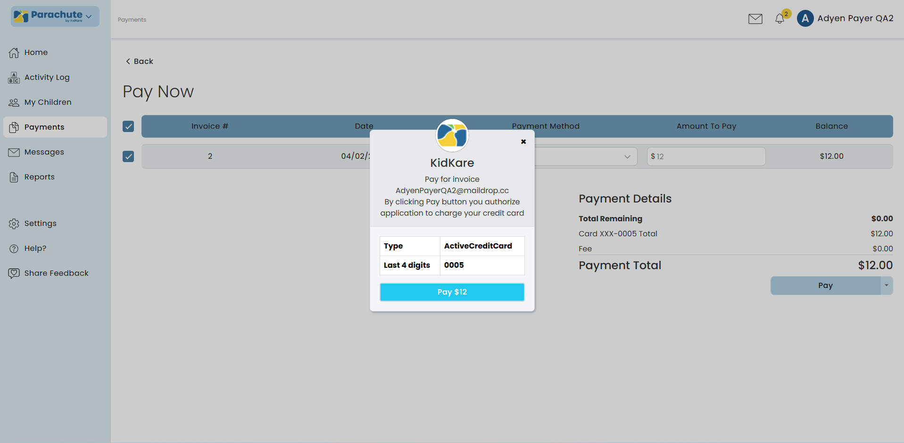

#### 2.4.3 Pay from Invoice Detail

Payer opens a specific invoice and pays directly from the detail page. Supports partial payments.

**Where:** Invoice detail page

- Enter the **amount to pay** (can be less than the full balance for partial payment)
- Select payment method
- Confirm payment

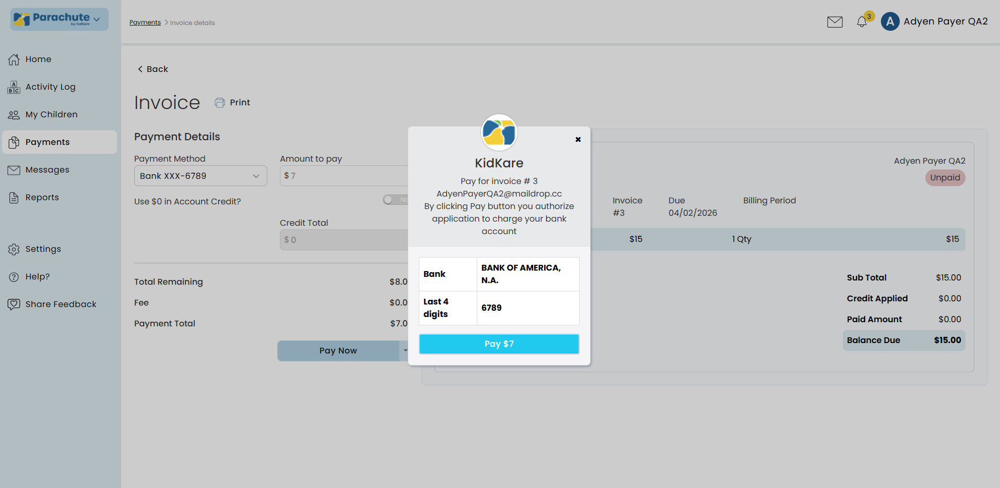

#### 2.4.4 Pay with New Credit Card

When paying with a new card (from any of the 3 methods above), the payer enters card details in the Adyen payment form: card number, expiry date, and security code.

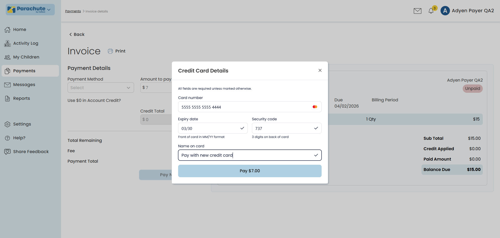

---

### 2.5 Payment Fees

| Payment Method | Fee to Payer |
|---------------|-------------|
| Credit Card | 2.95% + $0.30 per transaction |
| ACH (Bank Account) | $1.00 flat per transaction |

Fee assignment (who pays the fee) is configured by the provider in ParaPay settings after onboarding.

---

## 3. Architecture Overview

### 3.1 System Diagram

```
┌──────────────────────────────────────────────────────────────────────────┐
│                           FRONTEND LAYER                                 │
│                                                                          │
│  ┌─────────────────────┐         ┌─────────────────────────────┐        │
│  │  Parachute-PWA       │         │  Parachute (AngularJS)      │        │
│  │  (Payer Portal)      │         │  (Provider Portal)          │        │
│  │                      │         │                             │        │
│  │  • Pay invoice       │         │  • Onboarding form          │        │
│  │  • Save payment      │         │  • Refund UI                │        │
│  │    method            │         │  • Account settings         │        │
│  │  • Setup autopay     │         │                             │        │
│  │  • Payment limit     │         │                             │        │
│  │  • Adyen Web SDK     │         │                             │        │
│  │    (Advanced Flow)   │         │                             │        │
│  └──────────┬───────────┘         └──────────────┬──────────────┘        │
└─────────────┼────────────────────────────────────┼───────────────────────┘
              │ REST API                           │ REST API
              ▼                                    ▼
┌──────────────────────────────────────────────────────────────────────────┐
│                    BACKEND LAYER (Parachute API)                         │
│                                                                          │
│  Controllers:                                                            │
│  ┌─────────────────┐ ┌────────────────────────┐ ┌────────────────────┐  │
│  │ AdyenController  │ │ AdyenOnboardingCtrl    │ │ AdyenWebhookCtrl   │  │
│  │ /api/adyen/*     │ │ /api/adyen/onboard/*   │ │ /api/adyen/webhook │  │
│  └────────┬─────────┘ └───────────┬────────────┘ └─────────┬──────────┘  │
│           │                       │                         │            │
│  Business Logic Layer:                                                   │
│  ┌────────▼──────────┐ ┌─────────▼──────────┐ ┌───────────▼──────────┐  │
│  │ AdyenPaymentBll   │ │ AdyenOnboardingBll │ │ AdyenWebhookProcessor│  │
│  │ • ProcessPayment  │ │ • CompleteOnboard   │ │ • Route events       │  │
│  │ • SavePayMethod   │ │ • GetStatus         │ │ • HMAC validation    │  │
│  │ • GetAutopayAcct  │ │ AdyenPlatformBll    │ │ Handlers:            │  │
│  │ • UpdateAutopay   │ │ • GetAdyenAccount   │ │ • Authorisation      │  │
│  │                   │ │                     │ │ • Capture/Failed     │  │
│  │ InvoiceBll        │ │ AdyenUtil           │ │ • Chargeback         │  │
│  │ • RefundAdyen     │ │ • HMAC validation   │ │ • AccountUpdated     │  │
│  │ • ConfirmPayments │ │ • Client factories  │ │ • PayoutCreated      │  │
│  │ • MakeFeeExpense  │ │                     │ │ • Fraud              │  │
│  └────────┬──────────┘ └─────────┬───────────┘ └───────────┬──────────┘  │
│           │                       │                         │            │
│  ┌────────▼───────────────────────▼─────────────────────────▼──────────┐  │
│  │           StripeAutoPayProcessor / AutoPayFlow                      │  │
│  │           POST /stripe/processAutoPay (HX)                         │  │
│  │           POST /cx/stripe/processAutoPay (CX)                      │  │
│  │           Routes → AdyenPaymentBll.ProcessPayment(IsAutopay=true)  │  │
│  └─────────────────────────────────────────────────────────────────────┘  │
└────────┬──────────────────────────┬─────────────────────────┬────────────┘
         │                          │                          │
         ▼                          ▼                          ▼
┌─────────────────┐  ┌──────────────────────┐  ┌──────────────────────────┐
│  Adyen APIs      │  │  SQL Server (DB)      │  │  Adyen Webhooks          │
│                  │  │                       │  │  (Async callbacks)       │
│  • Checkout API  │  │  7 new tables:        │  │                          │
│    (Payments)    │  │  P_AdyenConnected     │  │  → /api/adyen/webhook    │
│  • Refund API    │  │    Accounts           │  │  → /webhook-platform     │
│  • LEM API       │  │  P_AdyenOnboarding    │  │  → /webhook-platform-    │
│    (Onboarding)  │  │    Data               │  │    transfer              │
│  • Balance       │  │  P_AdyenPayment       │  │                          │
│    Platform API  │  │    Methods            │  │  Events:                 │
│                  │  │  P_AdyenPayment       │  │  AUTHORISATION           │
│  Splits:         │  │    Reference          │  │  CAPTURE/CAPTURE_FAILED  │
│  Default→Provider│  │  P_AdyenRefund        │  │  CHARGEBACK              │
│  Commission→MM   │  │    History            │  │  REFUND/REFUND_FAILED    │
│                  │  │  P_AdyenEventLog      │  │  accountHolder.updated   │
│                  │  │  P_AdyenOnboarding    │  │  payout.created          │
│                  │  │    ProcessTracking    │  │                          │
│                  │  │                       │  │                          │
│                  │  │  4 modified tables:    │  │                          │
│                  │  │  P_ConnectedAccount   │  │                          │
│                  │  │  P_EpayCustomer       │  │                          │
│                  │  │  P_InvoicePayment     │  │                          │
│                  │  │  P_ConnectedAccPayout │  │                          │
└─────────────────┘  └──────────────────────┘  └──────────────────────────┘
```

### 3.2 Multi-Party Settlement (Splits)

Every Adyen payment is split into two portions:
- **Default Split** → Provider's `BalanceAccountId` (payment amount minus fees)
- **Commission Split** → KidKare's merchant account (platform fees)

Fee flags `SitePaysMMFee` and `SitePaysOtherFee` on `AdyenPaymentReference` determine who pays which fee.

### 3.3 Fee Structure (Web.config)

| Fee | Amount | Description |
|-----|--------|-------------|
| `AdyenMinuteMenuACHFeeCents` | 85 | MM fee for ACH ($0.85) |
| `AdyenMinuteMenuCCFeeCents` | 70 | MM fee for Credit Card ($0.70) |
| `AdyenACHFeeCents` | 15 | Partner fee for ACH ($0.15) |
| `AdyenCCFeeCents` | 30 | Partner flat fee for CC ($0.30) |
| `AdyenCCFeePercent` | 0.0295 | Partner percentage fee for CC (2.95%) |
| `AdyenACHChargeFailurePenaltyFeeCents` | 400 | Failed ACH penalty ($4.00) |

---

## 4. Flow Charts (Technical)

### 4.1 Payment Flow (Pay Invoice with New Credit Card)

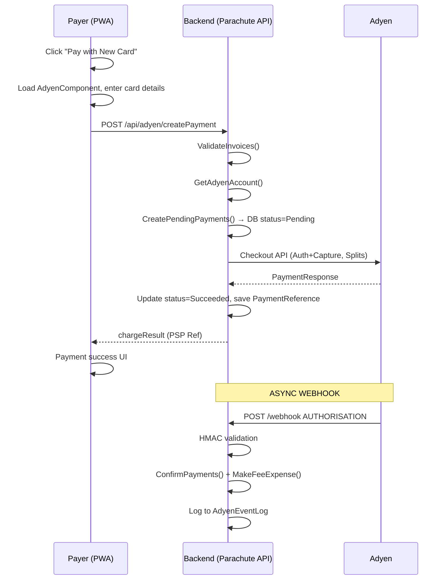

??? note "ASCII Art (detailed)"

    ```
    Payer (PWA)                    Backend (Parachute API)              Adyen
    │                                   │                            │
    │  1. Click "Pay with New Card"     │                            │
    │──────────────────────────────────>│                            │
    │                                   │                            │
    │  2. Load AdyenComponent (Card)    │                            │
    │  3. Enter card details            │                            │
    │  4. onSubmit → paymentDataReady   │                            │
    │                                   │                            │
    │  5. POST /api/adyen/createPayment │                            │
    │  ─────────────────────────────────>│                           │
    │                                   │  6. ValidateInvoices()     │
    │                                   │  7. GetAdyenAccount()      │
    │                                   │  8. CreatePendingPayments()│
    │                                   │     → DB: InvoicePayment   │
    │                                   │       (status=Pending)     │
    │                                   │                            │
    │                                   │  9. Checkout API           │
    │                                   │     (Auth+Capture, Splits) │
    │                                   │  ─────────────────────────>│
    │                                   │                            │
    │                                   │  10. PaymentResponse       │
    │                                   │  <─────────────────────────│
    │                                   │                            │
    │                                   │  11. Update payment        │
    │                                   │      status=Succeeded      │
    │                                   │  12. Save PaymentReference │
    │                                   │                            │
    │  13. chargeResult (PSP Ref)       │                            │
    │  <─────────────────────────────────│                           │
    │                                   │                            │
    │  14. responseCallback(result)     │                            │
    │  15. Payment success UI           │                            │
    │                                   │                            │
    │                                   │  === ASYNC WEBHOOK ===     │
    │                                   │                            │
    │                                   │  16. POST /webhook         │
    │                                   │      AUTHORISATION         │
    │                                   │  <─────────────────────────│
    │                                   │                            │
    │                                   │  17. HMAC validation       │
    │                                   │  18. ConfirmPayments()     │
    │                                   │  19. MakeFeeExpense()      │
    │                                   │  20. Log to AdyenEventLog  │
    ```

### 4.2 Refund Flow

> **Note:** `POST /api/adyen/refund` (AdyenController) is **dead code** — not called from anywhere.
> The actual refund entry point is via `ProviderAccountingController`:
> `POST /provider-accounting/invoice/addInvoiceRefundByPayment`
> → `InvoiceBll.RefundWithPaymentPlatform()` → routes to `RefundAdyen()` or `RefundStripe()`.
>
> `/cx-accounting/` endpoints are **deprecated and no longer used**.

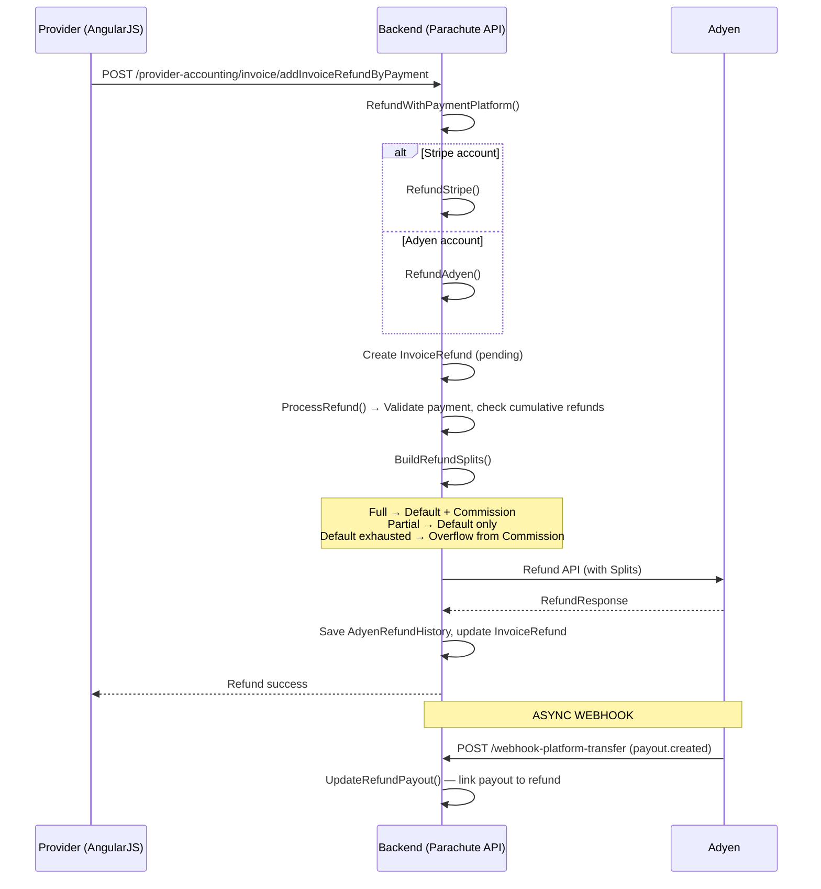

??? note "ASCII Art (detailed)"

    ```
    Provider (AngularJS)           Backend (Parachute API)              Adyen
    │                                   │                            │
    │  1. Initiate Refund               │                            │
    │  POST /provider-accounting/       │                            │
    │   invoice/addInvoiceRefundByPayment                            │
    │  ─────────────────────────────────>│                           │
    │                                   │                            │
    │                                   │  2. RefundWithPaymentPlatform()
    │                                   │     → Stripe account? → RefundStripe()
    │                                   │     → else → RefundAdyen()│
    │                                   │                            │
    │                                   │  3. InvoiceBll.RefundAdyen()│
    │                                   │  4. Create InvoiceRefund   │
    │                                   │     (Amount=0, pending)    │
    │                                   │                            │
    │                                   │  5. AdyenPaymentBll        │
    │                                   │     .ProcessRefund()       │
    │                                   │  6. Validate payment exists│
    │                                   │  7. Check cumulative       │
    │                                   │     refunds ≤ payment      │
    │                                   │                            │
    │                                   │  8. ProcessAdyenRefund()   │
    │                                   │  9. Load original          │
    │                                   │     PaymentReference       │
    │                                   │ 10. Reconstruct fee        │
    │                                   │     structure              │
    │                                   │ 11. BuildRefundSplits()    │
    │                                   │     ┌─────────────────┐    │
    │                                   │     │ Full refund?    │    │
    │                                   │     │ → Default +     │    │
    │                                   │     │   Commission    │    │
    │                                   │     │ Partial?        │    │
    │                                   │     │ → Default only  │    │
    │                                   │     │ Default exhausted│   │
    │                                   │     │ → Overflow from │    │
    │                                   │     │   Commission    │    │
    │                                   │     └─────────────────┘    │
    │                                   │                            │
    │                                   │ 12. Refund API (with Splits)│
    │                                   │  ─────────────────────────>│
    │                                   │                            │
    │                                   │ 13. RefundResponse         │
    │                                   │  <─────────────────────────│
    │                                   │                            │
    │                                   │ 14. Save AdyenRefundHistory│
    │                                   │ 15. Update InvoiceRefund   │
    │                                   │     (amount, PSP ref)      │
    │                                   │                            │
    │  16. Refund success               │                            │
    │  <─────────────────────────────────│                           │
    │                                   │                            │
    │                                   │  === ASYNC WEBHOOK ===     │
    │                                   │                            │
    │                                   │ 17. POST /webhook-platform │
    │                                   │     -transfer              │
    │                                   │     payout.created         │
    │                                   │  <─────────────────────────│
    │                                   │                            │
    │                                   │ 18. UpdateRefundPayout()   │
    │                                   │     Link payout to refund  │
    ```

### 4.3 Onboarding Flow

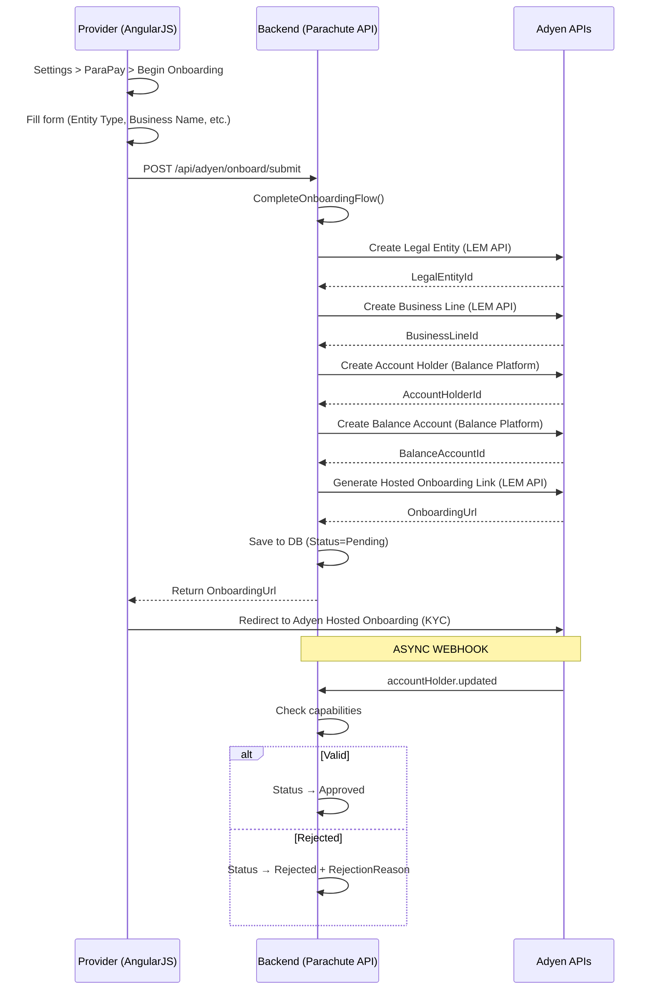

??? note "ASCII Art (detailed)"

    ```
Provider (AngularJS)           Backend (Parachute API)              Adyen APIs
    │                                   │                            │
    │  1. Settings > ParaPay            │                            │
    │  2. Click "Begin Onboarding"      │                            │
    │  3. Fill form:                    │                            │
    │     • Legal Entity Type           │                            │
    │     • Business Name/DBA           │                            │
    │     • Legal Company Name          │                            │
    │     • Annual GMV                  │                            │
    │     • Website                     │                            │
    │     • Contact Info                │                            │
    │     • Address                     │                            │
    │                                   │                            │
    │  4. POST /api/adyen/onboard/submit│                            │
    │  ─────────────────────────────────>│                           │
    │                                   │                            │
    │                                   │  5. CompleteOnboardingFlow()│
    │                                   │                            │
    │                                   │  6. Create Legal Entity    │
    │                                   │  ─────────────────────────>│ LEM API
    │                                   │  <─────────────────────────│
    │                                   │     → LegalEntityId        │
    │                                   │                            │
    │                                   │  7. Create Business Line   │
    │                                   │  ─────────────────────────>│ LEM API
    │                                   │  <─────────────────────────│
    │                                   │     → BusinessLineId       │
    │                                   │                            │
    │                                   │  8. Create Account Holder  │
    │                                   │  ─────────────────────────>│ Balance
    │                                   │  <─────────────────────────│ Platform
    │                                   │     → AccountHolderId      │
    │                                   │                            │
    │                                   │  9. Create Balance Account │
    │                                   │  ─────────────────────────>│ Balance
    │                                   │  <─────────────────────────│ Platform
    │                                   │     → BalanceAccountId     │
    │                                   │                            │
    │                                   │ 10. Generate Hosted        │
    │                                   │     Onboarding Link        │
    │                                   │  ─────────────────────────>│ LEM API
    │                                   │  <─────────────────────────│
    │                                   │     → OnboardingUrl        │
    │                                   │                            │
    │                                   │ 11. Save to DB:            │
    │                                   │     AdyenOnboardingData    │
    │                                   │     AdyenConnectedAccount  │
    │                                   │     ProcessTracking        │
    │                                   │     Status = Pending       │
    │                                   │                            │
    │  12. Return OnboardingUrl         │                            │
    │  <─────────────────────────────────│                           │
    │                                   │                            │
    │  13. Redirect to Adyen            │                            │
    │      Hosted Onboarding (KYC)      │                            │
    │                                   │                            │
    │                                   │  === ASYNC WEBHOOK ===     │
    │                                   │                            │
    │                                   │ 14. accountHolder.updated  │
    │                                   │  <─────────────────────────│
    │                                   │                            │
    │                                   │ 15. Check capabilities     │
    │                                   │     sendToTransferInstrument│
    │                                   │     Valid → Approved       │
    │                                   │     Rejected → Rejected    │
    │                                   │     + RejectionReason      │
    ```

### 4.4 Autopay Processing Flow

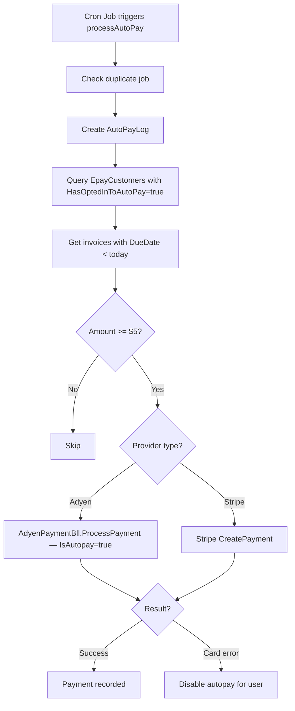

??? note "ASCII Art (detailed)"

    ```
    Cron Job / Scheduler            Backend (Parachute API)              Adyen
    │                                   │                            │
    │  POST /stripe/processAutoPay (HX) │                            │
    │  POST /cx/stripe/processAutoPay   │                            │
    │  ─────────────────────────────────>│                           │
    │                                   │                            │
    │                                   │  1. Check duplicate job    │
    │                                   │  2. Create AutoPayLog      │
    │                                   │                            │
    │                                   │  3. AutoPayFlow.Start()    │
    │                                   │  ┌─────────────────────┐   │
    │                                   │  │ StartBlock:         │   │
    │                                   │  │ Query EpayCustomers │   │
    │                                   │  │ WHERE               │   │
    │                                   │  │  HasOptedInToAutoPay│   │
    │                                   │  │  = true             │   │
    │                                   │  │ GROUP BY            │   │
    │                                   │  │  ConnectedAccount   │   │
    │                                   │  └─────────┬───────────┘   │
    │                                   │            │               │
    │                                   │  ┌─────────▼───────────┐   │
    │                                   │  │ InvoiceQueueBlock:  │   │
    │                                   │  │ Get invoices        │   │
    │                                   │  │ DueDate < today     │   │
    │                                   │  │ Group by parent     │   │
    │                                   │  └─────────┬───────────┘   │
    │                                   │            │               │
    │                                   │  ┌─────────▼───────────┐   │
    │                                   │  │ ChargeBlock:        │   │
    │                                   │  │ Check min $5.00     │   │
    │                                   │  │ Route by Provider:  │   │
    │                                   │  │ ┌─────────────────┐ │   │
    │                                   │  │ │Adyen:           │ │   │
    │                                   │  │ │ProcessPayment() │──────>│
    │                                   │  │ │IsAutopay=true   │ │   │
    │                                   │  │ │GetAutopayAcct() │ │   │
    │                                   │  │ └─────────────────┘ │   │
    │                                   │  │ ┌─────────────────┐ │   │
    │                                   │  │ │Stripe:          │ │   │
    │                                   │  │ │CreatePayment()  │ │   │
    │                                   │  │ └─────────────────┘ │   │
    │                                   │  │ On card error:      │   │
    │                                   │  │ → Disable autopay   │   │
    │                                   │  └─────────────────────┘   │
    ```

### 4.5 Payer Settings Flow (Save/Delete/Autopay)

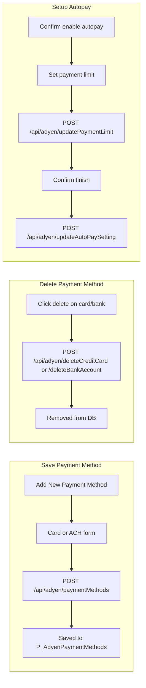

??? note "ASCII Art (detailed)"

    ```
    Payer (PWA)                              Backend
    │                                       │
    │  === SAVE PAYMENT METHOD ===          │
    │  Settings > Payment Info > Add Card   │
    │  → AdyenAddPaymentComponent           │
    │  → AdyenComponentComponent (Card/ACH) │
    │  → POST /api/adyen/paymentMethods     │
    │  ─────────────────────────────────────>│ SavePaymentMethod()
    │  <─────────────────────────────────────│ → P_AdyenPaymentMethods
    │                                       │
    │  === DELETE PAYMENT METHOD ===        │
    │  → POST /api/adyen/deleteCreditCard   │
    │    or /deleteBankAccount              │
    │  ─────────────────────────────────────>│ RemoveCreditCard/BankAccount()
    │  <─────────────────────────────────────│
    │                                       │
    │  === SETUP AUTOPAY (5-step wizard) ===│
    │  Step 1: Confirm enable autopay       │
    │  Step 2: Set payment limit            │
    │  → POST /api/adyen/updatePaymentLimit │
    │  ─────────────────────────────────────>│ UpdatePaymentLimit()
    │  Step 3: Confirm finish               │
    │  → POST /api/adyen/updateAutoPaySetting│
    │  ─────────────────────────────────────>│ UpdateAutopaySetting()
    │                                       │
    │  Step 4: Edit limit (optional)        │
    │  Step 5: Disable autopay              │
    │  → POST /api/adyen/deleteAutoPaySettings│
    │  ─────────────────────────────────────>│ DeleteAutopaySetting()
    ```

---

## 5. Implementation by Repository

### 5.1 MinuteMenu.Database

**Migration file:** `MMADMIN_PARACHUTE/RELEASES/MRP.sql`

**New Tables:**

| Table | Purpose |
|-------|---------|
| `P_AdyenConnectedAccounts` | Merchant account (SiteId, LegalEntityId, AccountHolderId, BalanceAccountId, BusinessLineId, Status, LiveMode, IsActive) |
| `P_AdyenOnboardingData` | Onboarding form data (all KYC fields, Status, RejectionReason, AdyenResponseData) |
| `P_AdyenOnboardingProcessTracking` | Interim tracking during multi-step onboarding API calls |
| `P_AdyenPaymentMethods` | Stored payment methods (EpayCustomerId, AdyenRecurringDetailReference, PaymentMethodType, Last4, Brand, Expiry, IsDefault) |
| `P_AdyenPaymentReference` | Payment-to-PSP reference mapping (PaymentReference, CheckNumber, Amount, TotalFees, SitePaysMMFee, SitePaysOtherFee) |
| `P_AdyenRefundHistory` | Refund audit trail (RefundAmount, CommissionAmount, BalanceAmount, RefundPspReference) |
| `P_AdyenEventLog` | Webhook event log (EventId, EventType, EventData) |

**Modified Tables:**

| Table | Change |
|-------|--------|
| `P_ConnectedAccount` | Added `PaymentProviderType INT NULL` |
| `P_EpayCustomer` | Added `PaymentProviderType INT NULL` |
| `P_InvoicePayment` | Added `PaymentProviderType INT NULL`, `AdyenPaymentId NVARCHAR(255) NULL` |
| `P_ConnectedAccountPayout` | Added `PaymentProviderType INT NULL` |

**Indexes:** 13 indexes across all new tables on key lookup columns
**Foreign Keys:** `P_AdyenConnectedAccounts → P_ConnectedAccount`, `P_AdyenPaymentMethods → P_EpayCustomer`

### 5.2 KK (KidKare) — Data Layer

**Files changed:**
- `KidKare.Data/Models/Parachute/AdyenValpay/AdyenModel.cs` — 7 entity classes + 3 enums
- `KidKare.Data/ParachuteContext.cs` — 7 DbSet properties added
- `KidKare.Data/Models/Parachute/Stripe/ConnectedAccount.cs` — Added `PaymentProviderType?` + navigation property

**Enums:**
- `PaymentProviderType` (Stripe=1, Adyen=2)
- `AdyenOnboardingStatus` (Pending=0, Approved=1, Rejected=2, PayoutBlocked=3)
- `AdyenOnboardingLegalEntityType` (Individual=0, Organization=1, SoleProprietorship=2)

### 5.3 Parachute — Backend API & BLL

**New Controllers:**

| Controller | Route | Endpoints |
|-----------|-------|-----------|
| `AdyenController` | `/api/adyen/` | customerSettings, paymentMethods, createPayment, deleteCreditCard, deleteBankAccount, updateAutoPaySetting, deleteAutoPaySettings, updatePaymentLimit, epayAccounts, epayAutopayAccounts, settings |
| `AdyenOnboardingController` | `/api/adyen/onboard/` | submit, status |
| `AdyenWebhookController` | `/api/adyen/` | webhook, webhook-platform, webhook-platform-transfer |

**New BLL Classes:**

| Class | Lines | Responsibility |
|-------|-------|---------------|
| `AdyenPaymentBll` | 2,640 | Payments, refunds, payment methods, autopay, fee calculations |
| `AdyenOnboardingBll` | 690 | Onboarding flow orchestration via Adyen LEM & Balance Platform APIs |
| `AdyenPlatformBll` | 117 | Account lookup and management |
| `AdyenWebhookProcessor` | — | Event routing to handlers (dictionary-based) |
| `AdyenWebhookBll` | — | Event logging |
| `AdyenUtil` | 232 | HMAC validation, client factories, phone formatting |

**Webhook Handlers (8):**
- `AdyenWebhookAuthorisationHandler` — Confirm payments + calculate fees
- `AdyenWebhookCaptureHandler` — Payment captured
- `AdyenWebhookCaptureFailedHandler` — Capture failure
- `AdyenWebhookChargeCancelHandler` — Charge cancellation
- `AdyenWebhookChargebackHandler` — Decline payment on chargeback
- `AdyenWebhookNotificationFraudHandler` — Fraud notification
- `AdyenWebhookAccountHolderUpdatedHandler` — Onboarding status update (Approved/Rejected)
- `AdyenWebhookPayoutCreatedHandler` — Link payments/refunds to payouts

**Modified Files:**
- `ProviderAccountingController.cs` — Refund routing changed from `RefundStripe()` to `RefundWithPaymentPlatform()` (routes Stripe or Adyen); added `POST /invoice/parentaddpayment-adyen` endpoint; added Adyen payment branching in `ProcessParentInitialPayment()`; changed `GetInvoices()`, `ExportExcel()`, `ExportCsv()` from GET to POST
- `InvoiceBll.cs` — Added `RefundAdyen()`, `RefundWithPaymentPlatform()`
- `AutoPayFlow.cs` — Routes to `AdyenPaymentBll.ProcessPayment()` when `PaymentProviderType == Adyen`
- `BusinessLogicModule.cs` — Autofac DI registration for all Adyen classes
- `Web.config` — All Adyen configuration keys, fees, HMAC keys

> **Dead code:** `POST /api/adyen/refund` in `AdyenController.cs` and `AdyenService.processRefund()` in PWA are not called from anywhere. Actual refund flows through `ProviderAccountingController`.

**Dependencies:** Adyen NuGet v32.2.1

### 5.4 Parachute-PWA — Frontend (Payer)

**Services:**
- `AdyenService` (274 lines) — Full API layer (17 methods + fee calculations)
- `AdyenPlatformService` (200 lines) — Adyen Web SDK wrapper

**Components:**
- `AdyenComponentComponent` (483 lines) — Advanced Flow implementation (individual Card/ACH)
- `AdyenPayWithNewCreditCardComponent` (241 lines) — Modal wrapper for new card payment
- `AdyenAddPaymentComponent` (69 lines) — Save new payment method

**Models:** `adyen.models.ts` — `PaymentProviderType`, `AdyenPaymentMethod`, `AdyenCustomerSettings`, `AdyenPaymentRequest/Response`, `AdyenChargeRequest`, `AdyenConfiguration`

**Page Integrations:**
- `ParentPaynowComponent` — Multi-invoice payment with Adyen routing
- `ParentViewInvoiceComponent` — Single-invoice payment
- `ParentInitialedPaymentComponent` — Initiated payment
- `ParentSettingComponent` — Payment method management + autopay wizard (5 steps)

**Routing:** `PermissionService.isAdyenAccount(siteId)` determines Adyen vs Stripe per provider

---

## 6. Ticket Traceability Matrix

| TP ID | Name | State | Feature Area | Implementation |
|-------|------|-------|-------------|----------------|
| [314216](https://minutemenu.tpondemand.com/entity/314216) | Begin processing payments on Adyen/ValPay | In Development | Core requirements | All repos |
| [314275](https://minutemenu.tpondemand.com/entity/314275) | Adyen Onboarding | Test | Onboarding | AdyenOnboardingBll, AdyenOnboardingController, Provider UI |
| [314548](https://minutemenu.tpondemand.com/entity/314548) | Adyen Process Payment | Test | Payment processing | AdyenPaymentBll.ProcessPayment, PWA payment components |
| [315093](https://minutemenu.tpondemand.com/entity/315093) | Adyen Autopay | Test | Autopay setup | AdyenPaymentBll autopay methods, PWA settings wizard |
| [315212](https://minutemenu.tpondemand.com/entity/315212) | Adyen Refund | Test | Refunds | AdyenPaymentBll.ProcessRefund, InvoiceBll.RefundAdyen |
| [315305](https://minutemenu.tpondemand.com/entity/315305) | Valpay/Adyen Webhook for Onboarding | Open | Webhook | AdyenWebhookAccountHolderUpdatedHandler |
| [317939](https://minutemenu.tpondemand.com/entity/317939) | AdyenOnboarding | Open | Onboarding API | KK data models |
| [318134](https://minutemenu.tpondemand.com/entity/318134) | Adyen Payer setting | Open | Payer settings | PWA payer settings page |
| [318240](https://minutemenu.tpondemand.com/entity/318240) | Onboarding Verified Page issue | UAT | Bug fix | Onboarding status display |
| [318204](https://minutemenu.tpondemand.com/entity/318204) | Error message 'webAddress' | UAT | Bug fix | Onboarding validation |
| [318258](https://minutemenu.tpondemand.com/entity/318258) | Settings page flashing | UAT | Bug fix | PWA settings |
| [318345](https://minutemenu.tpondemand.com/entity/318345) | Adyen handle refund logic | Done | Refund logic | AdyenPaymentBll refund splits |
| [318347](https://minutemenu.tpondemand.com/entity/318347) | Process autopay for adyen account | Open | Autopay processing | AutoPayFlow integration |
| [318348](https://minutemenu.tpondemand.com/entity/318348) | Adyen payer settings | Test | Payer settings | PWA settings page |
| [318349](https://minutemenu.tpondemand.com/entity/318349) | Adyen notification | Dev | Notifications | TBD |
| [318350](https://minutemenu.tpondemand.com/entity/318350) | Adyen notification for payer | Open | Notifications | TBD |
| [318351](https://minutemenu.tpondemand.com/entity/318351) | Adyen notification for provider/site | In Progress | Notifications | TBD |
| [315142](https://minutemenu.tpondemand.com/entity/315142) | Payment methods duplicated | UAT | Bug fix | Payment method dedup |
| [318458](https://minutemenu.tpondemand.com/entity/318458) | Show meaningful error messages | UAT | UX | Error message mapping |
| [315608](https://minutemenu.tpondemand.com/entity/315608) | Invoice status inconsistent | UAT | Bug fix | Invoice display |

---

### 6.5 Gaps & Dead Code

### Dead Code

| Item | Location | Detail |
|------|----------|--------|
| `POST /api/adyen/refund` | `AdyenController.cs` | Endpoint exists but never called. Actual refund flows through `ProviderAccountingController` → `RefundWithPaymentPlatform()` |
| `adyenService.processRefund()` | PWA `adyen.service.ts` | Defined but no component calls it |
| `adyenService.setDefaultPaymentMethod()` | PWA `adyen.service.ts` | Defined but no component calls it. Backend endpoint also missing in `AdyenController.cs`. **Note:** Stripe's equivalent in PWA (`stripeService`) is also never called — both providers set `defaultPaymentMethod` locally on client, not via API |

### Real Gaps (Adyen missing vs Stripe)

| # | Gap | Severity | Detail |
|---|-----|----------|--------|
| GAP-1 | **ACH Failure Penalty Fee** | Medium | Config `AdyenACHChargeFailurePenaltyFeeCents=400` exists but is never used. `CaptureFailedHandler` only marks payment as failed, no penalty fee transfer. Stripe has full `ChargePenaltyFee()` implementation |
| GAP-2 | **Autopay Disable on Payment Failure** | Medium | Stripe disables autopay on `charge.failed`. Adyen's `CaptureFailedHandler` and `AuthorisationHandler` (failure path) do not disable autopay. `AutoPayFlow.cs` only catches `StripeException`, not Adyen exceptions |
| GAP-3 | **1099 Fee Reconciliation Report** | Low (Phase 2) | `GET /reports/1099K` is Stripe-specific (uses Stripe API keys, Stripe payout data). Adyen equivalent deferred to Phase 2 |

### By Design (Not gaps)

| Item | Reason |
|------|--------|
| Fraud Detection System | Adyen handles fraud internally. Code explicitly skips `CheckFraud()` for Adyen (`ProviderAccountingController`). Comment: `"No fraud queue - Adyen handles fraud internally"` |
| Payout Settlement Reports | Stripe uses API polling (pull), Adyen uses webhooks (push) via `PayoutCreatedHandler`. Both sufficient |
| ePay Settlements Report | `POST /reports/epaySettlements` — Adyen dùng chung role `StripeUser`. Data compatible (cùng `InvoicePayments` + `ConnectedAccountPayout`). Hoạt động bình thường cho cả Adyen |
| Invoice Fraud Review Emails | Part of Stripe's manual fraud system. Not needed for Adyen |

---

## 7. Test Case Plan

### 7.1 Onboarding (TP #314275)

| # | Test Case | Precondition | Steps | Expected Result | Priority |
|---|-----------|-------------|-------|-----------------|----------|
| ON-01 | Submit onboarding — Organization | New provider, no Adyen account | 1. Navigate to Settings > Subscription & ParaPay 2. Click "Begin Onboarding Verification" 3. Select "Organization" 4. Fill all required fields 5. Submit | Data saved to DB, Adyen Legal Entity + Business Line + Account Holder + Balance Account created, Hosted Onboarding URL returned, Status = Pending | High |
| ON-02 | Submit onboarding — Individual | New provider | Same as ON-01 but select "Individual" | Same as ON-01 with Individual legal entity type | High |
| ON-03 | Submit onboarding — Sole Proprietorship | New provider | Same as ON-01 but select "Sole Proprietorship" | Creates both Individual + SoleProprietorship entities (Adyen requirement) | High |
| ON-04 | Onboarding status — Pending | Submitted onboarding, awaiting Adyen verification | GET /api/adyen/onboard/status | Status=Pending, IsComplete=false, OnboardingUrl present | High |
| ON-05 | Onboarding status — Approved | Adyen sends accountHolder.updated webhook with Valid status | Webhook received and processed | Status=Approved, AdyenConnectedAccount.IsActive=true | High |
| ON-06 | Onboarding status — Rejected | Adyen sends webhook with Rejected status | Webhook received | Status=Rejected, RejectionReason populated | High |
| ON-07 | Duplicate onboarding prevention | Provider already onboarded and approved | Submit onboarding again | Returns null / prevents duplicate | Medium |
| ON-08 | Validation — missing required fields | Leave required fields blank | Submit form | Validation errors shown for each missing field | Medium |
| ON-09 | UI text verification | Navigate to ParaPay settings | Check displayed text | Shows "Complete your account setup for Parachute ParaPay with Adyen" | Low |

### 7.2 Payment Processing (TP #314548)

| # | Test Case | Precondition | Steps | Expected Result | Priority |
|---|-----------|-------------|-------|-----------------|----------|
| PAY-01 | Pay invoice with new credit card | Adyen provider with approved onboarding, invoice exists | 1. Open invoice 2. Click "Pay with New Card" 3. Enter card details 4. Submit | Payment created, InvoicePayment record (Succeeded), AUTHORISATION webhook confirms, fee expense created | Critical |
| PAY-02 | Pay invoice with saved credit card | Saved CC exists for payer | 1. Select saved card from dropdown 2. Confirm payment | Payment created using stored method token | Critical |
| PAY-03 | Pay invoice with new ACH | Adyen provider | Enter bank account details, submit | ACH payment processed, GIACT instant verification | Critical |
| PAY-04 | Pay invoice with saved ACH | Saved bank account exists | Select saved ACH, confirm | Payment via stored ACH method | Critical |
| PAY-05 | Pay with card — declined | Use test card for decline | Submit payment | Error: "Payment Failed: please try again or if issues persist reach out to support@kidkare.com" | High |
| PAY-06 | Pay with card — fraud blocked | Use test data that triggers fraud | Submit payment | Error message displayed, payment NOT in fraud queue | High |
| PAY-07 | Multiple partial payments | Invoice with $100 balance | Pay $40, then pay $60 | Two InvoicePayment records, invoice fully paid | High |
| PAY-08 | Fee calculation — CC | $100 CC payment, provider pays fees | Pay | Fee = $100 × 2.95% + $0.30 = $3.25. Commission split = MM fee ($0.70) + provider fee ($3.25) | High |
| PAY-09 | Fee calculation — ACH | $100 ACH payment | Pay | Fee = $1.00 flat. Commission = MM ACH fee ($0.85) + partner ACH fee ($0.15) | High |
| PAY-10 | Save card during payment | New CC payment, check "save for future" | Complete payment | Payment succeeds AND card saved to P_AdyenPaymentMethods | Medium |
| PAY-11 | Minimum amount validation | Invoice < $5 | Attempt to pay | Validation error, minimum $5 required | Medium |
| PAY-12 | Stripe provider — no Adyen routing | Stripe provider account | Open invoice | Stripe payment UI shown, NOT Adyen | High |
| PAY-13 | AUTHORISATION webhook — success | Payment submitted | Webhook received with Success=true | ConfirmPayments() called, fee expense created | High |
| PAY-14 | AUTHORISATION webhook — failure | Payment submitted | Webhook with Success=false | Exception logged with reason | High |
| PAY-15 | Card brands — Visa/MC/Discover/Amex | Each card brand | Pay with each | All 4 accepted | Medium |

### 7.3 Refunds (TP #315212, #318345)

| # | Test Case | Precondition | Steps | Expected Result | Priority |
|---|-----------|-------------|-------|-----------------|----------|
| REF-01 | Full refund — CC | $100 CC payment exists | Refund $100 | Adyen Refund API called, InvoiceRefund created, AdyenRefundHistory with BalanceAmount + CommissionAmount, parentFee refunded | Critical |
| REF-02 | Full refund — ACH | $100 ACH payment exists | Refund $100 | Same as REF-01 for ACH | Critical |
| REF-03 | Partial refund — within Default balance | $100 payment, refund $30 | Refund $30 | Refund from Default split only, no Commission refund | High |
| REF-04 | Partial refund — Default exhausted | $100 payment, $85 already refunded, refund $10 | Refund $10 | Remaining Default refunded + overflow from Commission (providerFee portion only) | High |
| REF-05 | Multiple partial refunds | $100 payment | Refund $20, then $30, then $50 | Three AdyenRefundHistory records, cumulative validation passes | High |
| REF-06 | Refund exceeds payment | $100 payment | Attempt refund $150 | Validation error, refund rejected | High |
| REF-07 | Refund exceeds remaining balance | $100 payment, $80 already refunded | Attempt refund $30 | Validation error (cumulative > original) | High |
| REF-08 | Refund — Cash/Check/Account Credit | Payment exists | Refund as Cash | No Adyen API call, RegisterRefund() only | Medium |
| REF-09 | Refund payout webhook | Refund processed | payout.created webhook received | UpdateRefundPayout() links payout to InvoiceRefund | Medium |
| REF-10 | Refund — payment not found | Invalid paymentId | Attempt refund | Exception: payment not found | Medium |
| REF-11 | Refund — empty CheckNumber | Payment without PSP reference | Attempt refund | Validation error | Medium |

### 7.4 Autopay (TP #315093, #318347)

| # | Test Case | Precondition | Steps | Expected Result | Priority |
|---|-----------|-------------|-------|-----------------|----------|
| AP-01 | Enable autopay | Adyen payer with saved CC | Settings > Enable Autopay > Set limit > Confirm | AutoPayMethod set, payment limit saved | High |
| AP-02 | Set payment limit | Autopay enabled | Change limit to $500 | PaymentLimit updated in DB | High |
| AP-03 | Disable autopay | Autopay enabled | Settings > Disable Autopay > Confirm | AutoPayMethod = None, autopay disabled | High |
| AP-04 | Process autopay — HX | Invoices due, autopay enabled, Adyen account | POST /stripe/processAutoPay | AutoPayFlow queries, routes to AdyenPaymentBll.ProcessPayment(IsAutopay=true), charges stored method | Critical |
| AP-05 | Process autopay — CX | Center account with autopay | POST /cx/stripe/processAutoPay | Same flow via CxAutoPayFlow | Critical |
| AP-06 | Autopay — expired card | Stored CC is expired | Process autopay | Payment fails, autopay disabled for user | High |
| AP-07 | Autopay — payment limit exceeded | Invoice $200, limit $100 | Process autopay | Payment skipped or capped at limit | High |
| AP-08 | Autopay — minimum $5 | Invoice $3 | Process autopay | Payment skipped (below minimum) | Medium |
| AP-09 | Autopay — no due invoices | All invoices paid | Process autopay | No charges created | Medium |
| AP-10 | Autopay — duplicate job prevention | Job already running | Trigger processAutoPay again | Second job rejected/skipped | Medium |

### 7.5 Payer Settings (TP #318348)

| # | Test Case | Precondition | Steps | Expected Result | Priority |
|---|-----------|-------------|-------|-----------------|----------|
| PS-01 | Save new credit card | Adyen payer | Settings > Add Credit Card > Enter details | Card saved to P_AdyenPaymentMethods with last4, brand, expiry | High |
| PS-02 | Save new bank account (ACH) | Adyen payer | Settings > Add Bank Account > Enter details | Bank saved, GIACT instant verification | High |
| PS-03 | Delete credit card | Saved CC exists | Click delete on card | Card removed from Adyen + DB | High |
| PS-04 | Delete bank account | Saved bank exists | Click delete | Account removed | High |
| PS-05 | Set default payment method | Multiple methods saved | Set one as default | IsDefault=true for selected, false for others | Medium |
| PS-06 | View payment methods | Multiple methods saved | Navigate to Settings | All methods displayed with last4, brand, type | Medium |

### 7.6 Webhooks

| # | Test Case | Precondition | Steps | Expected Result | Priority |
|---|-----------|-------------|-------|-----------------|----------|
| WH-01 | HMAC validation — valid signature | Valid HMAC key configured | Send webhook with valid signature | Event processed | Critical |
| WH-02 | HMAC validation — invalid signature | — | Send webhook with wrong signature | Event rejected, logged | Critical |
| WH-03 | AUTHORISATION — success | Payment in Pending state | Send AUTHORISATION webhook | Payment confirmed, fee expense created | Critical |
| WH-04 | CAPTURE_FAILED | Payment in Pending state | Send CAPTURE_FAILED webhook | Payment failure logged | High |
| WH-05 | CHARGEBACK | Payment confirmed | Send CHARGEBACK webhook | InvoiceBll.DeclineInvoicePayment() called | High |
| WH-06 | NOTIFICATION_OF_FRAUD | Payment exists | Send fraud notification | Event logged | Medium |
| WH-07 | accountHolder.updated — Approved | Onboarding pending | Send webhook with Valid capability | Status → Approved, account activated | High |
| WH-08 | accountHolder.updated — Rejected | Onboarding pending | Send webhook with Rejected capability | Status → Rejected, RejectionReason stored | High |
| WH-09 | payout.created | Payment confirmed | Send payout webhook | ConnectedAccountPayout created, linked to payments | High |
| WH-10 | Event logging | Any webhook | Send any webhook | Event saved to P_AdyenEventLog | Medium |
| WH-11 | Unknown event type | — | Send unregistered event type | Silent pass, event logged | Low |

### 7.7 Integration & Regression

| # | Test Case | Priority |
|---|-----------|----------|
| INT-01 | Stripe provider payment still works after Adyen integration | Critical |
| INT-02 | Stripe autopay still processes correctly (not routed to Adyen) | Critical |
| INT-03 | Stripe refund still works | Critical |
| INT-04 | Mixed providers — Parent has children at both Stripe and Adyen providers | High |
| INT-05 | Payment methods are provider-specific (Adyen methods not shown for Stripe provider) | High |
| INT-06 | End-to-end: Onboard → Save Card → Pay Invoice → Confirm via webhook → Refund | Critical |
| INT-07 | End-to-end: Onboard → Save ACH → Enable Autopay → Process Autopay → Payout | Critical |

---

*Generated from PR scan of branches `feature/314217_adyen_payment_integration_resolve_conflict` across Parachute, KK, and PWA repositories, cross-referenced with TP release #314217 tickets.*
