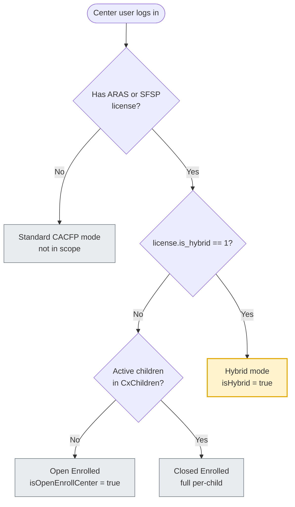
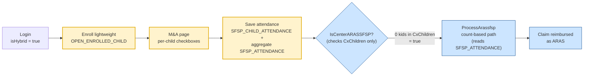

# Plan B: ARAS/SFSP Hybrid via `is_hybrid` flag (alternative to new program types)

**Ticket:** [#323000](https://minutemenu.tpondemand.com/entity/323000) — Hybrid ARAS/SFSP Enrollment + Attendance
**Companion to:** original [`323000 brain storming.md`](https://github.com/MinuteMenu/docs/blob/userstory/323000-hybrid-aras/docs/plans/323000%20hybrid%20enrollment%20and%20attendance/323000%20brain%20storming.md) (Approach A — 2 new program types)
**Status:** **Recommended approach** (revised — was previously "alternative")

> **Why alternative:** Approach A ran into trouble writing the multilicense logic for the 2 new program types. Approach B keeps the existing `AtRisk` / `SummerFoodProgram` enums and adds a boolean `is_hybrid` column on `CENTER_LICENSE`, so it automatically falls through to the existing ARAS rails.

> **Legend:** 🟦 existing (unchanged) · 🆕 new behavior · 🔄 changed · ⚠️ open question · 🔴 risk

---

## 1. TL;DR

Instead of adding 2 new program types (`AtRiskHybrid`, `SummerFoodProgramHybrid`), add **a single boolean column `is_hybrid`** on `CENTER_LICENSE`. A hybrid center = a license with `program_type_code IN (AtRisk, SFSP)` **AND** `is_hybrid = 1`. Hybrid children and attendance still live in dedicated tables (`OPEN_ENROLLED_CHILD`, `SFSP_CHILD_ATTENDANCE`), same as Approach A.

**One-line trade-off:** Approach B avoids touching existing predicates (`IsCenterARASSFSP`, `isLicenseAtRiskOrEmergencyShelter`, login flags) and reuses the existing `at_risk_flag` pattern. The cost: we need clear documentation of `is_hybrid` semantics (visibility for future devs) and a DB constraint to prevent invalid combinations.

---

## 2. A vs B comparison (metric level)

| Criterion                             | Approach A (2 enums)                                                                             | Approach B (flag)                                                                                   |
| ------------------------------------- | ------------------------------------------------------------------------------------------------ | --------------------------------------------------------------------------------------------------- |
| Schema change                         | 2 rows in `CODE_DETAIL`                                                                        | + 1 column `is_hybrid` on `CENTER_LICENSE` (**KK and CX share the table, single change**) |
| Predicates to update                  | `isLicenseAtRiskOrEmergencyShelter`, `IsCenterARASSFSP`, `IsOpenEnrollCenter`, 8 callsites | Mostly**none** — hybrid falls through                                                        |
| Enums to maintain                     | 4 (KK + CX + ClaimsProcessor.Converted, hand-synced)                                             | 0 new enums                                                                                         |
| Multilicense logic                    | Complex (4 enum combinations)                                                                    | Simple (existing logic stays)                                                                       |
| Bug visibility when wrong             | Loud (failed switch case, compile error)                                                         | Quiet (needs explicit docs)                                                                         |
| **Total backend files touched** | **~10-15**                                                                                 | **~3-5**                                                                                      |

---

## 3. Schema delta vs Approach A

> KK and CX **share** the `CENTER_LICENSE` table — only a single ALTER is needed, no replication across two schemas.

### Approach A

```sql
-- KK + CX, just 2 data rows
INSERT INTO CODE_DETAIL (code_id, code_name, code_value)
VALUES (?, 'PROGRAM_TYPE', 'AtRiskHybrid'),
       (?, 'PROGRAM_TYPE', 'SummerFoodProgramHybrid');

-- Mirror enum:
-- KK: ProgramTypeCode.cs — add AtRiskHybrid, SummerFoodProgramHybrid
-- CX: Constants.ProgramTypeCode — add same
-- ClaimsProcessor.Converted — mirror
```

### Approach B

```sql
-- KK and CX share the CENTER_LICENSE table → single ALTER
ALTER TABLE CENTER_LICENSE
  ADD is_hybrid BIT NOT NULL DEFAULT 0;

-- Optional: index if many predicates read this flag
CREATE INDEX IX_CenterLicense_Hybrid
  ON CENTER_LICENSE (center_id, license_id, is_hybrid)
  WHERE is_hybrid = 1;

-- No enum changes needed.
```

**Notes:**

- B does not touch the enum in any of the 3 codebases (KK, CX, ClaimsProcessor) — no sync risk.
- KK and CX share the `CENTER_LICENSE` schema → only one schema change, no need to keep two DBs in lockstep.
- `is_hybrid` needs backfill for existing rows → `DEFAULT 0` is safe (existing centers are not hybrid).

---

## 4. Mode detection logic

> **Scope of this phase:** we only distinguish "hybrid or not". Separating per-child (ATMC ARAS) vs group-count (SFSP) attendance/claim modes will be handled in a later phase. So for now we expose **a single `IsHybrid` flag**, not separate `IsARASHybrid` / `IsSFSPHybrid`.



**Login flag computation (Approach B):**

```csharp
// LoginService.cs — addition, doesn't replace existing flags
var licenses = _siteBll.GetLicenses(centerId);

result.IsHybrid = licenses.Any(l =>
    l.is_hybrid && (l.program_type_code == ProgramTypeCode.AtRisk
                 || l.program_type_code == ProgramTypeCode.SummerFoodProgram));

// IsOpenEnrollCenter, IsOpenEnrollCenterNonLA — logic NOT changed
//   → still uses the existing IsCenterARASSFSP (only checks CxChildren count)
//   → a hybrid center has hybrid kids in OPEN_ENROLLED_CHILD,
//     none in CxChildren → IsOpenEnrollCenter = true
```

**Important:** under Approach B, a hybrid center will have **both** `IsOpenEnrollCenter = true` **and** `IsHybrid = true`. The FE must check `IsHybrid` first (since it is a superset behavior).

---

## 5. Behavior walkthroughs

### 5.1 ARAS Hybrid claim flow (Approach B)



**Why "fall-through" works:**

- Hybrid kids live in `OPEN_ENROLLED_CHILD` (new table), **not** `CxChildren`
- `IsCenterARASSFSP` queries `CxChildren.Where(... child_status_code == 238)` → 0 rows
- Predicate returns `true` → claim engine routes to the count-based path `ProcessArassfsp`
- `ProcessArassfsp` reads `SFSP_ATTENDANCE` (aggregate) — which was recomputed from `SFSP_CHILD_ATTENDANCE` in the same save transaction → numbers are correct

→ **0 code changes in the claim engine.** This is why Approach B is attractive.

---

## 6. Predicates that do NOT need updating (Approach B advantage)

| Predicate                                                  | File:Line                               | Behavior under B                                                                                 | Explanation                                  |
| ---------------------------------------------------------- | --------------------------------------- | ------------------------------------------------------------------------------------------------ | -------------------------------------------- |
| `isLicenseAtRiskOrEmergencyShelter`                      | `csProcessClaimBusiness.cs:4576` (CX) | `program_type_code == AtRisk` → true for ARAS Hybrid                                          | Hybrid keeps `program_type_code = AtRisk`  |
| `AtRiskCenterHelper.IsCenterLicenseAtRisk`               | `AtRiskCenterHelper.cs:52` (CX)       | Same                                                                                             | Same                                         |
| `IsCenterARASSFSP` (KK BLL)                              | `CentersBll.cs:918`                   | Returns `true` for hybrid center (0 kids in CxChildren)                                        | Routes claim → count-based, correct         |
| `IsCenterARASSFSPWithSingleLicense`                      | `CentersBll.cs:958`                   | Same logic                                                                                       |                                              |
| `LoginService.IsOpenEnrollCenter`                        | `LoginService.cs:527`                 | Derived from `IsCenterARASSFSP` → correct                                                     |                                              |
| `IsAras`                                                 | `AttendanceBll.cs:1121`               | Same                                                                                             |                                              |
| 9 enrollment-bypass rules (41, 43–45, 48–49, 58–59, 67) | `csProcessClaimBusiness.cs` (CX)      | Per-child path bypass for ARAS — hybrid doesn't go through per-child path, so it doesn't matter |                                              |
| State export `program_type_code` switch                  | 10+ state generators (CX)               | Hybrid → matches the `AtRisk` case                                                            | **B-4 risk: silent wrong format** ⚠️ |

→ Roughly **15-20 predicates** are "exempt from audit" compared to Approach A.

---

## 7. Predicates that STILL need updating (same as A)

| Predicate / area                             | Reason                                                                                            |
| -------------------------------------------- | ------------------------------------------------------------------------------------------------- |
| Login response `UserDetailsResponse`       | + 1 flag `IsHybrid`                                                                             |
| FE `permission-service.js`                 | + helper `isHybrid()`                                                                           |
| FE ATMC component `*ngIf`                  | Gate for hybrid centers (same work as A)                                                          |
| `ChildBll.AddChild` flow                   | Must know "this is hybrid → save into new table"; same work as A                                 |
| Sign-in sheet SP                             | Must add `is_hybrid` filter inside the SP (Approach A would use `program_type_code IN (...)`) |
| ATMC walk-in endpoint                        | Same work as A                                                                                    |
| Lightweight enrollment endpoint              | Same work as A                                                                                    |
| `IsCenterSFSPClosedEnrolled` ➜ Paid block | **Still does not fire** for hybrid (same as A) — needs a hybrid-aware Paid block           |

---

## 8. Risk register (revised)

### 8.1 Risk SHARED by both approaches

| Risk                                                               | Severity  | Mitigation                                      |
| ------------------------------------------------------------------ | --------- | ----------------------------------------------- |
| **Paid block for SFSP Hybrid is not enforced automatically** | 🟡 Medium | Add a new explicit check (same work under both) |

### 8.2 Risk specific to Approach B (after dropping out-of-scope items)

| Risk                                               | Severity  | Reason                                                                                                                                                                        | Mitigation                                                                                        |
| -------------------------------------------------- | --------- | ----------------------------------------------------------------------------------------------------------------------------------------------------------------------------- | ------------------------------------------------------------------------------------------------- |
| Adding a new column ripples across many code paths | 🟡 Medium | A new `is_hybrid` column on `CENTER_LICENSE` touches multiple layers (entity mappings, DTOs, SP signatures, FE models, data access). Each consumer needs to be re-checked | Inventory all read/write paths of `CENTER_LICENSE` before implementation; re-audit after change |
| Visibility for future developers                   | 🟢 Low    | The `is_hybrid` column is easy to miss when reading code                                                                                                                    | Documentation + ADR + code comments                                                               |
| Combinatorial interaction with `at_risk_flag`    | 🟢 Low    | 3 booleans on a license (`program_type_code` × `at_risk_flag` × `is_hybrid`)                                                                                          | DB constraint or app-level:`is_hybrid = 1 → program_type IN (AtRisk, SFSP)`                    |
| Residual callsite audit for `IsCenterARASSFSP`   | 🟡 Medium | A few spots still need a product decision (max-2 ARAS quota, SFSP second-meal lookup)                                                                                         | Audit each callsite before go-live                                                                |

### 8.3 Risk specific to Approach A (for comparison)

| Risk                                                 | Severity  | Reason                                                                                                                       |
| ---------------------------------------------------- | --------- | ---------------------------------------------------------------------------------------------------------------------------- |
| Missing a callsite when updating predicates          | 🔴 High   | 8 `IsCenterARASSFSP` callsites + `isLicenseAtRiskOrEmergencyShelter` + `AtRiskCenterHelper`. Miss one = silent failure |
| Enum sync across 3 repos (KK + CX + ClaimsProcessor) | 🟡 Medium | Same-day PR required                                                                                                         |
| Multilicense helper expansion                        | 🟡 Medium | `IsCenterARAS*WithSingleLicense` must be extended to 4 enum cases — this is the pain the user is hitting                  |

---

## 9. UI surface changes (same as Approach A)

All UI changes from Approach A apply as-is under B:

- Inline Add Walk-in on the M&A page
- Lightweight enrollment form (1 first name)
- Date-grid sign-in sheet

The only difference: how the FE detects the mode (uses the `IsHybrid` flag, derived from license + `is_hybrid`).

---

## 10. Multilicense scenarios (the problem the user is hitting)

The user is struggling with Approach A because `IsCenterARASSFSPWithSingleLicense` must be extended to handle 4 enum values × multilicense combinations.

Under Approach B, **no extension is needed** — the existing function stays. The predicate is correct because:

| Scenario                                                                | Behavior under B                                                                                                                                              |
| ----------------------------------------------------------------------- | ------------------------------------------------------------------------------------------------------------------------------------------------------------- |
| 1 license `AtRisk + is_hybrid=1`                                      | Single license, hybrid only ✅                                                                                                                                |
| 1 license `AtRisk + is_hybrid=1` + 1 license `ChildCare`            | Multi license.`IsCenterARASSFSPWithSingleLicense` checks whether non-ARASSFSP licenses (ChildCare) have kids. If yes → false (= mixed mode); if no → true |
| 1 license `AtRisk + is_hybrid=1` + 1 license `AtRisk + is_hybrid=0` | **Important edge case.** Both are ARAS → `IsCenterARASSFSP` returns ARAS with mixed enrollment status. ⚠️ Needs careful audit                      |
| 1 license `AtRisk + is_hybrid=1` + 1 license `SFSP + is_hybrid=1`   | Both hybrid, different program types. Login flag:`IsHybrid = true` for both                                                                                 |

→ This is **the original reason** Approach B was proposed. Multilicense logic is delegated entirely to the license level; the predicate layer does not need to know about hybrid.

---

## 11. Verification — code claims that were checked

- ✅ `CENTER_LICENSE.at_risk_flag` already exists (boolean, `CxCenterLicense.cs:21`) — confirms the 3-dimension concern
- ✅ `IsCenterARASSFSP` only queries `CxChildren`, does not touch the new hybrid tables (`CentersBll.cs:918`)
- ✅ Children in `OPEN_ENROLLED_CHILD` (new table) will not appear in `CxChildren` → the existing predicate returns `true` for hybrid centers
- ✅ Login `IsOpenEnrollCenter` = `IsCenterARASSFSP` invocation (`LoginService.cs:527`) → fall-through is correct
- ✅ Login `IsOpenEnrollCenterNonLA` comes from a NonLA list check, does not depend on the hybrid enum
- ✅ State export switch on `program_type_code` spans ~10 states — this is the silent-break risk (R-B2)
- ⚠️ `MenuBll.cs:1276` uses `IsCenterARASSFSPWithSingleLicense` for SFSP second-meal — hybrid would be incorrectly included

---

## 12. Open questions

- ⚠️ When toggling `is_hybrid` on an ARAS license that has active children, what should happen?
