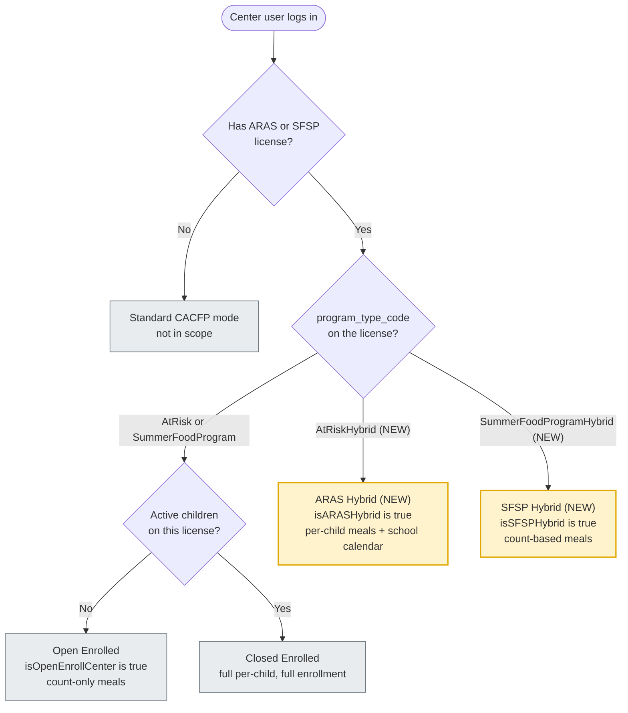
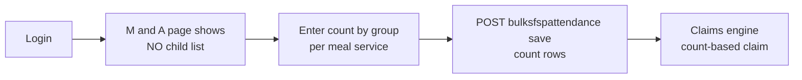
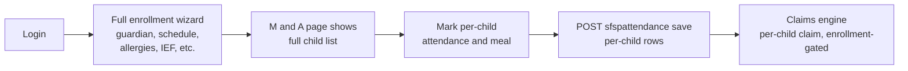
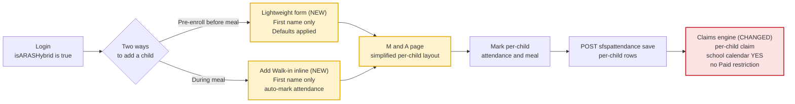
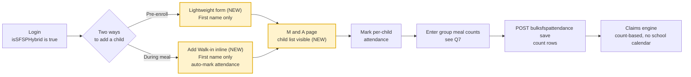

# Plan: ARAS/SFSP Hybrid Enrollment + Attendance

**Ticket:** [#323000](https://minutemenu.tpondemand.com/entity/323000) (parent Feature) — child stories 323015–323021
**Author:** Thuan Nguyen
**Date:** 2026-05-12
**Status:** Draft — pre-estimation review

> **Reading guide.** Sections 1–5 are written for both product and engineering. Sections 6–8 are for product (stories, behavior changes, questions). Sections 9 onward are the technical appendix.
>
> **Legend used across this document.**
> 🟦 today (no change) · 🆕 **new behavior** · 🔄 **change to existing behavior** · ⚠️ **Qn open question** · 🔴 **risk**

---

## 1. TL;DR

KidKare lets ARAS/SFSP centers run in two modes today: **Open Enrolled** (no child list, count-only meals) or **Closed Enrolled** (full CACFP-style enrollment, per-child meals). Most real ARAS/SFSP sites can do neither — they get walk-ins they can't pre-enroll, but regulators want some per-child accountability. This feature adds a third operating model — **Hybrid** — with two flavors (**ARAS Hybrid** and **SFSP Hybrid**), each with lightweight enrollment, walk-in quick-add at meal time, simplified attendance/meal entry, and a date-grid sign-in sheet.

---

## 2. The four operating models, side by side

```
                  TODAY 🟦                              NEW 🆕
        ┌──────────────────┬──────────────────┬──────────────────┬──────────────────┐
        │  OPEN ENROLLED   │ CLOSED ENROLLED  │   ARAS HYBRID 🆕 │   SFSP HYBRID 🆕 │
        │   (Non-LA only)  │                  │                  │                  │
        ├──────────────────┼──────────────────┼──────────────────┼──────────────────┤
Child   │       NO         │      YES         │       YES        │       YES        │
list    │  (no children)   │ (full enrollment)│   (name only)    │   (name only)    │
        ├──────────────────┼──────────────────┼──────────────────┼──────────────────┤
Enroll  │       N/A        │  guardian +      │  first name      │  first name      │
form    │                  │  schedule +      │  required only   │  required only   │
        │                  │  allergies + IEF │                  │                  │
        ├──────────────────┼──────────────────┼──────────────────┼──────────────────┤
Walk-in │       N/A        │  full form       │  inline quick-add│  inline quick-add│
        │                  │  (no quick path) │  on M&A page     │  on M&A page     │
        ├──────────────────┼──────────────────┼──────────────────┼──────────────────┤
Meal    │  count by group  │   per child      │   per child      │  count by group  │
record  │                  │                  │                  │                  │
        ├──────────────────┼──────────────────┼──────────────────┼──────────────────┤
Sign-in │   blank lines    │  child names     │  child names     │  child names     │
sheet   │                  │  (one per row)   │  + date-grid     │  + date-grid     │
        │                  │                  │  checkboxes      │  checkboxes      │
        ├──────────────────┼──────────────────┼──────────────────┼──────────────────┤
FRP     │       N/A        │   per IEF        │  default = Free  │  default = Free  │
        ├──────────────────┼──────────────────┼──────────────────┼──────────────────┤
CACFP   │       N/A        │  Paid allowed    │  no Paid claim   │  no Paid claim   │
Paid    │                  │  per IEF         │  (regulatory)    │  (regulatory)    │
        ├──────────────────┼──────────────────┼──────────────────┼──────────────────┤
School  │       no         │      no          │       YES        │       no         │
calendar│                  │                  │  (same as ARAS)  │                  │
checks  │                  │                  │                  │                  │
        └──────────────────┴──────────────────┴──────────────────┴──────────────────┘
```

> **Key asymmetry to notice.** ARAS Hybrid and SFSP Hybrid look the same up front (lightweight enrollment + walk-in) but split at meal time: ARAS Hybrid is **per-child**, SFSP Hybrid is **count-based**. The split mirrors the existing ARAS-closed vs SFSP-open distinction.

---

## 3. How the system picks a mode at login

This is the single decision that drives every downstream behavior. Today the choice is two-way; after this feature it becomes four-way.



**What's new in this flow:**
- 🆕 Two new branches off `program_type_code` — `AtRiskHybrid` and `SummerFoodProgramHybrid`. They go straight to hybrid behavior without the "active children?" detour.
- 🆕 Two new login flags: `isARASHybrid`, `isSFSPHybrid`. Existing `isOpenEnrollCenter` and `isOpenEnrollCenterNonLA` stay as-is for today's two modes.

⚠️ **Q15** — should the new lightweight-enrollment endpoint live at `POST /centers/children` (new prefix) or extend the existing `POST /child/...` prefix? The login flow doesn't decide this; the FE service shape does.

---

## 4. Behavior walkthroughs — one diagram per mode

### 4.1 Open Enrolled (today, no change)



Used today by Non-LA open-enrolled centers. Nothing in this flow changes.

### 4.2 Closed Enrolled (today, no change)



Used today by ARAS/SFSP centers that fully pre-enroll. Nothing in this flow changes.

### 4.3 ARAS Hybrid (NEW) 🆕



**Where the behavior is new or different vs Closed Enrolled:**
- 🆕 Two entry points to create a child (pre-enroll vs walk-in). Today there is only one (the full wizard).
- 🆕 Lightweight form: **first name required, everything else optional or system-defaulted** (Free FRP, Active status, today's date as enrollment date).
- 🔄 Claims engine must treat `AtRiskHybrid` as ARAS for school-calendar checks AND for the 9 enrollment-gated claim rules. *Without this, hybrid meals will silently fail to flag for ARAS reimbursement.* 🔴

⚠️ **Q2** — Lightweight vs Walk-in: are they actually two distinct paths or one path with a checkbox? Best guess: pre-enroll = no auto-attendance, walk-in = auto-mark attendance + current meal. Confirm with product.
⚠️ **Q3** — Do walk-in kids need a distinct flag for downstream reports? If yes, a new column on `CHILD` is needed (not in any story today).

### 4.4 SFSP Hybrid (NEW) 🆕



**Where the behavior is new or different vs Open Enrolled:**
- 🆕 SFSP Hybrid shows a **child list** on the M&A page (Open Enrolled shows none). This is the "hybrid" idea: people are tracked, but meals are still counted as groups.
- 🔄 Meal save still goes through the count-based endpoint, even though children are listed.

⚠️ **Q7** — Behavioral model says "count by group" for SFSP Hybrid, but story 323020 says hybrid centers can "capture meal counts at the child level." Reconcile: are SFSP Hybrid meals truly group counts, or per-child counts that roll up?

---

## 5. UI surface mockups

### 5.1 Meals & Attendance page — inline Add Walk-in 🆕

```
┌─ Meals & Attendance — May 12, 2026 ──────────────── Meal: Snack ─┐
│                                                                  │
│   Child                  Attendance       Meal Served            │
│   ─────────────────────────────────────────────────────          │
│   Aria K.                  [✓]              [✓]                  │
│   Marcus J.                [✓]              [✓]                  │
│   Sophia R.                [ ]              [ ]                  │
│                                                                  │
│   ─── 🆕 inline walk-in row (no modal, no redirect) ───          │
│   First name: [_________]    Last: [____]   [ Save & Add ]       │
│                                                                  │
│   [ + Add Walk-in ]                              [ Save All ]    │
└──────────────────────────────────────────────────────────────────┘
```

⚠️ **Q4** — When a user types "Aria K" and a child by that name already exists in this center, the response signals `isNewRecord: false`. What's the match rule — exact first+last today, exact across history, fuzzy?
⚠️ **Q5** — Hidden field: `licenseId`. Where does the FE get it from when the center holds multiple licenses?

### 5.2 Sign-in sheet — today vs hybrid 🔄

```
TODAY 🟦                                  NEW for hybrid 🆕 (story 323021)
(closed-enrolled: child names per row,    (date-grid: children × dates with checkboxes)
 50 blank lines if no children)
                                           ┌─────────────────────────────────────────┐
┌───────────────────────────┐              │ Child Name │ 1 │ 2 │ 3 │ 4 │ ... │ 31 │  │
│  Child Name      Sign in  │              │────────────┼───┼───┼───┼───┼─────┼────│  │
│  ───────────────────────  │              │ Aria K.    │ ☐ │ ☐ │ ☐ │ ☐ │     │ ☐  │  │
│  Aria K.        [_____]   │              │ Marcus J.  │ ☐ │ ☐ │ ☐ │ ☐ │     │ ☐  │  │
│  Marcus J.      [_____]   │              │ Sophia R.  │ ☐ │ ☐ │ ☐ │ ☐ │     │ ☐  │  │
│  Sophia R.      [_____]   │              │ ...        │   │   │   │   │     │    │  │
│  (or 50 blank lines)      │              └─────────────────────────────────────────┘
└───────────────────────────┘
```

⚠️ **Q6** — Date range across the top: calendar month (1–31)? Service month? User-selected? Also: today there are **two** sheets (Daily and Weekly `.rpt`); does the date-grid replace one, both, or coexist?

### 5.3 Lightweight enrollment form 🆕

```
┌─ Add Hybrid Child (lightweight form) ──────────────┐
│                                                    │
│   First name (required):  [____________________]   │
│   Last name (optional):   [____________________]   │
│   Birth date (optional):  [ MM / DD / YYYY      ]  │
│                                                    │
│   Everything else is system-defaulted:             │
│     • FRP = Free                                   │
│     • Status = Active                              │
│     • Enrollment date = today                      │
│     • Race / ethnicity = Unknown / None            │
│     • IsCacfpParticipant = true                    │
│                                                    │
│                                  [ Cancel ] [ Save ]│
└────────────────────────────────────────────────────┘
```

> The existing full-enrollment wizard (guardian, schedule, allergies, classroom, IEF, child number) is **hidden entirely** for hybrid sites.

⚠️ **Q10** — If a lightweight child is later upgraded to full enrollment, do we preserve attendance history and reuse the same `child_id`?

---

## 6. The six stories at a glance

| # | Story | What it changes | Behavior delta |
|---|-------|-----------------|----------------|
| 323015 | New program types `AtRiskHybrid` + `SummerFoodProgramHybrid` | Backend foundation | 🆕 mode-selection branch + 🔄 claim-engine flag |
| 323019 | Lightweight enrollment | Backend `AddHybridChild` + new form | 🆕 child creation path with system defaults |
| 323016 | Add Walk-Ins during ATMC | Inline UI + new endpoint | 🆕 mid-meal child creation; ⚠️ implicit flag |
| 323017 | API support for hybrid models | Login flags + endpoint table | 🆕 `isARASHybrid` / `isSFSPHybrid` flags |
| 323020 | ATMC UI for hybrid | Per-child + count UI for hybrid | 🔄 component gate change + layout |
| 323021 | New Sign-in sheet | SP + `.rpt` for date-grid layout | 🆕 date-grid output, today only blank lines/names |

Story 323015 is the spine — it defines the mode and the contract. Everything else is a slice.

---

## 7. Questions for the product team (grouped)

Listed in priority order. Each blocks confident sizing.

### 🚨 Highest priority — these change the shape of the work

- **Q2.** Lightweight Enrollment vs Walk-in — are they two distinct paths or one path with a "mark attendance now" toggle? Drives whether stories 323016 and 323019 share an endpoint.
- **Q3.** Should walk-in children carry a distinct flag in the database? If yes, this adds a CXADMIN schema migration not currently in any story.
- **Q15.** Will product accept a new route `/centers/children` for lightweight enrollment, or should it sit on the existing `/child` prefix? Affects FE contract.

### Behavior and scope

- **Q1.** Does "partially enrolled" mean "closed enrolled" or something else? Story 323020 uses them interchangeably.
- **Q4.** Walk-in dedup rule: same first+last in this center today only, or across history?
- **Q5.** Multiple licenses per center — does the FE pass `licenseId` for walk-in, and where does it get it?
- **Q6.** Sign-in sheet date range: calendar month / service month / user-selected? Daily, weekly, or both?
- **Q7.** SFSP Hybrid: are meals count-based at the group level or per child rolled up?
- **Q8.** Permissions: who can use Add Walk-in and lightweight enrollment? Same role as today's full enrollment, or new?
- **Q9.** Migration: are existing ARAS/SFSP centers in scope for being flipped to hybrid in v1, or strictly new sites only?
- **Q10.** Can a walk-in child be later "promoted" to full enrollment without losing attendance history?
- **Q11.** Do hybrid sites appear in CX Admin (WinForms) like ARAS/SFSP sites today, including annual renewal workflows?

### Reporting and claims

- **Q12.** Where do hybrid claim totals roll up in monthly reports — existing ARAS/SFSP buckets or new ones?
- **Q13.** Is the "CACFP Paid restriction = No (regulatory)" enforced at claim time, at UI entry, or both?
- **Q14.** ARAS Hybrid school-calendar checks — exactly the same rules as ARAS today, or any variation?

### Operations

- **Q16.** v1 hybrid configuration via direct DB edit — confirmed acceptable, no CX Admin dropdown in this release?
- **Q17.** Parachute sync for hybrid children — skip entirely, or sync as guardianless records?
- **Q18.** Both daily and weekly sign-in sheets in scope, or just one?

---

## 8. Risk

- 🔴 **Highest:** Changing the 8 callsites of `IsCenterARASSFSP` can affect every existing ARAS/SFSP claim. A missed callsite causes silent claim mis-disallow. *Mitigation: full regression on existing ARAS/SFSP closed-enrolled and open-enrolled claims before and after.*
- 🔴 **Claims engine flag persistence:** Bad `at_risk_*_flag` values written at save time persist into `HISTORIC_DATA`. Hybrid sites must not go live in any environment, even dev, before the CX claims engine fix is applied.
- 🔴 **Hand-synced enums:** KK, CX, and `ClaimsProcessor.Converted` each keep their own copy of `ProgramTypeCode`. Three places must stay in sync. *Mitigation: same-day PRs across all three.*
- 🟡 **Schema drift:** Two CXADMIN SP copies (one in `MinuteMenu.Database`, one in `Centers-CX`). If only one is updated, the deployed report won't match. *Mitigation: PR checklist line — both copies updated.*
- 🟡 **Walk-in column decision (Q3):** If chosen later, a schema migration becomes a hot fix on top of a shipped feature.
- 🟢 **Rollback:** Switching `program_type_code` back to a non-hybrid value reverts behavior. No data migration to unwind. Children created via lightweight/walk-in stay in the table — they just appear under the new program type.

---

# Technical appendix

The rest of this document is for the implementation team.

---

## 9. Architecture decisions

- [x] **Data access change?** Two new rows in `CODE_DETAIL` for the program type codes. A possible new column on `CHILD` to flag walk-ins (TBD — see Q3).
- [x] **Auth/session change?** Login response (`UserDetailsResponse`) gains `IsARASHybrid` and `IsSFSPHybrid` flags. No re-auth required for existing users.
- [x] **Cross-repo change?** KK + Centers-CX (claims engine) + MinuteMenu.Database (SP) + possibly ClaimsProcessor.Converted. Deploy order: DB code values → KK + CX in parallel → SP/reports.
- [x] **New API calls?** New endpoint for walk-in quick-add. New endpoint (or new action) for lightweight enrollment. Two new login flags on the existing login response.
- [x] **Database schema change?** Two new `CODE_DETAIL` rows (mandatory) + possibly a walk-in flag column on `CHILD` (TBD).
- [ ] **Infrastructure dependency?** None.
- [x] **Rollback plan?** Code values stay in the table; KK/CX code is feature-gated by program type — flipping a center's `program_type_code` back to the non-hybrid value reverts behavior.

## 10. Repos and key files

| Repo | Key Files | What Changes |
|------|-----------|--------------|
| KK | `Projects/KidKare.Data/Models/Enums/ProgramTypeCode.cs` | 🆕 Add `AtRiskHybrid` and `SummerFoodProgramHybrid` enum values |
| KK | `Projects/KidKare.Bll/Centers/CentersBll.cs` (lines 918, 1603) | 🆕 Add `IsCenterARASOrSFSP` method; 🔄 update `SponsorSfspArasCentersExcludeState` to include `SummerFoodProgramHybrid` |
| KK | `Projects/KidKare.Bll/Centers/Claim/ClaimBll.cs` | 🔄 Update callsites at 264, 330, and 851 |
| KK | `Projects/KidKare.Bll/Centers/Child/ChildBll.cs` (line 320) | 🆕 Add `AddHybridChild` method (bypasses validators, uses system defaults) |
| KK | `Projects/KidKare.Service/Services/LoginService.cs` | 🆕 Set two new flags after existing flag assignments |
| KK | `Projects/KidKare.Service/Requests/Login/UserDetails/UserDetailsResponse.cs` (line 135) | 🆕 Add `IsARASHybrid` and `IsSFSPHybrid` boolean fields |
| KK | `Projects/KidKare.Service/Controllers/Centers/ChildController.cs` | 🆕 Host new walk-in endpoint and lightweight-enrollment action (or new `ChildrenController`) |
| KK | `Projects/KidKare.Data/Models/Cx/CxChild.cs` | ⚠️Q3 Possible new walk-in flag column |
| KK | `Projects/KidKare.Web/app/common/services/permission-service/permission-service.js` (lines 1238+) | 🆕 Add `isARASHybrid()` and `isSFSPHybrid()` helpers |
| KK | `Projects/KidKare.Web/app/ts-components/cx-aras-sfsp-meal-attendance-component/` | 🔄 ATMC component (Angular) — gate change, inline walk-in row, per-child vs count |
| KK | `Projects/KidKare.Web/app/states/sponsor-manage-children/enroll-child/` | 🆕 Lightweight enrollment short-circuit of multi-step wizard |
| Centers-CX | `products/Centers/Projects/MinuteMenu.Centers.ServerLib/ProcessorCalendarEntry/AtRiskCenterHelper.cs` (line 54) | 🔄 Treat `AtRiskHybrid` as ARAS |
| Centers-CX | `products/Centers/Projects/MinuteMenu.Centers.ServerLib/Business/csProcessClaimBusiness.cs` (line 4576) | 🔄 Add `AtRiskHybrid` to `isLicenseAtRiskOrEmergencyShelter` |
| Centers-CX | `products/Centers/Projects/MinuteMenu.Centers.ServerCommon/Constants.cs` (line 55) | 🆕 Mirror the two new enum values from KK |
| Centers-CX | `products/Centers/Database/CXADMIN/Programmability/StoredProcedures/select_rpt_at_risk_after_school_sign_in_sheet_sp.sql` | 🔄 Add date-grid output for hybrid program types |
| Centers-CX | `products/Centers/Projects/MinuteMenu.Centers.ReportingServices/Reports/AtRiskAfterSchoolSignInSheet.rpt` + `...Week.rpt` | 🔄 New date-grid layout for hybrid sites |
| MinuteMenu.Database | `CXADMIN/Programmability/Stored Procedures/select_rpt_at_risk_after_school_sign_in_sheet_sp.sql` | 🔄 Same SP changes mirrored to deployment repo |
| ClaimsProcessor.Converted | TBD | 🔄 Mirror enum and program-type checks if rewrite touches these files |

## 11. Verified ground truth (code claims)

The ticket is mostly grounded; line numbers drifted ±2–10. Key facts confirmed:

- `ProgramTypeCode` enum exact values: Unknown=0, AdultCare=1612, ChildCare=1613, AtRisk=1614, OSHC=1615, HeadStart=1616, EmergencyShelter=1617, SummerFoodProgram=2218.
- `IsCenterARASSFSP` at `CentersBll.cs:918` (ticket said 910).
- `SponsorSfspArasCentersExcludeState` at `CentersBll.cs:1603` (ticket said 1595).
- `AddChild` at `ChildBll.cs:320` with surrounding ~250 lines of validators, duplicate checks, CACFP logic, guardian creation.
- `IsCenterARASSFSP` callsites at `ClaimBll.cs:264`, `:330`, and 🟡 **extra at `:851`** (ticket missed this one — variable read but only used in SFSP-attendance-fetch branch; probably dead code).
- 8 total callsites of `IsCenterARASSFSP` across KK Bll layer; ticket addressed 2 explicitly.
- Routes `/centers/meal/sfspattendance/save` (per-child) and `/centers/meal/bulksfspattendance/save` (count-based) exist.
- ATMC component is **modern Angular (TypeScript)** — KK frontend is hybrid AngularJS 1.x + modern Angular.
- ATMC HTML template root is `*ngIf="isOpenEnrollCenterNonLA"` — currently renders only for Non-LA open-enrolled centers.
- Centers-CX claim engine has its own `Constants.ProgramTypeCode` enum, hand-synced with KK.
- `HISTORIC_DATA` is a real audit table; mis-flagged attendance does persist.
- Sign-in sheet SP exists in **two locations** (sync risk): `MinuteMenu.Database` and `Centers-CX`.
- **Two `.rpt` files** exist: `AtRiskAfterSchoolSignInSheet.rpt` (daily) and `AtRiskAfterSchoolSignInSheetWeek.rpt` (weekly) — the ticket only mentions one.

## 12. Hallucinations in the ticket

Places the ticket states something that does not match current code.

1. **`LoginResult.cs` does not exist.** Story 323015 §2.6 names this file for new flag fields. Actual file: `UserDetailsResponse.cs` at `Projects/KidKare.Service/Requests/Login/UserDetails/`. `LoginService.cs` assigns flags at lines ~526–527 and ~679–680, not a single block.
2. **`POST /centers/children` is not an existing route.** Story 323017 routes lightweight enrollment to this path. Actual: `ChildController` uses `[RoutePrefix("child")]` (singular). New controller or route prefix needed — explicit decision required (⚠️ Q15).
3. **Line numbers drift by ±2 to ±10.** Implementer reading the ticket literally will hit "where did the code go?" moments.
4. **Frontend framework claim is incomplete.** Ticket uses TypeScript for ATMC but rest of KK frontend is AngularJS 1.x. Truth: hybrid frontend.
5. **No `WALK-IN` flag column exists.** Story 323016 says "flag it as WALK-IN" but `CxChild` has no `is_walkin`, `walkin_flag`, `child_origin`, or `enrollment_source` column. Implicit schema change.
6. **Sign-in sheet story missed the weekly variant and the .rpt files.** Real surface: two SPs and two `.rpt` definitions.
7. **Two SP copies create sync risk.** Same SP in `MinuteMenu.Database` and in `Centers-CX`.
8. **CX enum sync is hand-maintained.** Team must also update `ClaimsProcessor.Converted` if rewrite covers these files.
9. **`AddChild` side effects are bigger than "validators".** It also does guardian create/update with SSO LoginAdapter call, duplicate name/number checks, CACFP logic, IEF policy F8b sync, classroom assignment, SOAP `SaveChild` (Parachute sync), and audit-trail history writes. `AddHybridChild` must explicitly choose include-or-skip for each.
10. **Behavioral model "Walk-in add" row says "name + initial."** Stories 323016 and 323019 say only First Name required. Internal inconsistency.

## 13. Rough sizing (T-shirt)

Sizes assume product team answers Q1–Q18 favorably; each "depends on" is the headline risk.

| Story | Size | Depends on / risk |
|---|---|---|
| 323015 — New program types (master) | **S** (1–2 days) | Mechanical: enum + CODE_DETAIL + new `IsCenterARASOrSFSP` + audit of 8 callsites. Risk: missed callsite. |
| 323017 — API login flags | **S** (1 day) | Two flags on `UserDetailsResponse`, helper, two assignments. Trivial. |
| 323019 — Lightweight enrollment | **M** (3–5 days) | `AddHybridChild` design decisions (guardian, Parachute sync, audit, IEF). Could grow to **L** if walk-in flag column is added. |
| 323016 — Walk-in during ATMC | **M** (3–5 days) | Endpoint + dedup + inline UI + auto-mark current meal. Risk: dedup rule (Q4), walk-in flag column (Q3). |
| 323020 — ATMC UI for hybrid | **M–L** (5–8 days) | Removing the `*ngIf="isOpenEnrollCenterNonLA"` gate is one line; making the screen render for two new program types with mixed per-child / count modes is the bulk. Risk: SFSP-hybrid per-child-vs-group reconciliation (Q7). |
| 323021 — Date-grid sign-in sheet | **M** (3–5 days) | SP changes + two `.rpt` files + sync between two SP copies. Risk: date range + scope (Q6, Q18). |
| **CX claims engine** (not its own story) | **S–M** (2–4 days) | One-line addition in `AtRiskCenterHelper` + `isLicenseAtRiskOrEmergencyShelter` + new enum entries. Plus mirroring into ClaimsProcessor.Converted. |
| **QA / regression** | **M** (3–5 days) | Two new program types interact with every ARAS/SFSP flow. Targeted regression on claim processing essential. |

**Aggregate ballpark: 20–35 working days of dev + 3–5 days QA**, assuming no surprises. Largest single schedule risk: Q7 (SFSP Hybrid meal-entry mode).

## 14. Test approach

End-to-end verification when the work is built.

1. **DB readiness.** Two new `CODE_DETAIL` rows present in dev DB; KK and CX enum constants compile against them.
2. **Login flow.** Set test center's `CENTER_LICENSE.program_type_code = AtRiskHybrid`. Log in. `UserDetailsResponse` returns `IsARASHybrid=true`, `IsSFSPHybrid=false`, `IsOpenEnrollCenter=false`. Repeat for SFSP Hybrid.
3. **Lightweight enrollment.** Complete lightweight form with First Name only; child record exists with correct defaults (Free FRP, Active, today as enrollment date).
4. **Walk-in.** On M&A page, click Add Walk-in, enter a name, save. Child appears in attendance list and is marked for the current meal service. Dedup: re-running with same name returns `isNewRecord=false`.
5. **Meal save.** ARAS Hybrid — per-child via `/centers/meal/sfspattendance/save`. SFSP Hybrid — bulk via `/centers/meal/bulksfspattendance/save`.
6. **Claim processing.** Process an ARAS Hybrid claim — `at_risk_*_flag` columns set; Rules 41, 43, 44, 45, 48, 49, 58, 59, 67 do not disallow on enrollment grounds. Verify `HISTORIC_DATA` flag values at save time.
7. **Sign-in sheet.** Pull report for hybrid center — date-grid layout. Confirm open-enrolled center still gets the legacy blank-line layout.
8. **Regression.** Process one each of ARAS closed-enrolled, ARAS open-enrolled, SFSP closed-enrolled, SFSP open-enrolled. No change in output.

## 15. Recommendation for next step

Take Q1–Q18 to the product team. Two most blocking:

- **Q2 + Q3** (Lightweight vs Walk-in distinction, walk-in flag column) — define whether 323016 and 323019 are one feature or two, and whether the data model changes.
- **Q15** (route shape) — front-end contract depends on it.

Once those are answered, the rough sizing converts to a hardenable estimate. Until then, hold the bottom of the range as a floor and the top + 5 days as a ceiling.

---

## Implementation PRs

_Updated as work progresses._

| PR | Repo | Description | Status |
|----|------|-------------|--------|
| | | | |
