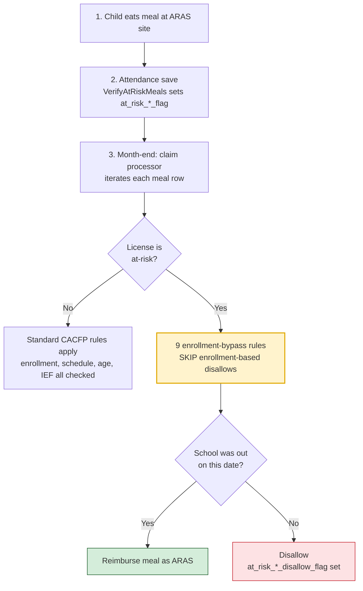

# ARAS Today

**Companion to:** [323000 — ARAS/SFSP Hybrid Enrollment + Attendance](./323000.md)
**Date:** 2026-05-12
**Status:** Reference. Every fact below is cited with file:line. Read before touching ARAS code.

> The hybrid feature does not invent new claim logic. It reuses the ARAS rails. To extend ARAS safely, the team needs a clear map of those rails first. This document is that map.

---

## 1. The path of a meal

A child eats a snack after school at an ARAS center. The center logs the meal. A month later the claim processor walks each meal row and asks: *should this meal be reimbursed as ARAS?*

The answer turns on three checkpoints.

1. **Is the license an at-risk license?** If yes, the next two questions matter. If no, the meal goes through standard CACFP rules.
2. **Was school out on this day?** Only school-out days qualify for ARAS reimbursement.
3. **Do the usual CACFP enrollment-disallow rules apply, or are they skipped?** For an at-risk license, **nine** rules skip — at-risk children are not subject to those gates.

The rest of this doc walks each checkpoint with file:line citations.

---

## 2. The flow



---

## 3. The license-level at-risk check

Two methods. Same conceptual question. Different scopes. Both must be updated for AtRiskHybrid.

### 3.1 `AtRiskCenterHelper.IsCenterLicenseAtRisk()` — drives the school-calendar logic

File: `Centers-CX/products/Centers/Projects/MinuteMenu.Centers.ServerLib/ProcessorCalendarEntry/AtRiskCenterHelper.cs:52`

```csharp
public bool IsCenterLicenseAtRisk()
{
    bool programTypeIsAtRisk = _centerRow != null
        ? _centerRow.program_type_code == (int)Constants.ProgramTypeCode.AtRisk
        : false;
    bool centerIsAtRisk = _centerRow != null ? _centerRow.at_risk_flag : false;
    return programTypeIsAtRisk || centerIsAtRisk;
}
```

Two callers, both in `SchoolEntryEligibleDetector.cs`:

- `:52` — `GetChildSchoolYearIneligibilityReasons`
- `:68` — `IsNotIneligibleBySchoolOutReason`

### 3.2 `csProcessClaimBusiness.isLicenseAtRiskOrEmergencyShelter()` — drives the 9 bypass rules

File: `Centers-CX/products/Centers/Projects/MinuteMenu.Centers.ServerLib/Business/csProcessClaimBusiness.cs:4576`

```csharp
private bool isLicenseAtRiskOrEmergencyShelter()
{
    return processCenterRow.program_type_code == (int)Constants.ProgramTypeCode.AtRisk
        || processCenterRow.program_type_code == (int)Constants.ProgramTypeCode.EmergencyShelter;
}
```

**Same idea, two implementations.** One gates school-calendar logic; the other gates the 9 enrollment-bypass rules. Both need AtRiskHybrid added.

---

## 4. School-out gating

Driven by the `CALENDAR_ENTRY` table.

- A day is "school out" when `CalendarEntryTypeCode = SchoolOut` for a date within the claim month.
- Scope is hierarchical: sponsor → school district → center → child. Any level can add entries.
- Default school year is **September 1 – May 31**. Overrideable per scope via `SchoolStartDate` / `SchoolEndDate` entries.

Source: `SchoolCalendarService.cs:22` (query), `SchoolYearResolver.cs:58` (default range).

**Exception.** If a school-out day's reason text contains `(No At-Risk)`, that day is disallowed for at-risk children even though school is out. See `SchoolEntryEligibleDetector.cs:81`.

---

## 5. The at_risk flag columns

Six per attendance row, one per meal service. Plus six "disallow" siblings written during claim processing.

| Meal | Flag column (DAILY_ATTENDANCE) | Disallow column (CLAIM_ATTENDANCE) |
|---|---|---|
| Breakfast | `at_risk_breakfast_flag` | `at_risk_breakfast_disallow_flag` |
| AM snack | `at_risk_am_snack_flag` | `at_risk_am_snack_disallow_flag` |
| Lunch | `at_risk_lunch_flag` | `at_risk_lunch_disallow_flag` |
| PM snack | `at_risk_pm_snack_flag` | ⚠️ `at_risk_pm_snack_disalow_flag` *(misspelled — see §7)* |
| Dinner | `at_risk_dinner_flag` | `at_risk_dinner_disallow_flag` |
| Evening snack | `at_risk_evening_snack_flag` | `at_risk_evening_snack_disallow_flag` |

Writer: `AttendanceService.VerifyAtRiskMeals`, called at two points:

- Daily save — `AttendanceService.cs:301`
- Claim processing — `AttendanceService.cs:364`

---

## 6. The 9 enrollment-bypass rules

All live in `csProcessClaimBusiness.cs`. All gate on `isLicenseAtRiskOrEmergencyShelter()`.

| # | Method | Line | What the rule disallows (for non-ARAS) | Bypass line |
|---|---|---|---|---|
| 41 | `ChildNotEnrolled` | 4486 | Meal taken before child's `original_enrollment_date` | 4491 |
| 43 | `ChildWithdrawn` | 4615 | Meal taken on or after the child's withdrawn date | 4617 |
| 44 | `ChildPending` | 4639 | Child status is Pending and policy denies pending children | 4641 |
| 45 | `ChildTooOld` | 4802 | Child's age exceeds license `allowed_ending_age` (special at-risk handling: max 18 with school-year check) | 4817 |
| 48 | `ChildMigrantTooOld` | 4925 | Migrant child is older than 16 | 4927 |
| 49 | `ChildEnrollmentExpired` | 4940 | Child's `enrollment_expiration_date` has passed | 4944 |
| 58 | `ChildNotApprovedForMeal` | 5668 | Child's `attend_*_flag` does not include this meal type | 5670 |
| 59 | `ChildNotApprovedForDayOfWeek` | 5732 | Child's `attend_<weekday>_flag` does not include this weekday | 5734 |
| 67 | `ChildNonParticipating` | 4779 | Child's `participates_flag` is false | 4781 |

**Composite gating.** Most rules combine the license check with a meal-level helper (`isMealAtRisk`) or child-level helper (`IsAnyMealAtRisk`). The result is the same — at-risk skips — but the call shape varies. Rule 49 uses only the license check.

---

## 7. Three surprises — read carefully

### 7.1 The Paid restriction is not enforced as a claim rule

The behavioral model says ARAS sites cannot claim Paid meals. **The code does not enforce this at claim time.** It is enforced at enrollment time, and only for SFSP-closed-enrolled centers — not for ARAS:

- `KK/Projects/KidKare.Bll/Centers/Child/ChildBll.cs:343` — `AddChild` forces `IsCacfpParticipant = false` when the center is SFSP-closed-enrolled and the child's FRP is Paid.
- `KK/Projects/KidKare.Bll/Centers/Child/ChildBll.cs:242` — `UpdateChild` does the same.
- `KK/Projects/KidKare.Bll/Centers/Enrollment/EnrollmentBll.cs:686` — batch import does the same.

For ARAS today, the Paid restriction is honored operationally by sponsors. The hybrid feature's "no Paid claim — regulatory" line is not enforced in code today for the ARAS counterpart either. Decide explicitly whether to add a claim-time rule, repeat the enrollment-time gate, or leave it as today.

### 7.2 There is already an `at_risk_flag` on the CENTER row

A boolean on the CENTER table, independent of `program_type_code`. `IsCenterLicenseAtRisk` ORs it in. A center with `program_type_code = ChildCare` and `at_risk_flag = true` is treated as at-risk for school-calendar logic.

This is an existing lightweight mechanism for marking a center as at-risk. It overlaps in spirit with what AtRiskHybrid does. Understand it before designing around it.

### 7.3 One column name is shipped misspelled

`at_risk_pm_snack_disalow_flag` is missing an `l` ("disalow" instead of "disallow"). The other five disallow columns are spelled correctly. Any new SP, migration, or query that touches this column must preserve the typo to remain compatible.

---

## 8. The 8 IsCenterARASSFSP callsites (KK side)

Distinct from the CX claim engine. This is the KK BLL method that gates KK-side filtering and counting.

| File:Line | Method | What it gates | Hybrid should join? |
|---|---|---|---|
| `ClaimBll.cs:264` | `GetUnprocessedClaims` | Routes to ARAS/SFSP claim fetch vs regular | ✅ Yes |
| `ClaimBll.cs:330` | `GetUnprocessedClaimsDetail` | Same routing for detail view | ✅ Yes |
| `ClaimBll.cs:851` | `GetClaimsMonthsForCenter` | Variable read but not used in current path | 🟡 Verify — likely dead code |
| `CentersBll.cs:1092` | `SponsorARASSFSPCount` | Counts a sponsor's ARAS/SFSP centers (max 2) | ✅ Yes |
| `CentersBll.cs:1118` | `SponsorARASSFSPCountByStateAndProgramType` | State-level ARAS/SFSP presence check | ✅ Yes |
| `CommonUtils.cs:200` | `SponsorARASSFSPCountByStateAndProgramType_Static` | Static duplicate of CentersBll:1118 | ✅ Yes — keep in sync |
| `CommonUtils.cs:227` | `SponsorARASSFSPCount_Static` | Static duplicate of CentersBll:1092 | ✅ Yes — keep in sync |
| `MenuBll.cs:1276` | `GetMealCounts` | Single-license gate for SFSP second-meal lookup | ✅ Yes |

Story 323015 §2.4 proposes a new `IsCenterARASOrSFSP` method that includes the hybrid program types and switches the first two callsites over. The other six need the same review.

---

## 9. Reading list

Open in this order. If a developer reads files 1, 2, and 4 carefully and skims the rest, they will have the foundation to extend ARAS to AtRiskHybrid safely.

1. `Centers-CX/products/Centers/Projects/MinuteMenu.Centers.ServerLib/ProcessorCalendarEntry/AtRiskCenterHelper.cs` — 70 lines. The conceptual entry point.
2. `Centers-CX/products/Centers/Projects/MinuteMenu.Centers.ServerLib/ProcessorCalendarEntry/SchoolEntryEligibleDetector.cs` — how school-out drives the at-risk decision.
3. `Centers-CX/products/Centers/Projects/MinuteMenu.Centers.ServerLib/Business/AttendanceService.cs` — search for `VerifyAtRiskMeals`. How `at_risk_*_flag` gets written.
4. `Centers-CX/products/Centers/Projects/MinuteMenu.Centers.ServerLib/Business/csProcessClaimBusiness.cs` — search for `isLicenseAtRiskOrEmergencyShelter`. The 9 bypass rules cluster between lines 4486 and 5734.
5. `KK/Projects/KidKare.Bll/Centers/CentersBll.cs:918` — `IsCenterARASSFSP`. The KK-side counterpart.
6. `KK/Projects/KidKare.Bll/Centers/Child/ChildBll.cs:343` — the implicit Paid restriction at enrollment.

---

## 10. What this means for the hybrid feature

- The ticket's one-line CX changes (§7.1 of the main plan) are correct in shape but land on logic that **was not obvious** without this map. Specifically: Rule 49 uses only the license-level gate, Rule 45 has special at-risk age handling, and the `at_risk_flag` on CENTER row already exists.
- The "no Paid claim" line in the hybrid behavioral model needs a product call: enforce in code now (and add the equivalent enforcement for ARAS while we are there)? Or honor operationally as today?
- A hybrid kid with no `attend_<weekday>_flag` and no `attend_*_flag` will hit Rules 58 and 59. Both skip for at-risk licenses, so the bypass should hold — but worth verifying with a test meal-save on dev once the enum value is added.
