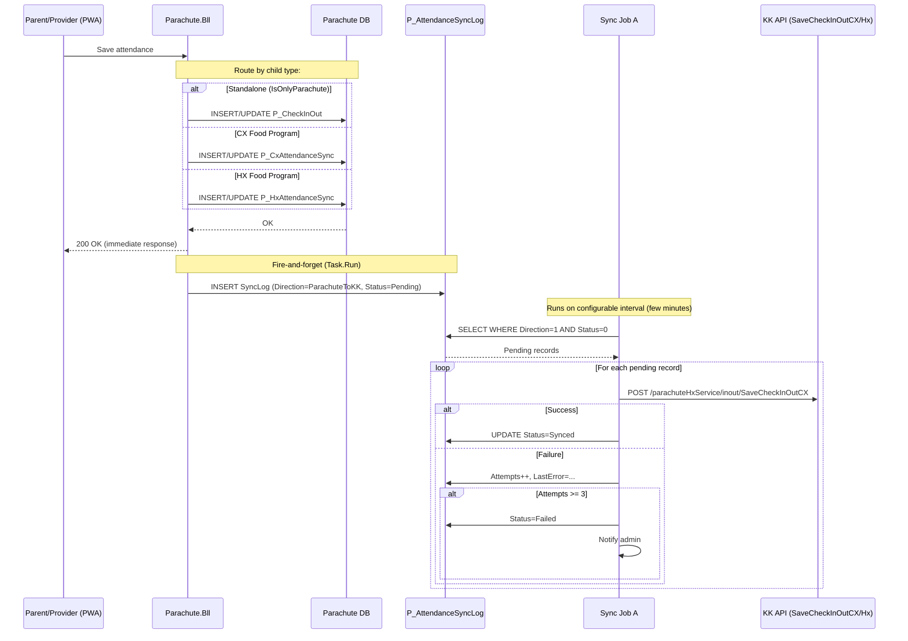
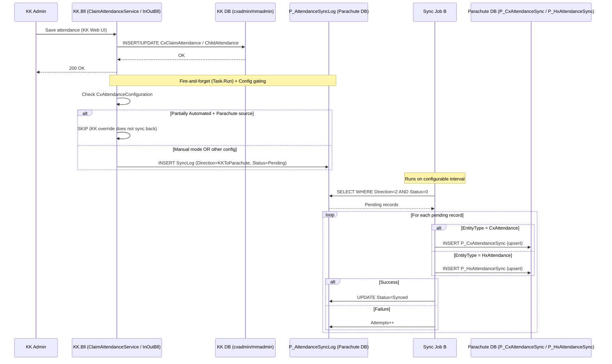
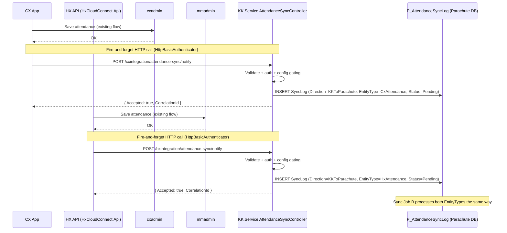
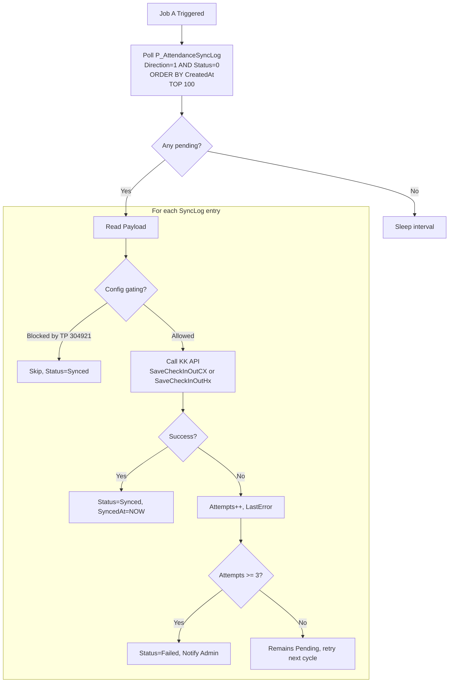
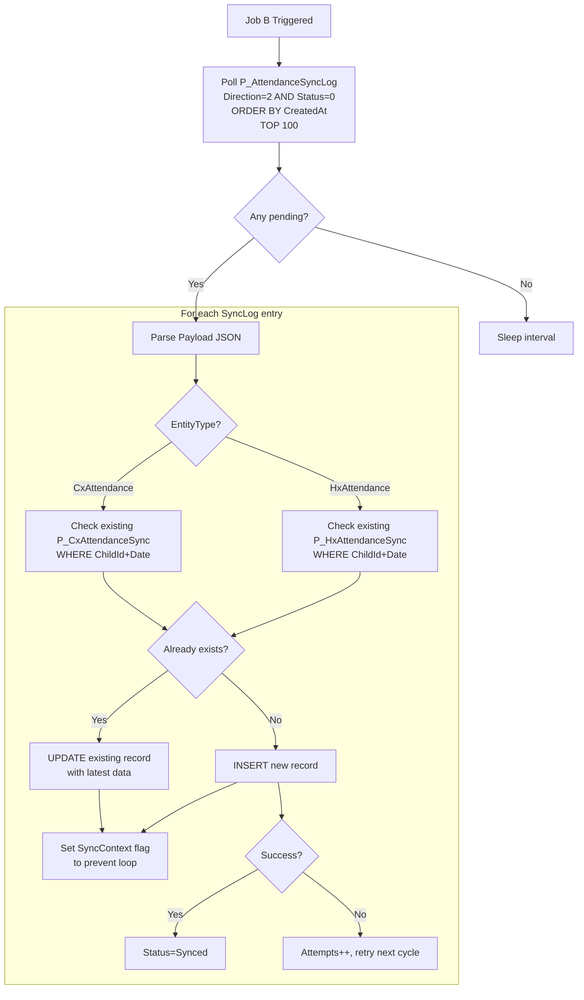

# Separate Attendance Tables in Parachute — Technical Design Plan

**Ticket:** TP 315953
**Related:** TP 304921 (Configurable Attendance Source — Released)
**Date:** 2026-04-15
**Version:** 1.0
**Status:** Draft

---

## Table of Contents

1. [Performance Requirements & Expectations](#1-performance-requirements)
2. [Overview](#2-overview)
3. [Architecture](#3-architecture)
4. [Database Design](#4-database-design)
5. [Data Flow — Sync Mechanisms](#5-data-flow)
6. [Sync Jobs — Azure WebJob](#6-sync-jobs)
7. [Migration API](#7-migration-api)
8. [Auto-migrate on Child Enrollment](#8-auto-migrate)
9. [Config Gating (TP 304921)](#9-config-gating)
10. [KK Transfer Handler](#10-kk-transfer)
11. [Error Handling & Logging](#11-error-handling)
12. [Impact Area](#12-impact-area)
13. [Testing Plan](#13-testing-plan)
14. [Implementation Phases](#14-implementation-phases)
15. [Open Items](#15-open-items)

---

## 1. Performance Requirements & Expectations

### 1.1 Data Volume

| Table | Records/Year | Migration Backfill (full historical) | 3-Year Projection | Category |
|---|---|---|---|---|
| `P_CheckInOut` (standalone) | ~1M | Existing (no migration) | ~3M | Small |
| `P_CxAttendanceSync` | **85M** | **~300M** (full CX historical) | **~555M** | Very Large |
| `P_HxAttendanceSync` | **81M** | **~570M** (full HX historical) | **~810M** | Very Large |
| `P_AttendanceSyncLog` | N/A | 0 | ~3.5M rolling (7-day cleanup) | Small |
| `V_AllAttendance` (view) | ~166M new/year | **~870M historical (570M HX + 300M CX)** | **~1.36B** | Billion-scale |

**Daily throughput:** Production **1,000,000 msg/day × 22 working days = 22M msg/mo**. Dev + QA combined **2,000 msg/working day × 22 wd = 44K msg/mo**. Working days only (Mon–Fri).

### 1.2 Performance Targets

| Operation | Target Latency | Scale Context |
|---|---|---|
| Check-in/out screen (single site + date) | **< 50ms** | Query hits 1 partition (~7M rows) with covering index → few hundred rows |
| Attendance report (sponsor + 1 month) | **< 500ms** | Scans 1-2 partitions via `V_AllAttendance` with Date filter |
| Invoice attendance check (per child) | **< 200ms** | Unique index seek `UX_Child_Date` → 1 row |
| Sync Job poll (SyncLog pending) | **< 5ms** | Filtered index Status=0 → only few thousand rows indexed |
| Sync Job throughput | **1M msg/day** (22M/mo working days) without backlog | Job runs configurable interval, batch processing |
| Migration API (bulk import) | **870M records full historical** (570M HX + 300M CX) — executed in a single weekend window with parallel SqlBulkCopy (~6-12 hours) | SqlBulkCopy, batch by sponsor + month, parallel 20 threads, pre-disabled indexes during load |
| KK Transfer (bulk update) | **< 10 minutes** for largest sponsor | Batch 10K rows per iteration |

### 1.3 Sync Latency — NOT Real-Time

Sync between Parachute and KK is **eventually consistent**, NOT real-time.

| Stage | Latency |
|---|---|
| Entity save → Task.Run INSERT SyncLog | ~50-200ms |
| SyncLog pending → Job picks up (poll interval) | **Configurable: 1-5 minutes** |
| Job processes record → writes to target DB | ~100-500ms |
| **Total end-to-end latency** | **~2-10 minutes** (depends on job interval config) |

**Minimum achievable latency:** ~1-3 minutes (job poll every 1 minute). More aggressive polling (30s) is possible but increases DB poll load.

**Real-time sync (<1 second) is NOT achievable** with current SyncLog + polling architecture. Would require different architecture (message queue push, SignalR, CDC).

### 1.4 How Technical Solutions Meet These Requirements

| Requirement | Solution | Handles 715M rows? |
|---|---|---|
| Large table query performance | Monthly partitioning — queries with Date filter scan ~7M rows/partition instead of 715M | **Yes** |
| Fast lookups on large tables | Partition-aligned indexes with INCLUDE columns (covering) — index-only scan, no bookmark lookups | **Yes** |
| Exclude deleted rows from queries | Filtered indexes (`WHERE record_status_code = 288`) — reduce index size | **Yes** |
| Unique constraint at scale | `UX_Child_Date` unique index — checked per-partition | **Yes** |
| SyncLog stays small | Cleanup job deletes Status=Synced > 7 days. Filtered index Status=0 has only few thousand rows. | **Yes** |
| Migration 870M rows full historical | SqlBulkCopy + batch by sponsor/month + parallel 20 threads + pre-disable indexes + checkpoint via `P_MigrationProgress` | **Yes (single weekend window, ~6-12 hours active migration + Sunday buffer)** |
| Insert 1M msg/day prod (= 22M/mo working days) | Nonclustered identity PK — sequential, no page splits | **Yes** |
| Index maintenance at 7M inserts/month | Per-partition rebuild (`REBUILD PARTITION = N`) — rebuild only 1 partition, not 715M index | **Yes** |
| Archive old data (keep active < 330M) | `ALTER TABLE ... SWITCH PARTITION` — instant metadata-only move | **Yes** |
| Transfer large sponsor | Batch UPDATE 10K rows/iteration with delay | **Yes (5-10 min)** |

### 1.5 Mandatory Operational Requirements

These are **required** to sustain performance at this scale — not optional:

| Requirement | Frequency | Why |
|---|---|---|
| **Archive data > 2 years** | Monthly | Without archive, active data grows to 715M+ → queries degrade. Keep ~330M active. |
| **Index rebuild per partition** | Weekly | 7M inserts/month/table cause fragmentation → rebuild current month's partition only |
| **UPDATE STATISTICS** | Weekly | Stale stats → bad query plans at this scale |
| **SyncLog cleanup** | Daily | Without cleanup, SyncLog grows unbounded |
| **Reports MUST filter by Date** | Always (app-level enforcement) | `V_AllAttendance` has no index — without Date filter, scan 715M rows (minutes, not seconds) |
| **Monitor partition sizes** | Monthly | If any partition exceeds 10M rows, investigate |

### 1.6 Scaling Thresholds & Alert Actions

| Threshold | Action |
|---|---|
| Any table > 500M active rows | Review archive policy — may need to archive more aggressively |
| Single partition > 10M rows | Investigate — data distribution may be uneven |
| SyncLog pending > 10K rows | Alert — sync jobs may be falling behind |
| SyncLog failed > 100 rows | Alert — admin review required |
| Check-in/out query > 200ms | Check index fragmentation + partition elimination in execution plan |
| Report query > 3 seconds | Verify Date filter present, check stale statistics |
| Migration batch > 1 hour per sponsor | Review batch size, run during off-hours only |

---

## 2. Overview

### 2.1 Background


Currently, Parachute stores attendance data **only for standalone CX users** (Parachute-only accounts). For Food Program users (HX and CX), attendance data is stored exclusively in KidKare (KK) databases (`CLAIM_ATTENDANCE` in cxadmin, `CHILD_ATTENDANCE` in mmadmin). Parachute must call KK APIs to retrieve this data.

Both products currently share the same database, so changes made on KK are automatically visible to Parachute. However, as the products evolve toward independent databases, this implicit sharing will break.

### 1.2 Scope

- **Parachute stores attendance for ALL users** — standalone CX, Food Program CX, and Food Program HX
- **Bidirectional sync** between Parachute DB and KK DB via `P_AttendanceSyncLog`
- **Full historical data migration** of CX/HX attendance to Parachute — approximately **870 million records** (570M HX + 300M CX), executed in a **single weekend off-hours window** with parallel SqlBulkCopy (~6-12 hours active migration, Sunday reserved as buffer for unexpected issues)
- **Auto-migration** when new children enroll into Parachute
- **Parachute reports and invoices** read attendance from local DB
- **KK Transfer** (provider/sponsor) reflected in Parachute data
- **TP 304921 update**: Add Parachute as source for "Partially Automated Attendance"

### 1.3 Key Decisions

| # | Decision | Chosen Option |
|---|----------|---------------|
| 1 | Attendance table structure | **3 separate tables**: `P_CheckInOut` (Parachute-native), `P_CxAttendanceSync` (CX synced), `P_HxAttendanceSync` (HX synced). View `V_AllAttendance` for unified queries. |
| 2 | Sync mechanism | `P_AttendanceSyncLog` table in Parachute DB (no Azure Service Bus, no message queue) |
| 3 | SyncLog insert method | `Task.Run` fire-and-forget after entity save (not in same transaction) |
| 4 | SyncLog location | Parachute DB only (no new tables in cxadmin/mmadmin) |
| 5 | Sync jobs hosting | Azure WebJob (separate process from web app) |
| 6 | CX App / HX App sync | **Both CX App and HX App call the SAME shared KK.Service API** (`POST /api/synclog/attendance`). KK.Service centralizes the SyncLog INSERT logic. No VB6 client changes for HX. |
| 7 | KK BLL sync | Task.Run INSERT SyncLog directly via ParachuteContext |
| 8 | Config gating | Gate at SyncLog INSERT point in KK BLL (not at job level). Sync Job always runs. |
| 9 | Migration approach | Online API (`POST /admin/migration/attendance`), batch by sponsorId + month, skip existing |
| 10 | Loop prevention | `SyncContext` flag — inbound sync does NOT create SyncLog back |
| 11 | Table partitioning | Monthly partition on all 3 attendance tables (requires SQL Server 2016 SP1+) |
| 12 | DB triggers | Not used — explicit code-level SyncLog INSERT |
| 13 | Missed SyncLog (fire-and-forget failure) | Reconciliation job (scheduled) catches missed records |
| 14 | CX/HX table schema | Keep close to source format (2 in/out pairs for CX, 3 for HX) — no InOutIndex normalization. Reduces row count. |

---

## 3. Architecture

### 2.1 High-Level Architecture

```
+---------------------------------------------------------------------+
|                          SAVE SOURCES                                |
|                                                                      |
|  +------------+  +----------+  +--------+  +---------+  +---------+ |
|  | Parachute  |  | KK Web   |  | CX App |  | HX App  |  | APIM /  | |
|  | (PWA/Web)  |  | UI       |  | (.NET) |  | (VB6)   |  | Procare | |
|  +-----+------+  +----+-----+  +---+----+  +----+----+  +----+----+ |
|        |              |            |             |             |      |
+--------|--------------|------------|-------------|-------------|------+
         |              |            |             |             |
         v              v            +-----+-------+             |
  +-------------+ +----------+             |                     |
  |Parachute.Bll| | KK.Bll   |             v                     |
  |             | |          |     +----------------+            |
  |Route by     | |Save entity     | KK.Service     |            |
  |child type:  | |+ Task.Run|     | AttendanceSync |            |
  |Standalone   | |add SyncLog     | Controller     |            |
  | ->P_CheckIn | |(via Parachute  | (shared API:   |            |
  |CX->P_CxAtt | |Context)  |     |  cxintegration/|            |
  |HX->P_HxAtt | +----+-----+     |  hxintegration/|            |
  |+ Task.Run   |     |           |  attendance-   |            |
  |add SyncLog  |     |           |  sync/notify)  |            |
  +------+------+     |           +--------+-------+            |
         |             |                    |                     |
         |             |                    | INSERT SyncLog     |
         |             |                    |                     |
         +------+------+--------+-----------+                    |
                |                                                |
                v                                                |
+---------------------------------------------------------------v---+
|                        Parachute DB                                 |
|                                                                     |
|  +---------------------------+ +---------------------------+       |
|  | P_CheckInOut              | | P_CxAttendanceSync        |       |
|  | (standalone only)         | | (ALL CX attendance)       |       |
|  | PARTITIONED monthly       | | PARTITIONED monthly       |       |
|  +---------------------------+ +---------------------------+       |
|                                                                     |
|  +---------------------------+ +---------------------------+       |
|  | P_HxAttendanceSync       | | V_AllAttendance (VIEW)    |       |
|  | (ALL HX attendance)       | | UNION ALL of 3 tables     |       |
|  | PARTITIONED monthly       | | for reports + invoices    |       |
|  +---------------------------+ +---------------------------+       |
|                                                                     |
|  +---------------------------+ +---------------------------+       |
|  | P_AttendanceSyncLog       | | P_Participant             |       |
|  | (sync queue, ~3.5M rows)  | | (CX<->Parachute mapping)  |       |
|  | 4 filtered indexes        | +---------------------------+       |
|  +---------------------------+ +---------------------------+       |
|                  |             | P_MigrationProgress        |       |
|                  |             +---------------------------+       |
+------------------+----------------------------------------------+   |
                   |                                                  |
                   +------------------------------+                   |
                                                  |                   |
                                   +--------------+---------------+   |
                                   |      Azure WebJob            |   |
                                   |      (separate process)      |   |
                                   |                              |   |
                                   |  Sync Job A: Parachute -> KK |   |
                                   |  Sync Job B: KK -> Parachute |   |
                                   |  Reconciliation (scheduled)  |   |
                                   |  Cleanup (scheduled)         |   |
                                   +------------------------------+   |
+---------------------------------------------------------------------+
```

### 2.2 Data Flow — Two Directions

The sync process operates in **two independent directions**:

```
Direction 1: Parachute -> KK
  Parachute user saves attendance on PWA/Web
  -> Parachute.Bll routes by child type:
     Standalone  -> INSERT P_CheckInOut
     CX child    -> INSERT P_CxAttendanceSync
     HX child    -> INSERT P_HxAttendanceSync
  -> Task.Run INSERT P_AttendanceSyncLog (Direction=ParachuteToKK)
  -> Sync Job A polls SyncLog -> calls KK HTTP API (SaveCheckInOutCX/Hx)

Direction 2: KK -> Parachute
  KK/CX/HX user saves attendance
  -> KK BLL saves CxClaimAttendance/ChildAttendance
  -> Task.Run INSERT P_AttendanceSyncLog (Direction=KKToParachute)
     OR CX App/HX App calls POST /api/synclog/attendance
  -> Sync Job B polls SyncLog -> routes by EntityType:
     CxAttendance -> INSERT P_CxAttendanceSync
     HxAttendance -> INSERT P_HxAttendanceSync
```

### 2.3 Data Flow Diagrams

#### Direction 1: Parachute -> KK



#### Direction 2: KK -> Parachute (via KK BLL)



#### Direction 2: KK -> Parachute (via CX App / HX App)

Both CX App and HX App POST to the **same shared API** on KK.Service. The route prefix differs by source so each app keeps its existing base URL configuration unchanged. KK.Service is the single writer of `P_AttendanceSyncLog` for external sources.



### 2.4 Why SyncLog Table (vs Alternatives)

| Criteria | Direct HTTP sync | Message Queue (Azure SB) | SyncLog Table (Chosen) |
|----------|:----------------:|:------------------------:|:----------------------:|
| Infrastructure cost | $0 | $10-170/month | $0 |
| New dependency | None | Azure Service Bus | None |
| Retry capability | No (lost on failure) | Built-in (DLQ) | Custom (Attempts + reconciliation) |
| Audit trail | No | No | Yes (SyncLog table) |
| Replay capability | No | 7-day retention | Yes (re-process SyncLog entries) |
| Monitoring | Custom | Azure Portal | SQL query on SyncLog |
| Complexity | Low | Medium | Low-Medium |
| Team familiarity | High | Medium | High |
| Impact on cxadmin/mmadmin | None | None | None (SyncLog in Parachute DB) |

**Decision: SyncLog table** — no new infrastructure, no cost, team-familiar pattern, built-in audit trail.

---

## 4. Database Design

### 3.1 Three-Table Strategy

CX and HX attendance data is tens of millions of records. To keep `P_CheckInOut` small and fast for Parachute-native queries, synced CX/HX data is stored in **separate dedicated tables**.

```
Parachute DB
|
+-- P_CheckInOut          (Parachute-native only — small, fast)
+-- P_CxAttendanceSync    (CX synced data — tens of millions)
+-- P_HxAttendanceSync    (HX synced data — tens of millions)
+-- V_AllAttendance       (VIEW = UNION ALL of above 3 tables for reports)
+-- P_AttendanceSyncLog   (sync queue — rolling ~3.5M rows)
+-- P_MigrationProgress   (migration tracking)
```

**Benefits:**
- `P_CheckInOut` stays small — check-in/out screen (most frequent query) always fast
- CX/HX tables keep source-native format (2 in/out pairs for CX, 3 for HX — no InOutIndex normalization)
- 1 CX source row = 1 CX target row (not 2). 1 HX source row = 1 HX target row (not 3). Reduces total row count.
- Migration can truncate + re-migrate CX or HX independently without affecting Parachute-native data
- Each table has independent partition/index strategy

### 3.2 P_CheckInOut — Standalone Parachute Users Only

Existing table, **no schema changes**. Only stores attendance for standalone users (`IsOnlyParachute = true`). CX/HX data goes to dedicated tables (3.3, 3.4).

```sql
-- Existing schema — unchanged
CREATE TABLE P_CheckInOut (
    Id                      int IDENTITY(1,1) NOT NULL,
    SponsorId               int NOT NULL,
    SiteId                  varchar(50) NOT NULL,
    ChildId                 uniqueidentifier NOT NULL,
    ParentId                uniqueidentifier NULL,
    Date                    datetime NOT NULL,
    TimeIn                  datetime NULL,
    TimeOut                 datetime NULL,
    InOutIndex              int NOT NULL,

    -- Audit (ParachuteBase)
    mod_date_time           datetime NULL,
    mod_login_id            varchar(50) NULL,
    create_date_time        datetime NULL,
    create_login_id         varchar(50) NULL,
    record_status_code      decimal(9,0) NULL DEFAULT 288,
    replicate_to_server_flag varchar(1) NULL DEFAULT 'N'
);
```

**Indexes:**

```sql
-- IX_1: Check-in/out screen (most frequent)
CREATE NONCLUSTERED INDEX IX_CheckInOut_SiteId_Date
ON P_CheckInOut (SiteId, Date)
INCLUDE (ChildId, TimeIn, TimeOut, InOutIndex, Temperature, ParentId)
WHERE record_status_code = 288
ON ps_Attendance_Monthly(Date);

-- IX_2: Report / Invoice
CREATE NONCLUSTERED INDEX IX_CheckInOut_SponsorId_Date
ON P_CheckInOut (SponsorId, Date)
INCLUDE (ChildId, SiteId, TimeIn, TimeOut, InOutIndex)
WHERE record_status_code = 288
ON ps_Attendance_Monthly(Date);

-- UX_3: Sync duplicate check + Child lookup (UNIQUE)
CREATE UNIQUE NONCLUSTERED INDEX UX_CheckInOut_Child_Date_InOutIndex
ON P_CheckInOut (ChildId, Date, InOutIndex)
WHERE record_status_code = 288
ON ps_Attendance_Monthly(Date);
```

### 3.3 P_CxAttendanceSync — ALL CX Attendance Data

Stores **all** CX attendance: both Parachute user saves (CX Food Program children) AND KK/CX App synced data. Schema close to source `CLAIM_ATTENDANCE`. Keeps 2 in/out pairs per row.

```sql
CREATE TABLE P_CxAttendanceSync (
    Id                      int IDENTITY(1,1) NOT NULL,
    SponsorId               int NOT NULL,
    SiteId                  varchar(50) NOT NULL,
    ChildId                 uniqueidentifier NOT NULL,
    CxChildId               int NULL,               -- Original CX child_id (int)
    CenterId                int NULL,               -- Original CX center_id
    Date                    datetime NOT NULL,
    FirstInTime             datetime NULL,
    FirstOutTime            datetime NULL,
    SecondInTime            datetime NULL,
    SecondOutTime           datetime NULL,
    FirstTemperature        decimal(5,2) NULL,
    SecondTemperature       decimal(5,2) NULL,
    SourceSystem            smallint NOT NULL DEFAULT 2,  -- 2=KidKareCX
    ExternalId              varchar(100) NULL,

    -- Audit
    mod_date_time           datetime NULL,
    mod_login_id            varchar(50) NULL,
    create_date_time        datetime NULL,
    create_login_id         varchar(50) NULL,
    record_status_code      decimal(9,0) NULL DEFAULT 288,
    replicate_to_server_flag varchar(1) NULL DEFAULT 'N',

    CONSTRAINT PK_CxAttSync PRIMARY KEY NONCLUSTERED (Id, Date)
) ON ps_Attendance_Monthly(Date);
```

**Indexes:**

```sql
CREATE NONCLUSTERED INDEX IX_CxAttSync_SiteId_Date
ON P_CxAttendanceSync (SiteId, Date)
INCLUDE (ChildId, FirstInTime, FirstOutTime, SecondInTime, SecondOutTime)
WHERE record_status_code = 288
ON ps_Attendance_Monthly(Date);

CREATE NONCLUSTERED INDEX IX_CxAttSync_SponsorId_Date
ON P_CxAttendanceSync (SponsorId, Date)
INCLUDE (ChildId, SiteId, FirstInTime, FirstOutTime)
WHERE record_status_code = 288
ON ps_Attendance_Monthly(Date);

-- UNIQUE: 1 CX child has 1 attendance record per date
CREATE UNIQUE NONCLUSTERED INDEX UX_CxAttSync_Child_Date
ON P_CxAttendanceSync (ChildId, Date)
WHERE record_status_code = 288
ON ps_Attendance_Monthly(Date);
```

### 3.4 P_HxAttendanceSync — ALL HX Attendance Data

Stores **all** HX attendance: both Parachute user saves (HX Food Program children) AND KK/HX App synced data. Schema close to source `CHILD_ATTENDANCE`. Keeps 3 in/out pairs per row.

```sql
CREATE TABLE P_HxAttendanceSync (
    Id                      int IDENTITY(1,1) NOT NULL,
    SponsorId               int NOT NULL,
    SiteId                  varchar(50) NOT NULL,
    ChildId                 uniqueidentifier NOT NULL,  -- HX child_id (Guid) direct match
    Date                    datetime NOT NULL,
    FirstInTime             datetime NULL,
    FirstOutTime            datetime NULL,
    SecondInTime            datetime NULL,
    SecondOutTime           datetime NULL,
    ThirdInTime             datetime NULL,
    ThirdOutTime            datetime NULL,
    FirstTemperature        decimal(5,2) NULL,
    SecondTemperature       decimal(5,2) NULL,
    ThirdTemperature        decimal(5,2) NULL,
    SourceSystem            smallint NOT NULL DEFAULT 3,  -- 3=KidKareHX
    ExternalId              varchar(100) NULL,

    -- Audit
    mod_date_time           datetime NULL,
    mod_login_id            varchar(50) NULL,
    create_date_time        datetime NULL,
    create_login_id         varchar(50) NULL,
    record_status_code      decimal(9,0) NULL DEFAULT 288,
    replicate_to_server_flag varchar(1) NULL DEFAULT 'N',

    CONSTRAINT PK_HxAttSync PRIMARY KEY NONCLUSTERED (Id, Date)
) ON ps_Attendance_Monthly(Date);
```

**Indexes:**

```sql
CREATE NONCLUSTERED INDEX IX_HxAttSync_SiteId_Date
ON P_HxAttendanceSync (SiteId, Date)
INCLUDE (ChildId, FirstInTime, FirstOutTime, SecondInTime, SecondOutTime, ThirdInTime, ThirdOutTime)
WHERE record_status_code = 288
ON ps_Attendance_Monthly(Date);

CREATE NONCLUSTERED INDEX IX_HxAttSync_SponsorId_Date
ON P_HxAttendanceSync (SponsorId, Date)
INCLUDE (ChildId, SiteId, FirstInTime, FirstOutTime)
WHERE record_status_code = 288
ON ps_Attendance_Monthly(Date);

-- UNIQUE: 1 HX child has 1 attendance record per date
CREATE UNIQUE NONCLUSTERED INDEX UX_HxAttSync_Child_Date
ON P_HxAttendanceSync (ChildId, Date)
WHERE record_status_code = 288
ON ps_Attendance_Monthly(Date);
```

### 3.5 V_AllAttendance — Unified View for Reports

Reports and invoices query this view to get all attendance across all sources.

```sql
CREATE VIEW V_AllAttendance AS
    -- Parachute native (already normalized to InOutIndex)
    SELECT SponsorId, SiteId, ChildId, Date,
           TimeIn, TimeOut, InOutIndex,
           Temperature, SourceSystem, ExternalId
    FROM P_CheckInOut
    WHERE record_status_code = 288

    UNION ALL

    -- CX synced: expand 2 pairs into rows
    SELECT SponsorId, SiteId, ChildId, Date,
           FirstInTime, FirstOutTime, 0,
           FirstTemperature, SourceSystem, ExternalId
    FROM P_CxAttendanceSync
    WHERE record_status_code = 288
      AND (FirstInTime IS NOT NULL OR FirstOutTime IS NOT NULL)
    UNION ALL
    SELECT SponsorId, SiteId, ChildId, Date,
           SecondInTime, SecondOutTime, 1,
           SecondTemperature, SourceSystem, ExternalId
    FROM P_CxAttendanceSync
    WHERE record_status_code = 288
      AND (SecondInTime IS NOT NULL OR SecondOutTime IS NOT NULL)

    UNION ALL

    -- HX synced: expand 3 pairs into rows
    SELECT SponsorId, SiteId, ChildId, Date,
           FirstInTime, FirstOutTime, 0,
           FirstTemperature, SourceSystem, ExternalId
    FROM P_HxAttendanceSync
    WHERE record_status_code = 288
      AND (FirstInTime IS NOT NULL OR FirstOutTime IS NOT NULL)
    UNION ALL
    SELECT SponsorId, SiteId, ChildId, Date,
           SecondInTime, SecondOutTime, 1,
           SecondTemperature, SourceSystem, ExternalId
    FROM P_HxAttendanceSync
    WHERE record_status_code = 288
      AND (SecondInTime IS NOT NULL OR SecondOutTime IS NOT NULL)
    UNION ALL
    SELECT SponsorId, SiteId, ChildId, Date,
           ThirdInTime, ThirdOutTime, 2,
           ThirdTemperature, SourceSystem, ExternalId
    FROM P_HxAttendanceSync
    WHERE record_status_code = 288
      AND (ThirdInTime IS NOT NULL OR ThirdOutTime IS NOT NULL);
```

### 3.6 Monthly Partition (shared across all 3 tables)

> **Requires:** SQL Server 2016 SP1+

```sql
CREATE PARTITION FUNCTION pf_Attendance_Monthly (datetime)
AS RANGE RIGHT FOR VALUES (
    '2025-01-01', '2025-02-01', '2025-03-01', '2025-04-01',
    '2025-05-01', '2025-06-01', '2025-07-01', '2025-08-01',
    '2025-09-01', '2025-10-01', '2025-11-01', '2025-12-01',
    '2026-01-01', '2026-02-01', '2026-03-01', '2026-04-01',
    '2026-05-01', '2026-06-01'
);

CREATE PARTITION SCHEME ps_Attendance_Monthly
AS PARTITION pf_Attendance_Monthly ALL TO ([PRIMARY]);
```

All 3 attendance tables use `ON ps_Attendance_Monthly(Date)`.

### 3.7 P_AttendanceSyncLog

Single table for both sync directions. `EntityType` determines which target table Sync Job writes to.

```sql
CREATE TABLE P_AttendanceSyncLog (
    Id              bigint IDENTITY PRIMARY KEY,
    Direction       smallint NOT NULL,          -- 1=ParachuteToKK, 2=KKToParachute
    EntityType      varchar(30) NOT NULL,       -- 'CheckInOut' | 'CxAttendance' | 'HxAttendance'
    EntityId        varchar(100) NULL,
    ChildId         uniqueidentifier NOT NULL,
    SponsorId       int NOT NULL,
    SiteId          varchar(50) NULL,
    AttendanceDate  datetime NOT NULL,
    ChangeType      varchar(10) NOT NULL,       -- 'Insert' | 'Update' | 'Delete'
    Payload         nvarchar(max) NOT NULL,     -- JSON (format depends on EntityType)
    Status          smallint NOT NULL DEFAULT 0,-- 0=Pending, 1=Synced, 2=Failed
    Attempts        int NOT NULL DEFAULT 0,
    LastError       nvarchar(500) NULL,
    CreatedAt       datetime2 NOT NULL DEFAULT SYSUTCDATETIME(),
    SyncedAt        datetime2 NULL
);

-- Filtered indexes
CREATE NONCLUSTERED INDEX IX_AttSyncLog_Pending
ON P_AttendanceSyncLog (Direction, CreatedAt) WHERE Status = 0;

CREATE NONCLUSTERED INDEX IX_AttSyncLog_Cleanup
ON P_AttendanceSyncLog (SyncedAt) WHERE Status = 1;

CREATE NONCLUSTERED INDEX IX_AttSyncLog_Reconciliation
ON P_AttendanceSyncLog (ChildId, AttendanceDate, Direction) WHERE Status IN (0, 1);

CREATE NONCLUSTERED INDEX IX_AttSyncLog_Failed
ON P_AttendanceSyncLog (CreatedAt) WHERE Status = 2;
```

### 3.8 P_MigrationProgress

```sql
CREATE TABLE P_MigrationProgress (
    Id              int IDENTITY PRIMARY KEY,
    SponsorId       int NOT NULL,
    SourceSystem    varchar(10) NOT NULL,       -- 'CX' | 'HX'
    MonthYear       datetime NOT NULL,
    Status          varchar(20) NOT NULL,       -- 'InProgress' | 'Completed' | 'Failed' | 'Abandoned'
    RowsInserted    int NULL,
    RowsSkipped     int NULL,
    Attempts        int NOT NULL DEFAULT 0,     -- Retry count. After 3 failures -> Status='Abandoned', stop retrying
    StartedAt       datetime2 NULL,
    CompletedAt     datetime2 NULL,
    ErrorMessage    nvarchar(max) NULL
);
```

### 3.9 Partition Maintenance

```sql
-- Monthly: add partition for next month (applies to all 3 tables sharing the function)
ALTER PARTITION FUNCTION pf_Attendance_Monthly()
SPLIT RANGE ('2026-07-01');

-- Archive: SWITCH old partitions > 2 years (per table)
ALTER TABLE P_CxAttendanceSync
SWITCH PARTITION $partition.pf_Attendance_Monthly('2024-01-15')
TO P_CxAttendanceSync_Archive;

-- Weekly: rebuild indexes per partition
ALTER INDEX IX_CxAttSync_SiteId_Date ON P_CxAttendanceSync
REBUILD PARTITION = $partition.pf_Attendance_Monthly('2026-04-15')
WITH (ONLINE = ON);
```

### 3.10 Database Architecture Overview

```
+------------------------------------------------------------------------+
|                           Parachute DB                                  |
|                                                                         |
|  +--------------------------------+                                    |
|  | P_CheckInOut                   |  STANDALONE users only (small)     |
|  | (PARTITIONED monthly)          |  IX_1 (SiteId, Date)              |
|  | InOutIndex format              |  IX_2 (SponsorId, Date)           |
|  +--------------------------------+  UX_3 (ChildId, Date, InOutIndex) |
|                                                                         |
|  +--------------------------------+                                    |
|  | P_CxAttendanceSync            |  ALL CX attendance (tens of M)     |
|  | (PARTITIONED monthly)          |  Parachute CX saves + KK CX sync  |
|  | 2 in/out pairs per row         |  IX (SiteId,Date), (SponsorId,Date)|
|  +--------------------------------+  UX (ChildId, Date)               |
|                                                                         |
|  +--------------------------------+                                    |
|  | P_HxAttendanceSync            |  ALL HX attendance (tens of M)     |
|  | (PARTITIONED monthly)          |  Parachute HX saves + KK HX sync  |
|  | 3 in/out pairs per row         |  IX (SiteId,Date), (SponsorId,Date)|
|  +--------------------------------+  UX (ChildId, Date)               |
|                                                                         |
|  +--------------------------------+                                    |
|  | V_AllAttendance (VIEW)         |  UNION ALL of 3 tables above      |
|  | Used by reports + invoices     |  Normalizes CX/HX to InOutIndex   |
|  +--------------------------------+                                    |
|                                                                         |
|  +--------------------------------+  +-----------------------------+   |
|  | P_AttendanceSyncLog            |  | P_MigrationProgress         |   |
|  | (~3.5M rows rolling)           |  | (migration tracking)        |   |
|  | 4 filtered indexes             |  +-----------------------------+   |
|  +--------------------------------+                                    |
|                                                                         |
|  +-----------------------------+                                       |
|  | P_Participant               |                                       |
|  | (CX <-> Parachute mapping)  |                                       |
|  +-----------------------------+                                       |
|                                                                         |
|  Maintenance:                                                           |
|   - Monthly: ADD partition (shared function, applies to all 3 tables)  |
|   - Monthly: SWITCH archive > 2yr per table                            |
|   - Weekly: REBUILD indexes per partition per table                     |
|   - Daily: Cleanup SyncLog (Status=Synced > 7 days)                   |
+------------------------------------------------------------------------+

+---------------------+        +---------------------+
|  cxadmin DB         |        |  mmadmin DB          |
|  (CLAIM_ATTENDANCE) |        |  (CHILD_ATTENDANCE)  |
|  No tables added    |        |  No tables added     |
+---------------------+        +---------------------+
```

---

## 5. Data Flow — Sync Mechanisms

### 4.1 SyncLog INSERT — Fire-and-Forget Pattern

All sources use the same pattern: save the business entity first, then asynchronously (fire-and-forget) INSERT a row into `P_AttendanceSyncLog` with `Status = Pending`. If the INSERT fails (rare — same-DB write), the failure is logged as a warning and the reconciliation job catches the missed record on its next run.

### 4.2 Sources and SyncLog INSERT Methods

| Source | Entity DB | SyncLog INSERT method | Code location |
|--------|-----------|----------------------|---------------|
| **Parachute.Bll** | Parachute DB | Task.Run direct (same DB). Routes to correct table: standalone → `P_CheckInOut`, CX → `P_CxAttendanceSync`, HX → `P_HxAttendanceSync` | `SaveCheckInOutIn{Parachute,Cx,Hx}System`, `ProviderSaveCheckInOutIn{Cx,Hx}System` |
| **KK.Bll** | cxadmin/mmadmin | Task.Run via ParachuteContext | `ClaimAttendanceService.SaveClaimAttendance`, `InOutBll.UpdateInOut/RemoveInOut/ApplyEnrollmentTimes`, `MealBll.SaveSFSPAttendance/*Bulk*`, `StaffAttendanceBll.Save` |
| **CX App** | cxadmin | **HTTP call to shared KK API** `POST /cxintegration/attendance-sync/notify` after local save (`LogicServiceToKK.SaveDailyAttendance`) | KK.Service `AttendanceSyncController` inserts into SyncLog |
| **HX App** | mmadmin | **HTTP call to SAME shared KK API** `POST /hxintegration/attendance-sync/notify` after local save | KK.Service `AttendanceSyncController` inserts into SyncLog |

**Key principle**: KK.Service is the **only place** that touches `P_AttendanceSyncLog` for external sources. CX App and HX App never write directly to the Parachute database. This keeps the SyncLog INSERT logic, validation, and config gating centralized.

### 4.3 Shared API — `POST /api/attendance-sync/notify` (CX + HX)

Both CX App and HX App POST to the same shared API on KK.Service. The route prefix differs by source (`cxintegration` vs `hxintegration`) so each app keeps its existing base URL configuration unchanged. The controller routes both into a single `Forward()` helper that inserts into `P_AttendanceSyncLog` with the correct `EntityType`.

Routes (both implemented in the same `AttendanceSyncController`):

```
POST /cxintegration/attendance-sync/notify     ← CX App
POST /hxintegration/attendance-sync/notify     ← HX App
```

Authentication: `[ExternalCall(EnforceAuthorizeRequest = true)]` — reuses existing ServiceStack HTTP Basic auth providers (`SsoCredentialsAuthProvider` for legacy SSO, `TokenSsoBasicAuthProvider` for Azure SSO with idToken). Both apps follow the same auth pattern they already use for `syncChildAndGuardianInfo`.

Request body (unified DTO):

```json
{
    "ClientId": 123,
    "CenterId": 456,
    "AttendanceDate": "2026-04-14T00:00:00Z",
    "CorrelationId": "optional-client-gen-guid",
    "Payload": {
        "Site": { "OwnerId": 123, "CenterId": 456 },
        "AttendanceDate": "2026-04-14T00:00:00Z",
        "ChangeType": "Upsert",
        "Children": [
            {
                "CxChildId": 12345,
                "FirstInTime": "2026-04-14T08:30:00Z",
                "FirstOutTime": "2026-04-14T17:00:00Z",
                "FirstTemperature": 36.8,
                "IsPresent": true
            }
        ]
    }
}
```

Response: `{ "Accepted": true, "CorrelationId": "abc123..." }` (or `Accepted: false` with `Reason` if config-gated).

Server-side handling (KK):
1. Validate payload + auth
2. Apply config gating (TP 304921 — skip if config says Parachute is source)
3. INSERT one row into `P_AttendanceSyncLog` (`Direction = KKToParachute`, `EntityType = CxAttendance` or `HxAttendance`)
4. Return 200 with CorrelationId

Sync Job B then picks up the SyncLog row and applies it to `P_CxAttendanceSync` or `P_HxAttendanceSync` in the Parachute DB.

### 4.4 Loop Prevention

When a Sync Job applies data from the opposite direction, it MUST NOT create a SyncLog entry back into the same flow (prevents infinite ping-pong).

Mechanism: a thread-static `SyncContext` flag wraps the inbound apply call. BLL save methods check this flag before scheduling a SyncLog INSERT — if the flag is set, the INSERT is skipped. The flag is automatically cleared when the apply call returns.

---

## 6. Sync Jobs — Azure WebJob

### 5.1 Deployment

Azure WebJob attached to App Service plan. Separate process, does not impact Parachute web app performance.

### 5.2 Jobs

| Job | Direction | Logic | Interval |
|-----|-----------|-------|----------|
| **Sync Job A** | Parachute -> KK | Poll `P_AttendanceSyncLog WHERE Direction=1 AND Status=0` -> call KK HTTP API (`SaveCheckInOutCX/Hx`) -> update Status | Configurable (few minutes) |
| **Sync Job B** | KK -> Parachute | Poll `P_AttendanceSyncLog WHERE Direction=2 AND Status=0` -> upsert into `P_CxAttendanceSync` or `P_HxAttendanceSync` (by EntityType) -> update Status | Configurable (few minutes) |
| **Reconciliation** | Both | Compare KK attendance vs P_CheckInOut -> create SyncLog for missed records | Configurable (scheduled) |
| **Cleanup** | -- | Delete `P_AttendanceSyncLog WHERE Status=Synced` older entries (batch 10K) | Configurable (scheduled) |

### 5.3 Retry Policy

- Each failed record: `Attempts++`, `LastError = ex.Message`
- `Attempts >= 3`: `Status = Failed` + notify admin
- Records with `Status=Failed` kept for admin review, cleanup does NOT delete them

### 5.4 Sync Job A Flow (Parachute -> KK)



### 5.5 Sync Job B Flow (KK -> Parachute)



---

## 7. Migration API

### 7.1 Scope

Migrate full historical attendance from KK databases to Parachute:

| Source | Records | Target |
|---|---|---|
| HX (`mmadmin.CHILD_ATTENDANCE`) | ~570M | `P_HxAttendanceSync` |
| CX (`cxadmin.CLAIM_ATTENDANCE`) | ~300M | `P_CxAttendanceSync` |
| **Total** | **~870M** | |

### 7.2 Migration unit

Migration runs **per year**. Operators can execute one year at a time, or all years in a single window — whichever fits the available downtime / off-hours budget.

Operational details (batch size, parallelism, off-hours window, partition pre-allocation, rollback, dry-run on staging) belong in the **runbook owned by DevOps + DBA**, not this design plan.

---

## 8. Auto-migrate on Child Enrollment

When a new child is added to `P_Participant`, automatically migrate their historical attendance via fire-and-forget call to the migration logic, filtered to the new child only.

If auto-migrate fails: log warning. Admin can re-run migration API for that sponsor manually.

---

## 9. Config Gating (TP 304921)

### 8.1 TP 304921 Update

**New:** Parachute added as source for "Partially Automated Attendance" (previously API only).

### 8.2 Attendance Source Config Matrix

| Config Mode | Source | Parachute -> KK sync | KK adds SyncLog? (KK -> Parachute) |
|-------------|--------|:--------------------:|:-----------------------------------:|
| All Automatically Imported | Parachute | YES | NO (KK is read-only) |
| All Automatically Imported | API | YES | NO (KK is read-only) |
| **Partially Automated** | **Parachute (NEW)** | YES | **NO** — KK override stays in KK only |
| Partially Automated | API | YES | NO — KK override stays in KK only |
| Manual | -- | NO (no source) | YES — KK is sole source |

### 8.3 Gate Implementation

Gate is applied at the **SyncLog INSERT point** in KK BLL (not at job level). Sync Jobs always run.

Logic in plain terms: after saving attendance in KK BLL, before creating the SyncLog entry, KK reads `CxAttendanceConfiguration` for the center. If the mode is "All Automatically Imported" or "Partially Automated with Parachute as source", the KK side does NOT create a SyncLog entry — Parachute is the source of truth and the KK override (if any) stays inside KK. For all other modes, the SyncLog entry is created normally.

---

## 10. KK Transfer Handler

When KK transfers a provider/sponsor (all data moves), the existing KK Transfer flow is extended to also update Parachute attendance data:

- `P_CheckInOut` — bulk UPDATE rows belonging to the old SponsorId/SiteId, set new values
- `P_CxAttendanceSync` — same bulk UPDATE
- `P_HxAttendanceSync` — same bulk UPDATE
- `P_AttendanceSyncLog` — update pending entries (`Status=0`) with the new SponsorId/SiteId so they sync to the right destination

All updates batched (e.g., 10K rows per iteration) to avoid blocking long transactions on production-size tables.

---

## 11. Error Handling & Logging

### 10.1 Error Handling Strategy

| Scenario | Handling |
|----------|---------|
| Task.Run SyncLog INSERT fails | Log warning; reconciliation catches later |
| CX App / HX App API call fails | Log warning; fire-and-forget, reconciliation catches |
| Sync Job A: KK API down | Attempts++; after 3 fails -> Status=Failed + admin notify |
| Sync Job B: P_CheckInOut INSERT fails | Attempts++; after 3 fails -> Status=Failed + admin notify |
| Migration API: source DB timeout | Log error per month batch; resume from failed month on re-run |
| Auto-migrate fails | Log warning; admin can re-run migration API |
| Reconciliation query timeout | Log error; retry next scheduled cycle |

### 10.2 Monitoring

- **SyncLog dashboard query:** `SELECT Direction, Status, COUNT(*) FROM P_AttendanceSyncLog GROUP BY Direction, Status`
- **Pending backlog alert:** If `Status=0` count > threshold (e.g., 10K) -> alert
- **Failed records review:** `SELECT * FROM P_AttendanceSyncLog WHERE Status=2 ORDER BY CreatedAt DESC`
- **Migration progress:** `SELECT * FROM P_MigrationProgress WHERE Status='Failed'`

---

## 12. Impact Area

### 11.1 Systems Affected

| System | Change Type | Details |
|--------|:-----------:|---------|
| **Parachute DB** | Schema | ALTER `P_CheckInOut` (3 columns), CREATE `P_CxAttendanceSync`, `P_HxAttendanceSync`, `V_AllAttendance`, `P_AttendanceSyncLog`, `P_MigrationProgress`, monthly partition, indexes |
| **Parachute.Bll** | Code | Refactor 5 save methods: always save `P_CheckInOut` + Task.Run SyncLog |
| **Parachute Web/PWA** | Code | Reports + invoices read from `P_CheckInOut` instead of KK API |
| **KK.Service** | Code | New `AttendanceSyncController` with shared API (`POST /cxintegration/attendance-sync/notify` and `POST /hxintegration/attendance-sync/notify`); new migration controller |
| **KK.Bll** | Code | Task.Run SyncLog in `ClaimAttendanceService`, `InOutBll`, `MealBll`, `StaffAttendanceBll` + config gating |
| **KK DB (cxadmin/mmadmin)** | No change | Read-only for migration + reconciliation |
| **CX App (Centers-CX)** | Code | Add HTTP call to **shared KK API** (`POST /cxintegration/attendance-sync/notify`) after local save (fire-and-forget). Reuse existing `LogicServiceToKK` HttpBasicAuthenticator pattern. |
| **HX API (HxCloudConnect.Api)** | Code | Add HTTP call to **shared KK API** (`POST /hxintegration/attendance-sync/notify`) after local save (fire-and-forget). Same auth pattern. **No direct SyncLog INSERT inside HX API** — KK.Service is the only writer to `P_AttendanceSyncLog`. |
| **HX App (VB6 client)** | No change | Saves via HX API — no VB6 modification |
| **Azure WebJob** | New project | Sync Jobs A+B, Reconciliation, Cleanup |
| **TP 304921 config** | Update | Add Parachute source for "Partially Automated" |

### 11.2 Features Affected

| Feature | Impact |
|---------|--------|
| Check-in/out (Parachute) | Save `P_CheckInOut` for ALL users + trigger SyncLog |
| Check-in/out (KK/CX/HX) | Add SyncLog INSERT after save |
| Attendance reports (Parachute) | Read from local `P_CheckInOut` |
| Invoice attendance check | Verify attendance from `P_CheckInOut` |
| KK Transfer provider/sponsor | UPDATE `P_CheckInOut` + `P_AttendanceSyncLog` |
| Attendance source config (304921) | Add Parachute for Partially Automated |
| Child enrollment | Auto-migrate historical attendance |
| KK Meal/Claim processing | **No change** |
| KK Claim lockout | **No change** |

---

## 13. Testing Plan

### 12.1 Unit Tests

| ID | Scope | Details |
|----|-------|---------|
| UT-1 | Attendance entities | P_CheckInOut (3 new columns), P_CxAttendanceSync, P_HxAttendanceSync mapped correctly |
| UT-2 | P_AttendanceSyncLog entity | INSERT/UPDATE/query by status |
| UT-3 | SyncContext | `IsSyncInbound` flag propagation |
| UT-4 | Config gating | Partially Automated + Parachute -> skip. Manual -> allow. All Imported -> skip. |
| UT-5 | Migration mapping | CX int -> Guid via P_Participant. HX Guid direct match. |
| UT-6 | Migration insert | 1 CX row -> 1 P_CxAttendanceSync row. 1 HX row -> 1 P_HxAttendanceSync row. No row multiplication. |
| UT-7 | Migration skip existing | Re-run -> 0 new inserts |

### 12.2 Integration Tests

| ID | Scope | Details |
|----|-------|---------|
| IT-1 | Parachute save -> SyncLog | Verify SyncLog row created (Direction=ParachuteToKK) |
| IT-2 | KK save -> SyncLog | Verify SyncLog row created (Direction=KKToParachute) |
| IT-3 | SyncLog API | `POST /api/synclog/attendance` -> row inserted |
| IT-4 | Sync Job A | Pending -> calls KK API -> Status=Synced |
| IT-5 | Sync Job B | Pending CxAttendance -> writes P_CxAttendanceSync. Pending HxAttendance -> writes P_HxAttendanceSync. Status=Synced |
| IT-6 | Loop prevention | Job B writes P_CheckInOut -> verify NO new SyncLog |
| IT-7 | Retry logic | Fail -> Attempts++ -> 3 fails -> Status=Failed + notify |
| IT-8 | Migration API | CX/HX data migrated correctly |
| IT-9 | Migration re-run | Skip existing, no duplicates |
| IT-10 | Reconciliation | Missed SyncLog -> reconciliation creates -> synced |
| IT-11 | Cleanup | Synced > 7 days -> deleted |

### 12.3 E2E Test Scenarios

| ID | Scenario | Expected |
|----|----------|----------|
| E2E-1 | Parachute parent check-in | P_CheckInOut + SyncLog -> Job A -> KK updated |
| E2E-2 | KK admin save attendance | CxClaimAttendance + SyncLog -> Job B -> P_CheckInOut |
| E2E-3 | CX App save | Call API -> SyncLog -> Job B -> Parachute |
| E2E-4 | HX App save | HX API -> SyncLog -> Job B -> Parachute |
| E2E-5 | Partially Automated + Parachute | Parachute->KK YES. KK override -> NO SyncLog |
| E2E-6 | All Imported + Parachute | Parachute->KK YES. KK read-only |
| E2E-7 | Manual mode | KK->Parachute YES. Parachute->KK YES |
| E2E-8 | Child enroll + auto-migrate | Historical attendance migrated |
| E2E-9 | Migration bulk | Migrate by sponsorId -> re-run -> skip existing |
| E2E-10 | KK Transfer | P_CheckInOut + SyncLog updated with new SponsorId/SiteId |
| E2E-11 | Report attendance | Data from P_CheckInOut correct |
| E2E-12 | Invoice attendance check | Correct children verified |
| E2E-13 | Sync failure + recovery | Retry -> eventually synced |
| E2E-14 | Fire-and-forget miss | Reconciliation catches -> synced |

### 12.4 Performance Tests

| ID | Scope | Target |
|----|-------|--------|
| PT-1 | Migration throughput | 20M+ records within acceptable time |
| PT-2 | Sync Job throughput | 1M msg/day without backlog (22M/mo working days) |
| PT-3 | P_CheckInOut query IX_1 | SiteId + Date < 50ms |
| PT-4 | P_CheckInOut query IX_2 | SponsorId + Date range < 100ms |
| PT-5 | SyncLog poll IX_S1 | Status=0 filtered index < 5ms |
| PT-6 | Concurrent save + sync | 50 concurrent saves, no deadlocks |

### 12.5 Regression Tests

| ID | Scope | Verify |
|----|-------|--------|
| RT-1 | SaveQuantitiesByAttendance | Meal quantity recalc still correct |
| RT-2 | Claim lockout | Cannot save for locked months |
| RT-3 | attendance_record_source | Source tracking unchanged |
| RT-4 | Standalone CX check-in/out | Existing flow unchanged |
| RT-5 | KK read-only mode | All Imported config -> KK UI still read-only |

---

## 14. Implementation Phases

| Phase | Scope | Dependencies |
|-------|-------|:------------:|
| **1** | DB Schema: CREATE P_CxAttendanceSync + P_HxAttendanceSync + V_AllAttendance + P_AttendanceSyncLog + P_MigrationProgress, partition, indexes. P_CheckInOut unchanged. | -- |
| **2** | Migration API: endpoint + core logic + P_Participant mapping | Phase 1 |
| **3** | Parachute BLL refactor: save for ALL users + Task.Run SyncLog | Phase 1 |
| **4** | KK BLL: Task.Run SyncLog at mutation points + config gating | Phase 1 |
| **5** | KK.Service `AttendanceSyncController` (shared API for CX + HX) | Phase 1, 4 |
| **6** | CX App / HX API integration — call shared API after local save | Phase 5 |
| **7** | Azure WebJob: Sync Jobs A+B + Reconciliation + Cleanup | Phase 1, 3, 4 |
| **8** | Auto-migrate on child enrollment | Phase 2 |
| **9** | Run full 870M migration (single weekend window) | Phase 2, dry-run staging |
| **10** | Report attendance + Invoice attendance check (read from `V_AllAttendance`) | Phase 3 |
| **11** | KK Transfer handler (UPDATE all 3 attendance tables + SyncLog) | Phase 1 |
| **12** | Testing + QA | Phase 3-7 |

> 📎 **Effort estimates** (person-days, parallel-track durations) live in the LOE document, not this plan file.

---

## 15. Open Items

| # | Item | Status | Owner |
|---|------|--------|-------|
| 1 | SQL Server version/edition confirmation (partitioning support) | Pending | DevOps |
| 2 | CX DB and HX DB same SQL instance? (affects reconciliation queries) | Pending | DevOps |
| 3 | Full catalog of apps writing attendance (any missed?) | In progress | Dev team |
| 4 | P_Participant mapping completeness for migration | Pending verification | Dev team |
| 5 | Reconciliation job frequency (hourly vs daily) | TBD | Tech lead |
| 6 | Admin notification method for failed SyncLog (email, Slack, etc.) | TBD | Tech lead |
| 7 | Migration time window (off-hours? maintenance?) | TBD | DevOps |
| 8 | Archive strategy for P_CheckInOut partitions > 2 years | TBD | DBA |
| 9 | HX API attendance endpoints: confirm which ones to hook for SyncLog | Pending | Dev team |
| 10 | KK Transfer: confirm exact API/flow to hook | Pending | Dev team |

---

*Document generated: 2026-04-15*
*Next review: After SQL Server version confirmed and migration dry run completed*
