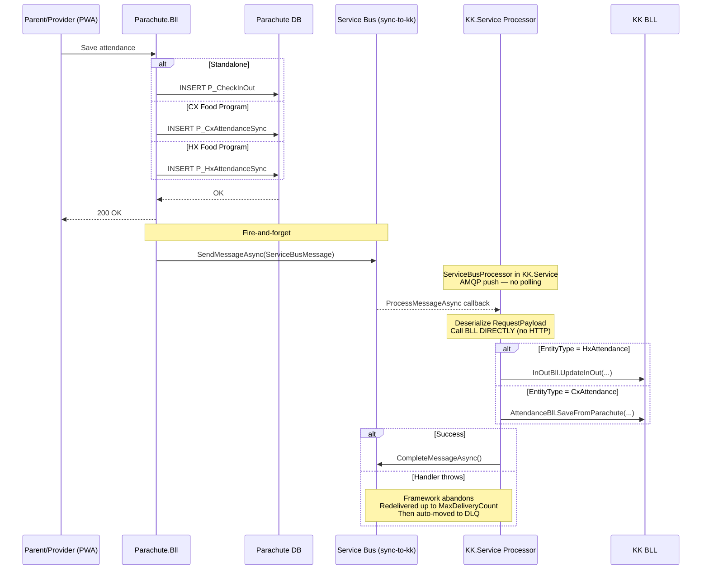
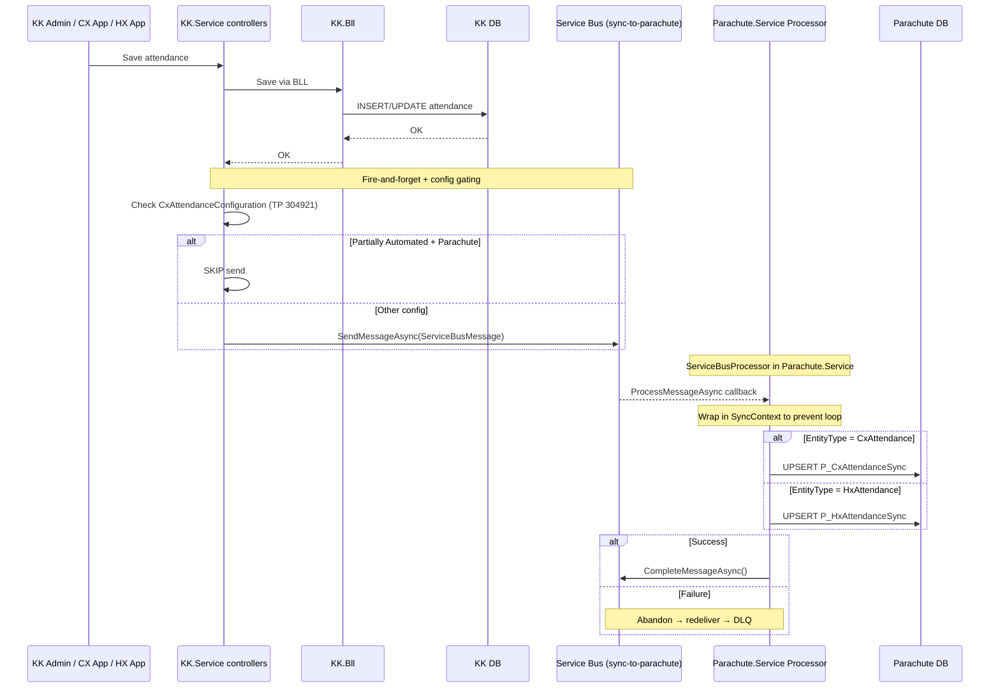

# Separate Attendance Tables in Parachute — Technical Design Plan (Azure Service Bus + Push Consumer)

**Ticket:** TP 315953
**Related:** TP 304921 (Configurable Attendance Source — Released)
**Date:** 2026-04-22
**Version:** 1.0
**Status:** Draft (alternative to Azure Queue plan)

---

## Table of Contents

1. [Performance Requirements & Expectations](#1-performance-requirements)
2. [Overview](#2-overview)
3. [Architecture](#3-architecture)
4. [Why Azure Service Bus (vs Azure Storage Queue)](#4-why-service-bus)
5. [Azure Storage Queue — Limitations & Mitigation Analysis](#5-storage-queue-limitations)
6. [Service Bus Tier Selection](#6-tier-selection)
7. [Cost Analysis](#7-cost-analysis)
8. [Database Design](#8-database-design)
9. [Data Flow — Sync via Service Bus](#9-data-flow)
10. [Sync Consumer — ServiceBusProcessor (Push Model)](#10-sync-consumer)
11. [Migration API](#11-migration-api)
12. [Auto-migrate on Child Enrollment](#12-auto-migrate)
13. [Config Gating (TP 304921)](#13-config-gating)
14. [KK Transfer Handler](#14-kk-transfer)
15. [Dead Letter Queue (Native)](#15-dlq)
16. [Error Handling & Logging](#16-error-handling)
17. [Impact Area](#17-impact-area)
18. [Testing Plan](#18-testing-plan)
19. [Implementation Phases](#19-implementation-phases)
20. [Open Items](#20-open-items)

---

## 1. Performance Requirements & Expectations

### 1.1 Data Volume

| Table | Records/Year | Migration Backfill (full historical) | 3-Year Projection | Category |
|---|---|---|---|---|
| `P_CheckInOut` (standalone) | ~1M | Existing (no migration) | ~3M | Small |
| `P_CxAttendanceSync` | **85M** | **~300M** (full CX historical) | **~555M** | Very Large |
| `P_HxAttendanceSync` | **81M** | **~570M** (full HX historical) | **~810M** | Very Large |
| `V_AllAttendance` (view) | ~166M new/year | **~870M historical (570M HX + 300M CX)** | **~1.36B** | Billion-scale |

**Daily throughput:** Production **1,000,000 msg/day × 22 working days = 22M msg/mo**. Dev + QA combined **2,000 msg/working day × 22 wd = 44K msg/mo**. Working days only (Mon–Fri).

### 1.2 Performance Targets

| Operation | Target Latency | Scale Context |
|---|---|---|
| Check-in/out screen (single site + date) | **< 50ms** | Query hits 1 partition (~7M rows) with covering index |
| Attendance report (sponsor + 1 month) | **< 500ms** | Scans 1-2 partitions via `V_AllAttendance` with Date filter |
| Invoice attendance check (per child) | **< 200ms** | Unique index seek `UX_Child_Date` |
| Sync message delivery | **< 100ms** | Service Bus AMQP push (no polling) |
| Sync throughput | **1M msg/day** = 22M/mo working days without backlog | Push-based consumer processes continuously |
| Migration API (bulk import) | **870M records full historical** (570M HX + 300M CX) | SqlBulkCopy, batch by sponsor + month |
| KK Transfer (bulk update) | **< 10 minutes** for largest sponsor | Batch 10K rows per iteration |

### 1.3 Sync Latency — Real-Time via AMQP Push

With Azure Service Bus + ServiceBusProcessor (AMQP push model):

| Stage | Latency |
|---|---|
| Entity save → `SendMessageAsync()` | ~50-150ms |
| Message in broker → consumer ProcessMessageAsync callback | **~10-50ms** (AMQP push) |
| Consumer → BLL direct call → write to DB | ~50-200ms (no HTTP overhead) |
| **Total end-to-end latency** | **~100-400 ms** |

Significantly faster than Storage Queue + polling (~1.5-4 seconds).

### 1.4 How Technical Solutions Meet These Requirements

| Requirement | Solution | Handles 715M rows / 1M msg/day? |
|---|---|---|
| Large table query performance | Monthly partitioning — queries scan ~7M rows/partition | **Yes** |
| Fast lookups on large tables | Partition-aligned covering indexes | **Yes** |
| Exclude deleted rows from queries | Filtered indexes (`WHERE record_status_code = 288`) | **Yes** |
| Sync transport (no DB load, no poll cost) | **Service Bus** — AMQP push, $0 DB load | **Yes** |
| Migration 870M rows full historical | SqlBulkCopy + batch by sponsor/month + skip existing + checkpoint via P_MigrationProgress | **Yes** |
| Insert 1M msg/day prod (= 22M/mo working days) | Nonclustered identity PK — sequential, no page splits | **Yes** |
| Index maintenance | Per-partition rebuild | **Yes** |
| Archive old data | `ALTER TABLE ... SWITCH PARTITION` — instant | **Yes** |

### 1.5 Mandatory Operational Requirements

| Requirement | Frequency | Why |
|---|---|---|
| **Archive data > 2 years** | Monthly | Keep ~330M active rows |
| **Index rebuild per partition** | Weekly | 7M inserts/month cause fragmentation |
| **UPDATE STATISTICS** | Weekly | Stale stats → bad query plans |
| **Reports MUST filter by Date** | Always | `V_AllAttendance` has no index |
| **Monitor active message count** | Continuous | Alert if consumer falls behind |
| **Monitor DLQ (native)** | Daily | Admin review failed messages |

### 1.6 Scaling Thresholds & Alert Actions

| Threshold | Action |
|---|---|
| Any table > 500M active rows | Review archive policy |
| Active message count > 10K | Alert — consumer falling behind, increase `MaxConcurrentCalls` |
| DLQ message count > 100 | Alert — admin review required |
| Check-in/out query > 200ms | Check index fragmentation |
| Report query > 3 seconds | Verify Date filter present |
| SB Standard ops > 100M/month | Review cost; consider tier downgrade or optimize message count |

---

## 2. Overview

### 2.1 Background

Currently, Parachute stores attendance data **only for standalone CX users**. For Food Program users (HX and CX), attendance data is stored exclusively in KidKare (KK) databases. Parachute must call KK APIs to retrieve this data.

### 2.2 Scope

- **Parachute stores attendance for ALL users** — standalone CX, Food Program CX, and Food Program HX
- **Bidirectional sync** between Parachute DB and KK DB via **Azure Service Bus**
- **Full historical data migration** of CX/HX attendance to Parachute — approximately **870 million records** (570M HX + 300M CX), executed per-year or in full per the runbook (operational details owned by DevOps/DBA)
- **Auto-migration** when new children enroll into Parachute
- **Parachute reports and invoices** read attendance from local DB
- **KK Transfer** (provider/sponsor) reflected in Parachute data
- **TP 304921 update**: Add Parachute as source for "Partially Automated Attendance"

### 2.3 Key Decisions

| # | Decision | Chosen Option |
|---|----------|---------------|
| 1 | Attendance table structure | **3 separate tables**: `P_CheckInOut` (standalone), `P_CxAttendanceSync` (CX), `P_HxAttendanceSync` (HX). View `V_AllAttendance` for unified queries. |
| 2 | **Sync transport** | **Azure Service Bus** (see Section 4 for comparison vs Storage Queue) |
| 3 | **Service Bus Tier** | **SB Basic** as default (covers 3/5 key limitations); upgrade to Standard only if Sessions/Dedup required (see Section 6) |
| 4 | Sync consumer hosting | **ServiceBusProcessor** hosted in-process (KK.Service / Parachute.Service) — push model, no Timer, no polling |
| 5 | Message send method | `sender.SendMessageAsync()` fire-and-forget after entity save |
| 6 | CX App / HX API sync | Both CX App and HX API call the SAME shared new API on KK.Service → KK.Service sends to Service Bus (centralized logic) |
| 7 | Config gating | Gate at send point in KK controllers (not at consumer level) |
| 8 | Migration approach | Online API, batch by sponsorId + month, skip existing |
| 9 | Loop prevention | `SyncContext` flag — inbound sync does NOT send message back |
| 10 | Table partitioning | Monthly partition on CX/HX attendance tables |
| 11 | Failed messages | **Native DLQ** — auto-routed by Service Bus after `MaxDeliveryCount` exceeded |
| 12 | CX/HX table schema | Source-native format (2 pairs CX, 3 pairs HX) |

---

## 3. Architecture

### 3.1 High-Level Architecture

```
+---------------------------------------------------------------------+
|                          SAVE SOURCES                                |
|                                                                      |
|  +------------+  +----------+  +--------+  +---------+  +---------+ |
|  | Parachute  |  | KK Web   |  | CX App |  | HX App  |  | APIM /  | |
|  | (PWA/Web)  |  | UI       |  | (.NET) |  | (VB6)   |  | Procare | |
|  +-----+------+  +----+-----+  +---+----+  +----+----+  +----+----+ |
+--------|--------------|------------|-------------|-------------|----+
         |              |            |             |             |
         v              v            v             v             v
  +-------------+  +---------------------------------------+
  |Parachute.Bll|  | KK.Service controllers                |
  | (save local |  | InOutController (HX mutations)        |
  |  + send SB) |  | AttendanceController (CX Save)        |
  +------+------+  | AttendanceSyncController (CX/HX apps) |
         |         | ParachuteHXServiceController          |
         |         +----------------+----------------------+
         |                          |
         |  fire-and-forget SendMessageAsync after BLL save
         |  every message MUST set SessionId = ChildId
         v                          v
  +-------------------------------------------------------------------+
  |  Azure Service Bus — 1 Standard namespace, region East US         |
  |  mm-attendance-sb (single namespace shared across environments)   |
  |                                                                   |
  |  attendance-sync-to-kk-{env}      attendance-sync-to-parachute-{env}
  |  (Parachute -> KK)                 (KK -> Parachute)              |
  |  + native $DeadLetterQueue         + native $DeadLetterQueue      |
  |  RequiresSession=true              RequiresSession=true           |
  |  RequiresDuplicateDetection=true   RequiresDuplicateDetection=true|
  +-----------------------------------+-------------------------------+
              |                                |
              |  AMQP push (ProcessSessionMessageAsync callback)
              |                                |
  +-----------v-----------+        +-----------v--------------+
  | KK.Service (same app) |        | Parachute.Service        |
  |                       |        | (same app)               |
  | ServiceBusSession-    |        | ServiceBusSession-       |
  |   Processor           |        |   Processor              |
  | MaxConcurrentSessions |        | MaxConcurrentSessions    |
  | = 16                  |        | = 16                     |
  | (sequential within    |        | (sequential within       |
  |  each ChildId session)|        |  each ChildId session)   |
  |                       |        |                          |
  | Deserialize message   |        | Deserialize message      |
  | -> call BLL directly: |        | -> upsert directly:      |
  |   InOutBll.UpdateInOut|        |   P_CxAttendanceSync     |
  |   AttendanceBll       |        |   P_HxAttendanceSync     |
  |     .SaveFromParachute|        |                          |
  +-----------------------+        +--------------------------+
                                              |
                                              v
+---------------------------------------------------------------------+
|                        Parachute DB                                  |
|                                                                      |
|  +---------------------------+ +---------------------------+        |
|  | P_CheckInOut              | | P_CxAttendanceSync        |        |
|  | (standalone only)         | | (ALL CX attendance)       |        |
|  | PARTITIONED monthly       | | PARTITIONED monthly       |        |
|  +---------------------------+ +---------------------------+        |
|                                                                      |
|  +---------------------------+ +---------------------------+        |
|  | P_HxAttendanceSync       | | V_AllAttendance (VIEW)    |        |
|  | (ALL HX attendance)       | | UNION ALL of 3 tables     |        |
|  | PARTITIONED monthly       | +---------------------------+        |
|  +---------------------------+                                      |
|                                                                      |
|  +---------------------------+ +---------------------------+        |
|  | P_MigrationProgress       | | P_Participant             |        |
|  +---------------------------+ +---------------------------+        |
+---------------------------------------------------------------------+
```

### 3.2 Service Bus topology

**1 shared namespace, 6 queues** (per customer decision 2026-05-06):

```
mm-attendance-sb (Service Bus Standard, East US, 1 namespace shared across envs)
├── attendance-sync-to-kk-dev
├── attendance-sync-to-parachute-dev
├── attendance-sync-to-kk-staging
├── attendance-sync-to-parachute-staging
├── attendance-sync-to-kk-prod
└── attendance-sync-to-parachute-prod

Each queue has a built-in $DeadLetterQueue sub-queue (not shown).
```

### 3.3 Data Flow — Two Directions

```
Direction 1: Parachute -> KK (~3K/day)
  Parachute user saves attendance on PWA/Web
  -> Parachute.Bll routes by child type -> save to correct table
  -> sender.SendMessageAsync(SessionId=ChildId) to "attendance-sync-to-kk-{env}"
  -> ServiceBusSessionProcessor in KK.Service receives PUSH callback -> calls InOutBll/AttendanceBll DIRECTLY (no HTTP)

Direction 2: KK -> Parachute (~1M msg/day prod working days)
  KK/CX/HX user saves attendance
  -> KK controllers save via BLL
  -> sender.SendMessageAsync(SessionId=ChildId) to "attendance-sync-to-parachute-{env}" (fire-and-forget after BLL)
  -> ServiceBusSessionProcessor in Parachute.Service receives PUSH callback -> upsert P_CxAttendanceSync / P_HxAttendanceSync DIRECTLY
```

---

## 4. Why Azure Service Bus (vs Azure Storage Queue)

### 4.1 Comparison Table

| Criteria | Azure Storage Queue | **Azure Service Bus (Chosen)** |
|----------|:------------:|:---------------------------:|
| **Max message size** | 64 KB (base64 = 48 KB raw) | **256 KB** (Basic/Standard) / 100 MB (Premium) |
| **Delivery model** | Polling (client pulls) | **Push via AMQP** (broker pushes to consumer) |
| **Sync latency** | 0-2000ms (poll interval) | **~10-50ms** (AMQP push) |
| **FIFO** | Best-effort only | Standard+: **Sessions** (strict FIFO per key) |
| **Duplicate detection** | None | Standard+: **Dedup window** (up to 7 days) |
| **Dead Letter Queue** | Manual (custom poison queue) | **Native DLQ** (auto after MaxDeliveryCount) |
| **Topic / Subscription (fan-out)** | None | Standard+: **Topics** supported |
| **Transactions** | None | Standard+: **Atomic cross-entity send/complete** |
| **Lock auto-renewal** | Fixed visibility timeout (30s) | **MaxAutoLockRenewalDuration** — framework renews during long handlers |
| **Retry with backoff** | Manual code | Built-in with `ScheduleMessageAsync` |
| **SDK** | `Microsoft.WindowsAzure.Storage` (legacy, deprecated) | **`Azure.Messaging.ServiceBus`** (modern v12+) |
| **Metrics** | Storage account level only | Per-queue portal metrics (Active, DLQ, Scheduled, Incoming) |
| **Cost @ prod 1M msg/day × 22 wd = 22M/mo** | $2.74 (LRS) | $3.30 (Basic) / **$52.61** (Standard) |
| **Cost @ dev+qa 2K/wd × 22 wd = 44K/mo** | $0.06 (LRS) | $0.01 (Basic) / $0.11 (Standard, shared ns) |
| **Consumer code size** | ~330 lines (Timer, poison, group-by hacks) | **~80 lines** (framework-driven) |

### 4.2 Decision Summary

**Azure Service Bus (Basic or Standard) chosen because:**
1. **Push model** — no polling overhead, real-time latency (~10-50ms vs 0-2s)
2. **256 KB message size** — removes 64 KB risk for large batch payloads
3. **Native DLQ** — eliminates custom poison queue maintenance
4. **Modern SDK** — avoids legacy SDK tech debt
5. **Sessions + Dedup** available on Standard if strict ordering/dedup needed
6. **Cost delta minimal for Basic** (+$0.56/month vs Storage Queue LRS at prod 22M/mo; +$49.87/month for Standard)
7. **75% less consumer code** — framework handles concurrency, retry, DLQ, lock renewal

---

## 5. Azure Storage Queue — Limitations & Mitigation Analysis

This section analyzes whether Storage Queue could be made to cover the 5 limitations via custom code. The purpose is to justify the migration to Service Bus.

### 5.1 The 5 Key Limitations

| # | Limitation | Description |
|---|---|---|
| 1 | Max message **64 KB** | Raw JSON after base64 ≈ 48 KB |
| 2 | **No Push** model | Consumer must poll |
| 3 | **No FIFO** guarantee | Best-effort ordering only |
| 4 | **No Duplicate Detection** | Producer retry creates duplicates |
| 5 | **No built-in DLQ** | No safe holding area for failed messages |

### 5.2 Can Custom Code Mitigate These? What's the Coverage & Risks?

| # | Limitation | Can be mitigated with custom code? | Approach | Coverage | Residual Risk |
|---|---|---|---|---|---|
| 1 | Max 64 KB | 🟡 Partial | **Claim-check pattern**: store payload in Blob, put blob URL in queue | **70%** | Added complexity (Blob read/write + cleanup); 2× storage cost; Blob read latency adds 50-100ms per message; Blob cleanup job required |
| 2 | No Push | ❌ No | Polling is fundamental to Storage Queue — can only **reduce poll interval** | **0%** (latency), can optimize cost | Shorter poll interval → more empty-poll ops → higher cost; longer poll → higher latency |
| 3 | No FIFO | 🟡 Partial | **App-level ordering**: group-by key + sequential processing within batch; **Last-Write-Wins** via `OccurredAt` timestamp check in consumer | **80%** | FIFO guaranteed only within one batch poll — cross-batch race still possible; LWW requires careful timestamp handling; no broker-level enforcement |
| 4 | No Dedup | 🟡 Partial | **DB-level idempotency**: UPSERT with natural key (ChildId + Date + InOutIndex); unique index | **90%** | Doesn't prevent broker delivering duplicates — consumer still burns CPU + DB roundtrip on each duplicate; harder to debug/monitor duplicates; requires unique constraint on every natural key |
| 5 | No DLQ | ✅ Yes | **Custom poison queue**: track `DequeueCount`, move to separate queue after N failures | **95%** | Requires custom code (~30 lines); admin tool to review/replay poison messages must be built separately; no native metrics for DLQ depth |

### 5.3 Overall Mitigation Coverage

**Weighted coverage: ~67%** (simple average of 5 items: 70% + 0% + 80% + 90% + 95% / 5).

**Remaining gaps even after full mitigation:**
- **Latency**: polling is fundamental; cannot achieve push-level latency (~10-50ms)
- **FIFO cross-batch**: best-effort only; edge cases during retry storms still race
- **Duplicate detection**: catches duplicates at DB level (after wasted processing), not at broker level
- **Cost of custom code**: ~330 lines of consumer logic to maintain vs ~80 lines with Service Bus

### 5.4 Hidden Costs of Full Mitigation

| Cost item | Estimate |
|---|---|
| Claim-check pattern implementation (Blob upload/download, cleanup job, error handling) | 5-7 days dev + ongoing maintenance |
| LWW timestamp logic (schema change + consumer check + monitoring skew) | 2-3 days dev |
| DB-level idempotency (unique indexes, UPSERT refactor, conflict handling) | 3-4 days dev |
| Custom poison queue + admin review UI | 3-5 days dev |
| Monitoring & alerting for all the above (no native portal metrics) | 2-3 days dev |
| **Total mitigation effort** | **~15-22 days dev** |
| **Tech debt carried indefinitely** | Deprecated SDK, custom code to maintain forever |

### 5.5 Conclusion

Storage Queue **can be partially mitigated (~67% coverage)** but at significant cost:
- 15-22 days of custom code
- Permanent tech debt (legacy SDK, custom poison, custom FIFO)
- Worse latency (cannot fix polling model)
- Higher total cost-of-ownership when maintenance is factored in

Service Bus provides better coverage **natively** at **< $1/month additional cost (Basic tier)** and with ~75% less code.

---

## 6. Service Bus Tier Selection

### 6.1 Tier Coverage of the 5 Limitations

| # | Limitation | SB Basic | SB Standard | SB Premium |
|---|---|---|---|---|
| 1 | Max 64 KB | ✅ 256 KB | ✅ 256 KB | ✅ 100 MB |
| 2 | No Push | ✅ AMQP push | ✅ AMQP push | ✅ AMQP push |
| 3 | No FIFO | ❌ | ✅ Sessions | ✅ Sessions |
| 4 | No Dedup | ❌ | ✅ Dedup window | ✅ Dedup window |
| 5 | No DLQ | ✅ Native DLQ | ✅ Native DLQ | ✅ Native DLQ |
| — | **Coverage** | **3/5 (60%)** | **5/5 (100%)** | **5/5 (100%)** |

### 6.2 Selected Tier — Service Bus Standard (customer-approved 2026-05-06)

**Decision**: **Service Bus Standard**.

Rationale:
- Project requires **Sessions** (FIFO per ChildId) — only available from Standard tier upward.
- Project requires **broker-level duplicate detection** — only available from Standard tier upward.
- Premium ($677/month minimum) is not justified at projected volume (prod 1M msg/day = 22M/mo working days). Geo-DR is not required (regional availability acceptable; source DBs remain source of truth).

**Coverage on this tier**: 5/5 limitations of Storage Queue resolved natively, no application-level mitigation needed.

---

## 7. Cost Analysis

### 7.1 Assumptions

| Parameter | Value |
|---|---|
| Receive pattern | PeekLock (reliable) |
| Operations per message | 3 (Send + Receive + Complete) — see 7.2 below |
| Message size | ≤ 64 KB (no chunking multiplier) |
| Region | Same region as producer/consumer (egress = $0) |

### 7.2 How Service Bus counts operations

Service Bus bills **per messaging operation** — each API call against the broker counts as 1 operation. The total ops for a message lifecycle depends on the receive pattern:

| API call | Counts as |
|---|---|
| `SendMessageAsync` | 1 op per message |
| `ReceiveMessagesAsync` | 1 op per call (a batched receive of N messages still counts as 1) |
| `CompleteMessageAsync` | 1 op per message |
| `AbandonMessageAsync` | 1 op per message |
| `DeadLetterMessageAsync` | 1 op per message |
| `RenewMessageLockAsync` | 1 op per call |
| `ScheduleMessageAsync` | 1 op per message + storage retention |
| `PeekMessageAsync` | 1 op per call |

**Message lifecycle ops by pattern**:

| Pattern | Ops per message |
|---|---|
| **PeekLock** (reliable, used in this design) | **3** = 1 Send + 1 Receive + 1 Complete |
| ReceiveAndDelete (less reliable, lossy on consumer crash) | 2 = 1 Send + 1 Receive (combined receive+delete) |
| With one retry (handler throws, abandon, redeliver, complete) | 5 = 1 Send + 2 Receive + 1 Abandon + 1 Complete |

**Message size multiplier**:
- Messages ≤ 64 KB: each Send / Receive counts as **1 op**
- Messages > 64 KB: charged in 64 KB increments — a 256 KB message Send counts as **4 ops**, Receive also **4 ops**

For attendance sync this design assumes the typical message stays under 64 KB; Sessions and dedup envelope properties do not change the op count.

**Why 3 ops per message in this plan**:
- We use PeekLock to guarantee no message loss on consumer crash — that requires explicit Complete after the apply succeeds.
- We do not assume retries in the baseline cost (transient errors are < 1% in practice; their additional ops are absorbed in the rounding).

If the actual production retry rate is higher than expected, the cost effectively rounds up by ~1 extra op per retried message.

### 7.3 Unit Rates (Azure East US, 2024)

| Item | Rate |
|---|---|
| Storage Queue LRS — Transaction | $0.04 / 1M ops |
| Storage Queue LRS — Storage | $0.045 / GB-month |
| Storage Queue GRS — Transaction | $0.05 / 1M ops |
| Storage Queue GRS — Storage | $0.09 / GB-month |
| SB Basic — Operations | $0.05 / 1M ops |
| SB Standard — Base fee | $9.81 / month |
| SB Standard — Free ops | 12.5M / month |
| SB Standard — Ops overage | $0.80 / 1M ops |

### 7.4 Scenario A — Dev + QA: 2K msg/working day × 22 wd = 44K msg/month

**Ops**: Storage Queue 1.432M (3 ops/msg + 1.3M polls) — Service Bus 132K (3 ops/msg, no polls)

| Service | Transaction | Storage | Base fee | Overage | **TOTAL/month** | **TOTAL/year** |
|---|---|---|---|---|---|---|
| Storage Queue LRS | 1.432M × $0.04/M = $0.057 | 0.01 GB × $0.045 = $0.0005 | — | — | **$0.06** | **$0.69** |
| Storage Queue GRS | 1.432M × $0.05/M = $0.072 | 0.01 GB × $0.09 = $0.001 | — | — | **$0.07** | **$0.87** |
| **SB Basic** | 132K × $0.05/M = $0.007 | included | $0 | — | **$0.01** | **$0.08** |
| SB Standard (shared ns w/ prod) | — | included | $0 incremental | 132K × $0.80/M = $0.11 | **$0.11** | **$1.27** |
| SB Standard (separate ns) | — | included | $9.81 | 132K within 12.5M free = $0 | **$9.81** | **$117.72** |

### 7.5 Scenario B — Production: 1M msg/day × 22 wd = 22M msg/month

**Ops**: Storage Queue 67.3M — Service Bus 66M

| Service | Transaction | Storage | Base fee | Overage | **TOTAL/month** | **TOTAL/year** |
|---|---|---|---|---|---|---|
| Storage Queue LRS | 67.3M × $0.04/M = $2.692 | 1 GB × $0.045 = $0.045 | — | — | **$2.74** | **$32.84** |
| Storage Queue GRS | 67.3M × $0.05/M = $3.365 | 1 GB × $0.09 = $0.090 | — | — | **$3.46** | **$41.46** |
| **SB Basic** | 66M × $0.05/M = $3.30 | included | $0 | — | **$3.30** | **$39.60** |
| SB Standard | — | included | $9.81 | (66M − 12.5M) × $0.80/M = $42.80 | **$52.61** | **$631.32** |

### 7.6 Summary — Prod + Dev/QA Combined

| Service | Prod 22M/mo | Dev+QA 44K/mo (shared ns) | **Combined / mo** | **Combined / yr** |
|---|---|---|---|---|
| Storage Queue LRS | $2.74 | $0.06 | **$2.80** | **$33.53** |
| Storage Queue GRS | $3.46 | $0.07 | $3.53 | $42.33 |
| SB Basic | $3.30 | $0.01 | $3.31 | $39.68 |
| **SB Standard (selected)** | **$52.61** | **$0.11** | **$52.72** | **$632.59** |

### 7.7 Selected Tier — Service Bus Standard

Customer approved **Service Bus Standard** (decision 2026-05-06) because the project requires **Sessions (FIFO per ChildId)** and **Duplicate Detection**, both of which are unavailable on Storage Queue and SB Basic.

| Cost line | Storage Queue LRS | SB Standard | Delta |
|---|---|---|---|
| Prod / mo (22M msg) | $2.74 | $52.61 | +$49.87 / mo |
| Dev+QA / mo (44K msg, shared ns) | $0.06 | $0.11 | +$0.05 / mo |
| **Combined / mo** | **$2.80** | **$52.72** | **+$49.92 / mo** |
| **Combined / yr** | **$33.53** | **$632.59** | **+$599.06 / yr** |

The cost premium pays for: native Sessions FIFO, broker-level duplicate detection, native DLQ, push delivery, 256 KB message size — eliminating the application-level mitigation work that would otherwise be needed on Storage Queue.

### 7.8 Notes on Pricing

- Rates above are Azure East US, Microsoft published pricing 2024 — **must be verified at [Azure Pricing Calculator](https://azure.microsoft.com/pricing/calculator/) before final commitment** (rates change yearly).
- All volumes are working-day basis (22 wd / month) per project assumption — production traffic flows on Mon–Fri only.
- Costs exclude: compute host for consumer, Application Insights, SQL storage for sync tables.
- SB does not charge for storage separately (included in base / operation pricing).
- 1 shared namespace is used across dev/staging/prod, so the $9.81 base fee is paid **once** (not per environment).
- See `315953\queue-cost-comparison.md` for cross-vendor comparison including RabbitMQ self-hosted and CloudAMQP managed.

---

## 8. Database Design

### 8.1 Tables Overview

```
Parachute DB
|
+-- P_CheckInOut              (standalone only — unchanged)
+-- P_CxAttendanceSync        (ALL CX attendance — NEW)
+-- P_HxAttendanceSync        (ALL HX attendance — NEW)
+-- V_AllAttendance           (VIEW — NEW)
+-- P_MigrationProgress       (migration tracking — NEW)
+-- P_AttendanceSyncAudit     (optional audit trail — NEW, INSERT-only)
|
+-- NO P_AttendanceSyncLog    (replaced by Service Bus)
```

### 8.2 P_CheckInOut — Standalone (Unchanged)

Existing table, no schema changes. Only stores standalone Parachute users (`IsOnlyParachute = true`).

### 8.3 P_CxAttendanceSync — ALL CX Attendance

Stores all CX attendance: Parachute CX saves + KK/CX App synced. Source-native: 2 in/out pairs per row.

```sql
CREATE TABLE P_CxAttendanceSync (
    Id                      int IDENTITY(1,1) NOT NULL,
    SponsorId               int NOT NULL,
    SiteId                  varchar(50) NOT NULL,
    ChildId                 uniqueidentifier NOT NULL,
    CxChildId               int NULL,
    CenterId                int NULL,
    Date                    datetime NOT NULL,
    FirstInTime             datetime NULL,
    FirstOutTime            datetime NULL,
    SecondInTime            datetime NULL,
    SecondOutTime           datetime NULL,
    FirstTemperature        decimal(5,2) NULL,
    SecondTemperature       decimal(5,2) NULL,
    SourceSystem            smallint NOT NULL DEFAULT 2,
    ExternalId              varchar(100) NULL,
    -- Audit columns (ParachuteBase)...
    CONSTRAINT PK_CxAttSync PRIMARY KEY NONCLUSTERED (Id, Date)
) ON ps_Attendance_Monthly(Date);
```

**Indexes:** IX_SiteId_Date (covering), IX_SponsorId_Date, UX_Child_Date (UNIQUE) — all partition-aligned, filtered `WHERE record_status_code = 288`.

**Key for idempotency:** `UX_Child_Date` guarantees UPSERT idempotency at consumer — critical when SB Basic is used (no broker-level dedup).

### 8.4 P_HxAttendanceSync — ALL HX Attendance

Same as CX but 3 in/out pairs. `ChildId` (Guid) matches HX directly. SourceSystem DEFAULT 3.

### 8.5 V_AllAttendance — Unified View

UNION ALL of P_CheckInOut + CX (expand 2 pairs) + HX (expand 3 pairs). Normalized to InOutIndex format for reports/invoices.

### 8.6 P_MigrationProgress

```sql
CREATE TABLE P_MigrationProgress (
    Id              int IDENTITY PRIMARY KEY,
    SponsorId       int NOT NULL,
    SourceSystem    varchar(10) NOT NULL,
    MonthYear       datetime NOT NULL,
    Status          varchar(20) NOT NULL,       -- 'InProgress'|'Completed'|'Failed'|'Abandoned'
    RowsInserted    int NULL,
    RowsSkipped     int NULL,
    Attempts        int NOT NULL DEFAULT 0,
    StartedAt       datetime2 NULL,
    CompletedAt     datetime2 NULL,
    ErrorMessage    nvarchar(max) NULL
);
```

### 8.7 P_AttendanceSyncAudit (Optional — Audit Trail)

Service Bus DLQ preserves failed messages natively. Optional audit for successful sync:

```sql
CREATE TABLE P_AttendanceSyncAudit (
    Id              bigint IDENTITY PRIMARY KEY,
    Direction       smallint NOT NULL,
    ChildId         uniqueidentifier NOT NULL,
    AttendanceDate  datetime NOT NULL,
    Action          varchar(10) NOT NULL,       -- 'Synced' | 'Failed' | 'DeadLettered'
    ErrorMessage    nvarchar(500) NULL,
    CreatedAt       datetime2 NOT NULL DEFAULT SYSUTCDATETIME()
);
```

### 8.8 Monthly Partition + Indexes

Partition function `pf_Attendance_Monthly`, scheme `ps_Attendance_Monthly`. Applied to P_CxAttendanceSync and P_HxAttendanceSync.

---

## 9. Data Flow — Sync via Service Bus

### 9.1 Message Format

Each Service Bus message carries:

| Field | Description |
|---|---|
| `EntityType` | `"CxAttendance"` or `"HxAttendance"` |
| `RequestPayload` | JSON of the original business payload — consumer deserializes and calls the corresponding BLL method directly |
| `CorrelationId` | End-to-end tracing identifier |
| `OccurredAt` | UTC timestamp when the producer emitted the event |

Service Bus envelope properties set by the producer:

| Property | Value |
|---|---|
| `MessageId` | Deterministic — composed of `EntityType`, `ChildId`, `Date`, `ChangeType`, `OccurredAt` — enables broker-level duplicate detection |
| `ContentType` | `application/json` |
| `SessionId` | `ChildId` — enables FIFO per child (Sessions feature on Standard tier) |

### 9.2 Message Send — Fire-and-Forget

The producer wraps the send in a fire-and-forget task. If the send fails (rare, transient), the failure is logged and a reconciliation pass catches the missed event later.

### 9.3 Sources and Send Methods

| Source | Queue | Method |
|--------|-------|--------|
| **Parachute.Bll** (Attendance.cs) | `attendance-sync-to-kk` | `ServiceBusSender.SendMessageAsync()` after local save |
| **KK.Service** controllers | `attendance-sync-to-parachute` | `ServiceBusSender.SendMessageAsync()` after BLL save |
| **CX App** | via shared KK.Service API | KK.Service forwards to SB |
| **HX API** | via shared KK.Service API | KK.Service forwards to SB |

### 9.4 Sequence Diagram — Direction 1: Parachute → KK



### 9.5 Sequence Diagram — Direction 2: KK → Parachute



### 9.6 Loop Prevention

A thread-static `SyncContext` flag prevents the consumer from re-sending an event back to Service Bus when it applies inbound sync. Mechanism: the apply call is wrapped in a `SyncContext` scope; BLL save methods check the flag before scheduling an outbound message and skip the send if the flag is set. The flag is automatically cleared when the scope exits.

### 9.7 Shared API for CX App / HX API Integration (TP 322493)

CX App and HX API save attendance locally in their own databases first, then notify KK through a shared HTTP endpoint. KK validates the request, wraps the payload into an `AttendanceSyncMessage`, and publishes it to the `attendance-sync-to-parachute` queue.

#### 9.7.1 Endpoints

| Caller | HTTP Method | Route | Entity Type (set from route) |
|---|---|---|---|
| CX App | `POST` | `cxintegration/attendance-sync/notify` | `CxAttendance` |
| HX API | `POST` | `hxintegration/attendance-sync/notify` | `HxAttendance` |

Both routes map to the same `AttendanceSyncController` and share a common `Forward()` helper internally. The route prefix matches the existing `KidKare.Integration` base URL used by CX App (`.../KidKare/cxintegration`) and HX API (`.../KidKare/hxintegration`) so neither caller needs to change its base URL configuration.

#### 9.7.2 Request Contract

| Field | Type | Notes |
|---|---|---|
| `SponsorId` | int (HX only) | Tenant identifier on HX side |
| `ProviderId` | Guid (HX only) | Provider/site identifier on HX side |
| `ClientId` | int (CX only) | Tenant identifier on CX side |
| `CenterId` | int (CX only) | Center identifier on CX side |
| `AttendanceDate` | datetime | Date of attendance |
| `CorrelationId` | string | Optional. KK generates if omitted. |
| `Payload` | object (JSON) | Full business payload, forwarded as-is to the queue |

#### 9.7.3 Sample Payload — CX App

```http
POST https://{kk-base}/KidKare/cxintegration/attendance-sync/notify HTTP/1.1
Authorization: Basic base64({username}:{password_or_idToken})
Content-Type: application/json; charset=utf-8

{
  "ClientId": 123,
  "CenterId": 456,
  "AttendanceDate": "2026-04-22T00:00:00Z",
  "CorrelationId": "optional-client-gen-guid-for-debug",
  "Payload": {
    "Site": {
      "OwnerId": 123,
      "CenterId": 456
    },
    "AttendanceDate": "2026-04-22T00:00:00Z",
    "IsCxSponsor": false,
    "ChangeType": "Upsert",
    "UserId": 999,
    "Children": [
      {
        "CxChildId": 12345,
        "FirstInTime": "2026-04-22T08:00:00Z",
        "FirstOutTime": "2026-04-22T12:00:00Z",
        "SecondInTime": "2026-04-22T13:00:00Z",
        "SecondOutTime": "2026-04-22T17:00:00Z",
        "FirstTemperature": 36.5,
        "SecondTemperature": 36.8,
        "IsPresent": true,
        "IsSchoolOut": false,
        "IsInfant": false
      },
      {
        "CxChildId": 12346,
        "FirstInTime": null,
        "FirstOutTime": null,
        "SecondInTime": null,
        "SecondOutTime": null,
        "FirstTemperature": null,
        "SecondTemperature": null,
        "IsPresent": false,
        "IsSchoolOut": true,
        "IsInfant": false
      }
    ]
  }
}
```

**CX Delete scenario** (remove attendance for one or more children):

```json
{
  "ClientId": 123,
  "CenterId": 456,
  "AttendanceDate": "2026-04-22T00:00:00Z",
  "Payload": {
    "Site": { "OwnerId": 123, "CenterId": 456 },
    "AttendanceDate": "2026-04-22T00:00:00Z",
    "ChangeType": "Delete",
    "UserId": 999,
    "Children": [
      { "CxChildId": 12345 }
    ]
  }
}
```

#### 9.7.4 Sample Payload — HX API

```http
POST https://{kk-base}/KidKare/hxintegration/attendance-sync/notify HTTP/1.1
Authorization: Basic base64({username}:{password_or_idToken})
Content-Type: application/json; charset=utf-8

{
  "SponsorId": 123,
  "ProviderId": "aaaaaaaa-bbbb-cccc-dddd-eeeeeeeeeeee",
  "AttendanceDate": "2026-04-22T00:00:00Z",
  "CorrelationId": "optional-client-gen-guid-for-debug",
  "Payload": {
    "Site": {
      "OwnerId": 123,
      "ProviderId": "aaaaaaaa-bbbb-cccc-dddd-eeeeeeeeeeee"
    },
    "Date": "2026-04-22T00:00:00Z",
    "ChangeType": "Upsert",
    "UserId": 888,
    "Children": [
      {
        "ChildId": "11111111-2222-3333-4444-555555555555",
        "FirstInTime": "2026-04-22T08:00:00Z",
        "FirstOutTime": "2026-04-22T11:30:00Z",
        "SecondInTime": "2026-04-22T13:00:00Z",
        "SecondOutTime": "2026-04-22T17:00:00Z",
        "ThirdInTime": null,
        "ThirdOutTime": null,
        "FirstTemperature": 36.5,
        "SecondTemperature": 36.7,
        "ThirdTemperature": null
      }
    ]
  }
}
```

**HX Delete scenario**:

```json
{
  "SponsorId": 123,
  "ProviderId": "aaaaaaaa-bbbb-cccc-dddd-eeeeeeeeeeee",
  "AttendanceDate": "2026-04-22T00:00:00Z",
  "Payload": {
    "Site": { "OwnerId": 123, "ProviderId": "aaaaaaaa-bbbb-cccc-dddd-eeeeeeeeeeee" },
    "Date": "2026-04-22T00:00:00Z",
    "ChangeType": "Delete",
    "UserId": 888,
    "Children": [
      { "ChildId": "11111111-2222-3333-4444-555555555555" }
    ]
  }
}
```

#### 9.7.5 Field Reference

**Outer request (common to CX & HX):**

| Field | Type | Required | Notes |
|---|---|---|---|
| `ClientId` / `SponsorId` | int | CX / HX respectively | Identifies tenant |
| `CenterId` / `ProviderId` | int / Guid | CX / HX respectively | Identifies site |
| `AttendanceDate` | DateTime (UTC) | ✅ | Date of attendance |
| `CorrelationId` | string | ❌ | Client-generated; if omitted KK generates a new one |
| `Payload` | JSON object | ✅ | Full business payload forwarded as-is to the queue |

**CX `Payload.Children[i]`:**

| Field | Type | Required | Notes |
|---|---|---|---|
| `CxChildId` | int | ✅ | Original CX `child_id` |
| `FirstInTime` ... `SecondOutTime` | DateTime (UTC) | ❌ | Two in/out pairs; null if not recorded |
| `FirstTemperature` / `SecondTemperature` | decimal(5,2) | ❌ | Per-session temperature |
| `IsPresent` | bool | ❌ | `false` = absent (all times null) |
| `IsSchoolOut` | bool | ❌ | School-out status |
| `IsInfant` | bool | ❌ | Infant flag |

**HX `Payload.Children[i]`:**

| Field | Type | Required | Notes |
|---|---|---|---|
| `ChildId` | Guid | ✅ | HX `child_id` (maps directly to Parachute `ChildId`) |
| `FirstInTime` ... `ThirdOutTime` | DateTime (UTC) | ❌ | Three in/out pairs |
| `FirstTemperature` / `SecondTemperature` / `ThirdTemperature` | decimal(5,2) | ❌ | Per-session temperature |

#### 9.7.6 Response Codes

| Status | Body | Meaning | Caller action |
|---|---|---|---|
| `200 OK` | `{ "Accepted": true, "CorrelationId": "..." }` | Queue accepted the message | None |
| `400 BadRequest` | `{ "Message": "Payload is required" }` | Invalid payload | Fix and do NOT retry |
| `401 Unauthorized` | `{ "Message": "Authorization denied" }` | Auth failed | Refresh credentials/token, retry once |
| `500 InternalServerError` | Generic error | KK or queue failure | Retry with exponential backoff |

#### 9.7.7 Recommended Retry Policy (caller side)

| Situation | Retry? | Backoff |
|---|---|---|
| `200` | — | — |
| `400 BadRequest` | No | — (fix payload) |
| `401 Unauthorized` | Once, after refreshing token | Immediate |
| `500` / network timeout | Up to 3 times | Exponential: 2s, 4s, 8s |
| All retries exhausted | Persist payload locally, retry batch later | — |

#### 9.7.8 Developer Notes for CX App / HX API Teams

1. **Timestamps in UTC** — avoid timezone drift bugs.
2. **CorrelationId** — client should generate a unique id (Guid/ULID) for each logical save to enable end-to-end tracing in Application Insights.
3. **Payload is flexible** — the `Payload` property is a JObject. Additional fields can be added later without breaking the outer DTO.
4. **Batch size** — multiple children in one request is OK; practical limit is ~100 children per call to keep the request body manageable.
5. **Delete semantics** — when `ChangeType = "Delete"`, only the identifying fields (`CxChildId` or `ChildId`) are required; time and temperature fields can be omitted.
6. **Authorization format** — `Authorization: Basic base64(username:credential)`. Use `password` for legacy SSO or `idToken` for Azure SSO, following the `IsAllowSupportOldSSO` feature flag on the caller side.
7. **Fire-and-forget on caller** — the notify endpoint is asynchronous; don't block user-facing UI waiting for the response.

---

## 10. Sync Consumer — ServiceBusSessionProcessor (Push Model + FIFO per session)

Because the queues are configured with `RequiresSession = true` (per-ChildId FIFO), consumers MUST use `ServiceBusSessionProcessor` rather than the simpler `ServiceBusProcessor`.

### 10.1 Hosting Decision — In-Process, Push-Based

Consumer uses `ServiceBusSessionProcessor` hosted inside existing service process (KK.Service / Parachute.Service) — NOT as WebJob, NOT as Azure Function.

**Deployment layout:**

```
KK.Service (existing IIS app)
├── Existing controllers, InvoiceScheduler, CxInvoiceScheduler
└── AttendanceSyncProcessor (NEW) → receives from attendance-sync-to-kk-{env}

Parachute.Service (existing IIS app)
├── Existing controllers, schedulers
└── AttendanceSyncProcessor (NEW) → receives from attendance-sync-to-parachute-{env}
```

### 10.2 Consumer Behavior (Sessions Enabled)

The consumer uses a Service Bus **session processor** (because queues have `RequiresSession = true`). Behavior in plain terms:

- The processor accepts up to N concurrent sessions (configurable, e.g., 16). Each session corresponds to a unique `SessionId` (= `ChildId`).
- Within one session, messages are processed strictly sequentially (FIFO per child).
- Across different sessions, messages are processed in parallel.
- Messages are not auto-completed — the handler explicitly completes after a successful apply, or explicitly dead-letters non-retriable failures.
- For other (retriable) failures, the handler lets the exception bubble. The framework abandons the message and Service Bus redelivers up to `MaxDeliveryCount` before auto-routing to the DLQ.
- The framework auto-renews the message lock for slow handlers up to `MaxAutoLockRenewalDuration` (e.g., 5 minutes).

Producer requirement (both sides): every outgoing message MUST set `SessionId = ChildId.ToString()` (so updates for the same child land in the same session) and a deterministic `MessageId` composed of entity type, child, date, change type, and timestamp (so duplicate detection drops redundant retries at the broker).

### 10.3 Queue Creation (One-time Setup, Manual via Azure Portal)

Queues are provisioned manually through the Azure Portal (no IaC, per customer decision). Configuration applied to each queue:

| Setting | Value |
|---|---|
| `MaxDeliveryCount` | 2 |
| `DefaultMessageTimeToLive` | 3 days |
| `LockDuration` | 30 seconds |
| `RequiresSession` | true (FIFO per ChildId) |
| `RequiresDuplicateDetection` | true |
| `DuplicateDetectionHistoryTimeWindow` | 10 minutes |

Repeat for all 6 queues (3 environments × 2 directions).

### 10.4 Autofac Registration

The processor class is registered as a singleton, auto-activated when the container builds, and starts processing on activation so it begins receiving messages as soon as the host process boots.

### 10.5 Jobs Summary

| Job | Queue | Logic | Model |
|-----|-------|-------|:-------------:|
| **KK.Service Processor** | `attendance-sync-to-kk` | Receive → call `InOutBll.UpdateInOut()` / `AttendanceBll.SaveFromParachute()` directly → complete | Push (AMQP) |
| **Parachute.Service Processor** | `attendance-sync-to-parachute` | Receive → upsert `P_Cx/HxAttendanceSync` via `ParachuteContext` → complete | Push (AMQP) |
| **Reconciliation** | N/A (DB query) | Compare KK vs Parachute → send missing messages | Scheduled (future phase) |

### 10.6 Load Analysis — Why In-process is Safe

- Daily volume: prod 1M msg/day = 22M / 22 wd / 86,400 s = **~11.6 messages/sec average** (peak higher during business hours)
- Dev + QA combined: 2K msg/working day = ~0.02 msg/sec (negligible)
- Each message = 1-2 DB operations via BLL
- Negligible vs existing web traffic

**Throttling**: governed by app settings (`AttendanceSync.MaxConcurrentCalls`, `AttendanceSync.PrefetchCount`, `AttendanceSync.MaxAutoLockRenewalDuration`). Tuned per environment by DevOps.

### 10.7 Multi-instance Safety

KK.Service typically runs multiple instances. Service Bus handles this natively:
- Competing consumers pattern built-in
- Message lock ensures only one instance processes each message
- No coordination code required

---

## 11. Migration API

Same as Azure Queue plan. Hosted in KK.Service. `POST /admin/migration/attendance`.

- Batch by sponsorId + month
- 1 CX row → 1 P_CxAttendanceSync row (source-native, no transform)
- 1 HX row → 1 P_HxAttendanceSync row
- Skip existing (WHERE NOT EXISTS on ChildId + Date)
- SqlBulkCopy for performance
- Track progress in P_MigrationProgress (Attempts → Abandoned after 3 fails)

---

## 12. Auto-migrate on Child Enrollment

Same as Azure Queue plan. Hook into P_Participant INSERT → fire-and-forget `MigrateForChild()`.

---

## 13. Config Gating (TP 304921)

Gate at the **send point** (not at consumer level). After the business save in KK BLL, before sending a message to Service Bus, KK reads the `CxAttendanceConfiguration` for the center. If the mode is "All Automatically Imported" or "Partially Automated with Parachute as source", KK does NOT publish the event — Parachute is the source of truth and the KK override (if any) stays inside KK. For all other modes, the event is published normally.

| Config | Source | Parachute→KK | KK sends to SB? |
|--------|--------|:------------:|:-------------------:|
| All Imported | Parachute | YES | NO (read-only) |
| Partially Automated | Parachute (NEW) | YES | **NO** |
| Manual | -- | NO | YES |

---

## 14. KK Transfer Handler

Same as Azure Queue plan. Hook into existing KK Transfer API → bulk UPDATE P_CheckInOut, P_CxAttendanceSync, P_HxAttendanceSync.

---

## 15. Dead Letter Queue (Native)

### 15.1 How It Works

Service Bus provides a **native DLQ** for every queue (`$DeadLetterQueue` sub-queue). Messages are auto-routed when:
- `DeliveryCount` > `MaxDeliveryCount` (default 10, we set 2)
- Explicit call to `DeadLetterMessageAsync(reason, description)`
- TTL expires (`DefaultMessageTimeToLive`)

No custom code needed. Admin reviews DLQ via Azure Portal, Service Bus Explorer, or custom dashboard.

### 15.2 DLQ Rules

1. Set `MaxDeliveryCount = 2` when creating queue
2. Monitor DLQ message count — alert if > 100
3. Admin can manually resubmit messages after fixing root cause, or discard if non-recoverable
4. Messages in DLQ persist indefinitely until admin acts (unless TTL set on DLQ)
5. Optional: schedule periodic DLQ drain job that logs + auto-discards after N days

### 15.3 Comparison vs Custom Poison Queue (Storage Queue)

| Aspect | Storage Queue custom poison | **Service Bus native DLQ** |
|---|---|---|
| Code required | ~30 lines in consumer | 1 config line (`MaxDeliveryCount`) |
| Admin review UI | Must build or use Azure Storage Explorer | **Azure Portal native UI** |
| Metrics | Custom Application Insights logging | **Built-in DLQ depth metric** |
| Alert | Custom logic | **Native metric alerts** |
| Replay to main queue | Custom tool | Native "Resubmit" in portal |

---

## 16. Error Handling & Logging

| Scenario | Handling |
|----------|---------|
| `SendMessageAsync` fails | Log warning; reconciliation catches later |
| CX/HX App API call fails | Log warning; fire-and-forget, reconciliation catches |
| Consumer: handler throws (retriable) | Framework abandons → redelivered → up to `MaxDeliveryCount` → auto-DLQ |
| Consumer: handler throws `NonRetriableException` | Explicit `DeadLetterMessageAsync` — immediate DLQ |
| Service Bus outage (~SLA 99.9%) | Sender retries via SDK built-in policy; messages buffer; consumer reconnects |
| Migration source DB timeout | Resume from failed month on re-run |
| Duplicate message (producer retry < dedup window) | SB Standard: auto-dropped. SB Basic: consumer UPSERT idempotent → no effect |
| Out-of-order message delivery | SB Standard with Sessions: guaranteed order per SessionId. SB Basic: consumer LWW check via `OccurredAt` |

### Monitoring

- **Active message count:** Azure Portal → Service Bus namespace → queue metrics
- **DLQ depth:** native metric, alert if > 0
- **Processing rate:** custom Application Insights events per message
- **ServiceBusProcessor errors:** `ProcessErrorAsync` handler → Application Insights
- **Optional audit:** `SELECT Action, COUNT(*) FROM P_AttendanceSyncAudit GROUP BY Action`

---

## 17. Impact Area

### Systems Affected

| System | Change Type | Details |
|--------|:-----------:|---------|
| **Parachute DB** | Schema | CREATE P_CxAttendanceSync, P_HxAttendanceSync, V_AllAttendance, P_MigrationProgress, partition, indexes |
| **Azure Service Bus** | New | **1 shared namespace** in **East US** (Standard tier), provisioned **manually via Azure Portal**, hosting **6 queues** (`attendance-sync-to-{kk\|parachute}-{dev\|staging\|prod}`). Each queue is configured with `RequiresSession=true`, `RequiresDuplicateDetection=true`, `MaxDeliveryCount=2`, `DefaultMessageTimeToLive=3 days`, `LockDuration=30s`. |
| **Parachute.Bll** | Code | Save/Get refactored to use local tables. `AttendanceSyncQueueSender` uses `ServiceBusSender` and sets `SessionId = ChildId` on every message. `AttendanceSyncProcessor` uses `ServiceBusSessionProcessor`. |
| **Parachute.Service** | Code | Hosts ServiceBusSessionProcessor for `attendance-sync-to-parachute-{env}` (in-process, no new project) |
| **Parachute Web/PWA** | Code | Reports + invoices read from local DB |
| **KK.Bll** | Code | `ServiceBusSender` for send (sets SessionId). `AttendanceSyncProcessor` uses `ServiceBusSessionProcessor` for receive. Direct BLL calls — no HTTP. |
| **KK.Service** | Code | Controllers add `ServiceBusSender.SendMessageAsync()` (with SessionId) after BLL save. Hosts ServiceBusSessionProcessor in-process. New `AttendanceSyncController` (TP 322493) accepts notifications from CX App / HX API. |
| **CX App** | Code | Add HTTP call to shared KK.Service API after save |
| **HX API** | Code | Add HTTP call to SAME shared KK.Service API after save |
| **HX App (VB6)** | No change | Saves via HX API |
| **NuGet packages** | New | Add `Azure.Messaging.ServiceBus` (v7+) to KK.Bll, Parachute.Bll. Add `Azure.Messaging.ServiceBus.Administration` for queue creation tooling (optional — manual Portal provisioning means SDK admin client is not strictly required). |
| **TP 304921 config** | Update | Add Parachute for Partially Automated |
| **Web.config / App Service config** | Update | Add `ServiceBus.ConnectionString`, `ServiceBus.QueueName.SyncToKk`, `ServiceBus.QueueName.SyncToParachute` (env-specific values) |

---

## 18. Testing Plan

Same test cases as Azure Queue plan (UT 1-7, IT 1-11, E2E 1-14, PT 1-6, RT 1-5) with adjustments:

- Replace "SendMessageAsync" (Storage Queue) with "SendMessageAsync" (ServiceBusSender) in test descriptions
- Replace "poll queue" with "ProcessMessageAsync callback" in IT-4, IT-5
- Add: IT-12 — DLQ: message with DeliveryCount > 5 auto-moved to `$DeadLetterQueue`
- Add: IT-13 — Explicit DeadLetter: `NonRetriableException` → immediate DLQ
- Add: IT-14 — Idempotency: producer retry in window → (Basic) consumer UPSERT; (Standard) broker dedup
- Add: PT-7 — Push latency: measure send-to-handler latency < 100ms p95
- Remove: test cases related to polling interval tuning

---

## 19. Implementation Phases

| Phase | Scope | Dependencies |
|-------|-------|:------------:|
| **1** | DB Schema: P_CxAttendanceSync, P_HxAttendanceSync, V_AllAttendance, P_MigrationProgress, partition, indexes | -- |
| **2** | Service Bus setup: namespace + queues + connection strings + message model + `Azure.Messaging.ServiceBus` NuGet integration | -- |
| **3** | Migration API: endpoint + core logic + P_Participant mapping | Phase 1 |
| **4** | Parachute BLL refactor: save for ALL users + GET from local + SB send + SyncContext + lightweight claim status APIs | Phase 1, 2 |
| **5** | KK.Service controllers: SB send at mutation points (InOutController, AttendanceController) | Phase 2 |
| **6** | Shared API on KK.Service (`AttendanceSyncController`) + CX App / HX API integration (both call same endpoint) | Phase 2 |
| **7** | ServiceBusSessionProcessor consumers: KK.Service (InOutBll/AttendanceBll direct call) + Parachute.Service (ParachuteContext upsert) + DLQ monitoring hooks | Phase 1, 2, 4, 5 |
| **8** | Auto-migrate on child enrollment | Phase 3 |
| **9** | Run migration | Phase 3 |
| **10** | Report attendance + Invoice attendance check (read from V_AllAttendance) | Phase 4 |
| **11** | KK Transfer handler | Phase 1 |
| **12** | Testing + QA | Phase 4-7 |

> 📎 **Effort estimates** (person-days, parallel-track durations) live in the LOE document, not this plan.

---

## 20. Open Items

### 20.1 Resolved (customer-approved 2026-05-06)

| # | Item | Decision |
|---|------|----------|
| 1 | Azure region | **East US** |
| 2 | Provisioning approach | **Manual via Azure Portal** (no IaC) |
| 3 | Namespace topology | **1 shared namespace** for all environments; queues use `-{env}` suffix |
| 4 | Service Bus tier | **Standard** (Sessions + Dedup required) |
| 5 | Sessions (FIFO per ChildId) | **ENABLED** (`RequiresSession = true`) |
| 6 | Geo-DR | **NOT enabled** (regional only; Premium tier not justified) |
| 7 | MaxDeliveryCount | **2** (aggressive, DLQ early) |
| 8 | DefaultMessageTimeToLive | **3 days** |
| 9 | LockDuration | **30 seconds** |
| 10 | DuplicateDetectionHistoryTimeWindow | **10 minutes** |
| 11 | Service Bus tier final cost @ prod 1M msg/day × 22 wd = 22M msg/mo | **$52.61/month** ($631.32/year) — verify on Azure Pricing Calculator before commitment. Combined with dev+qa shared ns = **$52.72/mo, $632.59/yr** |

### 20.2 Still Open

| # | Item | Status | Owner |
|---|------|--------|-------|
| 1 | SQL Server version/edition (partitioning support) | Pending | DevOps |
| 2 | CX DB and HX DB same SQL instance? | Pending | DevOps |
| 3 | P_Participant mapping completeness | Pending | Dev team |
| 4 | Reconciliation frequency (hourly vs daily) | TBD | Tech lead |
| 5 | DLQ alert notification method (email, Slack, Teams) | TBD | Tech lead |
| 6 | Migration time window (off-hours?) | TBD | DevOps |
| 7 | Archive strategy > 2 years | TBD | DBA |
| 8 | HX API attendance endpoints to hook | Pending | Dev team |
| 9 | KK Transfer exact API/flow to hook | Pending | Dev team |
| 10 | Audit trail needed? (P_AttendanceSyncAudit table) | TBD | PM |
| 11 | Performance test: verify consumer p99 process time < 25s for largest realistic batch | TBD | Dev team |
| 12 | DLQ replay admin tool (re-queue or discard from DLQ) | TBD | Tech lead |
| 13 | Connection-string handling (Web.config vs Azure Key Vault) | TBD | DevOps |

### 20.3 Operational Risk Items (must mitigate before go-live)

| # | Risk | Mitigation |
|---|------|------------|
| R1 | TTL = 3 days is short for financial data; outage > 3 days will lose messages | Strict alerting on DLQ count + 24/7 on-call; document recovery procedure |
| R2 | MaxDeliveryCount = 2 is aggressive; transient errors land in DLQ quickly | DLQ replay admin tool (Open Item 20.2 #12); alert when DLQ count > 50 |
| R3 | LockDuration = 30s requires consumer p99 < 25s | Performance test (Open Item 20.2 #11); enable `MaxAutoLockRenewalDuration = 5 minutes` as safety net |
| R4 | 1 shared namespace across dev/staging/prod — wrong connection string can hit prod queue | Strict env suffix in queue name (`-dev`/`-staging`/`-prod`); separate SAS keys per env if possible |
| R5 | No Geo-DR — single region outage halts sync until region recovers | Source DBs (KK, Parachute) remain source of truth; reconciliation job (Open Item 20.2 #4) replays missed events after recovery |

---

*Document generated: 2026-04-22 · Last updated: 2026-05-06 with customer decisions A-E*
*Next review: After Open Items 20.2 closed*
