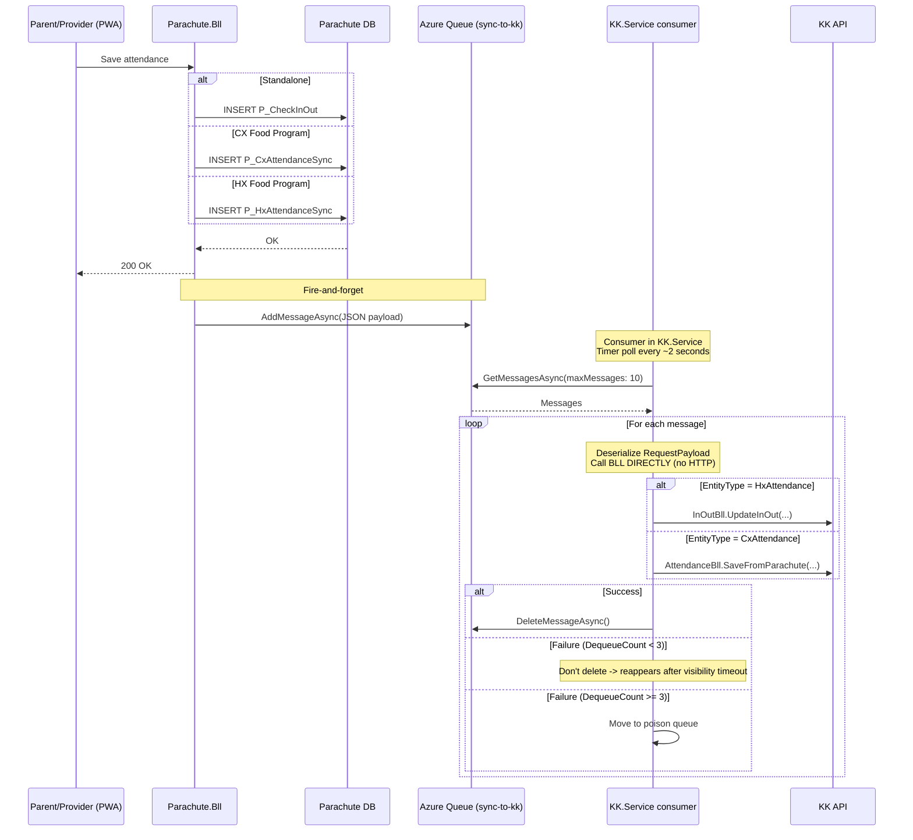
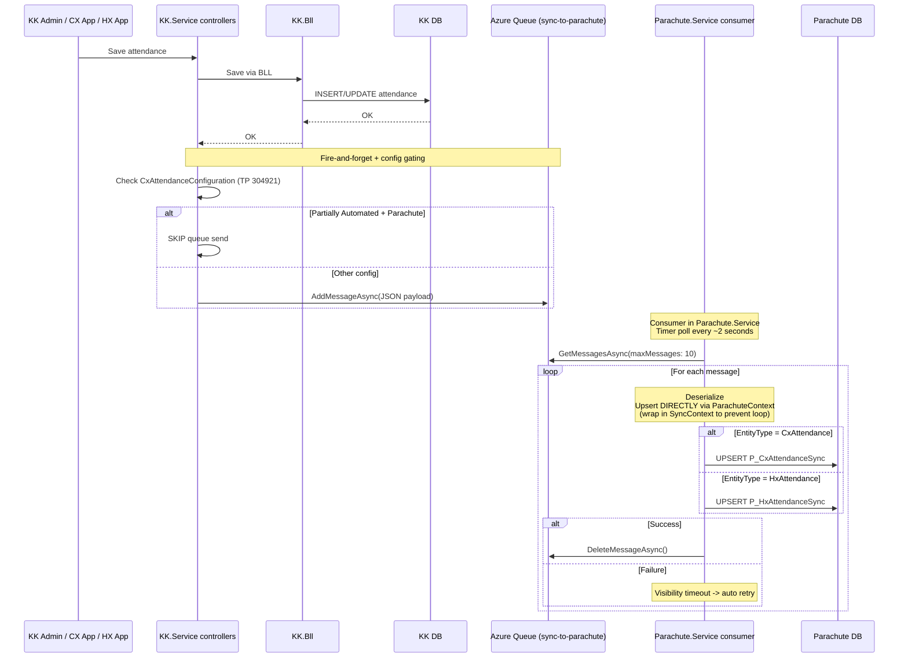

# Separate Attendance Tables in Parachute — Technical Design Plan (Azure Queue + In-process Consumer)

**Ticket:** TP 315953
**Related:** TP 304921 (Configurable Attendance Source — Released)
**Date:** 2026-04-18
**Version:** 3.0
**Status:** Draft

---

## Table of Contents

1. [Performance Requirements & Expectations](#1-performance-requirements)
2. [Overview](#2-overview)
3. [Architecture](#3-architecture)
4. [Why Azure Queue Storage (vs SyncLog Table)](#4-why-azure-queue)
5. [Database Design](#5-database-design)
6. [Data Flow — Sync via Azure Queue](#6-data-flow)
7. [Sync Consumer — In-process Timer Scheduler](#7-sync-consumer)
8. [Migration API](#8-migration-api)
9. [Auto-migrate on Child Enrollment](#9-auto-migrate)
10. [Config Gating (TP 304921)](#10-config-gating)
11. [KK Transfer Handler](#11-kk-transfer)
12. [Poison Queue Safeguards](#12-poison-queue)
13. [Error Handling & Logging](#13-error-handling)
14. [Impact Area](#14-impact-area)
15. [Testing Plan](#15-testing-plan)
16. [Implementation Phases & Estimates](#16-implementation-phases)
17. [Open Items](#17-open-items)

---

## 1. Performance Requirements & Expectations

### 1.1 Data Volume

| Table | Records/Year | Migration Backfill (~16 months) | 3-Year Projection | Category |
|---|---|---|---|---|
| `P_CheckInOut` (standalone) | ~1M | Existing (no migration) | ~3M | Small |
| `P_CxAttendanceSync` | **85M** | **~110M** | **~365M** | Very Large |
| `P_HxAttendanceSync` | **81M** | **~105M** | **~350M** | Very Large |
| `V_AllAttendance` (view) | ~166M new/year | ~215M | **~715M** | Approaching Billion |

**Daily throughput:** Production 1,000,000 msg/day × 22 working days/month = **22M msg/mo**. Dev + QA combined 2,000 msg/working day × 22 wd = **44K msg/mo**. Working days only (Mon–Fri).

### 1.2 Performance Targets

| Operation | Target Latency | Scale Context |
|---|---|---|
| Check-in/out screen (single site + date) | **< 50ms** | Query hits 1 partition (~7M rows) with covering index |
| Attendance report (sponsor + 1 month) | **< 500ms** | Scans 1-2 partitions via `V_AllAttendance` with Date filter |
| Invoice attendance check (per child) | **< 200ms** | Unique index seek `UX_Child_Date` |
| Sync consumer queue poll | **< 100ms** | `CloudQueue.GetMessagesAsync()` — Azure managed |
| Sync throughput | **1M msg/day** (22M/mo working days) without backlog | In-process consumer (Timer Scheduler) processes continuously |
| Migration API (bulk import) | **215M records in < 5 hours** | SqlBulkCopy, batch by sponsor + month, off-hours |
| KK Transfer (bulk update) | **< 10 minutes** for largest sponsor | Batch 10K rows per iteration |

### 1.3 Sync Latency — Near Real-Time

With Azure Queue Storage + in-process Timer Scheduler polling every 2 seconds:

| Stage | Latency |
|---|---|
| Entity save → `SendMessageAsync()` | ~50-200ms |
| Message in queue → consumer poll (every 2s) | **~1-3 seconds** |
| Consumer → BLL direct call → write to DB | ~50-200ms (no HTTP overhead) |
| **Total end-to-end latency** | **~1.5-4 seconds** |

Significantly faster than SyncLog table approach (~2-10 minutes).

### 1.4 How Technical Solutions Meet These Requirements

| Requirement | Solution | Handles 715M rows? |
|---|---|---|
| Large table query performance | Monthly partitioning — queries scan ~7M rows/partition instead of 715M | **Yes** |
| Fast lookups on large tables | Partition-aligned covering indexes — index-only scan | **Yes** |
| Exclude deleted rows from queries | Filtered indexes (`WHERE record_status_code = 288`) | **Yes** |
| Sync transport (no DB load) | **Azure Queue Storage** — zero DB ops for sync transport | **Yes** |
| Migration 215M rows | SqlBulkCopy + batch by sponsor/month + skip existing | **Yes (3-5 hours)** |
| Insert 500K/day | Nonclustered identity PK — sequential, no page splits | **Yes** |
| Index maintenance at 7M inserts/month | Per-partition rebuild | **Yes** |
| Archive old data | `ALTER TABLE ... SWITCH PARTITION` — instant | **Yes** |

### 1.5 Mandatory Operational Requirements

| Requirement | Frequency | Why |
|---|---|---|
| **Archive data > 2 years** | Monthly | Keep ~330M active rows |
| **Index rebuild per partition** | Weekly | 7M inserts/month cause fragmentation |
| **UPDATE STATISTICS** | Weekly | Stale stats → bad query plans |
| **Reports MUST filter by Date** | Always | `V_AllAttendance` has no index |
| **Monitor queue depth** | Continuous | Alert if messages backlog |
| **Monitor poison queue** | Daily | Admin review failed messages |

### 1.6 Scaling Thresholds & Alert Actions

| Threshold | Action |
|---|---|
| Any table > 500M active rows | Review archive policy |
| Queue depth > 10K messages | Alert — consumer may be falling behind |
| Poison queue > 100 messages | Alert — admin review required |
| Check-in/out query > 200ms | Check index fragmentation |
| Report query > 3 seconds | Verify Date filter present |

---

## 2. Overview

### 2.1 Background

Currently, Parachute stores attendance data **only for standalone CX users**. For Food Program users (HX and CX), attendance data is stored exclusively in KidKare (KK) databases. Parachute must call KK APIs to retrieve this data.

### 2.2 Scope

- **Parachute stores attendance for ALL users** — standalone CX, Food Program CX, and Food Program HX
- **Bidirectional sync** between Parachute DB and KK DB via **Azure Queue Storage**
- **Data migration** of historical CX/HX attendance to Parachute (from Jan 2025)
- **Auto-migration** when new children enroll into Parachute
- **Parachute reports and invoices** read attendance from local DB
- **KK Transfer** (provider/sponsor) reflected in Parachute data
- **TP 304921 update**: Add Parachute as source for "Partially Automated Attendance"

### 2.3 Key Decisions

| # | Decision | Chosen Option |
|---|----------|---------------|
| 1 | Attendance table structure | **3 separate tables**: `P_CheckInOut` (standalone), `P_CxAttendanceSync` (CX), `P_HxAttendanceSync` (HX). View `V_AllAttendance` for unified queries. |
| 2 | **Sync transport** | **Azure Queue Storage** (not SyncLog table — see Section 4 for comparison) |
| 3 | Sync consumer hosting | **In-process Timer Scheduler** (runs inside KK.Service and Parachute.Service — NO WebJob, NO HTTP API, calls BLL directly) |
| 4 | Message insert method | `queue.AddMessageAsync()` fire-and-forget after entity save |
| 5 | CX App / HX API sync | Both CX App and HX API call the SAME shared new API on KK.Service → KK.Service sends queue (centralized queue logic) |
| 6 | KK BLL sync | `queue.AddMessageAsync()` at controller level after BLL save |
| 7 | Config gating | Gate at queue send point in KK controllers (not at consumer level) |
| 8 | Migration approach | Online API, batch by sponsorId + month, skip existing |
| 9 | Loop prevention | `SyncContext` flag — inbound sync does NOT send message back |
| 10 | Table partitioning | Monthly partition on CX/HX attendance tables |
| 11 | Failed messages | **Poison queue** — NEVER auto-triggered (admin manual review only) |
| 12 | CX/HX table schema | Source-native format (2 pairs CX, 3 pairs HX) |
| 13 | No SyncLog table | Azure Queue replaces it. Optional `P_AttendanceSyncAudit` for audit trail (INSERT-only). |

---

## 3. Architecture

### 3.1 High-Level Architecture

```
+---------------------------------------------------------------------+
|                          SAVE SOURCES                                |
|                                                                      |
|  +------------+  +----------+  +--------+  +---------+  +---------+ |
|  | Parachute  |  | KK Web   |  | CX App |  | HX App  |  | APIM /  | |
|  | (PWA/Web)  |  | UI       |  | (.NET) |  | (VB6)   |  | Procare | |
|  +-----+------+  +----+-----+  +---+----+  +----+----+  +----+----+ |
+--------|--------------|------------|-------------|-------------|----+
         |              |            |             |             |
         v              v            v             v             v
  +-------------+  +---------------------------------------+
  |Parachute.Bll|  | KK.Service controllers                |
  | (save local |  | InOutController (HX mutations)        |
  |  + send Q)  |  | AttendanceController (CX Save)        |
  +------+------+  | ParachuteHXServiceController          |
         |         | (consumer processes here)             |
         |         +----------------+----------------------+
         |                          |
         |   (fire-and-forget queue send after BLL save)
         v                          v
  +--------------------------------------------------------------+
  |              Azure Queue Storage                              |
  |                                                               |
  |  attendance-sync-to-kk        attendance-sync-to-parachute    |
  |  (Parachute -> KK)           (KK -> Parachute)               |
  |                                                               |
  |  attendance-poison-to-kk      attendance-poison-to-parachute  |
  |  (failed msgs - admin only)  (failed msgs - admin only)      |
  +-------------------------------+-------------------------------+
              ^                                ^
              |                                |
              |  (poll + process via Timer)    |
              |                                |
  +-----------+-----------+        +-----------+--------------+
  | KK.Service (same app) |        | Parachute.Service        |
  |                       |        | (same app)               |
  | AttendanceSyncConsumer|        | AttendanceSyncConsumer   |
  | Timer poll every 2s   |        | Timer poll every 2s      |
  |                       |        |                          |
  | Deserialize message   |        | Deserialize message      |
  | -> call BLL directly: |        | -> upsert directly:      |
  |   InOutBll.UpdateInOut|        |   P_CxAttendanceSync     |
  |   AttendanceBll       |        |   P_HxAttendanceSync     |
  |     .SaveFromParachute|        |                          |
  +-----------------------+        +--------------------------+
                                              |
                                              v
+---------------------------------------------------------------------+
|                        Parachute DB                                  |
|                                                                      |
|  +---------------------------+ +---------------------------+        |
|  | P_CheckInOut              | | P_CxAttendanceSync        |        |
|  | (standalone only)         | | (ALL CX attendance)       |        |
|  | PARTITIONED monthly       | | PARTITIONED monthly       |        |
|  +---------------------------+ +---------------------------+        |
|                                                                      |
|  +---------------------------+ +---------------------------+        |
|  | P_HxAttendanceSync       | | V_AllAttendance (VIEW)    |        |
|  | (ALL HX attendance)       | | UNION ALL of 3 tables     |        |
|  | PARTITIONED monthly       | +---------------------------+        |
|  +---------------------------+                                      |
|                                                                      |
|  +---------------------------+ +---------------------------+        |
|  | P_MigrationProgress       | | P_Participant             |        |
|  +---------------------------+ +---------------------------+        |
|                                                                      |
|  NO P_AttendanceSyncLog table (replaced by Azure Queue)             |
|  NO WebJob — consumers run in existing service processes            |
+---------------------------------------------------------------------+
```

### 3.2 Data Flow — Two Directions

```
Direction 1: Parachute -> KK (~3K/day)
  Parachute user saves attendance on PWA/Web
  -> Parachute.Bll routes by child type -> save to correct table
  -> queue.AddMessageAsync() to "attendance-sync-to-kk"
  -> In-process consumer (KK.Service) polls queue -> calls InOutBll/AttendanceBll DIRECTLY (no HTTP)

Direction 2: KK -> Parachute (~1M msg/day prod working days)
  KK/CX/HX user saves attendance
  -> KK controllers (InOutController, AttendanceController) save via BLL
  -> queue.AddMessageAsync() to "attendance-sync-to-parachute" (fire-and-forget after BLL)
  -> In-process consumer (Parachute.Service) polls queue -> upsert P_CxAttendanceSync / P_HxAttendanceSync DIRECTLY
```

---

## 4. Why Azure Queue Storage (vs SyncLog Table)

### 4.1 Comparison Table

| Criteria | SyncLog Table | Azure Queue Storage (Chosen) |
|----------|:------------:|:---------------------------:|
| **Transport cost** | $0 (uses Parachute DB) | **~$2.74/month** at prod 1M msg/day baseline (see 4.2) |
| **DB load on Parachute DB** | **+2M ops/day** (1M INSERT + 1M UPDATE at prod 1M msg/day) | **$0 DB load** for sync transport |
| **Sync latency** | ~2-10 minutes (poll interval) | **~2-5 seconds** (poll every 2s) |
| **Cleanup job needed** | Yes (DELETE old synced rows daily) | **No** (messages auto-deleted after process) |
| **Extra DB table needed** | Yes (`P_AttendanceSyncLog` + 4 filtered indexes) | **No** |
| **Retry mechanism** | Custom code (Attempts column) | Built-in (`DequeueCount` + visibility timeout) |
| **Audit trail** | Built-in (query SyncLog 7 days) | **No** (optional `P_AttendanceSyncAudit` table) |
| **Poison handling** | `Status=2` rows in table — safe, no cost explosion | Poison queue — safe with in-process consumer (no auto-trigger) |
| **Infrastructure** | No new dependency | Azure Storage Account (may already exist) |
| **Scale at 2M/day** | +4M DB ops/day — **DB performance concern** | ~$4.88/month — **no DB impact** |

### 4.2 Azure Queue Storage Cost Estimates

**Pricing (East US, 2024 list — unverified, confirm on Azure Pricing Calculator):**
- LRS Transaction: $0.04 / 1M ops · GRS Transaction: $0.05 / 1M ops
- LRS Storage: $0.045 / GB-mo · GRS Storage: $0.09 / GB-mo
- PeekLock pattern = 3 ops per message (Send + Get + Delete)
- Polling overhead: 2 s interval → ~1.3M empty polls / month / queue

**Baseline (working-day basis: 22 wd / month):**

| Volume/day | Days/mo | Messages/month | Ops/month (with polling) | **LRS Cost/mo** | **LRS Cost/yr** |
|---|---|---|---|---|---|
| **1M (Production today)** | 22 wd | **22M** | 22M×3 + 1.3M = **67.3M** | **$2.74** | **$32.84** |
| 2K (Dev + QA gộp) | 22 wd | 44K | 44K×3 + 1.3M = 1.432M | $0.06 | $0.69 |
| **Combined prod + dev+qa** | — | **22.044M** | — | **$2.80** | **$33.53** |

**Headroom scaling (production volume only, working-day basis):**

| Prod volume / day | Messages/month | LRS Cost/mo | GRS Cost/mo |
|---|---|---|---|
| 500K msg/day | 11M | $1.39 | $1.74 |
| **1M msg/day (current)** | **22M** | **$2.74** | **$3.46** |
| 2M msg/day | 44M | $5.34 | $6.74 |
| 4M msg/day | 88M | $10.55 | $13.32 |

Calc for prod 1M baseline (LRS):
```
Ops:       22M × 3 + 1.3M polls = 67.3M
Transactions: 67.3M × $0.04/1M  = $2.692
Storage:      1 GB × $0.045     = $0.045
Total:                            $2.74 / mo · $32.84 / yr
```

Data Storage cost: minimal (~1 GB; messages deleted after processing).
Data Transfer cost: $0 (same Azure region).
**See `315953\queue-cost-comparison.md` for vendor-vs-vendor analysis (LRS / GRS / SB Basic / SB Standard / RabbitMQ / CloudAMQP).**

Reference: https://azure.microsoft.com/en-us/pricing/details/storage/queues/

### 4.3 Why In-process Consumer (vs Azure Function / WebJob)

| Criteria | Azure Function | Azure WebJob | **In-process (Chosen)** |
|----------|:-------------:|:------------:|:----------------------:|
| Billing | Per-execution × RAM × duration | Flat rate (App Service plan) | **$0 extra** (runs in existing app) |
| Poison loop risk | **$13K/month** (real team incident) | $0 — flat rate | **$0** — manual poison (no auto-trigger) |
| New project/deployment | Required | Required | **None** (reuse existing service deploy) |
| Call path to BLL | HTTP API round-trip | HTTP API round-trip | **Direct BLL call** (no HTTP overhead) |
| Startup complexity | New Function App | New WebJob + deployment | **Autofac `AutoActivate()`** |
| Multi-instance safety | Azure handles | Single instance only | Azure Queue visibility timeout handles it |

**Decision: In-process Timer Scheduler** — consumer lives inside the service that owns the target data:
- `attendance-sync-to-kk` consumer → runs in **KK.Service** → calls `InOutBll.UpdateInOut()` / `AttendanceBll.SaveFromParachute()` directly (no HTTP)
- `attendance-sync-to-parachute` consumer → runs in **Parachute.Service** → upserts `P_CxAttendanceSync`/`P_HxAttendanceSync` via `ParachuteContext` directly

**Why not WebJob:** The original plan proposed WebJob, but analysis showed:
- Consumer load (~4-6 DB writes/sec) is trivial compared to web traffic → safe to run in-process
- Direct BLL calls save HTTP overhead (~50-150ms per message)
- Zero deployment complexity (reuse existing service processes)

**Throttling for safety:** Configurable poll interval, batch size, max dequeue count prevent DB contention during burst backlog:
```
AttendanceSync.PollIntervalMs = 2000
AttendanceSync.BatchSize = 10
AttendanceSync.MaxDequeueCount = 3
```

### 4.4 Decision Summary

**Azure Queue Storage chosen because:**
1. **Zero DB load** for sync transport (vs 1.1M DB ops/day with SyncLog)
2. **Near real-time** sync latency (~2-5s vs ~2-10min)
3. **No cleanup job** needed (vs daily DELETE job for SyncLog)
4. **No extra DB table** (vs P_AttendanceSyncLog + 4 indexes)
5. **Cost is negligible** (~$1-5/month)
6. **Scales linearly** without DB impact (2M messages/day = ~$5/month, no DB concern)

---

## 5. Database Design

### 5.1 Tables Overview

```
Parachute DB
|
+-- P_CheckInOut              (standalone only — unchanged)
+-- P_CxAttendanceSync        (ALL CX attendance — NEW)
+-- P_HxAttendanceSync        (ALL HX attendance — NEW)
+-- V_AllAttendance           (VIEW — NEW)
+-- P_MigrationProgress       (migration tracking — NEW)
+-- P_AttendanceSyncAudit     (optional audit trail — NEW, INSERT-only)
|
+-- NO P_AttendanceSyncLog    (replaced by Azure Queue)
```

**Compared to SyncLog approach:** 1 fewer table, 4 fewer filtered indexes, no cleanup job.

### 5.2 P_CheckInOut — Standalone (Unchanged)

Existing table, no schema changes. Only stores standalone Parachute users (`IsOnlyParachute = true`).

### 5.3 P_CxAttendanceSync — ALL CX Attendance

Stores all CX attendance: Parachute CX saves + KK/CX App synced. Source-native: 2 in/out pairs per row.

```sql
CREATE TABLE P_CxAttendanceSync (
    Id                      int IDENTITY(1,1) NOT NULL,
    SponsorId               int NOT NULL,
    SiteId                  varchar(50) NOT NULL,
    ChildId                 uniqueidentifier NOT NULL,
    CxChildId               int NULL,
    CenterId                int NULL,
    Date                    datetime NOT NULL,
    FirstInTime             datetime NULL,
    FirstOutTime            datetime NULL,
    SecondInTime            datetime NULL,
    SecondOutTime           datetime NULL,
    FirstTemperature        decimal(5,2) NULL,
    SecondTemperature       decimal(5,2) NULL,
    SourceSystem            smallint NOT NULL DEFAULT 2,
    ExternalId              varchar(100) NULL,
    -- Audit columns (ParachuteBase)...
    CONSTRAINT PK_CxAttSync PRIMARY KEY NONCLUSTERED (Id, Date)
) ON ps_Attendance_Monthly(Date);
```

**Indexes:** IX_SiteId_Date (covering), IX_SponsorId_Date, UX_Child_Date (UNIQUE) — all partition-aligned, filtered `WHERE record_status_code = 288`.

### 5.4 P_HxAttendanceSync — ALL HX Attendance

Same as CX but 3 in/out pairs. `ChildId` (Guid) matches HX directly. SourceSystem DEFAULT 3.

### 5.5 V_AllAttendance — Unified View

UNION ALL of P_CheckInOut + CX (expand 2 pairs) + HX (expand 3 pairs). Normalized to InOutIndex format for reports/invoices.

### 5.6 P_MigrationProgress

```sql
CREATE TABLE P_MigrationProgress (
    Id              int IDENTITY PRIMARY KEY,
    SponsorId       int NOT NULL,
    SourceSystem    varchar(10) NOT NULL,
    MonthYear       datetime NOT NULL,
    Status          varchar(20) NOT NULL,       -- 'InProgress'|'Completed'|'Failed'|'Abandoned'
    RowsInserted    int NULL,
    RowsSkipped     int NULL,
    Attempts        int NOT NULL DEFAULT 0,     -- after 3 fails -> 'Abandoned'
    StartedAt       datetime2 NULL,
    CompletedAt     datetime2 NULL,
    ErrorMessage    nvarchar(max) NULL
);
```

### 5.7 P_AttendanceSyncAudit (Optional — Audit Trail)

Azure Queue deletes messages after processing — no history to query. If audit trail needed:

```sql
CREATE TABLE P_AttendanceSyncAudit (
    Id              bigint IDENTITY PRIMARY KEY,
    Direction       smallint NOT NULL,
    ChildId         uniqueidentifier NOT NULL,
    AttendanceDate  datetime NOT NULL,
    Action          varchar(10) NOT NULL,       -- 'Synced' | 'Failed' | 'Poison'
    ErrorMessage    nvarchar(500) NULL,
    CreatedAt       datetime2 NOT NULL DEFAULT SYSUTCDATETIME()
);
```

**Lightweight:** INSERT-only (no UPDATE, no poll, no filtered indexes). Cleanup: DELETE WHERE CreatedAt < 7 days.

### 5.8 Monthly Partition + Indexes

Same as previous plan (partition function `pf_Attendance_Monthly`, scheme `ps_Attendance_Monthly`). Applied to P_CxAttendanceSync and P_HxAttendanceSync.

### 5.9 Database Architecture Overview

```
+------------------------------------------------------------------------+
|                           Parachute DB                                  |
|                                                                         |
|  +--------------------------------+                                    |
|  | P_CheckInOut                   |  STANDALONE only (small, unchanged)|
|  +--------------------------------+                                    |
|                                                                         |
|  +--------------------------------+                                    |
|  | P_CxAttendanceSync            |  ALL CX (85M/year, partitioned)    |
|  +--------------------------------+                                    |
|                                                                         |
|  +--------------------------------+                                    |
|  | P_HxAttendanceSync            |  ALL HX (81M/year, partitioned)    |
|  +--------------------------------+                                    |
|                                                                         |
|  +--------------------------------+                                    |
|  | V_AllAttendance (VIEW)         |  UNION ALL for reports/invoices    |
|  +--------------------------------+                                    |
|                                                                         |
|  +------------------+ +------------------+ +------------------------+  |
|  | P_MigrationProg  | | P_Participant    | | P_AttSyncAudit (opt.)  |  |
|  +------------------+ +------------------+ +------------------------+  |
|                                                                         |
|  NO P_AttendanceSyncLog — replaced by Azure Queue Storage              |
|  NO cleanup job for SyncLog — queue auto-cleans                        |
|  NO 4 filtered indexes on SyncLog — not needed                         |
+------------------------------------------------------------------------+

Azure Queue Storage:
  +----------------------------------+  +----------------------------------+
  | attendance-sync-to-kk            |  | attendance-sync-to-parachute     |
  | (Parachute -> KK messages)       |  | (KK -> Parachute messages)       |
  +----------------------------------+  +----------------------------------+
  | attendance-poison-to-kk          |  | attendance-poison-to-parachute   |
  | (failed - ADMIN ONLY, NO TRIGGER)|  | (failed - ADMIN ONLY, NO TRIGGER)|
  +----------------------------------+  +----------------------------------+
```

---

## 6. Data Flow — Sync via Azure Queue

### 6.1 Message Format — Forward KK API Payload

The queue message carries the EXACT same payload that the original KK API call would have used. The consumer deserializes `RequestPayload` and calls the corresponding BLL method directly (no HTTP).

```csharp
public class AttendanceSyncMessage
{
    public string EntityType { get; set; }         // "CxAttendance" | "HxAttendance"
    public string RequestPayload { get; set; }     // JSON of the original KK request object
    public string CorrelationId { get; set; }
    public DateTime OccurredAt { get; set; }
}
```

### 6.2 Message Send — Fire-and-Forget

All sources use the same pattern: save entity, then send message via `Task.Run`.

```csharp
// After entity save completes:
_ = Task.Run(async () =>
{
    try
    {
        var message = new AttendanceSyncMessage
        {
            EntityType = "CxAttendance",
            RequestPayload = JsonConvert.SerializeObject(originalKkApiPayload),
            CorrelationId = Guid.NewGuid().ToString("N"),
            OccurredAt = DateTime.UtcNow
        };
        await _queueClient.SendToParachuteAsync(message);
    }
    catch (Exception ex)
    {
        _logger.LogWarning(ex, "Queue send failed");
        // Fire-and-forget: reconciliation catches later
    }
});
```

### 6.3 Sources and Queue Send Methods

| Source | Queue | Method |
|--------|-------|--------|
| **Parachute.Bll** (Attendance.cs) | `attendance-sync-to-kk` | `AttendanceSyncQueueSender.FireAndForgetToKK()` after local save |
| **KK.Service** controllers (InOutController, AttendanceController) | `attendance-sync-to-parachute` | `AttendanceSyncQueueClient.SendToParachuteAsync()` after BLL save |
| **CX App** | `attendance-sync-to-parachute` | Call SHARED new API on KK.Service → KK.Service sends to queue |
| **HX API** | `attendance-sync-to-parachute` | Call SAME SHARED API on KK.Service → KK.Service sends to queue |

### 6.3 Sequence Diagram — Direction 1: Parachute -> KK



### 6.4 Sequence Diagram — Direction 2: KK -> Parachute



### 6.5 Loop Prevention

`SyncContext` thread-static flag prevents re-sending to queue when consumer applies inbound sync:

```csharp
// Parachute consumer applying KK -> Parachute:
using (new SyncContext())  // IsSyncInbound = true
{
    // Upsert P_CxAttendanceSync / P_HxAttendanceSync
    // If any BLL logic reaches queue send -> it checks SyncContext.IsSyncInbound -> skip
}
```

For KK.Service consumer: no SyncContext needed because queue send is at controller level, and consumer calls BLL directly (bypasses the controller). So consumer processing doesn't trigger queue send back.
```

---

## 7. Sync Consumer — In-process Timer Scheduler

### 7.1 Hosting Decision — No WebJob

Consumer runs **inside the existing service process** (KK.Service / Parachute.Service) — NOT as a separate WebJob, NOT as Azure Function. See Section 4.3 for the full comparison.

**Deployment layout:**

```
KK.Service (existing IIS app)
├── Existing controllers, InvoiceScheduler, CxInvoiceScheduler
└── AttendanceSyncConsumer (NEW) → polls attendance-sync-to-kk

Parachute.Service (existing IIS app)
├── Existing controllers, schedulers
└── AttendanceSyncConsumer (NEW) → polls attendance-sync-to-parachute
```

Each consumer lives in the service that OWNS the target data → calls BLL / ParachuteContext directly → zero HTTP overhead.

### 7.2 Consumer Code Structure

Consumer follows the same pattern as existing `InvoiceScheduler`: Timer-based poll, `SingleInstance()` + `AutoActivate()` in Autofac.

**KK side** (`KidKare.Bll/AttendanceSync/AttendanceSyncConsumer.cs`):

```csharp
public class AttendanceSyncConsumer : IAttendanceSyncConsumer
{
    private readonly Timer _timer;
    private readonly IAttendanceSyncQueueClient _queueClient;
    private readonly InOutBll _inOutBll;
    private readonly IAttendanceBll _attendanceBll;
    private volatile bool _processing;

    public AttendanceSyncConsumer(IAttendanceSyncQueueClient queueClient,
        InOutBll inOutBll, IAttendanceBll attendanceBll,
        ITelemetryClientFactory telemetryClientFactory,
        ApplicationConfigReaderHelper configHelper)
    {
        _pollIntervalMs = configHelper.GetAttendanceSyncPollIntervalMs();
        _batchSize = configHelper.GetAttendanceSyncBatchSize();
        _maxDequeueCount = configHelper.GetAttendanceSyncMaxDequeueCount();
        _timer = new Timer(Poll, null, _pollIntervalMs, _pollIntervalMs);
    }

    private async void Poll(object state)
    {
        if (_processing) return;   // prevent concurrent poll on same instance
        _processing = true;
        try
        {
            var messages = await _queueClient.ReceiveFromKKQueueAsync(_batchSize);
            foreach (var msg in messages)
            {
                if (msg.DequeueCount > _maxDequeueCount) {
                    await _queueClient.MoveToPoisonAsync(...);
                    await _queueClient.DeleteMessageAsync(...);
                    continue;
                }
                try {
                    ProcessMessage(msg.MessageText);   // call BLL directly
                    await _queueClient.DeleteMessageAsync(...);
                } catch {
                    // don't delete → visibility timeout → auto retry
                }
            }
        }
        finally { _processing = false; }
    }

    private void ProcessMessage(string json)
    {
        var message = JsonConvert.DeserializeObject<AttendanceSyncMessage>(json);
        var payload = JObject.Parse(message.RequestPayload);
        switch (message.EntityType) {
            case "HxAttendance": ProcessHxAttendance(payload); break;
            case "CxAttendance": ProcessCxAttendance(payload); break;
        }
    }

    private void ProcessHxAttendance(JObject payload)
    {
        // Deserialize → call BLL directly (no HTTP)
        foreach (var child in children) {
            _inOutBll.UpdateInOut(child.ChildId, child.Date, child.InOutIndex,
                child.In, child.Out, siteId, ownerId, child.Temperature);
        }
    }

    private void ProcessCxAttendance(JObject payload)
    {
        var parameters = new SaveAttendanceParameters { /* deserialize */ };
        _attendanceBll.SaveFromParachute(parameters);
    }
}
```

**Parachute side** (`Parachute.Bll/AttendanceSync/AttendanceSyncConsumer.cs`): same pattern but uses `ParachuteContext` directly for upsert (no BLL needed for simple DB upsert).

### 7.3 Autofac Registration

```csharp
container.RegisterType<AttendanceSyncConsumer>()
    .As<IAttendanceSyncConsumer>()
    .SingleInstance()
    .AutoActivate();  // ← creates instance at container build → Timer starts immediately
```

### 7.4 Jobs Summary

| Job | Queue | Logic | Poll Interval |
|-----|-------|-------|:-------------:|
| **KK.Service consumer** | `attendance-sync-to-kk` | Receive → call `InOutBll.UpdateInOut()` / `AttendanceBll.SaveFromParachute()` directly → delete | 2s (configurable) |
| **Parachute.Service consumer** | `attendance-sync-to-parachute` | Receive → upsert `P_Cx/HxAttendanceSync` via `ParachuteContext` → delete | 2s (configurable) |
| **Reconciliation** | N/A (DB query) | Compare KK vs Parachute → send missing messages to queue | Scheduled (configurable, future phase) |

**No cleanup job needed** — messages auto-deleted after processing.

### 7.5 Load Analysis — Why In-process is Safe

Concern: adding consumer to existing service → compete with web requests?

Actual numbers:
- Daily volume: prod 1M msg/day = 22M / 22 wd / 86,400 s = **~11.6 messages/sec average** (peak higher during business hours)
- Dev + QA combined: 2K msg/working day = ~0.02 msg/sec (negligible)
- Each message = 1-2 DB operations via BLL

This is negligible compared to existing web traffic. Risk only at burst after backlog (e.g., queue down for 1 hour → 20K messages queued up). Mitigated by configurable throttle:

```
AttendanceSync.PollIntervalMs = 2000   ← poll every 2s
AttendanceSync.BatchSize = 10          ← max 10 msgs per poll
AttendanceSync.MaxDequeueCount = 3     ← poison after 3 failures
```

### 7.6 Multi-instance Safety

KK.Service typically runs multiple instances behind a load balancer. Azure Queue handles this natively:
- Instance A calls `GetMessagesAsync()` → message becomes invisible for 30s
- Instance B polls at the same time → does NOT see the same message
- No locking or coordination needed

**Caveat:** If a single message takes > 30s to process (e.g., slow DB), visibility timeout expires and another instance may pick it up → duplicate processing. BLL operations are idempotent (upsert), so no data corruption, just wasted CPU. Mitigation: increase visibility timeout if processing is slow.

---

## 8. Migration API

Same as previous plan. Hosted in KK.Service. `POST /admin/migration/attendance`.

- Batch by sponsorId + month
- 1 CX row → 1 P_CxAttendanceSync row (source-native, no transform)
- 1 HX row → 1 P_HxAttendanceSync row
- Skip existing (WHERE NOT EXISTS on ChildId + Date)
- SqlBulkCopy for performance
- Track progress in P_MigrationProgress (Attempts → Abandoned after 3 fails)

---

## 9. Auto-migrate on Child Enrollment

Same as previous plan. Hook into P_Participant INSERT → fire-and-forget `MigrateForChild()`.

---

## 10. Config Gating (TP 304921)

Gate at **queue send point** (not at consumer level):

```csharp
if (!SyncContext.IsSyncInbound)
{
    var config = GetAttendanceConfig(centerId);

    if (config?.ImportMethod == PartiallyAutomated && config?.ImportSource == Parachute)
        return; // KK override does NOT sync back

    if (config?.ImportMethod == Auto)
        return; // KK is read-only

    await _queueClient.SendMessageAsync(payload);
}
```

| Config | Source | Parachute→KK | KK sends to queue? |
|--------|--------|:------------:|:-------------------:|
| All Imported | Parachute | YES | NO (read-only) |
| Partially Automated | Parachute (NEW) | YES | **NO** |
| Manual | -- | NO | YES |

---

## 11. KK Transfer Handler

Same as previous plan. Hook into existing KK Transfer API → bulk UPDATE P_CheckInOut, P_CxAttendanceSync, P_HxAttendanceSync.

---

## 12. Poison Queue Safeguards

**Lesson learned: team had $13K Azure Function incident from poison queue auto-trigger loop.**

### Rules (MANDATORY)

1. **NEVER** create auto-trigger, function trigger, or worker on poison queues
2. Poison queue = **admin manual review ONLY**
3. Set **message TTL = 30 days** on poison queues (auto-expire old messages)
4. Monitor: alert when poison queue depth > threshold (e.g., 100 messages)
5. Admin tool: manual re-queue or discard messages after investigation
6. **Document this as team rule** to prevent repeat incident

### Poison Queue Message Flow

```
Main queue message fails 3 times (DequeueCount > 3)
  → Consumer moves to poison queue + notifies admin
  → Message sits in poison queue
  → Admin reviews via Azure Storage Explorer or custom dashboard
  → Admin fixes root cause, then:
      Option A: Re-queue message to main queue (retry)
      Option B: Discard message (data loss acceptable, reconciliation catches)
  → Message auto-expires after 30 days if not handled
```

---

## 13. Error Handling & Logging

| Scenario | Handling |
|----------|---------|
| `SendMessageAsync` fails | Log warning; reconciliation catches later |
| CX/HX App API call fails | Log warning; fire-and-forget, reconciliation catches |
| Consumer: KK API down | Don't delete message → visibility timeout → auto retry |
| Consumer: DB write fails | Don't delete → auto retry |
| DequeueCount > 3 | Move to poison queue + notify admin |
| Queue Storage outage (~SLA 99.9%) | Messages buffer; consumer retries when recovered |
| Migration source DB timeout | Resume from failed month on re-run |

### Monitoring

- **Queue depth:** Azure Portal → Storage Account → Queue metrics
- **Poison queue depth:** Alert if > 0 messages
- **Consumer health:** App Insights → custom events (`AttendanceSyncPoisoned`, `AttendanceSyncConsumer` exceptions)
- **Optional audit table:** `SELECT Action, COUNT(*) FROM P_AttendanceSyncAudit GROUP BY Action`

---

## 14. Impact Area

### Systems Affected

| System | Change Type | Details |
|--------|:-----------:|---------|
| **Parachute DB** | Schema | CREATE P_CxAttendanceSync, P_HxAttendanceSync, V_AllAttendance, P_MigrationProgress, partition, indexes. **No SyncLog table.** |
| **Azure Queue Storage** | New | 4 queues (2 main + 2 poison) — storage account can reuse `kkreports` or create new |
| **Parachute.Bll** | Code | Save/Get refactored to use local tables. `AttendanceSyncQueueSender` for queue send. `AttendanceSyncConsumer` (Timer Scheduler) for queue poll. |
| **Parachute.Service** | Code | Hosts consumer for `attendance-sync-to-parachute` (in-process, no new project) |
| **Parachute Web/PWA** | Code | Reports + invoices read from local DB |
| **KK.Bll** | Code | `IAttendanceSyncQueueClient` for send/receive. `AttendanceSyncConsumer` (Timer Scheduler) hosts consumer for `attendance-sync-to-kk`. Direct BLL calls — no HTTP. |
| **KK.Service** | Code | Controllers (`InOutController`, `AttendanceController`) add queue send after BLL save. Lightweight APIs `GetAttendanceEditStatusHx/Cx` for claim status. Hosts consumer in-process. |
| **CX App** | Code | Add HTTP call to shared KK.Service API after save (KK.Service sends queue) |
| **HX API** | Code | Add HTTP call to SAME shared KK.Service API after save (centralized queue logic) |
| **HX App (VB6)** | No change | Saves via HX API |
| **NO Azure WebJob** | — | Consumer runs in-process inside existing services |
| **NO Azure Function** | — | Avoided due to poison loop cost risk |
| **TP 304921 config** | Update | Add Parachute for Partially Automated |

### Features Affected

Same as previous plan (check-in/out, reports, invoice, transfer, config, enrollment). KK Meal/Claim processing and Claim lockout **unchanged**.

---

## 15. Testing Plan

Same test cases as previous plan (UT 1-7, IT 1-11, E2E 1-14, PT 1-6, RT 1-5) with adjustments:

- Replace "SyncLog INSERT" with "SendMessageAsync" in test descriptions
- Replace "poll SyncLog table" with "poll Azure Queue" in IT-4, IT-5
- Add: IT-12 — Poison queue: message with DequeueCount > 3 moved to poison queue
- Add: IT-13 — Poison queue: NO auto-trigger (admin manual review only)
- Remove: IT-11 (Cleanup job — not needed with queues)

---

## 16. Implementation Phases & Estimates

| Phase | Scope | Dependencies | Estimate |
|-------|-------|:------------:|:--------:|
| **1** | DB Schema: P_CxAttendanceSync, P_HxAttendanceSync, V_AllAttendance, P_MigrationProgress, partition, indexes | -- | 4-5 days |
| **2** | Azure Queue setup: Storage Account + 4 queues + connection strings + message model + queue client | -- | 1 day |
| **3** | Migration API: endpoint + core logic + P_Participant mapping | Phase 1 | 5-7 days |
| **4** | Parachute BLL refactor: save for ALL users + GET from local + queue send + SyncContext + lightweight claim status APIs | Phase 1, 2 | 4-5 days |
| **5** | KK.Service controllers: queue send at mutation points (InOutController, AttendanceController) | Phase 2 | 4-5 days |
| **6** | Shared API on KK.Service (POST /api/attendance-sync/notify) + CX App / HX API integration (both call same endpoint) | Phase 2 | 3-4 days |
| **7** | In-process consumers: KK.Service (Timer Scheduler → InOutBll/AttendanceBll direct call) + Parachute.Service (Timer Scheduler → ParachuteContext upsert) + poison handling | Phase 1, 2, 4, 5 | 3-5 days |
| **8** | Auto-migrate on child enrollment | Phase 3 | 2-3 days |
| **9** | Run migration (execution + verification) | Phase 3 | 2-3 days |
| **10** | Report attendance + Invoice attendance check (read from V_AllAttendance) | Phase 4 | 3-5 days |
| **11** | KK Transfer handler | Phase 1 | 2-3 days |
| **12** | Testing + QA | Phase 4-7 | 5-7 days |

**Total sequential:** ~38-53 days (Phase 7 reduced by 2 days — no WebJob deployment setup)
**With 2-3 devs parallel:** ~24-28 days (~5 weeks)

---

## 17. Open Items

| # | Item | Status | Owner |
|---|------|--------|-------|
| 1 | Azure Storage Account: create new or reuse existing? | TBD | DevOps |
| 2 | SQL Server version/edition (partitioning support) | Pending | DevOps |
| 3 | CX DB and HX DB same SQL instance? | Pending | DevOps |
| 4 | P_Participant mapping completeness | Pending | Dev team |
| 5 | Reconciliation frequency (hourly vs daily) | TBD | Tech lead |
| 6 | Admin notification method (email, Slack) | TBD | Tech lead |
| 7 | Migration time window (off-hours?) | TBD | DevOps |
| 8 | Archive strategy > 2 years | TBD | DBA |
| 9 | HX API attendance endpoints to hook | Pending | Dev team |
| 10 | KK Transfer exact API/flow to hook | Pending | Dev team |
| 11 | Audit trail needed? (P_AttendanceSyncAudit table) | TBD | PM |
| 12 | Queue message TTL configuration | TBD | Dev team |

---

*Document generated: 2026-04-16*
*Next review: After Azure Storage Account confirmed and in-process consumer POC completed*
