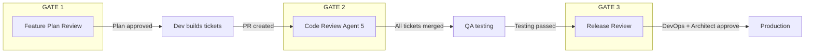
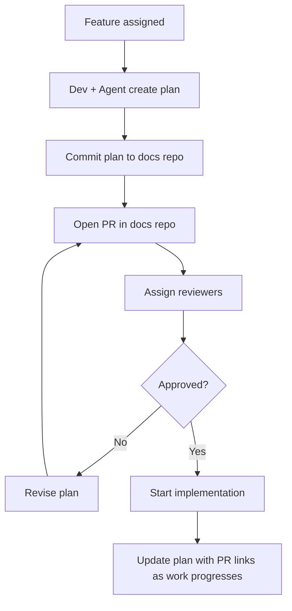
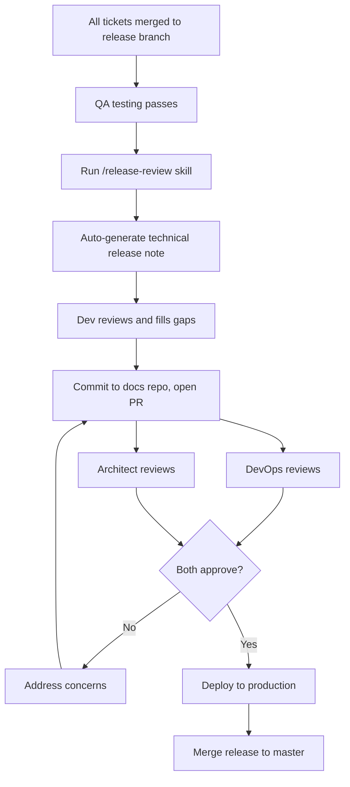
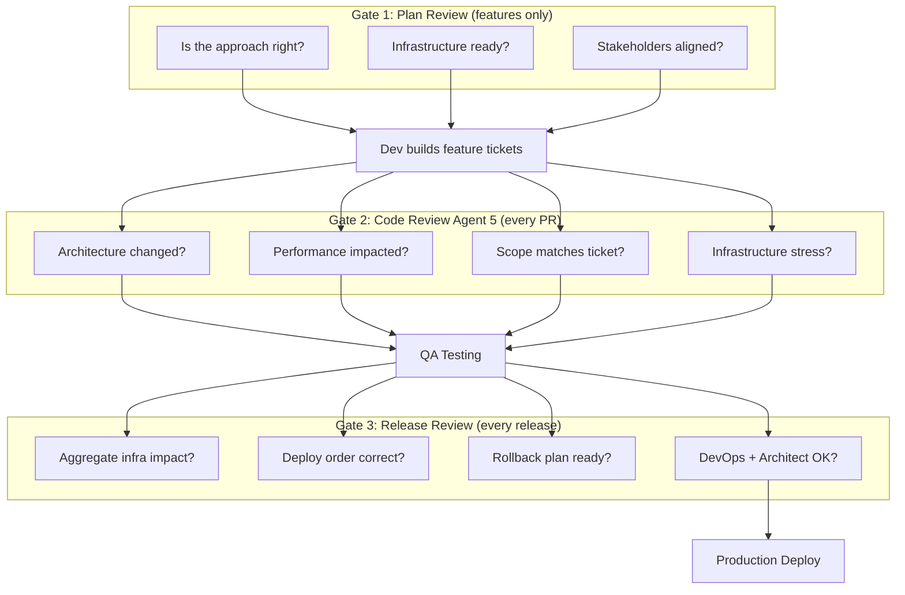

# Architecture & Performance Review Process

**Effective:** April 2026
**Team:** MinuteMenu KidKare

---

## Quick Summary

- **Every PR** gets an automated architecture and performance check (Agent 5 in code review).
- **Major features** (multi-week, multi-repo) require a plan review before coding starts.
- **Every release** gets a technical release note reviewed by DevOps and architect before production.
- **No process is perfect.** Performance issues will still slip through. We need alerts that catch problems before clients complain, and enough system headroom to survive spikes while we fix them.
- **Goal:** catch infrastructure and performance problems before they reach production — and survive when they do.

---

## 1. Why We Are Changing

Two production incidents in March 2026 showed that our code review catches bugs and guideline violations, but misses architecture changes and infrastructure stress.

```
 INCIDENT 1: 35x Performance Regression (#319632)
 ─────────────────────────────────────────────────
 Ticket asked for:   2-line filter fix (change != 290 to = 288)
 Developer did:      Rewrote the entire stored procedure
 What changed:       Simple indexed lookup on materialized view
                     → real-time computation with 25 temp table ops
 Result:             752ms → 26.3 seconds (35x slower)
                     Got worse every day as data grew.

 Code review:        Did NOT catch the architecture change.
```

```
 INCIDENT 2: SSO Login Degradation (Release #317989)
 ────────────────────────────────────────────────────
 Release included:   New login form UI
 Side effect:        Broke "remember me" → all users re-enter credentials
 What happened:      Thousands of logins + password resets at once
 Exposed:            Connection leaks, undersized MySQL VM,
                     8-hour wait_timeout, 360s command timeout
 Result:             Auth response: 0.4s → 55s average
                     Password resets: 5/30min → 316/30min

 Code review:        Did NOT assess infrastructure impact.
```

**Common pattern:** Code changes had infrastructure implications. Nobody flagged them.

```
 WHAT WE REVIEW TODAY              WHAT WE MISSED
 ┌──────────────────────┐         ┌──────────────────────────────┐
 │ ✓ Code bugs          │         │ ✗ Architecture changes       │
 │ ✓ Guideline rules    │         │ ✗ Performance impact         │
 │ ✓ Git history context│         │ ✗ Infrastructure stress      │
 │ ✓ Ticket alignment   │         │ ✗ Scope creep beyond ticket  │
 │                      │         │ ✗ Cross-repo side effects    │
 └──────────────────────┘         └──────────────────────────────┘
  Caught by Agents 1-4             Now caught by 3 new review gates
```

---

## 2. The Three Review Gates

Three new review steps at different stages of the delivery process.



```
 WHEN EACH GATE RUNS
 ────────────────────────────────────────────────────────────────

 ┌─────────────┐    ┌─────────────┐    ┌──────────┐    ┌──────┐
 │ Plan Review │───>│ Code Review │───>│ Release  │───>│ Prod │
 │ (features)  │    │ (every PR)  │    │ Review   │    │      │
 └─────────────┘    └─────────────┘    └──────────┘    └──────┘
       │                   │                  │
  Major features      Every PR         Every release
  only (weeks/        automatically     after QA passes
  months of work)     via Agent 5       before deploy
```

---

## 3. Gate 1: Feature Plan Review

### What It Is

Before coding a major feature, create a short implementation plan. Commit it to the docs repo. Open a PR. Stakeholders review and approve before work starts.

### When Required

```
 REQUIRED                              NOT REQUIRED
 ┌─────────────────────────────┐      ┌─────────────────────────────┐
 │ Multi-week/month features   │      │ Individual tickets          │
 │ Changes to auth/payments    │      │ Bug fixes                   │
 │ Changes touching 3+ repos   │      │ Small enhancements          │
 │ Core flow changes (claims)  │      │ Config changes              │
 │                             │      │ UI text/style changes       │
 │ Examples:                   │      │                             │
 │ - SAML SSO integration     │      │ We deliver hundreds of      │
 │ - Adyen payment integration │      │ tickets per 2-week cycle.   │
 │ - Claims processor rewrite  │      │ Cannot review plans for all.│
 └─────────────────────────────┘      └─────────────────────────────┘
```

### How It Works



**Reviewers:** architect, dev lead, DevOps (if infra impact), client stakeholder (if needed).

### What the Plan Covers

The plan template forces answers to the questions that would have caught Incident 1:

```
 ARCHITECTURE DECISIONS CHECKLIST
 ────────────────────────────────────────────────────────────────
 [ ] Data access change?    Do I change how data is queried?
                            New tables, removed views, new joins
                            on large tables?

 [ ] Auth/session change?   Does this affect login, session, tokens,
                            or "remember me"? Could this force users
                            to re-authenticate?

 [ ] Cross-repo change?     Which repos are touched? What is the
                            deploy order?

 [ ] New API calls?         New endpoints or increased call frequency?
                            Estimate additional load.

 [ ] Database schema?       New tables, columns, indexes, stored
                            procedures?

 [ ] Infrastructure need?   Does this need VM scaling, new config,
                            connection pool changes, or new services?
```

### What It Would Have Caught

**Incident 1:** A plan for ticket #292344 would say "I will rewrite `select_review_providers_sp` to compute ReviewNeeded at query time instead of using `ProvidersDueReviewsMart`." The architect would immediately ask: "Why not just fix the 2-line filter in the existing lookup?"

**Incident 2:** A plan for SAML SSO integration would say "New login form replaces the existing one. Users will need to re-enter credentials." DevOps would ask: "How many users? What is the expected concurrent load? Is the SSO database sized for this?"

Plan template: [plans/template.md](../plans/template.md)

---

## 4. Gate 2: Code Review — Architecture & Performance Agent

### What It Is

A new agent (Agent 5) added to the automated code review skill. It runs on every PR alongside the existing 4 agents. It checks for architecture changes and performance implications.

### How It Fits with Existing Code Review

```
 BEFORE (4 agents)                  NOW (5 agents)
 ┌──────────────────────────┐      ┌──────────────────────────────┐
 │ Agent 1: Guidelines      │      │ Agent 1: Guidelines          │
 │ Agent 2: Bug detection   │      │ Agent 2: Bug detection       │
 │ Agent 3: Git history     │      │ Agent 3: Git history         │
 │ Agent 4: Ticket alignment│      │ Agent 4: Ticket alignment    │
 │                          │      │ Agent 5: Architecture &      │
 │                          │      │          Performance ← NEW   │
 └──────────────────────────┘      └──────────────────────────────┘
                                          │
                                   Always produces an
                                   "Infrastructure Impact
                                   Assessment" that can be
                                   shared with DevOps.
```

### What Agent 5 Checks

Six categories of architecture and performance risk:

```
 CATEGORY                  WHAT IT LOOKS FOR
 ─────────────────────────────────────────────────────────────
 Scope Creep               Diff does much more than the ticket
                           asks for. Small fix → full rewrite.

 Data Access Change        Materialized view → real-time query.
                           Indexed lookup → table scan.
                           Cached result → live query.

 Infrastructure Stress     Mass re-authentication. Session
                           invalidation. New background jobs
                           that hit the database.

 Timeout/Pool Changes      Connection timeout changes. Pool
                           size changes. Command timeout values.

 Removed Optimizations     Dropped indexes. Removed caching.
                           Batch → per-row operations.

 Cross-Repo Impact         Changes to SSO, shared DB, or
                           payment services used by other
                           products.
```

### What It Produces

Every PR gets an Infrastructure Impact Assessment, even when no issues are found:

```
 INFRASTRUCTURE IMPACT ASSESSMENT
 ──────────────────────────────────────────────────
 Risk Level:           None | Low | Medium | High | Critical
 Summary:              One sentence.
 Details:              What changed, what tables/services affected.
 DevOps Action Needed: Yes / No
   If yes:             What specifically (VM, pool, index, etc.)
```

This section can be copied directly to share with DevOps.

### What It Would Have Caught

**Incident 1:** Agent 5 would flag:
- "Scope creep: ticket asks for 2-line filter fix, diff rewrites entire stored procedure"
- "Data access change: `ProvidersDueReviewsMart` indexed lookup replaced with 25 temp table operations on MEAL_RECORD (millions of rows)"
- "Risk Level: Critical. DevOps action needed: review query plan, add indexes or revert."

**Incident 2:** Agent 5 would flag:
- "Infrastructure stress: login form change may invalidate saved credentials for all users"
- "Cross-repo impact: SSO changes affect KK, CX, and Parachute simultaneously"
- "Risk Level: High. DevOps action needed: assess SSO database capacity for mass re-auth."

### Learning from Incidents

Agent 5 references a `known-patterns.md` file with patterns from past incidents. When the same pattern appears in a new PR, Agent 5 scores it higher. This file is updated whenever a new incident reveals a pattern.

Current patterns:
1. Materialized view replaced with real-time computation
2. UI change forces mass re-authentication
3. Connection leak under error path
4. Oversized timeout values
5. Scope creep beyond ticket requirements

---

## 5. Gate 3: Release Review

### What It Is

After all tickets merge to the release branch and QA testing passes, generate a technical release note. DevOps and architect review it before production deployment.

### When Required

**Every release.** No exceptions. The release note is auto-generated — the overhead is reviewing, not writing.

### How It Works



### What the Release Note Covers

```
 RELEASE NOTE SECTIONS
 ──────────────────────────────────────────────────────────────

 1. TICKETS IN THIS RELEASE
    Table: ticket ID, title, type, infrastructure impact level.

 2. INFRASTRUCTURE IMPACT (AGGREGATE)
    ┌─────────────────────────────────────────────────────────┐
    │ Database Changes      Schema, stored procs, indexes,    │
    │                       migration scripts                 │
    │                                                         │
    │ Auth/Session Changes  Login flow, tokens, re-auth       │
    │                       impact                            │
    │                                                         │
    │ API Changes           New/changed/removed endpoints,    │
    │                       traffic pattern changes           │
    │                                                         │
    │ Performance           Large table queries, removed      │
    │                       optimizations, new jobs           │
    │                                                         │
    │ Cross-Repo            Repos involved, deploy order,     │
    │                       rollback order                    │
    └─────────────────────────────────────────────────────────┘

 3. WEB CONFIGURATION CHANGES
    Table: service, key, value, notes.

 4. RISK ASSESSMENT
    Worst case. Likelihood. Detection. Rollback plan.

 5. DEPLOYMENT CHECKLIST
    DevOps review        ☐
    Architect review     ☐
    SQL scripts verified ☐
    Web config confirmed ☐
    Rollback plan ready  ☐
    Deploy approved      ☐
```

### What It Would Have Caught

**Incident 2:** The SAML SSO release note would show:

```
 RELEASE: SAML SSO Integration (#317989)
 ────────────────────────────────────────────────────────

 Auth/Session Changes:
   Login flow changes:   New login form replaces existing form
   Re-auth impact:       ALL USERS will need to re-enter
                         credentials (remember-me broken)

 Cross-Repo Dependencies:
   Repos:     KK, SSO, Parachute, Database (CXADMIN + MMADMIN)
   Deploy:    Database → SSO → KK → Parachute
   Rollback:  Parachute → KK → SSO → Database

 Risk Assessment:
   Worst case: all users re-authenticate at once, SSO
   database cannot handle the load. Cascading failure
   across KK, CX, and Parachute.
```

DevOps would see this and ask: "Is the SSO MySQL VM sized for this? What is the connection pool limit? Should we scale up before deploying?"

Release note template: [releases/template.md](../releases/template.md)

---

## 6. How the Three Gates Work Together

Each gate catches different types of problems at different stages.

```
 STAGE          GATE              CATCHES                    WHO REVIEWS
 ──────────────────────────────────────────────────────────────────────
 Before coding  Plan Review       Wrong approach             Architect
                (features only)   Missing infrastructure     Dev Lead
                                  Scope misalignment         DevOps
                                                             Stakeholder

 Per PR         Code Review       Architecture changes       Developer
                Agent 5           Performance regression     (automated)
                (every PR)        Scope creep
                                  Infrastructure stress

 Before deploy  Release Review    Aggregate impact           DevOps
                (every release)   Cross-repo coordination    Architect
                                  Deploy/rollback order
                                  Config changes
```



### What Each Gate Would Have Caught for Each Incident

```
 INCIDENT 1: SP Rewrite (#319632)
 ──────────────────────────────────────────────────────────────
 Gate 1 (Plan):     Would catch if it was a major feature.
                    In this case it was a ticket, so Gate 1
                    does not apply.
 Gate 2 (Agent 5):  ✓ CATCHES IT. Flags scope creep (2-line
                    fix → full rewrite) and data access change
                    (materialized view → real-time computation).
 Gate 3 (Release):  ✓ CATCHES IT. Release note shows stored
                    procedure change on large tables.

 INCIDENT 2: SSO Login Degradation (#317989)
 ──────────────────────────────────────────────────────────────
 Gate 1 (Plan):     ✓ CATCHES IT. SAML SSO is a major feature.
                    Plan review would surface re-auth impact
                    and infrastructure requirements.
 Gate 2 (Agent 5):  ✓ CATCHES IT. Flags login form change that
                    invalidates saved credentials for all users.
 Gate 3 (Release):  ✓ CATCHES IT. Release note shows auth
                    change affecting all users, 6-repo deploy,
                    and SSO database load concern.
```

---

## 7. When Things Still Slip Through

No process catches everything. Even with all three gates in place, a performance issue can still reach production. A query that runs fine on dev data can choke on production scale. A load pattern nobody predicted can spike. A third-party service can slow down.

**The question is not "will it happen?" but "how fast do we know, and how long can the system survive?"**

```
 THREE GATES = PREVENTION              THIS SECTION = SAFETY NET
 ┌──────────────────────────┐         ┌──────────────────────────────┐
 │ Plan Review              │         │ Performance alerts           │
 │ Code Review Agent 5      │         │ System headroom              │
 │ Release Review           │         │                              │
 │                          │         │ Catch what the gates miss.   │
 │ Stop problems before     │         │ Buy time to fix before       │
 │ they reach production.   │         │ the system goes down.        │
 └──────────────────────────┘         └──────────────────────────────┘
```

### Performance Alerts Must Be in Place

We should know about a problem before a client calls to complain.

```
 WITHOUT ALERTS                        WITH ALERTS
 ──────────────────────────           ──────────────────────────
 Issue deployed                       Issue deployed
      │                                    │
      ▼                                    ▼
 Response time degrades                Response time degrades
      │                                    │
      ▼                                    ▼
 Users notice slowness                 Alert fires ◄── we know
      │                                    │
      ▼                                    ▼
 Users complain to support             Team investigates
      │                                    │
      ▼                                    ▼
 Support creates ticket                Fix deployed
      │                                (hours, not days)
      ▼
 Team investigates
      │
      ▼
 Fix deployed
 (days later)
```

What we need:

- **API response time alerts** — if an endpoint average exceeds its baseline by 3x or crosses a threshold (e.g., 5 seconds), alert immediately.
- **Database query alerts** — long-running queries, connection pool exhaustion, high CPU on database VMs.
- **Error rate alerts** — sudden spike in 500 errors, timeout exceptions, or connection failures.
- **Application Insights dashboards** — per-endpoint P50/P95/P99 response times, trended daily so regressions are visible before they become critical.

Both incidents would have been detected earlier with alerts:
- **Incident 1:** API response time on `/review/providers` went from 752ms → 10.1s on day one. A 3x threshold alert would fire within hours.
- **Incident 2:** Auth response time went from 0.4s → 55s. MySQL connections spiked from <30 to 617. Both would trigger alerts immediately.

### System Headroom Must Exist

When a performance issue hits production, the system needs to survive long enough for the team to respond. If the system runs at 90% capacity on a normal day, any spike kills it instantly. There is no time to fix anything.

```
 NO HEADROOM                           WITH HEADROOM
 ──────────────────────────           ──────────────────────────

 Normal load:  ████████░░ 90%         Normal load:  █████░░░░░ 50%

 Spike:        ██████████ 100% DEAD   Spike:        ████████░░ 80%
                                                     System still
               No time to fix.                       running. Team
               System down.                          has time to
               Users affected.                       investigate
                                                     and fix.
```

What we need:

- **Connection pool headroom** — do not set Max Pool Size to the exact number we normally use. Leave room for spikes. SSO incident showed 617 connections when normal was <30 — the VM only had 2 vCPUs.
- **Database VM sizing** — CPU and memory should handle 2-3x normal load without degradation. Scaling up during an incident is too slow to help.
- **Timeout values that fail fast** — a 360-second command timeout holds resources for 6 minutes per blocked request. A 30-second timeout releases resources quickly, preventing cascade failure. Fail fast, recover fast.
- **Connection cleanup** — `wait_timeout` should be minutes, not hours. Leaked connections should be cleaned up automatically, not accumulate until the pool is exhausted.

Both incidents would have been less severe with headroom:
- **Incident 1:** If the database VM had more capacity, the 35x regression would have been slower but survivable while the team investigated.
- **Incident 2:** If the SSO MySQL VM had 4+ vCPUs instead of 2, and `wait_timeout` was 300s instead of 28800s, the connection spike would not have cascaded into a full outage.

```
 ┌─────────────────────────────────────────────────────────────────┐
 │  RULE OF THUMB                                                  │
 │                                                                 │
 │  Alerts      = know about the problem in minutes, not days.     │
 │  Headroom    = system survives the spike, team has time to fix. │
 │  Together    = the difference between "we fixed a slow query"   │
 │                and "production was down for 8 hours."            │
 └─────────────────────────────────────────────────────────────────┘
```

---

## 8. Summary

```
 ╔═══════════════════════════════════════════════════════════════════╗
 ║       ARCHITECTURE & PERFORMANCE REVIEW — SUMMARY                ║
 ╠═══════════════════════════════════════════════════════════════════╣
 ║                                                                  ║
 ║  WHY:  Two production incidents caused by architecture and       ║
 ║        performance changes that code review did not catch.       ║
 ║        35x performance regression. Login degradation for all     ║
 ║        users. Both were preventable.                             ║
 ║                                                                  ║
 ║  THREE NEW REVIEW GATES:                                         ║
 ║  ┌─────────────┬─────────────────────┬─────────────────────────┐ ║
 ║  │ Gate        │ When                │ Who Reviews             │ ║
 ║  ├─────────────┼─────────────────────┼─────────────────────────┤ ║
 ║  │ Plan Review │ Before coding       │ Architect, Dev Lead,    │ ║
 ║  │             │ (major features     │ DevOps, Stakeholder     │ ║
 ║  │             │  only)              │                         │ ║
 ║  ├─────────────┼─────────────────────┼─────────────────────────┤ ║
 ║  │ Code Review │ Every PR            │ Automated (Agent 5)     │ ║
 ║  │ Agent 5     │ (automatic)         │ + Developer triage      │ ║
 ║  ├─────────────┼─────────────────────┼─────────────────────────┤ ║
 ║  │ Release     │ Every release       │ DevOps, Architect       │ ║
 ║  │ Review      │ (before deploy)     │                         │ ║
 ║  └─────────────┴─────────────────────┴─────────────────────────┘ ║
 ║                                                                  ║
 ║  KEY PRINCIPLE:                                                  ║
 ║  Code review catches bugs. These gates catch infrastructure      ║
 ║  and architecture problems. Different problems need different    ║
 ║  review at different stages.                                     ║
 ║                                                                  ║
 ║  SAFETY NET (when things still slip through):                    ║
 ║  - Performance alerts: know in minutes, not days.                ║
 ║  - System headroom: survive the spike, buy time to fix.          ║
 ║                                                                  ║
 ║  OVERHEAD:                                                       ║
 ║  - Plan review: only major features. Not every ticket.           ║
 ║  - Agent 5: fully automated. Zero developer effort.              ║
 ║  - Release review: auto-generated. Review, not write.            ║
 ║                                                                  ║
 ║  TEMPLATES:                                                      ║
 ║  - Plan template: docs/plans/template.md                         ║
 ║  - Release note template: docs/releases/template.md              ║
 ║                                                                  ║
 ╚═══════════════════════════════════════════════════════════════════╝
```
