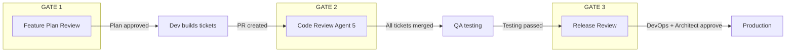
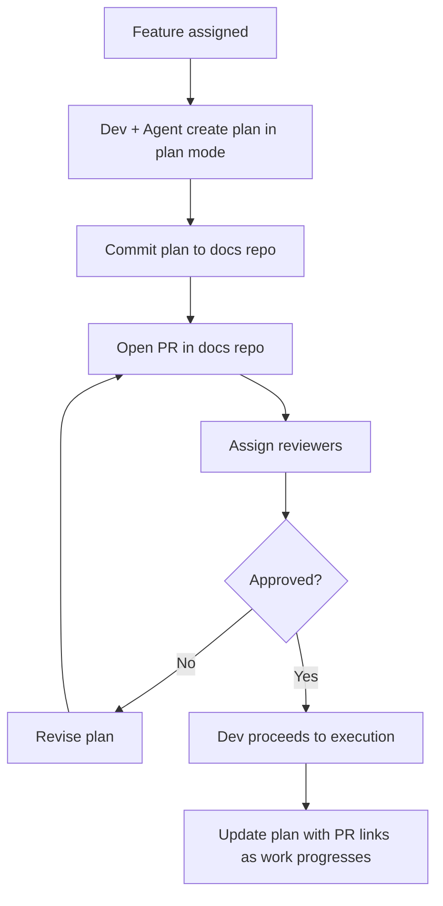
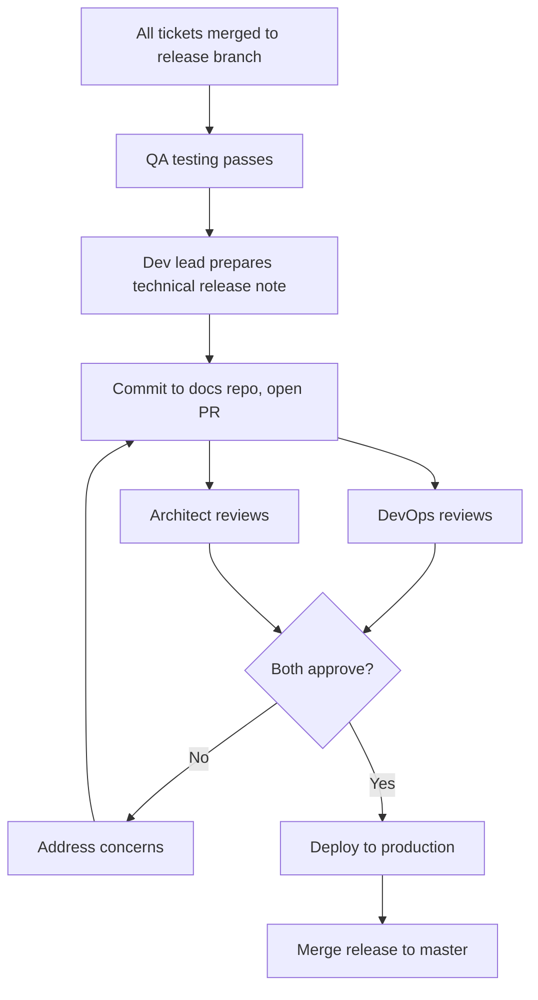
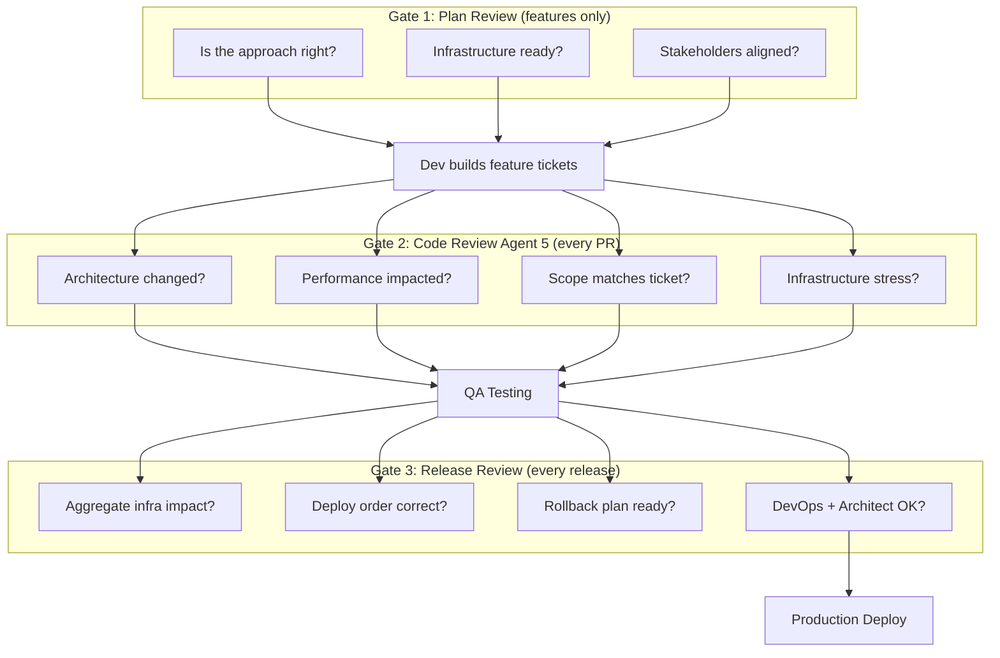

# Architecture & Performance Review Process

**Effective:** April 2026
**Team:** MinuteMenu KidKare

---

## Quick Summary

- **Every PR** — developer and agent review architecture and performance impact (Agent 5 in code review).
- **Major features** (multi-week, multi-repo) — agent plan must be reviewed and approved before execution.
- **Every release** — dev lead provides a technical release note, reviewed by DevOps and architect before production.
- **If an issue still slips through** — DevOps must have performance alerts and system headroom in place so we detect and respond before clients are affected.

---

## 1. Why We Are Improving

We already have AI-assisted code review in place. It catches bugs, guideline violations, and ticket alignment issues. But a couple of recent production incidents — including a stored procedure performance regression and a login degradation after a major release — showed that we are missing architecture and infrastructure impact during review.

We are improving the process to:

- **Eliminate** architecture and performance issues before they reach production.
- **Increase** system reliability through better review at every stage.
- **Improve** client satisfaction by preventing incidents rather than reacting to them.

```
 WHAT WE REVIEW TODAY              WHAT WE ARE ADDING
 ┌──────────────────────┐         ┌──────────────────────────────┐
 │ ✓ Code bugs          │         │ + Architecture changes       │
 │ ✓ Guideline rules    │         │ + Performance impact         │
 │ ✓ Git history context│         │ + Infrastructure stress      │
 │ ✓ Ticket alignment   │         │ + Cross-repo side effects    │
 │                      │         │ + Release-level impact       │
 └──────────────────────┘         └──────────────────────────────┘
  Existing Agents 1-4              Three new review gates
```

---

## 2. The Three Review Gates

Three review steps added at different stages of the delivery process.



```
 WHEN EACH GATE RUNS
 ────────────────────────────────────────────────────────────────

 ┌─────────────┐    ┌─────────────┐    ┌──────────┐    ┌──────┐
 │ Plan Review │───>│ Code Review │───>│ Release  │───>│ Prod │
 │ (features)  │    │ (every PR)  │    │ Review   │    │      │
 └─────────────┘    └─────────────┘    └──────────┘    └──────┘
       │                   │                  │
  Major features      Every PR         Every release
  only (weeks/        Developer +       Dev lead provides
  months of work)     Agent review      release note
```

---

## 3. Gate 1: Feature Plan Review

### What It Is

When developers work with AI coding assistants (Claude Code, GitHub Copilot, Antigravity), there is a plan mode where the agent works with the developer to create a comprehensive implementation plan. For major features, this plan must be reviewed and approved by stakeholders before the developer proceeds to execution.

The plan is committed to the docs repo as a PR so architect, dev lead, DevOps, and stakeholders can review it.

### When Required

```
 REQUIRED                              NOT REQUIRED
 ┌─────────────────────────────┐      ┌─────────────────────────────┐
 │ Multi-week/month features   │      │ Individual tickets          │
 │ Changes to auth/payments    │      │ Bug fixes                   │
 │ Changes touching 3+ repos   │      │ Small enhancements          │
 │ Core flow changes (claims)  │      │ Config changes              │
 │                             │      │ UI text/style changes       │
 │ Examples:                   │      │                             │
 │ - SAML SSO integration     │      │ We deliver hundreds of      │
 │ - Adyen payment integration │      │ tickets per 2-week cycle.   │
 │ - Claims processor rewrite  │      │ Cannot review plans for all.│
 └─────────────────────────────┘      └─────────────────────────────┘
```

### How It Works



**Reviewers:** architect, dev lead, DevOps (if infra impact), client stakeholder (if needed).

Plan template: [plans/template.md](../plans/template.md)

---

## 4. Gate 2: Code Review — Architecture & Performance Agent

### What It Is

A new agent (Agent 5) added to the existing code review. It runs on every PR alongside the existing 4 agents. Developer reviews Agent 5 findings and triages them — we never fully rely on the agent alone.

### How It Fits with Existing Code Review

```
 BEFORE (4 agents)                  NOW (5 agents)
 ┌──────────────────────────┐      ┌──────────────────────────────┐
 │ Agent 1: Guidelines      │      │ Agent 1: Guidelines          │
 │ Agent 2: Bug detection   │      │ Agent 2: Bug detection       │
 │ Agent 3: Git history     │      │ Agent 3: Git history         │
 │ Agent 4: Ticket alignment│      │ Agent 4: Ticket alignment    │
 │                          │      │ Agent 5: Architecture &      │
 │                          │      │          Performance ← NEW   │
 └──────────────────────────┘      └──────────────────────────────┘
                                          │
                                   Developer reviews findings
                                   and produces Infrastructure
                                   Impact Assessment to share
                                   with DevOps.
```

### What Agent 5 Checks

Six categories of architecture and performance risk:

```
 CATEGORY                  WHAT IT LOOKS FOR
 ─────────────────────────────────────────────────────────────
 Scope Creep               Diff does significantly more than
                           the ticket asks for.

 Data Access Change        Materialized view → real-time query.
                           Indexed lookup → table scan.
                           Cached result → live query.

 Infrastructure Stress     Mass re-authentication. Session
                           invalidation. New background jobs
                           that hit the database.

 Timeout/Pool Changes      Connection timeout changes. Pool
                           size changes. Command timeout values.

 Removed Optimizations     Dropped indexes. Removed caching.
                           Batch → per-row operations.

 Cross-Repo Impact         Changes to SSO, shared DB, or
                           payment services used by other
                           products.
```

### What It Produces

Every PR gets an Infrastructure Impact Assessment, even when no issues are found:

```
 INFRASTRUCTURE IMPACT ASSESSMENT
 ──────────────────────────────────────────────────
 Risk Level:           None | Low | Medium | High | Critical
 Summary:              One sentence.
 Details:              What changed, what tables/services affected.
 DevOps Action Needed: Yes / No
   If yes:             What specifically (VM, pool, index, etc.)
```

This section can be copied directly to share with DevOps.

### Learning from Incidents

Agent 5 references a `known-patterns.md` file with example patterns from past incidents. These are starting examples, not a complete list — the agent uses them as guidance to recognize similar risks, not as a strict checklist. The file is updated whenever a new incident reveals a useful pattern.

---

## 5. Gate 3: Release Review

### What It Is

After all tickets merge to the release branch and QA testing passes, the dev lead provides a technical release note. DevOps and architect review it before production deployment.

### When Required

**Every release.** No exceptions.

### How It Works



### What the Release Note Covers

```
 RELEASE NOTE SECTIONS
 ──────────────────────────────────────────────────────────────

 1. TICKETS IN THIS RELEASE
    Table: ticket ID, title, type, infrastructure impact level.

 2. INFRASTRUCTURE IMPACT (AGGREGATE)
    ┌─────────────────────────────────────────────────────────┐
    │ Database Changes      Schema, stored procs, indexes,    │
    │                       migration scripts                 │
    │                                                         │
    │ Auth/Session Changes  Login flow, tokens, re-auth       │
    │                       impact                            │
    │                                                         │
    │ API Changes           New/changed/removed endpoints,    │
    │                       traffic pattern changes           │
    │                                                         │
    │ Performance           Large table queries, removed      │
    │                       optimizations, new jobs           │
    │                                                         │
    │ Cross-Repo            Repos involved, deploy order,     │
    │                       rollback order                    │
    └─────────────────────────────────────────────────────────┘

 3. WEB CONFIGURATION CHANGES
    Table: service, key, value, notes.

 4. RISK ASSESSMENT
    Worst case. Likelihood. Detection. Rollback plan.

 5. DEPLOYMENT CHECKLIST
    DevOps review        ☐
    Architect review     ☐
    SQL scripts verified ☐
    Web config confirmed ☐
    Rollback plan ready  ☐
    Deploy approved      ☐
```

Release note template: [releases/template.md](../releases/template.md)

---

## 6. How the Three Gates Work Together

Each gate catches different types of problems at different stages.

```
 STAGE          GATE              CATCHES                    WHO REVIEWS
 ──────────────────────────────────────────────────────────────────────
 Before coding  Plan Review       Wrong approach             Architect
                (features only)   Missing infrastructure     Dev Lead
                                  Scope misalignment         DevOps
                                                             Stakeholder

 Per PR         Code Review       Architecture changes       Developer
                Agent 5           Performance regression     + Agent
                (every PR)        Infrastructure stress

 Before deploy  Release Review    Aggregate impact           DevOps
                (every release)   Cross-repo coordination    Architect
                                  Deploy/rollback order
                                  Config changes
```



---

## 7. If an Issue Still Slips Through

Even with all three gates, an issue can still reach production. DevOps must ensure the following are in place so we detect and respond before clients are affected:

- **Performance alerts** — API response time, database query duration, error rate spikes. The team should know about a problem within minutes, not hear about it from clients days later.
- **System headroom** — infrastructure should handle sudden spikes without going down. If the system runs at capacity on a normal day, any spike becomes an outage with no time to respond.
- **Fail-fast timeouts** — short command and connection timeouts so blocked requests release resources quickly instead of holding them for minutes.
- **Connection cleanup** — automatic cleanup of idle connections so leaks do not accumulate silently.

DevOps will follow up with the specific alert thresholds, capacity targets, and monitoring setup.

---

## 8. Summary

```
 ╔═══════════════════════════════════════════════════════════════════╗
 ║       ARCHITECTURE & PERFORMANCE REVIEW — SUMMARY                ║
 ╠═══════════════════════════════════════════════════════════════════╣
 ║                                                                  ║
 ║  WHY:  Improve our review process to catch architecture and      ║
 ║        performance issues before production. Increase system     ║
 ║        reliability. Improve client satisfaction.                  ║
 ║                                                                  ║
 ║  THREE REVIEW GATES:                                              ║
 ║  ┌─────────────┬─────────────────────┬─────────────────────────┐ ║
 ║  │ Gate        │ When                │ Who Reviews             │ ║
 ║  ├─────────────┼─────────────────────┼─────────────────────────┤ ║
 ║  │ Plan Review │ Before coding       │ Architect, Dev Lead,    │ ║
 ║  │             │ (major features     │ DevOps, Stakeholder     │ ║
 ║  │             │  only)              │                         │ ║
 ║  ├─────────────┼─────────────────────┼─────────────────────────┤ ║
 ║  │ Code Review │ Every PR            │ Developer + Agent       │ ║
 ║  │ Agent 5     │                     │                         │ ║
 ║  ├─────────────┼─────────────────────┼─────────────────────────┤ ║
 ║  │ Release     │ Every release       │ DevOps, Architect       │ ║
 ║  │ Review      │ (before deploy)     │                         │ ║
 ║  └─────────────┴─────────────────────┴─────────────────────────┘ ║
 ║                                                                  ║
 ║  SAFETY NET (if an issue still slips through):                   ║
 ║  - DevOps: performance alerts — detect in minutes, not days.     ║
 ║  - DevOps: system headroom — survive the spike, buy time to fix. ║
 ║                                                                  ║
 ║  OVERHEAD:                                                       ║
 ║  - Plan review: only major features. Not every ticket.           ║
 ║  - Agent 5: developer + agent review. Part of existing workflow. ║
 ║  - Release review: dev lead provides release note.               ║
 ║                                                                  ║
 ║  TEMPLATES:                                                      ║
 ║  - Plan template: docs/plans/template.md                         ║
 ║  - Release note template: docs/releases/template.md              ║
 ║                                                                  ║
 ╚═══════════════════════════════════════════════════════════════════╝
```
