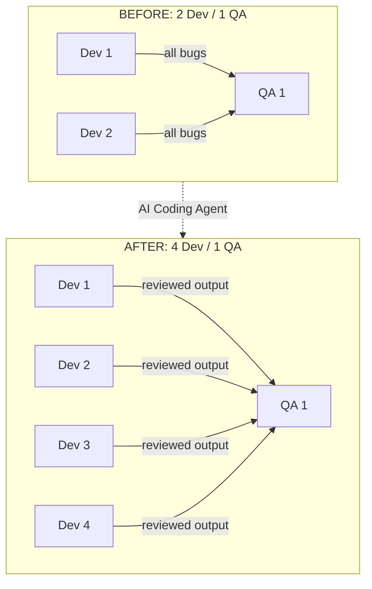
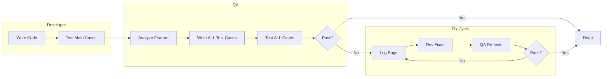
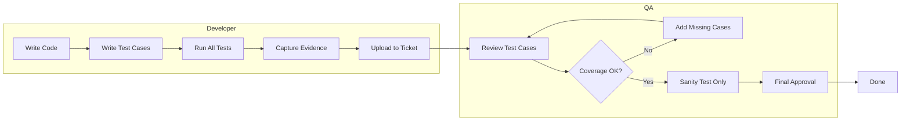
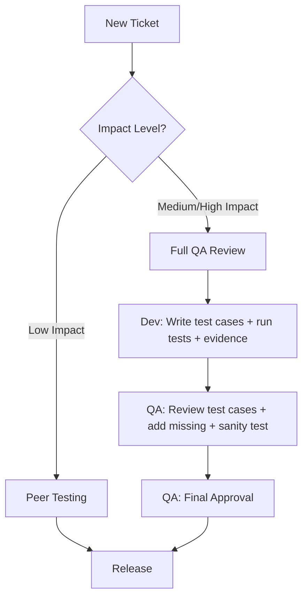
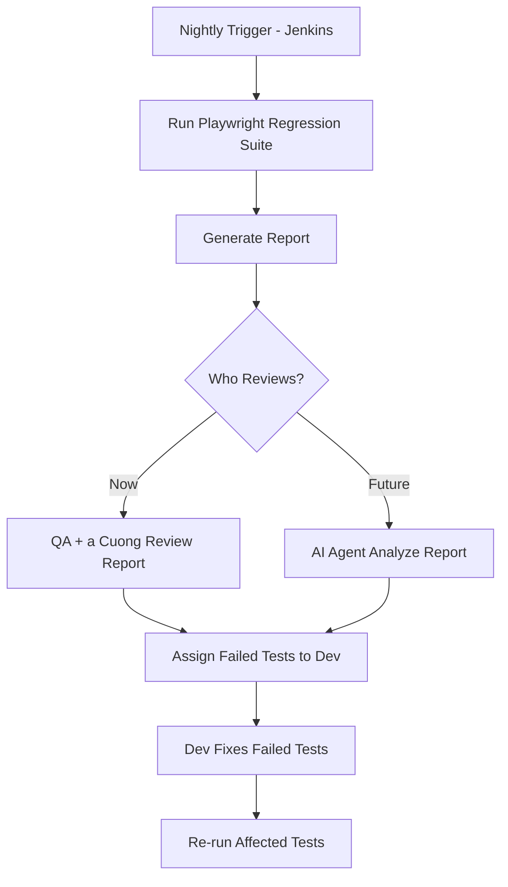
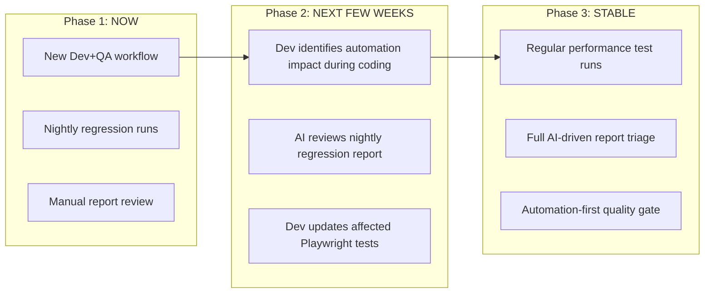
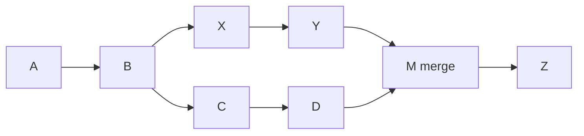
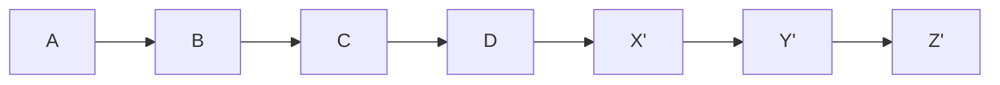

# Development Workflow Change

**Effective:** April 2026
**Team:** MinuteMenu KidKare

---

## Quick Summary

- **Dev now owns testing.** Write test cases, run all tests, capture screenshots, upload evidence to the ticket.
- **QA now owns quality review.** Review dev's test cases, add missing ones, sanity test only, give final approval.
- **Low impact tickets** (error message, validation, typo) — peer testing between devs, no QA needed.
- **Evidence required** — every ticket needs a test case checklist + screenshots before QA review.
- **Nightly Playwright regression** runs automatically. Failed tests assigned to dev to fix.
- **Git: use rebase, not merge.** Only on your own branch. Push with `--force-with-lease` after rebase.

---

## 1. Why We Are Changing

AI coding agents made development much faster. A feature that took weeks now takes days.
But QA still needs the same time to test. The team changed from 2 dev / 1 QA to 4 dev / 1 QA.
QA cannot keep up if we keep the old process.

```
 BEFORE                              NOW
 ┌──────────┐  ┌──────────┐        ┌──────────┐  ┌──────────┐
 │  2 Devs  │──│  1 QA    │        │  4 Devs  │──│  1 QA    │
 └──────────┘  └──────────┘        └──────────┘  └──────────┘
                                        │              │
  Dev writes code in weeks.        AI agent helps    Same 1 QA
  QA has time to test all.         dev ship in       can NOT test
                                   days.             4x more output.
                                        │
                                   ┌────▼──────────────────────┐
                                   │  BOTTLENECK MOVED TO QA   │
                                   └───────────────────────────┘
```

**The fix: devs own testing. QA owns quality review.**



---

## 2. Old Process vs New Process

### Old Process

```
  Dev                QA                          Dev         QA
  ┌──────┐          ┌──────────────┐            ┌──────┐   ┌──────┐
  │Write │────────> │Analyze       │───Bugs──> │Fix   │──>│Retest│
  │Code  │          │Write ALL     │            │Bugs  │   │ALL   │
  │Test  │          │  test cases  │            │      │   │      │
  │main  │          │Test ALL cases│            │      │   │Round │
  │cases │          │              │            │      │   │2 / 3 │
  └──────┘          └──────────────┘            └──────┘   └──────┘
                    ^ QA does everything
```



### New Process

```
  Dev                                       QA
  ┌───────────────────────────┐            ┌──────────────────┐
  │ Write Code                │──────────> │ Review test cases │
  │ Write test cases          │            │ Add missing ones  │
  │ Run ALL tests             │            │ Sanity test only  │
  │ Capture screenshots       │            │ Final approval    │
  │ Upload evidence to ticket │            │                   │
  └───────────────────────────┘            └──────────────────┘
  ^ Dev owns testing                       ^ QA owns quality
```



> **Note:** When QA adds missing test cases, dev runs those too and provides evidence.

---

## 3. What Changes for Each Role

```
 ┌──────────────────────────────────────────────────────────────┐
 │ ROLE        │ BEFORE                 │ NOW                   │
 ├─────────────┼────────────────────────┼───────────────────────┤
 │             │ Write code             │ Write code            │
 │ Developer   │ Test main cases only   │ Write test cases      │
 │             │ Fix bugs from QA       │ Run ALL tests         │
 │             │                        │ Capture screenshots   │
 │             │                        │ Upload evidence       │
 │             │                        │ Output = production   │
 │             │                        │   ready               │
 ├─────────────┼────────────────────────┼───────────────────────┤
 │             │ Analyze feature        │ Review dev test cases │
 │ QA          │ Write ALL test cases   │ Add missing cases     │
 │             │ Test ALL cases         │ Sanity test only      │
 │             │ Log bugs               │ Final approval        │
 │             │ Retest round 2, 3      │                       │
 ├─────────────┼────────────────────────┼───────────────────────┤
 │ Key rule    │ QA finds all bugs      │ Dev prevents bugs     │
 │             │                        │ QA verifies coverage  │
 └─────────────┴────────────────────────┴───────────────────────┘
```

### Three Key Rules

1. **Dev must test and make sure code is production ready.**
   Not "works on my machine." Fully tested, with screenshots and test case checklist in the ticket.
2. **QA does not run all test cases.**
   QA reviews the dev's test list, adds what's missing, and does sanity testing only.
3. **QA is still the quality owner.**
   QA reviews the test plan, can ask dev to run more tests, and gives final approval.

### What "Evidence" Means

Dev must upload to the ticket:

- **Test case checklist** — table with: ID, description, expected result, status, screenshot
- **Screenshots** — one per test case, showing the actual result

Example: (this is just minimal version, QA can provide more comprehensive report template later)

| ID    | Description                          | Expected Result                                   | Status | Screenshot          |
| ----- | ------------------------------------ | ------------------------------------------------- | ------ | ------------------- |
| TC-01 | Add new child with valid data        | Child saved, shows in list                        | Pass   | [screenshot-01.png] |
| TC-02 | Add child with missing required name | Validation error "Name is required"               | Pass   | [screenshot-02.png] |
| TC-03 | Add child with duplicate name        | Warning dialog shown, allow save                  | Pass   | [screenshot-03.png] |
| TC-04 | Edit existing child info             | Changes saved, list updated                       | Pass   | [screenshot-04.png] |
| TC-05 | Delete child with linked meals       | Confirmation dialog, meals unlinked after confirm | Pass   | [screenshot-05.png] |
| TC-06 | Delete child without linked data     | Child removed from list immediately               | Pass   | [screenshot-06.png] |
| TC-07 | View child list with 100+ records    | Page loads under 3 seconds, pagination works      | Pass   | [screenshot-07.png] |

---

## 4. Ticket Routing: Who Tests What?

**Dev self-classifies the impact level.** QA can override if they disagree.



### Low Impact (peer testing, no QA needed)

- Update error message text
- Add simple field validation
- Fix typo in UI
- Config or setting change

### Medium / High Impact (full QA review required)

- New feature
- Bug fix that changes behavior
- Data migration or schema change
- Payment / billing changes
- Changes that touch multiple features
- Security-related changes
- ...

---

## 5. Nightly Regression Testing

The Playwright regression test suite runs every night automatically via Jenkins.



**Current:** QA + a Cuong review the nightly report each morning and assign failed tests to devs.

**Future:** AI agent will analyze the report, classify failures (real bug vs flaky test vs environment issue), and auto-assign to the right dev.

---

## 6. Automation Impact Awareness

> **Status:** Nice-to-have now. Mandatory in a few weeks once the team has enough Playwright knowledge.

When dev makes a code change, they should also think about automation impact:

```
 ┌─────────────────────────────────────────────────────────────────┐
 │  DURING DEVELOPMENT                                             │
 │                                                                 │
 │  1. Make code change                                            │
 │                                                                 │
 │  2. Work with AI agent to answer:                               │
 │     ┌──────────────────────────────────────────┐                │
 │     │  - Which Playwright tests does this       │                │
 │     │    change affect?                         │                │
 │     │  - Do any existing tests need updating?   │                │
 │     │  - Should we add new automation tests?    │                │
 │     │  - Re-run affected tests to verify.       │                │
 │     └──────────────────────────────────────────┘                │
 │                                                                 │
 │  3. Update or add Playwright tests as needed                    │
 │                                                                 │
 │  4. Include test changes in the same PR                         │
 └─────────────────────────────────────────────────────────────────┘
```

---

## 7. Rollout Phases



### Phase 1: NOW

- [X] New Dev + QA workflow (this document)
- [X] Nightly Playwright regression runs on Jenkins
- [X] Manual report review by QA + a Cuong

### Phase 2: NEXT FEW WEEKS

- [ ] Dev checks automation impact during coding (with AI agent)
- [ ] AI agent reviews nightly regression report
- [ ] Dev updates affected Playwright tests with code changes

### Phase 3: WHEN AUTOMATION IS STABLE

- [ ] Regular performance test runs (already available, can trigger manually)
- [ ] Full AI-driven regression report triage
- [ ] Automation-first quality gate

---

## 8. Summary

```
 ╔═══════════════════════════════════════════════════════════════════╗
 ║           DEVELOPMENT WORKFLOW CHANGE — SUMMARY                  ║
 ╠═══════════════════════════════════════════════════════════════════╣
 ║                                                                  ║
 ║  WHY:  AI made coding faster. QA is now the bottleneck.          ║
 ║        Team is 4 dev / 1 QA. Old process does not scale.         ║
 ║                                                                  ║
 ║  WHAT CHANGES:                                                   ║
 ║  ┌─────────┬───────────────────────┬──────────────────────────┐  ║
 ║  │         │  Dev                  │  QA                      │  ║
 ║  ├─────────┼───────────────────────┼──────────────────────────┤  ║
 ║  │ Testing │  Writes + runs ALL    │  Reviews test plan       │  ║
 ║  │         │  test cases           │  Adds missing cases      │  ║
 ║  │         │  Uploads evidence     │  Sanity test only        │  ║
 ║  ├─────────┼───────────────────────┼──────────────────────────┤  ║
 ║  │ Quality │  Production-ready     │  Final approval          │  ║
 ║  │         │  output expected      │  Quality owner           │  ║
 ║  ├─────────┼───────────────────────┼──────────────────────────┤  ║
 ║  │ Low     │  Peer testing         │  Not involved            │  ║
 ║  │ impact  │  (dev reviews dev)    │                          │  ║
 ║  └─────────┴───────────────────────┴──────────────────────────┘  ║
 ║                                                                  ║
 ║  EVIDENCE = screenshots + test case checklist in the ticket      ║
 ║  IMPACT   = dev self-classifies, QA can override                 ║
 ║                                                                  ║
 ║  AUTOMATION:                                                     ║
 ║  - Playwright regression runs every night                        ║
 ║  - QA + a Cuong review report (AI agent later)                   ║
 ║  - Dev checks automation impact during coding (soon mandatory)   ║
 ║  - Performance tests when automation is stable                   ║
 ║                                                                  ║
 ╚═══════════════════════════════════════════════════════════════════╝
```

---

## 9. Git Workflow: Rebase Instead of Merge

### The Problem with Merge

Most of the team uses `git merge` to update branches. For example, merging master into a prodissue branch to get the latest changes.

This creates merge commits that clutter the history and make it hard to move branches between targets.

```
 MERGE WORKFLOW (old)

 master:    A───B───C───D───E
                 \       \
 prodissue:       X───Y───M1───Z───M2
                          ▲           ▲
                     merge commit  merge commit

 Problems:
 - M1 and M2 are noise in the history
 - If you merged from release-A, those merge commits
   stay even if you switch to release-B
 - Hard to tell which commits are yours vs merge noise
```

### The Fix: Use Rebase

Instead of merging the base branch into your feature branch, **rebase your branch onto the base branch**.

```
 REBASE WORKFLOW (new)

 master:    A───B───C───D───E
                              \
 prodissue:                    X'──Y'──Z'

 Clean. Linear. Your commits only.
```

**Merge (old):**



**Rebase (new):**



### Why Rebase Is Better for Us

**1. Clean history.** No merge commits. Easy to read `git log`.

**2. Flexible base switching.** This is the big one.

A prodissue branch can start from master. Then rebase onto release-A to test. If we decide to ship in release-B instead, just rebase onto release-B. No leftover merge commits from release-A.

```
 SCENARIO: Change release target

 Step 1: Start from master
   master:     A───B───C
                        \
   prodissue:            X───Y

 Step 2: Rebase onto release-A to test
   release-A:  A───B───C───R1───R2
                                  \
   prodissue:                      X'──Y'

 Step 3: Decision changes — ship in release-B instead
   release-B:  A───B───C───S1───S2
                                  \
   prodissue:                      X''──Y''

 With merge, step 3 would carry merge commits from release-A.
 With rebase, the branch is clean every time.
```

**3. No "ghost revert" problem.** This happened to our team before.

With merge: you merge prodissue A into release X. Later you revert it (no time to test). Release X ships and merges to master. Now master has both the merge AND the revert. When you try to merge prodissue A into release Y later, Git says "already merged" — it sees the original commits in the history and ignores the revert. **Your changes silently disappear.**

With rebase: this cannot happen. Rebase creates new commits with new SHAs every time. Git never thinks "I've seen this before."

```
 THE GHOST REVERT PROBLEM (merge workflow)

 Step 1: Merge prodissue A into release X
   release-X:    R1───R2───M1(merge prodissue A)
                           /
   prodissue-A:    X───Y──Z

 Step 2: Revert prodissue A (no time to test)
   release-X:    R1───R2───M1───REVERT(M1)

 Step 3: Release X merged to master
   master:       ...───M1───REVERT(M1)
                 Git remembers X, Y, Z as "already merged"

 Step 4: Try to merge prodissue A into release Y
   git merge prodissue-A  →  "Already up to date!"
   Commits X, Y, Z are in history. Git skips them.
   THE REVERT STAYS. YOUR CODE IS GONE.

 WITH REBASE — this cannot happen:
   git rebase origin/release-Y   (on prodissue-A)
   Creates X', Y', Z' — brand new SHAs.
   Git applies them fresh. No history conflict.
```

**4. Production-ready testing.** Always rebase onto the release branch before final testing. Your code runs on top of the exact release code. No surprises after merge.

### Commands

```bash
# Update your branch with latest master
git fetch origin
git rebase origin/master

# Move your branch onto a release branch for testing
git rebase origin/release/26.3.5

# Switch to a different release branch
git rebase origin/release/26.4.1

# After rebase, push to remote (required because history changed)
git push --force-with-lease
```

### Rules

1. **Use `rebase`, not `merge`**, to update your branch with latest code from master or release.
2. **Use `--force-with-lease`**, not `--force`, when pushing after rebase. It stops you from overwriting someone else's work.
3. **Never rebase shared branches** (master, release/*). Only rebase your own feature/prodissue branches.
4. **Resolve conflicts commit-by-commit.** Rebase replays your commits one at a time. Fix each conflict as it comes. This gives cleaner results than a single merge conflict blob.

```
 SAFE vs UNSAFE

 ✓ git rebase origin/master           (on your feature branch)
 ✓ git push --force-with-lease        (after rebase)

 ✗ git merge origin/master            (creates merge commits)
 ✗ git push --force                   (can overwrite others' work)
 ✗ git rebase on master or release/*  (never rebase shared branches)
```

### Quick Reference

| Task                               | Command                                          |
| ---------------------------------- | ------------------------------------------------ |
| Get latest master into your branch | `git fetch origin && git rebase origin/master` |
| Test on a release branch           | `git rebase origin/release/X.Y.Z`              |
| Switch to different release        | `git rebase origin/release/A.B.C`              |
| Push after rebase                  | `git push --force-with-lease`                  |
| Abort a messy rebase               | `git rebase --abort`                           |
| Continue after fixing conflict     | `git add . && git rebase --continue`           |
